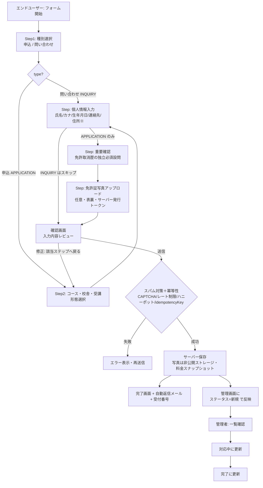
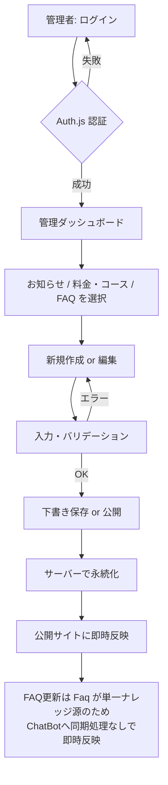
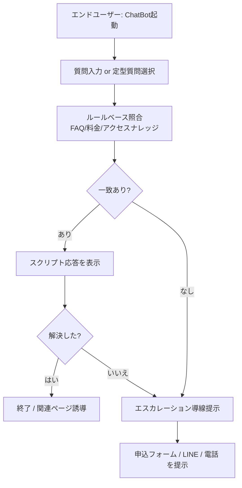
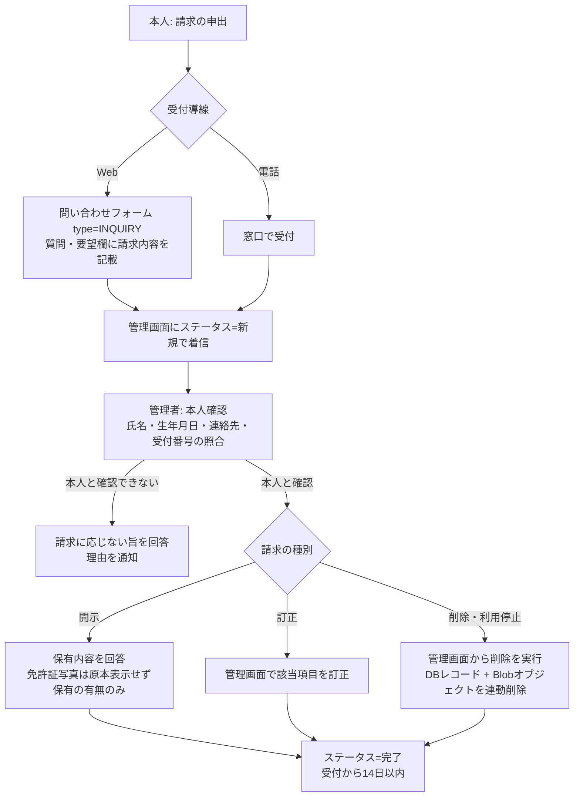

# 業務仕様書 — 岩滝・網野自動車教習所 Webサイトリニューアルデモ

## 変更履歴

| バージョン | 日付 | 変更内容 | 変更者 |
|-----------|------|---------|--------|
| 0.1.0 | 2026-07-19 | 初版作成（P0基盤整備フェーズ・全スコープの業務仕様策定） | Spec Agent |
| 0.2.0 | 2026-07-19 | Seniorレビュー差し戻し反映。REV-002(免許取消歴・写真をtype=APPLICATION条件収集化＝最小収集整合) / REV-001(FAQ単一ナレッジ源化でUS-014充足) / REV-006(お知らせカテゴリのALL廃止・COMMON化) / REV-005(スクール系の受け皿) / 申込フロー図の条件分岐・修正遷移(REV-017)を更新 | Spec Agent |
| 0.2.1 | 2026-07-19 | 再レビューNice-to-have反映。RE-02: F-022向けに US-017(スクール・追加講習の情報閲覧) を新設 | Spec Agent |
| 0.3.0 | 2026-07-29 | P3着手前の業務仕様確定（Security監査 SEC-036/APPI 要求への対応）。**§2.3 新設: 個人情報・免許証写真の保持期間を業務仕様として確定**（申込3年 / 問い合わせ1年 / 免許証写真は対応完了後30日・最長180日 / 未紐付けアップロード24時間 / 削除要求は受付から14日以内）。**§2.2.4 新設: 開示・訂正・削除請求の受付フロー**。§2.1 に用語追加（保持期間 / 保有個人データ / 開示等の請求）。**US-018 新設**（個人情報の開示・訂正・削除の請求）。§4.3 を確定値へ更新。tech-stack §6 #8「保持期間の具体値」の未決を解消（REV-021 クローズ） | Spec Agent |
| 0.3.1 | 2026-07-29 | P3 設計レビュー差し戻し反映（`docs/review-p3-design-2026-07-29.md`）。**SPEC-015 / RV-P3D-S08**: §2.2.4 の「対応記録を個人非特定で残す」に対応する機能要件が functional-spec に無かった状態を解消——本デモでは F-017 の削除操作ログ（AC-017-3 / AC-017-8）をもって充て、監査証跡としての永続性が保証されない制約を明示的に受容と記録。**SPEC-014 / RV-P3D-008**: §2.3.1 #3 の起算点を `Application.statusChangedAt`（新設フィールド）と明記し、「DONE から30日」が計算不能だった問題を解消。削除対象に `UploadToken` を追加（RV-P3D-S07）。**N03**: §2.3.1 #6 の同意日時を `createdAt` で代替すると明記 | Spec Agent |
| 0.3.2 | 2026-07-29 | P3 設計**再**レビュー差し戻し反映（`docs/review-p3-design-re-2026-07-29.md`）。**SPEC-017 / RV-P3DR-002**: 冪等再送の照合に必要なフォームセッション `sid` の保持場所を `Application.sessionIdHash`（HMAC ハッシュ）に確定したことに伴い、**§2.3.1 に #7 を追加**（保持期間は申込・問い合わせ本体と同一寿命 / 独立した削除経路は設けない / 生の `sid` は保存もログ出力もしない）。**#1〜#6 の番号は変更していない**（既存文書からの参照を壊さないため） | Spec Agent |

---

## 1. プロジェクト概要

### 1.1 背景と目的

現行サイト <https://iwataki-driving-school.com/> は、通学・合宿・プロ免許・ドローン・建機講習まで扱う総合教習所（岩滝校・網野校の2校体制）の情報を網羅しているが、次の運用・体験課題を抱える。

- **更新が事業者主導でできない**: お知らせ・料金・キャンペーンの更新に制作会社の関与が必要と推測され、情報鮮度が落ちる（「お得な情報」が約2ヶ月間隔でしか更新されない）。
- **申込フォームの離脱リスク**: 必須14項目・合計19項目の長大フォーム。重要な注意事項（免許取消歴の申告）が自由記述欄に埋没。モバイル最適化が不明瞭。
- **問い合わせが電話・LINEに依存**: 定型質問（年齢・持ち物・視力・支払い・送迎バス等）を営業時間外に自己解決できない。FAQは11件と限定的。
- **SEO・構造化の弱さ**: 2校×多数の免許種別を持つが、ローカルSEO・構造化データ・内部リンク設計が最新水準でない可能性。

**本プロジェクトの目的**は、これらを解決した「運用まで含むリニューアル像」を、実際に触れる**本番品質のデモ**として提示することである。デモは次の4つの新価値を、現行の情報網羅性を保った上で示す。

1. 管理者が自分で更新できる **CMS**
2. 離脱を抑える **ステップ式申込フォーム**
3. 24時間自己解決を助ける **AI ChatBot（ルールベース）**
4. 検索で見つかる **SEO基盤**

### 1.2 対象ユーザー

本サイトは「エンドユーザー（サイト利用者）」と「管理者（教習所スタッフ）」の2種を対象とする。

| ペルソナ | 役割 | 主な利用シーン |
|---------|------|-------------|
| 免許取得検討者（学生・社会人・Uターン層） | エンドユーザー | モバイルで通学/合宿の料金比較 → 疑問解消 → 申込または相談 |
| プロ免許・法人ニーズ層（在職者・法人） | エンドユーザー | 大型/二種/けん引/大特・建機/ドローン講習の要件・料金確認 → 問い合わせ |
| 保護者・付添い | エンドユーザー | 料金・安全性・アクセスの確認 |
| 事務スタッフ（ITに専門的でない） | 管理者 | お知らせ・料金・FAQの即時更新、届いた申込・問い合わせのステータス管理 |

エンドユーザーの主デバイスは**モバイル**であり、モバイルファーストで設計する。

### 1.3 スコープ

**対象範囲 (In Scope)**:

- **公開サイト**: トップ / コース・料金比較（校舎×免許種別×通学・合宿）/ お知らせ一覧・詳細 / FAQ / 学校案内・アクセス（2校）/ 入所申込・問い合わせフォーム
- **管理画面（CMS）**: お知らせCRUD / 料金・コース編集 / FAQ編集 / 申込・問い合わせ受信管理（一覧・ステータス: 新規/対応中/完了）
- **ステップ式 入所申込・問い合わせフォーム**: 現行19項目を再設計。免許取消歴の確認を独立必須設問に格上げ。免許証写真アップロード。確認画面。モバイル最適化。
- **AI ChatBot**: ルールベース/モック応答。FAQ/料金/アクセスナレッジのスクリプト応答。未解決はフォーム/LINE/電話へエスカレーション。
- **SEO基盤**: メタ/OGP/正規URL/構造化データ（DrivingSchool×2校, FAQPage, BreadcrumbList）/サイトマップ

**対象外 (Out of Scope)**:

- 実決済・ローン審査連携
- 既存の外部予約システム（menkyo-torocca 等）との本番連携
- 本番の会員認証・個人情報の実運用保管（会員機能の本運用）
- 多言語UI（構造としては将来対応を想定）
- リクルート応募の本番運用、法人契約の実ワークフロー
- 実LLMとのAI連携（ChatBotはルールベースに限定）

---

## 2. ビジネスルール

### 2.1 用語定義

| 用語 | 定義 |
|-----|------|
| 校舎 | 教習を提供する拠点。岩滝校（与謝野町）と網野校（京丹後市）の2校。 |
| コース | 教習プランの総称。区分（category）で免許（LICENSE）/ ドローン（DRONE）/ 建機（KENKI）/ 追加講習（ADDITIONAL: 高齢者・ペーパー・企業）を包含する。免許は普通車MT/AT、準中型、中型、大型、普通二種、大型二種、けん引、大型特殊、普通自動二輪。 |
| スクール・追加講習 | 免許（通学/合宿）構造に馴染まないコース（ドローン/建機/高齢者/ペーパー/企業）。料金比較UIとは別導線で扱う。 |
| 通学 / 合宿 | 免許コースの受講形態。通学は自宅から通学、合宿は宿泊して短期集中。 |
| 給付金タグ | 教育訓練給付金の対象コースであることを示す表示（準中型/中型/大型等）。 |
| 助成金タグ | 助成金対象を示す表示（ドローン/建機等）。 |
| お知らせ | 事業者が発信する告知。カテゴリ実体: 岩滝 / 網野 / ドローン / 建機 / 共通(COMMON)。一覧の「すべて」はフィルタ操作であり記事カテゴリではない。 |
| 料金スナップショット | 申込時点のコース名・料金を申込レコードに非正規化保存した値。後のコース改定・削除後も申込内容を正確に再現するための記録。 |
| 申込 | 入所申込。教習開始に向けた申込情報の送信。 |
| 問い合わせ | 質問・相談。申込に至らない情報要求。申込と同一フォームから種別選択で分岐。 |
| ステータス | 管理者が申込・問い合わせに付与する対応状態。新規 / 対応中 / 完了。 |
| ChatBot | ルールベースの応答ボット。FAQ・料金・アクセスのナレッジからスクリプト応答する。 |
| エスカレーション | ChatBotで未解決の質問を、申込フォーム / LINE / 電話へ誘導すること。 |
| 免許取消歴 | 過去に運転免許の取消処分を受けた履歴。入所可否・手続きに関わる重要確認事項。 |
| 署名付きURL | 非公開ストレージ上の免許証写真へ、期限付きで一時アクセスするためのURL。 |
| APPI | 個人情報の保護に関する法律（個人情報保護法）。本デモの非機能要件の準拠対象。 |
| 保持期間 | Webサイト経由で受領した個人情報を、当校が保管してよい上限期間。経過後は自動削除される（§2.3）。 |
| 保有個人データ | 当校が開示・訂正・削除の権限を持って保有する個人データ。Webサイト経由の申込・問い合わせ情報がこれに当たる。 |
| 開示等の請求 | 本人からの、保有個人データの開示・訂正・利用停止・削除の求め。受付から14日以内に対応する（§2.2.4）。 |
| 教習原簿 | 入所後に法令に基づき当校が別途作成・保管する教習記録。**Webサイトの申込データとは別系統**であり、本仕様の保持期間の対象外（§2.3 の注記）。 |

### 2.2 業務フロー

#### 2.2.1 入所申込・問い合わせフロー（エンドユーザー → 管理者）

> ※ 住所・郵便番号・免許取消歴・現有免許・免許証写真・入所希望日・支払方法は type=APPLICATION 時のみ収集（REV-002・最小収集）。INQUIRY は種別→連絡先→確認 の短縮フロー。確認画面からの「修正」は該当項目のステップへ戻る（REV-017）。

#### 2.2.2 CMS更新フロー（管理者）

#### 2.2.3 ChatBotフロー（エンドユーザー）

#### 2.2.4 開示・訂正・削除請求の受付フロー（本人 → 管理者）

APPI が定める本人の権利（開示・訂正・利用停止・削除）に対応する業務フロー。専用フォームは新設せず、**既存の問い合わせフォーム（type=INQUIRY）または電話**で受け付ける（受付導線を増やさず、本人確認を対面／電話で確実に行うため）。

**業務ルール**:
- 受付から**14日以内**に対応を完了する（APPI の「遅滞なく」の社内基準として設定）。
- **本人確認ができない請求には応じない**。照合項目は氏名・生年月日・連絡先（メール または 電話）・受付番号のうち2点以上。
- **開示請求に対して免許証写真そのものは返送しない**（提出物であり、送付経路で新たな漏えいリスクを生むため）。保有の有無・アップロード日時のみを回答する。
- 削除は F-017 の削除機能で実行し、**DBレコードと免許証写真オブジェクトの両方**が消えることを管理者が画面上で確認できること。
- 対応記録（請求の受付・本人確認の結果・対応日）は、削除対象の申込データそのものとは別に、**個人を特定しない形**（受付番号・種別・日付のみ）で残す。
  - **本デモにおける実現方法（SPEC-015 / 2026-07-29 訂正）**: 専用の記録テーブルは設けず、**F-017 の削除操作ログ**（`applicationId` / `receiptNumber` / `type` / 操作日時 / 操作者 `adminUserId`。個人情報を含まない。`functional-spec.md` AC-017-3 / AC-017-8）**をもって対応記録に充てる**。
  - **受容した制約（明示）**: ログの保持期間はプラットフォーム依存であり、**監査証跡としての永続性は保証されない**。本デモは実在の個人情報を本運用で保管しない（§2.3.2 注記）ためこの制約を受容する。**実運用開始時には追記専用の削除記録テーブルを設けること**。
  - 訂正の経緯: v0.3.0 では本項に対応する機能要件が `functional-spec.md` に存在せず、**業務仕様にだけ要求がある状態**だった（設計レビュー RV-P3D-S08）。両者を上記の内容で整合させた。

### 2.3 個人情報の保持期間（確定値）

> **確定の経緯**: `docs/security-audit.md` の P3 事前要件が「保持期間を業務仕様として確定させる」ことを要求したため、教習所の実務サイクルと APPI の「利用目的の達成に必要な範囲を超えない」原則に照らして本節で確定する。`docs/tech-stack.md` §6 #8 の未決（暫定値）はこれをもって解消する（REV-021 クローズ）。技術的な受け入れ条件は `functional-spec.md` §4.12。

#### 2.3.1 対象と期間

| # | 対象データ | 保持期間 | 起算点 | 根拠 |
|---|-----------|---------|-------|------|
| 1 | **申込データ**（`Application` type=APPLICATION の全項目）| **3年** | 受信日（`createdAt`）| 入所〜卒業〜免許取得までが最長でも約1年（教習期限9ヶ月＋検定・本免手続き）。その後の「卒業証明の再発行相談」「再入所時の照会」を1〜2シーズン分カバーできる余裕をみて3年とする。これ以上の長期保管は、入所後に別系統で作成される教習原簿（下記注記）と重複するため不要 |
| 2 | **問い合わせデータ**（`Application` type=INQUIRY の全項目）| **1年** | 受信日 | 収集項目が申込より少なく（住所・免許情報・写真を持たない）、利用目的は「相談への回答」に限られる。回答完了で目的を達するが、同一相談者の再問い合わせ（次の入所シーズンまで）に対応できるよう1年とする |
| 3 | **免許証写真**（Blob オブジェクト + `LicensePhoto` レコード + 対応する `UploadToken` 行）| **対応完了（status=DONE）から30日**、ただし**受信日から180日を超えない**（いずれか早い方）| **`Application.statusChangedAt`**（status=DONE 遷移日。SPEC-014）/ `createdAt`（受信日） | 免許証画像は本人確認のための**一時的な照合資料**であり、入所手続きの本受付では窓口で原本を確認する。目的達成後の保管は漏えい時の被害（本人確認書類の全項目・顔写真）が突出して大きい。**申込データ本体（3年）より意図的に短く**設定する |
| 4 | **未紐付けアップロード**（`UploadToken.consumed=false` の Blob オブジェクト）| **トークン失効から24時間** | `UploadToken.expiresAt` | 申込に至らなかった写真。フォーム離脱後の再開猶予として24時間を置き、以後は滞留させない（REV-004 の orphan 回収） |
| 5 | **削除要求を受けたデータ**（上記1〜4のいずれか）| **受付から14日以内に削除** | 請求受付日 | §2.2.4。本人確認の完了後、速やかに実行する |
| 6 | **同意の記録**（`privacyConsent` と同意日時）| 紐付く申込・問い合わせと**同一寿命** | — | 同意記録だけを残しても本人を特定できる情報が伴わなければ意味をなさず、伴えば保持期間を延長したのと同じになるため、独立保持しない。**同意日時は `Application.createdAt` をもって代替する**（同意は送信と同一トランザクション内でしか成立せず、実質同一の値になるため専用フィールドを設けない。SPEC-N03 / 2026-07-29 明示） |
| 7 | **フォームセッションの識別子**（`Application.sessionIdHash`。冪等再送の照合用。SPEC-017）| 紐付く申込・問い合わせと**同一寿命**（#1 / #2 に含まれる）| — | 保存するのは Cookie 内 `sid` の**ハッシュ**であり、単体では個人を識別しない。**独立した削除経路は設けない**（`Application` の行削除で同時に消えるため）。生の `sid` は保存せず、ログにも出さない（`functional-spec.md` §4.12 AC-PII-1） |

#### 2.3.2 運用ルール

- 保持期間の経過による削除は、**管理者の操作を要さない自動処理**（バッチ）で行う。手動運用に依存させない。
- 削除時は **DBレコードと Blob オブジェクトの両方**を消す。片方だけが残る状態を作らない（`functional-spec.md` §4.12 AC-PII-6/7）。
- 保持期間は**プライバシーポリシー（F-023 /privacy）に数値で明記**し、申込フォームの同意チェックから参照できるようにする。同意なく期間を延長しない。
- 期間を変更する場合は、本節 → プライバシーポリシー → 実装の順で更新する（本節が唯一の真実源）。

> **注記: 教習原簿との関係**
> 入所後に法令に基づき作成・保管される教習原簿・卒業証明関連の記録は、**当校の入所手続きの中で別途作成される別系統の記録**であり、本節の保持期間の対象外である。本節が定めるのは「**Webサイト経由で受領した申込・問い合わせデータ**」の保持期間のみ。両者を混同して Web 側のデータを法定年数まで長期保管することはしない（重複保持は APPI の最小限保持の原則に反するため）。

> **注記: 本デモのスコープ**
> 本プロジェクトはデモであり、実在の個人情報を本運用で保管しない（§1.3 対象外）。本節は「リニューアル後にこの運用で回せる」ことを示すための業務仕様であり、実運用開始時には当校の個人情報保護方針との整合を取ったうえで確定する。ただし**デモ実装は本節の値をそのまま実装する**（値が実装に存在しないと、保持期間の遵守を検証できないため）。

---

## 3. ユーザーストーリー

> 各ストーリーは受け入れ条件をテスト可能な形で記述する。機能IDは `functional-spec.md` の F-xxx と対応する。

### US-001: コース・料金の横断比較（エンドユーザー）
- **As a** 免許取得を検討しているエンドユーザー
- **I want to** 校舎・免許種別・受講形態（通学/合宿）でコースと料金を横断比較したい
- **So that** 自分に合ったコースと校舎を素早く見つけられる

**受け入れ条件**:
- [ ] 校舎（岩滝/網野）、免許種別、受講形態（通学/合宿）で絞り込みできる
- [ ] 各コースに最短日数・料金（〜円）・対応校・給付金/助成金タグが表示される
- [ ] 対応校でないコースは、その校舎で絞り込んだ際に非表示または対象外と明示される
- [ ] モバイルで横スクロールなしに比較内容を閲覧できる

### US-002: コース詳細の確認（エンドユーザー）
- **As a** 特定の免許種別に関心があるエンドユーザー
- **I want to** コースの詳細（対象条件・料金内訳・最短日数・対応校・給付金情報）を確認したい
- **So that** 申込前に必要な情報を把握できる

**受け入れ条件**:
- [ ] 各コース詳細ページに最短日数・料金・対応校・給付金/助成金タグが表示される
- [ ] コース詳細から申込フォームへ、コースが選択された状態で遷移できる

### US-003: お知らせの閲覧（エンドユーザー）
- **As a** エンドユーザー
- **I want to** 最新のお知らせ・キャンペーンをカテゴリ別に閲覧したい
- **So that** 自分の関心校舎・分野の最新情報を得られる

**受け入れ条件**:
- [ ] お知らせ一覧はフィルタ「すべて」＋カテゴリ（岩滝/網野/ドローン/建機/共通）で絞り込める（REV-006）
- [ ] 校舎（岩滝/網野）で絞り込むと、当該校カテゴリに加え共通(COMMON)告知も表示される
- [ ] 一覧はページネーションされ、公開日の新しい順に並ぶ
- [ ] 一覧から詳細ページへ遷移でき、詳細に本文・公開日・カテゴリが表示される
- [ ] 未公開（下書き）のお知らせは公開サイトに表示されない

### US-004: FAQの閲覧（エンドユーザー）
- **As a** 疑問を持つエンドユーザー
- **I want to** カテゴリ別にFAQを閲覧・検索したい
- **So that** 電話をかけずに自己解決できる

**受け入れ条件**:
- [ ] FAQはカテゴリ別に一覧表示される
- [ ] 質問をクリックすると回答が展開表示される
- [ ] キーワードでFAQを絞り込める

### US-005: 学校案内・アクセスの確認（エンドユーザー）
- **As a** 来校を検討するエンドユーザー
- **I want to** 各校舎の所在地・電話・アクセス・特徴を確認したい
- **So that** 通いやすさや連絡手段を把握できる

**受け入れ条件**:
- [ ] 岩滝校・網野校それぞれの住所・電話・最寄駅からのアクセスが表示される
- [ ] 地図（埋め込みまたは静的）とアクセス手段が確認できる
- [ ] 各校の対応免許種別・特徴が確認できる

### US-006: ステップ式での申込（エンドユーザー）
- **As a** 申込を行うエンドユーザー
- **I want to** 項目を分割したステップ式フォームで無理なく申込したい
- **So that** 長大なフォームに離脱せず最後まで入力できる

**受け入れ条件**:
- [ ] フォームは複数ステップに分割され、進捗（現在ステップ/全体）が表示される
- [ ] 各ステップで前へ戻る・次へ進むができ、入力値が保持される
- [ ] 送信前に確認画面で全入力内容を確認・修正できる
- [ ] 送信成功時に完了画面が表示され、自動返信メールが届く
- [ ] モバイルで各ステップが1画面で完結し、生年月日等の入力補助がある

### US-007: 免許取消歴の明示的申告（エンドユーザー）
- **As a** 申込を行うエンドユーザー
- **I want to** 免許取消歴の有無を独立した必須設問として回答したい
- **So that** 重要な確認事項を見落とさず、正しく手続きが進む

**受け入れ条件**:
- [ ] 申込（type=APPLICATION）では免許取消歴の有無が独立した必須設問（ラジオ等）として提示される
- [ ] 申込では未回答だと次ステップに進めない
- [ ] 「あり」を選択した場合、補足入力または注意喚起が表示される
- [ ] 問い合わせ（type=INQUIRY）では免許取消歴を収集しない（最小収集・REV-002）

### US-008: 免許証写真のアップロード（エンドユーザー）
- **As a** 現有免許を持つエンドユーザー
- **I want to** 免許証写真（表裏）を安全にアップロードしたい
- **So that** 申込手続きに必要な情報を提出できる

**受け入れ条件**:
- [ ] 申込（type=APPLICATION）で表・裏の画像をそれぞれアップロードできる（任意項目。問い合わせでは非収集）
- [ ] 対応形式・サイズ上限を超えるファイルは拒否され、理由が表示される
- [ ] アップロード先キー（objectKey）はサーバーが生成し、クライアントは指定できない（REV-004）
- [ ] 申込に紐付かなかった写真は一定期間後に自動削除される（orphan回収・REV-004）
- [ ] アップロードされた写真は非公開ストレージに保存され、公開URLでは参照できない
- [ ] 管理者のみが署名付きURL経由で閲覧できる
- [ ] 写真は**対応完了から30日・受信から最長180日**で自動削除される（§2.3 #3）
- [ ] 申込に紐付かなかった写真は**トークン失効から24時間**で自動削除される（§2.3 #4）

### US-009: 問い合わせの送信（エンドユーザー）
- **As a** 申込前に相談したいエンドユーザー
- **I want to** 申込フォームから「問い合わせ」種別を選んで質問を送りたい
- **So that** 個人情報を最小限に相談だけを行える

**受け入れ条件**:
- [ ] フォーム冒頭で「申込」「問い合わせ」を選択でき、問い合わせでは申込専用項目（コース/校舎/受講形態/住所/免許取消歴/現有免許/免許証写真/入所希望日/支払方法）が省略される（REV-002）
- [ ] 問い合わせでは氏名/カナ/生年月日/連絡先/相談内容/同意のみを収集する（最小収集）
- [ ] 問い合わせ送信後、管理画面にステータス=新規で反映される

### US-010: ChatBotでの自己解決（エンドユーザー）
- **As a** 営業時間外に疑問を持つエンドユーザー
- **I want to** ChatBotに質問して即座に回答を得たい
- **So that** 電話を待たずに自己解決できる

**受け入れ条件**:
- [ ] FAQ・料金・アクセスに関する定型質問にルールベースで応答する
- [ ] 定型質問の選択肢（サジェスト）が提示される
- [ ] 回答に関連ページへのリンクが含まれる
- [ ] 未解決時に申込フォーム/LINE/電話のエスカレーション導線を提示する

### US-011: 管理者ログイン（管理者）
- **As a** 教習所スタッフ
- **I want to** 認証を経て管理画面にログインしたい
- **So that** 権限を持つ者だけが情報を編集できる

**受け入れ条件**:
- [ ] Auth.js による認証を経ないと管理画面にアクセスできない
- [ ] 未認証で管理URLに直接アクセスするとログイン画面へリダイレクトされる
- [ ] ログアウトできる

### US-012: お知らせのCRUD（管理者）
- **As a** 教習所スタッフ
- **I want to** お知らせを作成・編集・公開/非公開・削除したい
- **So that** 制作会社に依頼せず情報を即時更新できる

**受け入れ条件**:
- [ ] お知らせを新規作成でき、タイトル・本文・カテゴリ・公開日を設定できる
- [ ] 下書き保存と公開を切り替えられる
- [ ] 既存お知らせを編集・削除できる
- [ ] 公開したお知らせが公開サイトに即時反映される

### US-013: 料金・コースの編集（管理者）
- **As a** 教習所スタッフ
- **I want to** コースの料金・最短日数・対応校・給付金タグを編集したい
- **So that** 料金改定やキャンペーンを自分たちのタイミングで反映できる

**受け入れ条件**:
- [ ] コースの料金・最短日数・対応校・受講形態・給付金/助成金タグを編集できる
- [ ] 編集内容が公開サイトの料金比較UIに即時反映される
- [ ] 必須項目未入力・不正な数値は保存できずエラーが表示される

### US-014: FAQの編集（管理者）
- **As a** 教習所スタッフ
- **I want to** FAQを追加・編集・削除し、カテゴリを管理したい
- **So that** よくある質問を最新化し、ChatBotの回答品質も保てる

**受け入れ条件**:
- [ ] FAQを新規作成・編集・削除でき、質問・回答・カテゴリ・表示順・キーワードを設定できる
- [ ] 公開したFAQがFAQページとChatBot応答の双方に反映される（ChatBotは `Faq` を単一ナレッジ源として実行時に直接照合するため、複製・同期処理なしで反映される・REV-001）

### US-015: 申込・問い合わせの受信管理（管理者）
- **As a** 教習所スタッフ
- **I want to** 届いた申込・問い合わせを一覧で確認しステータス管理したい
- **So that** 取りこぼしなく対応できる

**受け入れ条件**:
- [ ] 申込・問い合わせを一覧表示し、種別・ステータス・受信日で絞り込み・並び替えできる
- [ ] 詳細画面で全入力内容を確認できる
- [ ] ステータスを新規→対応中→完了に更新できる
- [ ] 免許証写真は署名付きURL経由でのみ閲覧できる
- [ ] 一覧・詳細の画面と通信内容に、写真の公開URL・ストレージキーが現れない
- [ ] 申込・問い合わせを削除でき、削除時に免許証写真オブジェクトも連動して消える（§2.2.4 / US-018）

### US-016: 検索での発見（エンドユーザー / 事業視点）
- **As a** 検索エンジン経由の潜在ユーザー
- **I want to** 校舎・コース情報が検索結果でリッチに表示されること
- **So that** 該当ページを見つけやすくなる

**受け入れ条件**:
- [ ] 各ページに固有のtitle/descriptionとOGP、正規URLが設定される
- [ ] DrivingSchool（2校）、FAQPage、BreadcrumbListの構造化データが出力される
- [ ] サイトマップが生成され、非公開ページは含まれない

### US-017: スクール・追加講習の情報閲覧（エンドユーザー）
- **As a** ドローン/建機講習や追加講習（高齢者・ペーパードライバー・企業向け）に関心があるエンドユーザー
- **I want to** 免許コースとは別に、スクール・追加講習の内容・料金・対応校・助成金情報を閲覧したい
- **So that** 自分の目的に合う講習を見つけ、問い合わせ・申込へ進める

**受け入れ条件**:
- [ ] ドローン/建機/追加講習が、免許の料金比較UI（US-001）とは別導線で一覧・詳細表示される
- [ ] 各講習に名称・料金・最短日数・対応校・助成金/給付金タグが表示される（免許種別・通学/合宿は該当しない場合は非表示）
- [ ] 詳細から問い合わせ・申込フォーム（US-006/US-009）へ遷移できる

### US-018: 個人情報の開示・訂正・削除の請求（エンドユーザー / 管理者）
- **As a** 申込・問い合わせを送信した本人
- **I want to** 当校が保有する自分の情報の開示・訂正・削除を求めたい
- **So that** 自分の個人情報を自分でコントロールできる（APPI の本人の権利）

**受け入れ条件**:
- [ ] プライバシーポリシー（/privacy）に請求の受付方法（問い合わせフォーム / 電話）と保持期間が数値で明記される
- [ ] 請求は問い合わせフォーム（type=INQUIRY）から送信でき、管理画面にステータス=新規で着信する
- [ ] 管理者は本人確認（氏名・生年月日・連絡先・受付番号のうち2点以上の照合）を経て対応する
- [ ] 削除を実行すると、**申込レコードと免許証写真オブジェクトの両方**が消える（片方だけ残らない）
- [ ] 写真オブジェクトの削除に失敗した場合、レコードは削除されず管理者にエラーが表示される
- [ ] 受付から14日以内に対応が完了する運用であることが業務フロー（§2.2.4）に定義されている

> 対応機能: F-017（管理側の削除実行）/ F-023（プライバシーポリシーの記載）/ F-008（同意チェックからの導線）。

---

## 4. 非機能要件

### 4.1 パフォーマンス

- ページ初期表示（LCP）: モバイル4G相当で **2.5秒以内**を目標。
- API/Server Action 応答時間: 通常操作で **500ms以内**（写真アップロードを除く）。
- Core Web Vitals（LCP/CLS/INP）で「良好」を目標。画像は最適化・遅延読み込みを行う。
- お知らせ・FAQ・料金など公開データは可能な範囲でキャッシュ/静的化し高速化する。

### 4.2 セキュリティ

- **DBアクセスはサーバーサイド限定**。クライアントは公開DBキーを持たない。全DB操作はNext.jsのRoute Handler / Server Action経由。
- **管理画面は Auth.js による認証**。未認証アクセスはログインへリダイレクト。管理系APIはサーバー側で認可を検証する。
- **免許証写真は非公開ストレージ**に保存し、公開URLで参照不可。保存時暗号化。閲覧は**署名付きURL**（期限付き）で管理者のみ。
- **フォームのスパム対策**: CAPTCHA + レート制限 + ハニーポット + 送信間隔下限。二重送信防止。
  - **公開フォームでは「制限に達したら拒否」を全体流量の判断に使わない**。共有軸の枯渇による拒否は正規利用者のサービス停止に直結するため、待ち / 段階的劣化 / CAPTCHA 再検証へ切り替える（Security監査 条件1'。技術要件は `functional-spec.md` §4.11）。
- 入力値のサーバー側バリデーションとサニタイズ（XSS/インジェクション対策）。
- **個人情報入力フォームの公開と同時に CSP を投入する**（SEC-002。XSS が成立したときの被害が最も大きい画面であるため）。
- **ログに個人情報を出力しない。エラー応答に入力値を返さない。自動返信メールに個人情報を過剰記載しない**（`functional-spec.md` §4.12）。
- 秘密情報（DB接続情報、ストレージ資格情報、認証シークレット）は環境変数管理。リポジトリに含めない。

### 4.3 プライバシー / APPI（個人情報保護法）準拠

- 収集する個人情報（氏名・氏名カナ・生年月日・住所・電話・メール・免許証写真・免許取消歴）について、**利用目的を明示**し同意を取得する。免許取消歴・現有免許・免許証写真・住所は **申込（type=APPLICATION）時のみ**収集し、問い合わせ（INQUIRY）では収集しない（REV-002）。
- **プライバシーポリシーページ（F-023）**を用意し、申込フォームの**同意チェック**からリンクする。同意チェックは全typeで必須。
- 個人情報の**保持期間は §2.3 で確定済み**（申込3年 / 問い合わせ1年 / 免許証写真は対応完了後30日・最長180日 / 未紐付けアップロード24時間 / 削除要求は受付から14日以内）。削除は自動バッチと管理画面の削除機能の双方で実行でき、**削除時は DBレコードと免許証写真オブジェクトの両方**を消す（片方だけ残る状態を作らない）。開示・訂正・削除請求の受付フローは §2.2.4。
- 免許証写真等の機微情報はアクセスを管理者に限定し、アクセス経路を署名付きURLに限定する。アップロード先キーはサーバー生成・トークンバインドとし、悪用（任意キー投入・IDOR）を防ぐ（REV-004）。
- 最小権限・最小収集の原則（問い合わせ種別では不要項目を収集しない）。

### 4.4 対応環境

- **モバイルファースト**。スマートフォン（縦）を第一に設計し、タブレット・デスクトップにレスポンシブ対応。
- ブラウザ: Chrome最新版、Safari最新版（iOS Safari含む）、Firefox最新版、Edge最新版。
- タッチ操作・片手操作を考慮したタップ領域・ステップUI。

### 4.5 アクセシビリティ

- インタラクティブ要素に適切なラベル（aria-label等）を付与。
- キーボード操作・フォーカス順序に対応。
- 色のコントラスト比を確保し、色のみに依存しない情報提示。

### 4.6 SEO / 構造化

- ページ別メタ（title/description）、OGP、正規URL（canonical）。
- 構造化データ: `DrivingSchool`/`LocalBusiness`（岩滝校・網野校の2件）、`FAQPage`、`BreadcrumbList`。
- サイトマップ（sitemap.xml）と robots の適切な設定。非公開・管理系URLはクロール対象外。
