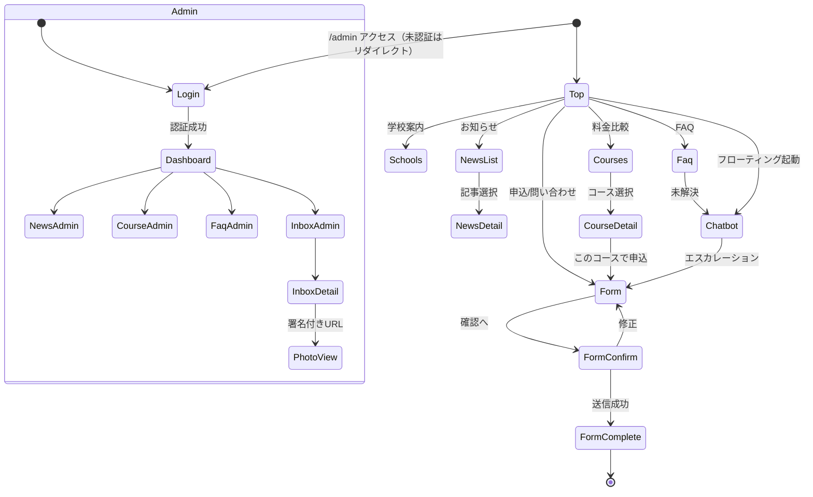

# 機能要件書 — 岩滝・網野自動車教習所 Webサイトリニューアルデモ

## 変更履歴

| バージョン | 日付 | 変更内容 | 変更者 |
|-----------|------|---------|--------|
| 0.1.0 | 2026-07-19 | 初版作成（全機能 F-001〜F-021 の画面・API・データモデル定義） | Spec Agent |
| 0.2.0 | 2026-07-19 | Seniorレビュー差し戻し反映。Must Fix: REV-001(FAQ単一ナレッジ源化/ChatRule廃止) / REV-002(取消歴・現有免許・写真をtype=APPLICATION条件必須化) / REV-003(Application→Course整合性＋料金スナップショット) / REV-004(アップロードobjectKeyバインディング) / REV-005(Course.category追加＋F-022スクール・追加講習詳細)。Should Fix: REV-006(News COMMON化) / REV-007(licenseType enum化) / REV-009(合宿データ方針) / REV-013(インデックス戦略) / REV-010(F-023静的ページ) / REV-011(receiptNumber・冪等キー) / REV-015(ChatBotサーバー照合確定) | Spec Agent |
| 0.2.1 | 2026-07-19 | 再レビューNice-to-have反映。RE-02(F-022を専用US-017へ紐付け・F-023をUS-006/008/009/016へ再紐付け) / RE-03(非LICENSEのlicenseType/licenseTypeLabelをnull扱いと明記・programLabelで代替) | Spec Agent |
| 0.2.2 | 2026-07-27 | P2前の仕様追補。SPEC-002: `PublishStatus` に `UNPUBLISHED`(非公開)を追加し3状態のセマンティクス・F-014遷移/フィルタ/公開日・公開サイト整合・スキーマ移行申し送りを明記。SEC-001: News.body のMarkdownソース保存＋描画時 remark→rehype→rehype-sanitize 厳格ホワイトリスト方針を§4.10に追加 | Spec Agent |
| 0.3.0 | 2026-07-29 | P3前の仕様追補（P2/P2.5 セキュリティ監査の設計制約を受け入れ条件化）。**§4.11 新設**: 公開エンドポイントのレート制限・スパム対策共通仕様（条件1' / 条件2 = SEC-031〜034/037/038/039/041/002）。**§4.12 新設**: 個人情報の取扱い共通仕様（PII 非ログ・非エコーバック / 保持期間 / APPI 削除経路 / 自動削除バッチ）。F-008/F-009/F-010/F-017/F-018 に**検証可能な受け入れ条件（AC-xxx）**を追加。SPEC-003: F-009 の「署名付きPUT URL の失効(300秒)」と「uploadToken の失効(600秒)」が単一の `expiresIn` に混在していた矛盾を解消（2フィールドに分離）。SPEC-004: F-010 境界値の「同一IPからの送信 N回/時」が SEC-032「IP 単独軸に依存しない」と矛盾するため多軸表記へ訂正。SPEC-005: F-018 の `POST /api/admin/uploads/sign` が生の `objectKey` を受け取る IDOR 構造だったためリソースID指定＋所有関係のサーバー判定へ変更。F-017 に APPI 削除 API（DB + Blob 連動削除）を追加 | Spec Agent |
| 0.3.1 | 2026-07-29 | **P3 設計レビュー（`docs/review-p3-design-2026-07-29.md`）の差し戻し反映**。Must Fix 9件（RV-P3D-009 は Designer 担当）+ Should Fix 13件 + Nice to Have 4件をクローズ。**SPEC-006**: F-008 Step 表を UI 設計の確定構成へ更新し AC-008-2 をフィールド名ベースへ（S01）。**SPEC-007**: 年齢下限の基準日・暦月丸め・境界値を確定（S02）。**SPEC-008**: F-008 に API 仕様の節を新設し3経路（Cookie 発行 / コース取得 / 郵便番号解決）を登録（S09）。**SPEC-009**: 免許証写真の自動再発行に上限3回・非表示タブでの停止を確定（S04）。**SPEC-010**: 混雑・劣化時のワイヤ契約を §4.11 Tier 表へ一本化（`200+challengeRequired` を廃止 / RV-P3D-002）。**SPEC-011**: `DELETE /api/uploads/license` を採用（S03）。**SPEC-012**: ハニーポットを「静かに拒否」から Tier B 降格へ変更（RV-P3D-006）。**SPEC-013**: `receiptNumber` を ULID 既定に（N01）。**SPEC-014**: `Application.statusChangedAt` を新設（RV-P3D-008）。**SPEC-015**: 対応記録を F-017 操作ログに充てる整理（S08）。**SPEC-016**: F-018 の単一ロール認可モデルを明示し AC-018-5 を必須化（S13）。§4.11: AC-RL-1 のセマフォ実体（KV リース付きカウンタ / TTL / シャード）を確定、AC-RL-3/6 を書き換え、**AC-RL-11〜14 を新設**（リース回復 / Tier 契約 / フォームセッション Cookie / メール宛先スロットル）。§4.12: AC-PII-5 を判定純関数と境界値へ、AC-PII-7 に `UploadToken` を追加、**AC-PII-10/11 を新設**（cron の認可・件数上限）。AC-010-13/14/15 を強化（セマフォ非直列化 / ルート列挙テストの実装形態指定 / CSP の単位別検証対象） | Spec Agent |
| 0.3.2 | 2026-07-29 | **P3 設計再レビュー（`docs/review-p3-design-re-2026-07-29.md`）の差し戻し反映**。新規 Must Fix 3件 + Should Fix 6件 + Nice to Have 2件。**§4.11 AC-RL-1 / AC-RL-11: セマフォの機構を `INCR`+`EXPIRE` から ZSET によるパーミット単位のリースへ差し替え**（RV-P3DR-001。`acquire` = 期限切れ掃除→`ZCARD`判定→`ZADD` を Lua 1本 / `release` = `ZREM permitId` で冪等 / AC-RL-11(a) を「継続的に `acquire` が到着している状況での回復」へ書き換え＝無負荷放置型のテストを禁止）。**AC-RL-15 新設**（RV-P3DR-005/006: TTL と `maxDuration` を単一定数から導出 / 上限は `perShardLimit` 定義 + 全体 = `perShardLimit × K` / power of two choices）。**AC-RL-8 明確化**（RV-P3DR-007: セマフォは `SemaphoreStore` という別抽象を持つ）。**AC-RL-12(c) を書き換え**（RV-P3DR-009: ジッタ検証を N=20 サンプル + ±20% レンジへ）、**(e) 追加**（RV-P3DR-004）。**§4.11 契約ルール7 新設**（RV-P3DR-004: Tier 判別はステータスと `challenge` の有無のみ / `challenge` なしの 403 は Tier ではない失敗 / 428 案は却下）。**SPEC-017 新設**: `Application.sessionIdHash` を追加し AC-010-4 の冪等照合に必要な `sid` の保持場所を確定（RV-P3DR-002。案(B) KV は却下）。**AC-RL-13(a)** に単位の割り当てを明記（RV-P3DR-010）。**AC-PII-1** に `sid` / `sessionIdHash` を禁止項目として追加。AC-PII-11 の検証単位は `docs/phase-status.md` (2) へ移動（RV-P3DR-003） | Spec Agent |
| 0.3.3 | 2026-07-29 | **P3 設計再々レビュー（`docs/review-p3-design-re2-2026-07-29.md` / Approve・P3-a 着手可）の新規指摘反映**。新規 Must Fix 2件 + Should Fix 5件 + Nice to Have 2件（RV-P3DR2-008 は Designer 担当）。**AC-RL-11(a) の「上限まで取り切る」を「セマフォ全体を満杯にすること」と再定義**（RV-P3DR2-001。`perShardLimit` 件では容量の 1/K しか埋まらず、回収が無くても最後の `acquire` が成功して**テストが常に green になる**＋ (d) の歯止めも同時に無効化される）。手順を①〜⑤で確定＝**既定は `SEMAPHORE_SHARDS = 1` の注入** / 「`acquire` が失敗するまで取る」の禁止 / **時刻を進める前に「期限前の追加 `acquire` が失敗する」assert を必須化**（空振り防止）/ (d) は (a) のその assert の証跡を先に残す＋掃除の間引き実装の禁止。**AC-RL-11(e) 新設**（RV-P3DR2-002。「同時に有効なパーミットが `semaphoreTotalLimit()` を超えない」＝セマフォの存在理由そのものを検証する条件が無かった。**(e-1) 振る舞い + (e-2) 単一原子操作 + (e-3) 濃度の最大値**の3点を必須化し、楽観方式が成功数だけを見るテストで green になることを本文に明記）。**AC-RL-1**: `ZADD` の擬似コードを `<now + ttlMs>` へ訂正し**単位（ms）を明記**（RV-P3DR2-004）、**キー literal を `sem:{applications}:0`〜`:3` に確定**（RV-P3DR2-006。`{}` はハッシュタグ。連番を `{}` に入れると複数キー `EVAL` が `CROSSSLOT` で失敗する）、**待機中の各ポーリングでシャード候補を選び直す**を追加（RV-P3DR2-003）。**AC-RL-15(a)** に**秒 → ms の変換を `semaphoreTtlMs()` 1箇所へ固定**と「`acquire` に渡る実 ms 値が 20,000 であること」を追加（RV-P3DR2-004）。**AC-010-13(b)(c)**: キー形式を訂正し、**シャード化の効果の成立条件**と「(c) の実測を『シャード化が効いた証拠』と読み替えない」を明記（RV-P3DR2-009） | Spec Agent |

> 本書は `business-spec.md` のユーザーストーリー（US-xxx）に対応する。技術前提: Next.js(App Router) + Prisma + Vercel Postgres（Vercel集約構成, tech-stack v0.2.0）。DBアクセスはサーバーサイド限定（Route Handler / Server Action）。管理画面は Auth.js 認証。免許証写真は Vercel Blob（非公開）＋署名付きURL。ChatBotはルールベース。

---

## 1. 機能一覧

| 機能ID | 機能名 | 優先度 | ステータス | 関連ストーリー |
|--------|--------|--------|-----------|-------------|
| F-001 | トップページ | High | 未着手 | US-001, US-003, US-005 |
| F-002 | コース・料金 横断比較 | High | 未着手 | US-001 |
| F-003 | コース詳細 | High | 未着手 | US-002 |
| F-004 | お知らせ一覧（公開） | High | 未着手 | US-003 |
| F-005 | お知らせ詳細（公開） | High | 未着手 | US-003 |
| F-006 | FAQ（公開） | High | 未着手 | US-004 |
| F-007 | 学校案内・アクセス | Mid | 未着手 | US-005 |
| F-008 | ステップ式 申込・問い合わせフォーム | High | 未着手 | US-006, US-007, US-008, US-009 |
| F-009 | 免許証写真アップロード | High | 未着手 | US-008 |
| F-010 | フォーム送信・スパム対策・自動返信 | High | 未着手 | US-006, US-009 |
| F-011 | AI ChatBot（ルールベース） | High | 未着手 | US-010 |
| F-012 | 管理者認証（Auth.js） | High | 未着手 | US-011 |
| F-013 | 管理ダッシュボード | Mid | 未着手 | US-011 |
| F-014 | お知らせ管理（CMS CRUD） | High | 未着手 | US-012 |
| F-015 | 料金・コース管理（CMS） | High | 未着手 | US-013 |
| F-016 | FAQ管理（CMS） | High | 未着手 | US-014 |
| F-017 | 申込・問い合わせ受信管理 | High | 未着手 | US-015 |
| F-018 | 署名付きURLによる写真閲覧 | High | 未着手 | US-008, US-015 |
| F-019 | SEO基盤（メタ/OGP/正規URL） | High | 未着手 | US-016 |
| F-020 | 構造化データ | Mid | 未着手 | US-016 |
| F-021 | サイトマップ / robots | Mid | 未着手 | US-016 |
| F-022 | スクール・追加講習詳細（ドローン/建機/高齢者/ペーパー/企業） | Mid | 未着手 | US-017 |
| F-023 | 静的ページ（プライバシーポリシー等） | Mid | 未着手 | US-006, US-008, US-009, US-016 |

**優先度凡例**: High=デモ必須 / Mid=デモ望ましい / Low=将来。

---

## 2. 機能詳細

### F-001: トップページ

#### 概要
現行のトップ構成（ヒーロー → FEATURE → NEWS最新 → 料金 → SCHOOL INFO → VOICE → ACCESS）を再設計して維持。各セクションから主要導線（料金比較・申込・お知らせ・各校案内）へ誘導する。

#### 画面仕様
| 要素 | 種別 | 必須 | バリデーション | 備考 |
|------|------|------|-------------|------|
| ヒーロー | section | Yes | - | キャッチコピー＋CTA（申込/料金比較） |
| FEATUREセクション | section | Yes | - | 指名制/女性教習/スマホ予約/柔軟スケジュール/予復習動画 |
| NEWS最新 | list | Yes | - | 公開お知らせの新しい順 最大3件、詳細へリンク |
| 料金プレビュー | tabs | Yes | - | 通学/合宿タブ、比較ページへの導線 |
| SCHOOL INFO | section | Yes | - | 岩滝校・網野校の概要、各校案内へリンク |
| VOICE | section | No | - | 卒業生の声 |
| ACCESS | section | Yes | - | 2校のアクセス概要 |
| ChatBot起動ボタン | button | Yes | - | 全ページ共通フローティング（F-011） |

#### 振る舞い仕様
**正常系**:
1. ユーザーがトップにアクセスする
2. サーバーが公開お知らせ最新3件と料金サマリーを取得しレンダリングする
3. 各CTAから該当ページへ遷移できる

**異常系**:
| ケース | 条件 | エラーメッセージ | 振る舞い |
|--------|------|---------------|---------|
| E-001-1 | お知らせ取得失敗 | （非表示・ログ記録） | NEWSセクションは「お知らせはありません」を表示しページ全体は表示 |

**境界値**:
| 項目 | 最小値 | 最大値 | 備考 |
|------|--------|--------|------|
| NEWS表示件数 | 0件 | 3件 | 0件時は代替文言 |

#### API仕様
Server Component で取得（読み取り専用、公開データ）。
```
GET (Server Component data fetch)
- 公開お知らせ最新3件: prisma.news.findMany({ where: { status: 'PUBLISHED' }, orderBy: { publishedAt: 'desc' }, take: 3 })
- 料金サマリー: prisma.course.findMany({ where: { published: true } })
```

#### データモデル
F-004（News）, F-002（Course）を参照。

---

### F-002: コース・料金 横断比較

#### 概要
校舎（岩滝/網野）×免許種別×受講形態（通学/合宿）でコース・料金を横断比較する。管理画面（F-015）で編集されたデータを表示する。本比較UIは `category='LICENSE'`（免許）のコースのみを対象とする。スクール系（ドローン/建機）・追加講習（高齢者/ペーパー/企業）は構造（対応校・通学/合宿・料金の意味）が異なるため本UIから分離し、F-022 のスクール・追加講習詳細で扱う（REV-005）。

#### 画面仕様
| 要素 | 種別 | 必須 | バリデーション | 備考 |
|------|------|------|-------------|------|
| 校舎フィルタ | select/toggle | No | 岩滝/網野/両方 | 初期値=両方 |
| 免許種別フィルタ | select/checkbox | No | LicenseType enum 値 | 普通車/準中型/中型/大型/二種/けん引/大特/二輪等（enum・表記ゆれ不可） |
| 受講形態フィルタ | toggle | No | 通学/合宿 | 初期値=通学 |
| 比較テーブル/カード | table/cards | Yes | - | 種別・最短日数・料金〜・対応校・給付金/助成金タグ |
| コース詳細リンク | link | Yes | - | F-003へ |
| 申込CTA | button | Yes | - | 選択コースをフォームに引き継ぐ |

> 免許種別は自由文字列ではなく `LicenseType` enum で管理し、表記ゆれによるフィルタ破綻を防ぐ（REV-007）。表示名は enum に対応するラベルで解決する。普通車の MT/AT は同一 `licenseType='ORDINARY'` 内の `transmission` 属性（MT/AT）として区別し、別コース行にはしない。

#### 振る舞い仕様
**正常系**:
1. ユーザーがフィルタを選択する
2. 条件に一致する公開コースが絞り込み表示される
3. コースを選び詳細または申込へ遷移する

**異常系**:
| ケース | 条件 | エラーメッセージ | 振る舞い |
|--------|------|---------------|---------|
| E-002-1 | 条件一致0件 | 「条件に合うコースがありません」 | フィルタ緩和を促す |
| E-002-2 | データ取得失敗 | 「情報を取得できませんでした」 | 再読込導線 |

**境界値**:
| 項目 | 最小値 | 最大値 | 備考 |
|------|--------|--------|------|
| 対応校 | 1校 | 2校 | 大型/二種は岩滝のみ、二輪は網野のみ等 |
| 料金 | 0円超 | - | 0以下は不正データ（管理側で防止） |

#### API仕様
```
GET (Server Component / Route Handler) /api/courses?school=&license=&format=
※本エンドポイントは category='LICENSE' のみ返す。
Response (200):
{
  "courses": [
    {
      "id": "string",
      "category": "LICENSE",
      "licenseType": "ORDINARY",          // enum値
      "licenseTypeLabel": "普通車",         // 表示名
      "transmission": "AT",                // ORDINARY のみ AT|MT、他は null
      "format": "TSUGAKU | GASSHUKU",
      "minDays": 15,
      "priceFrom": 225500,
      "schools": ["IWATAKI","AMINO"],
      "subsidyTags": ["給付金"]
    }
  ]
}
Error Responses:
- 400: フィルタ値不正
- 500: サーバーエラー
```

#### データモデル
```typescript
type School = 'IWATAKI' | 'AMINO'
type CourseFormat = 'TSUGAKU' | 'GASSHUKU'
type Transmission = 'AT' | 'MT'

// REV-005: コース種別。LICENSE=免許（本比較UI対象）、DRONE/KENKI=スクール、
// ADDITIONAL=追加講習（高齢者/ペーパー/企業）。DRONE/KENKI/ADDITIONAL は F-022 で表示。
type CourseCategory = 'LICENSE' | 'DRONE' | 'KENKI' | 'ADDITIONAL'

// REV-007: 免許種別は enum。表示名は licenseTypeLabel で解決し表記ゆれを排除。
type LicenseType =
  | 'ORDINARY'       // 普通車
  | 'SEMI_MEDIUM'    // 準中型
  | 'MEDIUM'         // 中型
  | 'LARGE'          // 大型
  | 'ORDINARY_2ND'   // 普通二種
  | 'LARGE_2ND'      // 大型二種
  | 'TOWING'         // けん引
  | 'LARGE_SPECIAL'  // 大型特殊
  | 'MOTORCYCLE'     // 普通自動二輪

interface Course {
  id: string
  category: CourseCategory       // REV-005
  // REV-03: licenseType/licenseTypeLabel は category=LICENSE 専用。非LICENSE(DRONE/KENKI/
  // ADDITIONAL)では両者とも null とし、表示名は programLabel で代替する（displayName ヘルパで
  // 「LICENSE→licenseTypeLabel / 非LICENSE→programLabel」を一元解決）。
  licenseType: LicenseType | null // category=LICENSE 時のみ設定。非LICENSEは null（REV-007/RE-03）
  licenseTypeLabel: string | null // category=LICENSE 時のみ表示名（例: 普通車）。非LICENSEは null（RE-03）
  transmission: Transmission | null // ORDINARY のみ AT/MT。他は null
  programLabel: string | null     // category≠LICENSE のスクール/講習名（例: 農業用ドローン）。LICENSEは null
  format: CourseFormat | null     // 通学/合宿。スクール系で無意味なら null
  minDays: number                 // 最短日数（>0）
  priceFrom: number               // 料金〜（税込, >0）
  schools: School[]               // 対応校（1〜2）
  subsidyTags: string[]           // 給付金/助成金タグ
  description: string | null
  published: boolean              // 公開フラグ（物理削除は禁止=論理削除, REV-003）
  sortOrder: number
  createdAt: Date
  updatedAt: Date
}
```
> **合宿（GASSHUKU）データ（REV-009）**: 現行調査（`current-site-analysis.md` §4）は通学9件のみで合宿の料金・最短日数の出典がない。デモのシードデータでは合宿料金を**代表的なダミー値として明示（「デモ用参考値」ラベル付き）**で投入し、実値は現行 `/camp/` 調査で後日確定する（tech-stack §6 の未決事項に連動）。US-001 の通学/合宿絞り込みE2Eが空表にならないよう最低1件以上の合宿コースをシードする。

---

### F-003: コース詳細

#### 概要
個別コースの詳細（料金・最短日数・対応校・給付金情報・説明）を表示。申込フォームへコース選択を引き継ぐ。

#### 画面仕様
| 要素 | 種別 | 必須 | バリデーション | 備考 |
|------|------|------|-------------|------|
| コース名/種別 | heading | Yes | - | - |
| 料金・最短日数・対応校 | table | Yes | - | - |
| 給付金/助成金タグ | badge | No | - | - |
| 説明本文 | text | No | - | - |
| 申込CTA | button | Yes | - | コースID付きでF-008へ |
| パンくず | nav | Yes | - | BreadcrumbList（F-020） |

#### 振る舞い仕様
**正常系**: コースIDでコースを取得し詳細表示。CTAから申込フォームへ遷移。
**異常系**:
| ケース | 条件 | エラーメッセージ | 振る舞い |
|--------|------|---------------|---------|
| E-003-1 | コース未存在/非公開 | - | 404ページ |

#### API仕様
```
GET (Server Component) /courses/[id]
- prisma.course.findFirst({ where: { id, published: true } }) → null なら notFound()
```
#### データモデル
F-002 の `Course` を参照。

---

### F-004: お知らせ一覧（公開）

#### 概要
公開済みお知らせをカテゴリ別・新しい順・ページネーションで一覧表示。

#### 画面仕様
| 要素 | 種別 | 必須 | バリデーション | 備考 |
|------|------|------|-------------|------|
| カテゴリフィルタ | tabs/select | No | すべて/岩滝/網野/ドローン/建機 | 初期値=すべて。「すべて」はフィルタ操作であり記事カテゴリではない（REV-006） |
| 一覧アイテム | list | Yes | - | タイトル・公開日・カテゴリ、詳細へリンク |
| ページネーション | nav | Yes | - | 1ページ=10件 |

> **カテゴリ設計（REV-006）**: 記事に付与するカテゴリ実体は `IWATAKI / AMINO / DRONE / KENKI / COMMON`（両校共通告知）の5種。フィルタUIの「すべて」は全件表示の操作であり、記事カテゴリではない（従来の 'ALL' 二重定義を解消）。校舎フィルタ（岩滝/網野）選択時は、当該校カテゴリに加えて `COMMON`（共通告知）を含めて表示する。

#### 振る舞い仕様
**正常系**: 公開お知らせを条件で絞り込み、ページ単位で表示。
**異常系**:
| ケース | 条件 | エラーメッセージ | 振る舞い |
|--------|------|---------------|---------|
| E-004-1 | 0件 | 「お知らせはありません」 | 空状態表示 |
| E-004-2 | ページ範囲外 | - | 1ページ目にフォールバックまたは404 |

**境界値**:
| 項目 | 最小値 | 最大値 | 備考 |
|------|--------|--------|------|
| ページ番号 | 1 | 総ページ数 | 1件/ページ=10件 |

#### API仕様
```
GET /api/news?category=&page=
Response (200):
{
  "items": [{ "id":"", "title":"", "category":"IWATAKI", "publishedAt":"ISO", "excerpt":"" }],
  "page": 1, "totalPages": 5, "totalCount": 42
}
Error Responses:
- 400: パラメータ不正
- 500: サーバーエラー
```
一覧は `status='PUBLISHED'` かつ `publishedAt <= now()` のみ対象。

#### データモデル
```typescript
// REV-006: 記事カテゴリ実体。'ALL' は廃止（フィルタUIの「すべて」と分離）。
// COMMON = 両校共通告知（校舎フィルタ時も表示される）。
type NewsCategory = 'IWATAKI' | 'AMINO' | 'DRONE' | 'KENKI' | 'COMMON'

// SPEC-002: 公開状態は3値。UI(news-cms.md)が前提とする「非公開」を追加。
//   DRAFT       = 未公開の下書き（一度も公開していない・編集中）
//   PUBLISHED   = 公開中（公開サイトに表示。publishedAt 必須）
//   UNPUBLISHED = 非公開（公開を取り下げた/アーカイブ。公開サイトには非表示）
type PublishStatus = 'DRAFT' | 'PUBLISHED' | 'UNPUBLISHED'

interface News {
  id: string
  title: string
  body: string            // 本文（Markdownソースで保存。表示時にサニタイズ, SEC-001）
  category: NewsCategory
  status: PublishStatus    // DRAFT | PUBLISHED | UNPUBLISHED
  publishedAt: Date | null // 公開日時。PUBLISHED時は必須。DRAFT/UNPUBLISHEDはnull許容（UNPUBLISHEDは直近公開日時を保持してもよい）
  createdAt: Date
  updatedAt: Date
}
```
> **公開サイト整合（重要）**: 公開クエリは `status = 'PUBLISHED'`（かつ `publishedAt <= now()`）のみ表示。DRAFT・UNPUBLISHED は公開サイト非表示。P1実装済みの News 公開クエリは既に `PUBLISHED` フィルタのため、`UNPUBLISHED` 追加による公開側の挙動変化はない（新設の非公開状態も PUBLISHED ではないため自動的に除外される）。

---

### F-005: お知らせ詳細（公開）

#### 概要
公開お知らせの本文詳細を表示。

#### 画面仕様
| 要素 | 種別 | 必須 | バリデーション | 備考 |
|------|------|------|-------------|------|
| タイトル | heading | Yes | - | - |
| カテゴリ・公開日 | meta | Yes | - | - |
| 本文 | text | Yes | - | Markdownソースを描画時に厳格サニタイズして表示（SEC-001, §4.10） |
| 一覧へ戻る | link | Yes | - | - |
| パンくず | nav | Yes | - | BreadcrumbList |

#### 振る舞い仕様
**正常系**: IDで公開お知らせを取得し表示。
**異常系**:
| ケース | 条件 | エラーメッセージ | 振る舞い |
|--------|------|---------------|---------|
| E-005-1 | 未存在/非公開 | - | 404ページ |

#### API仕様
```
GET (Server Component) /news/[id]
- prisma.news.findFirst({ where: { id, status:'PUBLISHED' } }) → null なら notFound()
```
#### データモデル
F-004 の `News` を参照。

---

### F-006: FAQ（公開）

#### 概要
公開FAQをカテゴリ別に一覧表示。アコーディオン展開・キーワード絞り込み。**`Faq` は FAQ由来ナレッジの単一の真実源（single source of truth）**であり、ChatBot（F-011）は実行時に公開 `Faq`（keywords/answer）を直接照合する。別テーブルへの複製は行わない（REV-001）。これにより「FAQ編集→ChatBot反映」（US-014）が同期機構なしに成立する。

#### 画面仕様
| 要素 | 種別 | 必須 | バリデーション | 備考 |
|------|------|------|-------------|------|
| カテゴリ見出し | heading | Yes | - | 学校について/教習車種・プラン/料金・支払い/その他 |
| キーワード検索 | input | No | - | 質問・回答を部分一致 |
| Q&Aアコーディオン | accordion | Yes | - | クリックで回答展開 |

#### 振る舞い仕様
**正常系**: 公開FAQをカテゴリ別・表示順で表示。検索語で絞り込み。
**異常系**:
| ケース | 条件 | エラーメッセージ | 振る舞い |
|--------|------|---------------|---------|
| E-006-1 | 検索一致0件 | 「該当するFAQがありません」 | 空状態＋ChatBot誘導 |

#### API仕様
```
GET /api/faqs?category=&q=
Response (200): { "items": [{ "id":"", "question":"", "answer":"", "category":"", "sortOrder":1 }] }
```
公開FAQは `published=true` のみ。

#### データモデル
```typescript
type FaqCategory = 'SCHOOL' | 'COURSE' | 'PAYMENT' | 'OTHER'

interface Faq {
  id: string
  question: string
  answer: string          // 回答（プレーン/Markdown）
  category: FaqCategory
  keywords: string[]      // ChatBot照合用キーワード
  published: boolean
  sortOrder: number
  createdAt: Date
  updatedAt: Date
}
```

---

### F-007: 学校案内・アクセス

#### 概要
岩滝校・網野校それぞれの所在地・電話・アクセス・特徴・対応免許を表示。構造化データ（DrivingSchool）の情報源。

#### 画面仕様
| 要素 | 種別 | 必須 | バリデーション | 備考 |
|------|------|------|-------------|------|
| 校舎名・住所・電話 | section | Yes | - | 岩滝: 与謝野町弓木1459-1 / 網野: 京丹後市網野町下岡522 |
| アクセス | section | Yes | - | 岩滝口駅徒歩20分 / 網野駅徒歩5分 |
| 地図 | map/image | Yes | - | 埋め込みまたは静的画像 |
| 特徴・対応免許 | section | Yes | - | 各校の対応免許種別 |
| 電話CTA | tel link | Yes | - | フリーダイヤル/直通 |

#### 振る舞い仕様
**正常系**: 校舎データ（静的または DB）を表示。
**異常系**: 地図読み込み失敗時は住所テキストとリンクにフォールバック。

#### データモデル
```typescript
interface SchoolInfo {
  code: School            // IWATAKI | AMINO
  name: string
  postalCode: string
  address: string
  phoneTollFree: string
  phoneDirect: string
  access: string
  geo: { lat: number; lng: number } | null
  features: string[]
  licenseTypes: string[]
}
```
> デモでは定数/シードデータで保持可（管理編集はスコープ外）。

---

### F-008: ステップ式 申込・問い合わせフォーム

#### 概要
現行19項目を再設計したステップ式フォーム。冒頭で「申込/問い合わせ」を分岐。免許取消歴を独立必須設問に格上げ。確認画面・モバイル最適化・入力保持。

#### 画面仕様（ステップ構成 — 確定 / SPEC-006）

> **SPEC-006（RV-P3D-S01）**: v0.3.0 までの Step 表は「Step1（種別＋コース）〜Step6（確認）」の**目安**であり、UI 設計（`docs/ui-design/application-form.md` §1）が確定した構成と一致していなかった。**UI 設計の確定構成を本表に取り込み、これを確定とする**。あわせて **AC-008-2 をステップ番号ではなくフィールド名で記述する**（受け入れ条件をステップ番号に依存させない。UI 構成は今後も変わりうるが、type ごとに収集するフィールドの有無は変わらないため）。

**種別（type）は進捗の外側「入口」に置く**（種別により総ステップ数が 5 / 2 に変わるため、進捗バーの分母に含めると表示が後退して見える）。

**APPLICATION（全5ステップ）**

| Step | 要素 | 種別 | 必須 | バリデーション |
|------|------|------|------|-------------|
| 入口 | 種別（申込/問い合わせ） | radio | Yes | いずれか選択 |
| 1 | 教習プラン（複数可） | checkbox | Yes | 1つ以上 |
| 1 | コース | select | Yes | 選択肢内 |
| 1 | 校舎 | radio | Yes | 岩滝/網野 |
| 1 | 受講形態 | radio | Yes | 通学/合宿 |
| 2 | 氏名 | input | Yes | 1〜50文字 |
| 2 | 氏名カナ | input | Yes | 全角カナ、1〜50文字 |
| 2 | 生年月日 | date picker | Yes | 実在日付・未来日不可、年齢下限（§4.5 / 下記境界値表） |
| 2 | 性別 | radio | No | - |
| 2 | メール | input | Yes | RFCメール形式 |
| 2 | 電話 | input | Yes | 数字・ハイフン、10〜11桁 |
| 2 | 郵便番号 | input | Yes | 7桁 |
| 2 | 住所 | input | Yes | 1〜100文字 |
| 2 | 建物名 | input | No | 0〜100文字 |
| 3 | 免許取消歴の有無 | radio | Yes | あり/なし（US-007）。type=APPLICATION 時のみ収集（REV-002） |
| 3 | 取消歴の補足 | textarea | 条件付き | 「あり」選択時に表示 |
| 3 | 現有免許 | checkbox | No | 選択肢内。type=APPLICATION 時のみ収集（REV-002） |
| 3 | 免許証写真（表/裏） | file | No | F-009。type=APPLICATION 時のみ収集（REV-002） |
| 4 | 入所希望日 | month picker | No | 未来日 |
| 4 | 希望教習時間帯 | radio | No | - |
| 4 | 支払方法 | select | No | 選択肢内 |
| 4 | 当校初めてか | radio | No | - |
| 4 | 知ったきっかけ | checkbox | No | - |
| 4 | 質問・要望 | textarea | No | 0〜1000文字 |
| 5 | プライバシー同意 | checkbox | Yes | 同意必須（APPI） |
| 5 | 確認画面 | review | - | 全入力の表示・修正導線 |

**INQUIRY（全2ステップ）**

| Step | 要素 | 必須 |
|------|------|------|
| 入口 | 種別 | Yes |
| 1 | 氏名 / 氏名カナ / 生年月日 / 性別 / メール / 電話 / 当校初めてか / 知ったきっかけ / 質問・要望 | 氏名・カナ・生年月日・メール・電話は Yes、他は No |
| 2 | プライバシー同意 / 全入力のレビュー / 送信 | 同意 Yes |

> 免許取消歴・現有免許・免許証写真は最小収集原則（business §4.3・APPI）に従い **type=APPLICATION 時のみ収集・必須**とする（REV-002）。INQUIRY では申込専用項目（プラン/コース/校舎/受講形態/郵便番号/住所/**免許取消歴/現有免許/免許証写真**/入所希望日/支払方法）を**描画しない**（`hidden` でも非活性でもなく非レンダリング。AC-008-2）。

#### 振る舞い仕様
**正常系**:
1. 入口で種別を選び、以降のステップで入力する
2. 各ステップで「次へ/戻る」でき、入力値はクライアント状態で保持される
3. 必須未入力・形式不正は当該ステップで先に進めずエラー表示
4. 最終ステップ（確認画面）で内容を確認し、修正または送信する
5. 送信は F-010 に委譲

**異常系**:
| ケース | 条件 | エラーメッセージ | 振る舞い |
|--------|------|---------------|---------|
| E-008-1 | 必須未入力 | 「必須項目です」 | 当該項目直下に表示、次へ不可 |
| E-008-2 | 形式不正（メール/電話/カナ） | 「形式が正しくありません」 | 当該項目直下に表示 |
| E-008-3 | 取消歴未回答（type=APPLICATION時） | 「回答してください」 | 免許について（Step3）から進めない。INQUIRY時は当該ステップ自体を表示せず対象外 |
| E-008-4 | 同意未チェック | 「同意が必要です」 | 送信不可 |

**境界値**:
| 項目 | 最小 | 最大 | 備考 |
|------|------|------|------|
| 氏名 | 1文字 | 50文字 | - |
| 電話桁数 | 10 | 11 | ハイフン除去後 |
| 郵便番号 | 7桁 | 7桁 | - |
| 質問・要望 | 0 | 1000文字 | - |
| 生年月日 | - | - | 実在日付・未来日不可 |
| **年齢下限**（SPEC-007） | **18歳の誕生日の1ヶ月前**（＝17歳11ヶ月）| - | §4.5 で確定済み（普通車基準の一律下限）。**種別別要件（二輪16歳・大型/二種21歳等）はデモ検証対象外**（REV-014）。下記の判定規則に従う |
| 送信間隔（フォームセッション Cookie 発行→送信） | 3秒 | - | 下限未満は Tier B へ降格（§4.11 AC-RL-6）。**判定基準はサーバーが持つ `issuedAt`** |

> **SPEC-007（RV-P3D-S02）: 年齢下限の判定規則（確定）**。§4.5 に確定値がありながら F-008 と UI 設計では「未確定」扱いになっていたため、境界値を確定して転記する。
> - **基準日は「サーバーの受信日（JST）」**とする。クライアントのローカル日付・タイムゾーンに依存させない（端末時計のずれや海外からの送信で判定が変わらないようにするため）。
> - 判定は純関数 `isAgeEligible({ birthDate, receivedAt }): boolean` に分離する。定義: **`birthDate + 18年 - 1ヶ月 <= 受信日（JST の日付単位）`** なら可。
> - 「1ヶ月前」は**暦月**で計算し、**該当日が存在しない月は当月末日に丸める**（例: 生年月日 2008-03-29/30/31 → 18歳の誕生日の1ヶ月前は 2026-02-28（うるう年なら 2026-02-29）とする。「存在しない 2月29〜31日」を無効にしない）。
> - 境界値のユニットテスト（必須）: (a) **17歳11ヶ月0日 → 不可**、(b) **17歳11ヶ月1日（＝18歳の誕生日のちょうど1ヶ月前）→ 可**、(c) 18歳0日 → 可、(d) うるう日生まれ（2008-02-29）の判定、(e) 月末丸めが効くケース（上記 2008-03-31）。
> - エラーコードは `AGE_BELOW_MIN`。**エラー応答に生年月日そのものを含めない**（§4.12 AC-PII-2）。

#### API仕様（SPEC-008 / RV-P3D-S09）

> **SPEC-008**: UI 設計はフォームが3つの経路を叩くことを前提にしているが、v0.3.0 まで F-008 に API 仕様の節が無く、いずれも仕様に登録されていなかった。**「仕様に無い公開エンドポイント」は AC-010-14 のルート列挙テストの網からも漏れる**ため、ここに登録する。

```
GET /apply                                  (認証不要・ページ)
→ レスポンスで フォームセッション Cookie を Set-Cookie（§4.11 AC-RL-13）
→ 発行そのものが発信元軸 30回/10分 で制限される（AC-RL-13(c)）

GET /api/courses                            (認証不要・F-002 の既存経路を再利用)
→ コース選択肢の取得。取得失敗時はフォーム全体を落とさず当該セクションに ErrorState を出す

GET /api/postal/[code]                      (認証不要・GET・変更系ではない)
→ 郵便番号 → 住所の解決。7桁数字以外は 400
→ **デモ範囲では京都府内の内包データで解決し、外部通信を行わない**（外部 API をクライアントから直接叩かせない設計）
```

> **郵便番号解決のレート制限の扱い（確定）**: §4.11 の適用対象は**変更系**であり、本経路は GET・DB/外部 I/O を伴わない内包データ照合であるため、**§4.11 の公開変更系ラッパの対象外**とする。ただし **(a)** 入力は「7桁数字」の形にサーバーで正規化・検証してから使い、ユーザー入力をそのままキャッシュキー・ログに載せない、**(b)** 将来この経路を**外部 API 呼び出しに変更する場合は §4.11 の対象に含める**（外部 I/O が入った時点で増幅攻撃の踏み台になるため）——この条件を実装コメントに明記すること。

#### 完了条件（受け入れ条件）
> P2/P2.5 セキュリティ監査の設計制約（`docs/phase-status.md`「P3 の設計制約」）を検証可能な形に落としたもの。共通仕様は §4.11 / §4.12 を参照。

| ID | 受け入れ条件（検証方法） |
|----|------------------------|
| AC-008-1（RV-P3D-010） | 個人情報入力フォームが公開される時点で、**CSP レスポンスヘッダが同時に投入されている**（SEC-002）。**CSP は P3-a で最終形（後続単位で必要になるオリジンを全て含む）で投入する**（`tech-stack.md` §4.7 のオリジン表が真実源）。検証対象ページは単位により変わる: **P3-a では既存の公開ページ（`/`）**、**P3-b 以降は `/apply`**。E2E で対象ページのレスポンスヘッダに `Content-Security-Policy` が存在し、**`script-src` に `'unsafe-inline'` を含まない**ことを検証する。**CSP 未投入で /apply を公開してはならない**。**`style-src` は対象外**（Next.js がクリティカル CSS を inline `<style>` で注入するため `'unsafe-inline'` を許容せざるを得ない。`tech-stack.md` §4.7 に明記。「CSP を厳格にした」と過大に報告しないこと） |
| AC-008-2（RV-P3D-S01） | フォームは入口の種別選択で分岐し、`type=INQUIRY` では申込専用項目を **DOM に描画しない**（`hidden` でも非活性でもなく非レンダリング）。**判定はステップ番号ではなくフィールドで行う**（UI 構成は変わりうるが type ごとのフィールドの有無は変わらないため）。E2E で以下の入力要素が**DOM に存在しない**ことを検証: `plans` / `courseId` / `school` / `format` / `postalCode` / `address` / `buildingName` / `licenseRevoked` / `licenseRevokedNote` / `currentLicenses` / **免許証写真アップローダ** / `preferredStartMonth` / `paymentMethod` |
| AC-008-3（RV-P3D-005） | 入力値を **`localStorage` および Cookie に書き込まない**（E2E で送信前後に検証）。**`sessionStorage` への一時保存は、以下を全て満たす場合に限り許可する**: **(a)** タブを閉じると失われること、**(b) 自動復元せず**、利用者の明示操作でのみ復元すること、**(c)** 画面上に常時「今すぐ削除する」導線があること、**(d)** 送信成功・完了画面到達・破棄操作で `removeItem` されること、**(e)** **免許証写真に関わる値（`objectKey` / `uploadToken` / プレビュー URL / `File` オブジェクト）を保存しないこと**。E2E で (b)(d)(e) を検証する。**(e) は絶対に緩めない**——`uploadToken` は「このオブジェクトを自分の申込に紐付ける」資格情報であり、共有端末に残ると後続利用者が他人の免許証画像を自分の申込に紐付けられる。`idempotencyKey` は PII ではないため保存してよい（`form-submission.md` §2.1 が要求するリロード後の二重登録防止に必要）。**決定の理由**: 本条件と UI 設計（下書き保存）が正面衝突していたため、UI 側を潰さず条件付き許可へ改訂した。下書き復元を落とす選択肢もあったが、その場合でも `idempotencyKey` だけは sessionStorage に置く例外が必要になり、結局「sessionStorage 全面禁止」は成立しない |
| AC-008-4（RV-P3D-004） | フォームページ初期表示時に、サーバーが**署名付きフォームセッション Cookie** を発行する。**属性・署名・必須化・発行の流量制限・送信間隔判定への流用は §4.11 AC-RL-13 が唯一の真実源**（本条件はその参照）。これが「IP 以外の第2軸」となる（条件1'-3 / SEC-032 / SEC-038）。**Cookie を送らないリクエストを素通りさせないこと**が本軸の成立条件である |
| AC-008-5 | プライバシー同意チェックのラベルから /privacy（F-023）へリンクし、**個人情報の保持期間**（§4.12 の値）が同ページに明記されている。同意なしでは送信ボタンが有効化されない |
| AC-008-6 | サーバーのバリデーションエラーレスポンスは**フィールド名とエラーコードのみ**を返し、**送信された入力値をエコーバックしない**（§4.12 AC-PII-2）。ユニットテストでエラーレスポンス JSON に入力値が含まれないことを検証 |
| AC-008-7 | 確認画面（最終ステップ）はクライアント状態のみから描画し、確認内容取得のためのサーバー往復（個人情報の事前 POST）を行わない |
| AC-008-8（SPEC-007） | 年齢下限の判定が**サーバー受信日（JST）を基準とする純関数**として分離され、上記境界値表の (a)〜(e) がユニットテストで固定されている。クライアントのローカル日付を変更しても判定結果が変わらないことを結合テストで検証 |

#### データモデル
F-010 の `Application` を参照。

---

### F-009: 免許証写真アップロード

#### 概要
免許証の表・裏画像を Vercel Blob（非公開）にアップロード。公開URLでは参照不可。

#### 画面仕様
| 要素 | 種別 | 必須 | バリデーション | 備考 |
|------|------|------|-------------|------|
| 表画像 | file | No | JPEG/PNG/WebP, ≤5MB | プレビュー表示 |
| 裏画像 | file | No | 同上 | プレビュー表示 |
| 削除ボタン | button | No | - | 選択取り消し |

#### 振る舞い仕様（REV-004: objectKey バインディング・悪用対策）
**正常系**:
1. ユーザーが画像を選択する（type=APPLICATION のフロー内でのみ）
2. クライアントで形式・サイズを検証しプレビュー
3. クライアントがアップロード発行を要求。**サーバーが `objectKey` を生成**（予測不能なランダム接頭辞付き、クライアント指定は受け付けない）し、短期署名付きPUT URL と `uploadToken`（objectKey にバインドされた署名付き・単回使用・期限付きトークン）を返す
4. クライアントが署名付きPUT URLへ格納（非公開バケット）
5. 申込送信（F-010）時に `objectKey` と `uploadToken` を渡し、**サーバーが「当該フローで発行済み・未消費・期限内・objectKey一致」を検証**してから申込に紐付け（トークンを consumed にする）
6. 格納後、サーバーが実オブジェクトの content-type/size を**再検証**（申告値との齟齬を拒否）

**異常系**:
| ケース | 条件 | エラーメッセージ | 振る舞い |
|--------|------|---------------|---------|
| E-009-1 | 非対応形式 | 「JPEG/PNG/WebPのみ対応」 | 発行拒否 |
| E-009-2 | サイズ超過 | 「5MB以下にしてください」 | 発行拒否 |
| E-009-3 | アップロード失敗 | 「アップロードに失敗しました」 | 再試行導線 |
| E-009-4 | uploadToken 不正/期限切れ/消費済み/objectKey不一致 | （汎用エラー） | 申込時に紐付け拒否・ログ記録（REV-004） |
| E-009-5 | 格納後の再検証で content-type/size 齟齬 | （汎用エラー） | 紐付け拒否・当該オブジェクト削除 |

**境界値**:
| 項目 | 最小 | 最大 | 備考 |
|------|------|------|------|
| ファイルサイズ | 1B | 5MB (5,242,880 B) | サーバー発行制約＋格納後再検証 |
| 枚数 | 0 | 2 | 表・裏各1 |
| 署名付きPUT URL 有効期限 | - | **300秒**（確定） | 格納操作そのものの猶予（SPEC-003） |
| uploadToken 有効期限 | - | **600秒**（確定） | 格納後、申込送信までの猶予。署名URL失効後も申込を送れるよう長め（SPEC-003） |
| **自動再発行の回数**（SPEC-009） | - | **3回 / 写真スロット** | 期限直前の自動再発行の上限。到達後は「送信時に写真の再添付をお願いする」へ縮退（写真は任意項目なので送信自体は救済できる） |
| **発行API の発信元軸** | - | **P3-a で確定**（AC-RL-9） | `POST /api/uploads/license` の発行数。**発行数の制限が唯一の帯域防御**（AC-009-5） |
| **発行API のフォームセッション軸** | - | **P3-a で確定**（AC-RL-9） | 同上。1申込あたりの最悪ケース（写真2枚 × (初回1 + 再発行3)）＝ 8回を上回る値にすること |

> **SPEC-009（RV-P3D-S04）: 自動再発行の暴走防止（確定）**。`uploadToken` の期限直前に自動で再発行＋再 PUT する設計は、**タブを開いたまま放置すると 8分ごとに（写真2枚なら発行2回 + PUT 2回 × 最大5MB）が永久に繰り返される**。AC-009-5 が「発行数の制限が唯一の帯域防御」と定めている以上、この機構が発行数を膨らませる影響は無視できず、**正規利用者が自分で自分をレート制限に到達させる**経路になる（条件1'-1 の趣旨に反する）。以下を確定する:
> 1. **自動再発行は1スロットあたり最大3回**。到達後は自動再発行を停止し、送信時に再添付を促す縮退表示にする。
> 2. **`document.visibilityState === 'hidden'` の間は再発行しない**。`visibilitychange` で復帰した時点で期限切れなら Failed 表示へ遷移する（タブ放置での自動再送を構造的に止める）。
> 3. 上記2点を含めた「1申込あたりの総リクエスト数」を **AC-RL-9 の実測入力に含める**。P3-a の閾値決定が P3-c の挙動を知らずに行われないようにする。

> **SPEC-003（矛盾の訂正）**: v0.2.x では単一の `expiresIn: 300` と境界値表の「uploadToken 有効期限 暫定10分」が矛盾していた。**署名付きPUT URL（300秒）と uploadToken（600秒）は別物**として2フィールドに分離し、いずれも確定値とする（tech-stack §6 #3/#4 の暫定を本書で確定）。

#### API仕様
```
POST /api/uploads/license   (認証不要・§4.11 の公開変更系ラッパ必須)
Request:
{ "side": "front|back", "contentType": "image/jpeg", "size": 1234567 }
Response (200):
{
  "uploadUrl": "signed-put-url",            // サーバー発行、300秒で失効
  "objectKey": "private/lic/<random>",      // ★サーバー生成。クライアントは指定不可
  "uploadToken": "signed-single-use-token", // objectKey にバインド、600秒で失効
  "uploadUrlExpiresIn": 300,                // SPEC-003: 署名付きPUT URLの失効秒数
  "uploadTokenExpiresIn": 600               // SPEC-003: uploadTokenの失効秒数
}
Error Responses:（§4.11 Tier 表に準拠。SPEC-010）
- 400: 形式/サイズ不正
- 403: Tier B。`{ "challenge": "interactive" }`（Turnstile 未検証 / フォームセッション Cookie の不在・不正 / 逼迫の兆候）
- 415: Content-Type 不正（§4.11 の共通ラッパが返す）
- 202: Tier C。`{ "retryAfterMs": number }`（セマフォ上限。**共有軸の枯渇では 429 を返さない**）
- 429: Tier D。`Retry-After` ヘッダ + `{ "retryAfterMs": number }`（発信元軸 / フォームセッション軸の窓上限）
- 500: サーバーエラー

DELETE /api/uploads/license   (認証不要・§4.11 の公開変更系ラッパ必須。SPEC-011)
Request:
{ "objectKey": "string", "uploadToken": "string" }
Response (204): （本文なし）
Error Responses:
- 403: uploadToken 不正/期限切れ/消費済み/objectKey 不一致（汎用。理由を区別しない。
       **Tier ではない失敗＝ `challenge` を含まない**。§4.11 契約ルール7）
- 403 / 202 / 429: Tier B / C / D（上記と同一契約。**Tier B の 403 は `{ "challenge": "interactive" }` を含む**）
- 500: サーバーエラー
```

> **SPEC-011（RV-P3D-S03）: 「削除する」ボタンの実体を持たせる（採用）**。UI は選択取り消しの「削除する」ボタンを出すが、実体が無ければオブジェクトは orphan 回収バッチ（最長24時間）まで残り、**「消えた」と表示して消えていない UI** になる。§2.2.4（削除は DB と Blob の両方が消えることを確認できること）の趣旨と整合しないため、**削除 API を採用する**。
> - **決定の理由**: 免許証写真は本デモで最も機微なデータであり、利用者が「やめた」と判断した時点で最短で消えるほうが最小限保持の原則（§2.3）に沿う。24時間滞留させる積極的な理由がない。
> - **IDOR にならない理由**: `uploadToken` は発行時に `objectKey` へバインドされた予測不能な単回使用トークンであり、**それを提示できること自体が「そのオブジェクトを発行させた本人である」ことの証明**になる。サーバーは受け取った `objectKey` を信頼せず、**`uploadToken` から DB を引いてバインド済みの `objectKey` に対してのみ削除を実行する**（クライアント指定の `objectKey` は照合にのみ使い、不一致なら 403）。
> - **却下した代替案**: 「削除 API を作らず、UI 文言を『この申込には添付しない』に変更する」。文言としては正確だが、機微データが最長24時間残ることを利用者に説明できず、削除 API のコスト（1エンドポイント + AC 1本）が小さいため採らない。
> オブジェクトは非公開バケットに保存。フォーム送信時は `{objectKey, uploadToken, side}` を渡し、サーバーが検証後に紐付ける。閲覧は F-018。
> **orphan回収（REV-004・APPI連動）**: 申込に紐付かなかった（uploadToken 未消費のまま期限切れの）オブジェクトは、バッチで定期削除する。これによりストレージ悪用・機微データの滞留を防ぎ、APPI 削除フロー（tech-stack §4.1）と整合させる。具体値は §4.12 AC-PII-8。

#### 完了条件（受け入れ条件）

| ID | 受け入れ条件（検証方法） |
|----|------------------------|
| AC-009-1 | `objectKey` は**必ずサーバーが生成**する。リクエストボディに `objectKey` を含めて送信しても**無視される**（サーバー生成値がレスポンスに返る）。ユニットテストで「クライアント指定 `objectKey` がレスポンスにもストレージ操作にも一切現れない」ことを検証 |
| AC-009-2 | `objectKey` は暗号論的乱数（≥128bit）を含み、**連番・時刻・ユーザー入力（ファイル名/氏名/メール）を含まない**。ユニットテストで同一入力から2回発行した `objectKey` が一致しないこと、および入力文字列がキーに現れないことを検証 |
| AC-009-3 | 申込送信（F-010）時、サーバーは格納済みオブジェクトの**先頭バイト列（マジックバイト）を読み、実体が JPEG(`FF D8 FF`) / PNG(`89 50 4E 47 0D 0A 1A 0A`) / WebP(`RIFF....WEBP`) のいずれかであることを検証**する。申告 `contentType` と実体が不一致なら紐付けを拒否し、当該オブジェクトを削除する（E-009-5）。**拡張子・申告 Content-Type のみの判定は不可**。ユニットテストで「Content-Type: image/jpeg を申告した実体 HTML/SVG/ZIP が拒否され削除される」ことを検証 |
| AC-009-4 | サイズ上限 5,242,880 B は**サーバーが強制**する。(a) 発行時に申告 `size` を検証、(b) **格納後に実オブジェクトの実サイズを再取得して検証**する。申告値のみの検証では不可。ユニットテストで「申告 1MB・実体 6MB」が拒否・削除されることを検証 |
| AC-009-3/4 の実行位置（**RV-P3D-S10**） | **実体検証（AC-009-3 / AC-009-4(b)）はトランザクション開始前に完了させる。** トランザクション内で行うのは `UploadToken` の条件付き更新（`WHERE consumed=false`）と `Application` / `LicensePhoto` の作成のみとし、**ストレージへのネットワーク I/O をトランザクション内に含めない**（写真2枚で往復4回、モバイル起因の遅延を含むと長時間トランザクションになり DB コネクション枯渇の原因になる）。検証と消費の間の TOCTOU は、**`objectKey` が予測不能かつ `uploadToken` が単回使用である**ため実務上問題にならない（この理由をテストコメントに残すこと）。結合テストで「トランザクション境界内にストレージ呼び出しが無い」ことを、ストレージクライアントのスパイとトランザクション開始/終了フックで検証する |
| AC-009-5 | レート制限は**バイトを受け取る前**（発行API `POST /api/uploads/license`）に評価される。署名付きPUT はストレージへ直接行われるため、発行数の制限が唯一の帯域防御であることをテストコメントに明記し、発行API が §4.11 の共通ラッパを通ることを検証 |
| AC-009-6 | `UploadToken` の**単回使用が実際に強制**される。同一 `uploadToken` を使う2回目の申込送信は 403 になり、**2件目の `LicensePhoto` が作られない**。結合テストで DB 件数まで検証する（`consumed` フラグの更新は申込保存と**同一トランザクション**で行い、並行2リクエストでも二重消費が起きないこと＝`WHERE consumed=false` の条件付き更新で1行のみ更新されることを検証） |
| AC-009-7 | 期限切れ（600秒超）の `uploadToken`、および `objectKey` が発行時とバインドされた値と一致しないリクエストは 403。**エラーメッセージは汎用文言**で、どの条件で失敗したか（未存在/期限切れ/消費済み/不一致）を区別できない（列挙攻撃の防止） |
| AC-009-8 | バケットは**非公開**。`objectKey` から導かれる公開URLが (a) API レスポンス、(b) DB（`LicensePhoto` は `objectKey` のみ保持）、(c) HTML、(d) ログのいずれにも現れない。結合テストで `LicensePhoto` テーブルに `http` で始まる値を持つカラムが無いことを検証 |
| AC-009-9 | アップロード関連のログに**ファイル名・氏名・メール・電話・`objectKey` 全体**を出力しない（§4.12 AC-PII-1）。相関が必要な場合は `objectKey` のハッシュ先頭8文字のみ |
| AC-009-10（SPEC-011 / RV-P3D-S03） | `DELETE /api/uploads/license` は **`uploadToken` から DB を引いて得たバインド済み `objectKey` に対してのみ削除を実行**する。クライアント送信の `objectKey` は照合にのみ使い、**不一致・期限切れ・消費済み・未存在はすべて同一の 403**（理由を区別できない）。結合テストで (a) 正常系に Blob オブジェクトと `UploadToken` 行の**両方**が消えること、(b) **他人の `uploadToken` に自分の `objectKey` を組み合わせても何も消えない**こと、(c) 消費済み（申込に紐付いた）トークンでは削除できないこと（紐付け後の削除は F-017 `DELETE` の経路のみ）を検証 |
| AC-009-11（SPEC-009 / RV-P3D-S04） | **自動再発行が無制限に回らない。** (a) 1スロットあたりの自動再発行が **3回で停止**し、以後は縮退表示になる、(b) **`document.visibilityState === 'hidden'` の間は再発行 API を呼ばない**ことを、ユニットテスト（再発行スケジューラの純ロジック）と E2E（`visibilitychange` を発火させ、ネットワーク要求が発生しないこと）で検証する |

#### データモデル
```typescript
interface LicensePhoto {
  objectKey: string       // サーバー生成の非公開ストレージキー（公開URLではない）
  side: 'front' | 'back'
  contentType: string
  size: number
  uploadedAt: Date
}

// REV-004: アップロード発行トークン（objectKey とバインド、単回使用）
interface UploadToken {
  token: string           // 署名付き・予測不能
  objectKey: string       // バインド対象
  contentType: string
  maxSize: number
  consumed: boolean       // 申込紐付けで true
  expiresAt: Date
  createdAt: Date
}
```

---

### F-010: フォーム送信・スパム対策・自動返信

#### 概要
申込・問い合わせを永続化。CAPTCHA/レート制限/ハニーポットでスパムを防止。完了画面と自動返信メールを提供。管理画面（F-017）にステータス=新規で反映。

#### 画面仕様
| 要素 | 種別 | 必須 | バリデーション | 備考 |
|------|------|------|-------------|------|
| CAPTCHA | widget | Yes | 検証通過 | 送信時 |
| ハニーポット | hidden input | - | 空であること | 値ありはbot判定 |
| 送信ボタン | button | Yes | - | 送信中disabled（二重防止） |
| 完了画面 | page | Yes | - | 受付番号・問い合わせ先 |

#### 振る舞い仕様
**正常系**:
1. 確認画面で「送信」を押す
2. サーバーで CAPTCHA・ハニーポット・レート制限・**type依存の条件バリデーション**（REV-002）を実施
3. `idempotencyKey` を確認し重複でなければ処理継続（重複なら既存を返す, REV-011）
4. 写真がある場合 `uploadToken` を検証し objectKey を紐付け（REV-004）
5. courseId 指定時はコース名・料金を**スナップショット保存**（REV-003）
6. `Application` を保存（status=NEW、receiptNumber 採番）
7. 自動返信メール送信、完了画面へ遷移

**異常系**:
| ケース | 条件 | エラーメッセージ | 振る舞い |
|--------|------|---------------|---------|
| E-010-1 | CAPTCHA失敗 | 「認証に失敗しました」 | 再試行 |
| E-010-2 | ハニーポット充填 | （汎用の再認証要求。理由を示さない） | **Tier B（`403 { challenge: "interactive" }`）へ降格**。レコードを作らず自動返信も送らない。ログは「`hp_field` が非空だった」事実のみ（SPEC-012） |
| E-010-3 | 共有軸（セマフォ）の上限 | 「順番にお送りしています」 | **Tier C（`202 { retryAfterMs }`）**。**429 を返さない** |
| E-010-3b | 発信元軸 / フォームセッション軸の窓上限 | 「ただいま大変混み合っています」 | **Tier D（`429` + `Retry-After`）**。カウントダウン後に自動再送 |
| E-010-4 | サーバーバリデーション不整合 | 「入力を確認してください」 | 該当ステップへ戻す |
| E-010-5 | 保存失敗 | 「送信に失敗しました」 | 再送信導線。idempotencyKey で多重登録防止（REV-011） |
| E-010-6 | INQUIRYで申込専用項目を送信 | （汎用エラー） | 422。サーバーが type 逸脱を拒否（REV-002） |

**境界値**:
| 項目 | 最小 | 最大 | 備考 |
|------|------|------|------|
| 発信元軸（IPv4 / IPv6 `/64` 正規化後） | - | 5回/10分（**P3-a で実測確定**） | 超過は **Tier D（429）**。ゲートに使うが**単独軸に依存しない**（SEC-032） |
| フォームセッション Cookie 軸 | - | 3回/10分（**P3-a で実測確定**） | 超過は **Tier D（429）**。IP が信頼できない環境（`trusted=false`）でも機能する第2軸（条件1'-3 / SEC-038）。**Cookie 不在・不正は Tier B**（素通りさせない。AC-RL-13） |
| フォームセッション Cookie の**発行**（`GET /apply`） | - | 発信元あたり 30回/10分 | Cookie 軸を「タダで無限に増やせない」状態にする（AC-RL-13(c)）。緩くてよい |
| 送信間隔（Cookie の `issuedAt` →サーバー受信時刻） | 3秒 | - | 下限未満は **Tier B へ降格**（静かに拒否しない。AC-RL-6）。**クライアント送信の時刻は使わない** |
| 自動返信メール（同一宛先） | - | 3通/時 | **受付は常に行い、メール送信のみを抑止**（AC-RL-14） |
| 全体流量（グローバル軸） | - | §4.11 AC-RL-1 の同時実行セマフォで制御 | **拒否ではなく待ち**（最大2秒 → **Tier C（202）**）。硬いゲートにしない（条件1'-1）。**共有軸の枯渇で 429 を返さない** |

> **SPEC-004（矛盾の訂正）**: v0.2.x の「同一IPからの送信 N回/時（実装で定義）」は、SEC-032 が課した「**IP 単独軸に依存しない**」および条件1'-3「`trusted=false` で per-source ゲートが消えるため別軸を必ず併用」と矛盾するため、上記の多軸表に置き換えた。閾値は「正規利用者が到達しないこと」を実測で示すこと（§4.11 AC-RL-9）。

#### API仕様
```
POST /api/applications   (認証不要, §4.11 の公開変更系ラッパ必須)
Request:
{
  "type": "APPLICATION | INQUIRY",
  "idempotencyKey": "string",         // REV-011: クライアント生成UUID。重複送信排除
  // --- 以下 APPLICATION 専用。INQUIRY では送信不可（サーバーが無視/拒否, REV-002）---
  "plans": ["string"],
  "courseId": "string | null",
  "school": "IWATAKI | AMINO | null",
  "format": "TSUGAKU | GASSHUKU | null",
  // --- 共通 ---
  "name": "string",
  "nameKana": "string",
  "birthDate": "YYYY-MM-DD",
  "gender": "string | null",
  "email": "string",
  "phone": "string",
  // --- APPLICATION 専用 ---
  "postalCode": "string | null",
  "address": "string | null",
  "buildingName": "string | null",
  "licenseRevoked": true,              // APPLICATION時のみ必須（REV-002）
  "licenseRevokedNote": "string | null",
  "currentLicenses": ["string"],
  "licensePhotos": [{ "objectKey": "string", "uploadToken": "string", "side": "front|back" }], // REV-004
  "preferredStartMonth": "YYYY-MM | null",
  "preferredTimeSlot": "string | null",
  "paymentMethod": "string | null",
  // --- 共通 ---
  "firstTime": true,
  "referralSources": ["string"],
  "message": "string | null",
  "privacyConsent": true,
  "captchaToken": "string",
  "hp_field": ""
}
Response (201): { "id": "string", "receiptNumber": "string" }
Response (200, 冪等再送): { "id": "string", "receiptNumber": "string", "idempotent": true } // 既存レコードを返す
Error Responses:（§4.11 Tier 表に準拠。SPEC-010）
- 400: バリデーションエラー（`{ errors: [{ field, code }] }`。送信値をエコーバックしない）
- 403: **Tier B** — `{ "challenge": "interactive" }`
       （フォームセッション Cookie の不在・不正 / 送信間隔下限未満 / ハニーポット非空 / Turnstile 未検証 / 逼迫の兆候。
        **どのシグナルで降格したかを本文で区別できないこと**）
- 403: uploadToken 検証失敗（REV-004。**Tier ではない失敗**。本文は汎用エラーコードのみで **`challenge` を含まない**
       ＝クライアントは `challenge` の有無で Tier B と区別する。§4.11 契約ルール7 / AC-RL-12(e)。
       **この 403 に CAPTCHA を出してはならない**——解いて再送しても同じ 403 が返る抜けられないループになる）
- 422: 業務ルール違反（同意なし / INQUIRYで申込専用項目送信 等）
- 202: **Tier C** — `{ "retryAfterMs": number }`（セマフォ上限。**共有軸の枯渇で 429 を返さない**）
- 429: **Tier D** — `Retry-After` ヘッダ + `{ "retryAfterMs": number }`（発信元軸 / フォームセッション軸の窓上限）
- 500: サーバーエラー
```
> **SPEC-010（RV-P3D-002 / 混雑・劣化のワイヤ契約の統一）**: v0.3.0 では、同一の「混雑・劣化」状況に対して AC-RL-1（`200 + challengeRequired`）・F-010 API 仕様（`429` のみ）・`ui-design/form-submission.md` §4.2（Tier 表）・`ui-design/license-upload.md` §4.3 の**4通りの契約が併存**していた。**`form-submission.md` §4.2 の Tier 表を正とし、§4.11「混雑・劣化時のワイヤ契約」を唯一の真実源として仕様側を全て書き換えた**。`200 + challengeRequired` は採らない（`200` は冪等再送に割り当て済みで、同じ 200 に「作成されなかった」意味を重ねるとクライアントがボディのフィールド有無で成功判定することになるため）。**P3-a はこの応答を返す側を、P3-b は受ける側を実装する**ため、契約が割れたままでは両方それぞれの文書に対して green になり結合して初めて壊れる（P2 の「テスト対象の取り違え」と同型）。
> **サーバー再検証は type 依存の条件必須（REV-002）**: type=APPLICATION では plans/courseId系/住所/licenseRevoked/写真等を必須・検証。type=INQUIRY ではこれらを収集せず、送られても無視または 422 とし、氏名/カナ/生年月日/連絡先/message/同意のみを検証する。
> **料金スナップショット（REV-003）**: courseId が指定された場合、サーバーが送信時点のコース表示名（`licenseTypeLabel` または非LICENSEは `programLabel`）と `priceFrom` を読み取り、`Application` の `courseNameSnapshot` / `priceFromSnapshot` に**非正規化保存**する。クライアント送信の価格は信用しない。
> **冪等性（REV-011）**: `idempotencyKey` に一意制約を張り、短期ウィンドウ内の重複POSTは既存レコードを返す（201の再生成をしない）。レスポンス消失後の再送信でも二重登録が起きない。
> **Server Action ではなく Route Handler とする（SEC-037）**: v0.2.x は「Server Action 可」としていたが、**Origin / Content-Type 検証を認証非依存の共通ラッパで構造的に強制する**（§4.11 AC-RL-7）ため、変更系は Route Handler に統一する。ラッパを通らない経路を作らないことが受け入れ条件である。

#### 完了条件（受け入れ条件）
> **条件2（`docs/security-audit.md` P2.5-b 再監査 §C）: 以下 AC-010-10〜15 が未達なら F-010 を完了と見なさない。**

| ID | 受け入れ条件（検証方法） |
|----|------------------------|
| AC-010-1 | サーバーは `type` 依存の条件必須検証を行い、`type=INQUIRY` で申込専用項目（plans/courseId/school/format/postalCode/address/licenseRevoked/currentLicenses/licensePhotos/preferredStartMonth/paymentMethod）が1つでも送られた場合 422 を返し、**レコードを作らない**（E-010-6）。結合テストで DB 件数0を検証 |
| AC-010-2 | 料金は**クライアント送信値を一切使わない**。`courseId` からサーバーが `courseNameSnapshot` / `priceFromSnapshot` を読み出す。結合テストで「クライアントが `priceFrom: 1` を送っても保存値は DB のコース料金」であることを検証 |
| AC-010-3（**SPEC-012** / RV-P3D-006） | ハニーポット `hp_field` に値がある場合、**レコードを作らず・自動返信メールも送らず、Tier B（`403 { challenge: "interactive" }`）を返す**。結合テストで **DB 件数0とメール送信0**を検証。**「静かに拒否（正常応答と区別できない応答）」は採らない**——サーバーが正常応答と区別できない応答を返すなら、クライアントは何も表示しようがなく、UI 側の汎用エラー表示（`form-submission.md` §3.3）と**論理的に両立しない**。かつパスワードマネージャの自動入力等で誤検知された正規利用者（特に支援技術利用者）が**原因不明の失敗に遭う a11y 事故**が仕様として固定されてしまう。Tier B へ降格しても (a) bot はほぼ Turnstile を通過できないので防御効果は維持され、(b) 誤検知された人間は1タップで通過でき、(c) Tier B は混雑・Cookie 不在でも返るため**ハニーポット固有のシグナルにならない**（bot に判定基準を教えない、という当初の目的も維持される） |
| AC-010-4（+ **RV-P3D-S06** / **SPEC-017・RV-P3DR-002**） | 同一 `idempotencyKey` の2回目の POST は 200 + `idempotent: true` を返し、`Application` が **1件のまま**（結合テストで件数検証）。並行2リクエストでも一意制約違反を 200 応答に変換して二重登録しない。**冪等照合は `idempotencyKey` かつフォームセッション Cookie の `sid` の一致で行う**——キーの漏えい経路（sessionStorage の下書き・共有端末）が存在するため、キーだけを提示した第三者に `id` / `receiptNumber` を返さない。**`sid` が一致しない場合は `{ idempotent: true }` のみを返し、`id` / `receiptNumber` を返さない**。結合テストで「別 Cookie から同一 `idempotencyKey` を提示しても `receiptNumber` が返らない」ことを検証。**照合に使う `sid` の保持場所を確定する（SPEC-017 / RV-P3DR-002）**: **`Application.sessionIdHash String?`**（生の `sid` ではなく HMAC ハッシュ）を作成時に書き、冪等再送時に**受信 Cookie の `sid` から同じ手順で導いたハッシュと定数時間比較**する。**`sessionIdHash` が `null`（＝値を持たない既存行）は「不一致」として扱う**（`null` を「誰でも一致」にしない）。ユニット/結合テストで (a) 同一 Cookie の再送で `receiptNumber` が返る、(b) 別 Cookie では `{ idempotent: true }` のみ、(c) **Cookie を送らない再送は AC-RL-13(b) により先に Tier B（403）で止まり、冪等照合まで到達しない**、(d) `sessionIdHash` が `null` の行に対する再送で `receiptNumber` が返らない、ことを検証 |
| AC-010-5（+ **SPEC-013** / RV-P3D-N01） | `privacyConsent !== true` は 422。`receiptNumber` は一意制約を持ち、同日大量送信でも重複しない。**`receiptNumber` は ULID を既定とする**（日次連番 `'YYYYMMDD-NNNN'` は採らない）。ユニットテストで「連続して発番した2つの `receiptNumber` から当日の受付件数を推測できない（単調増加する連番部分を持たない）」ことを検証 |
| AC-010-6 | 自動返信メールの本文に**氏名以外の個人情報（生年月日・住所・電話・メールアドレス本文中への再掲・免許取消歴・現有免許・写真の有無）を記載しない**。記載してよいのは「宛名（氏名）・受付番号・受付日時・種別・問い合わせ窓口」のみ（§4.12 AC-PII-3）。ユニットテストでメール本文テンプレートの描画結果に禁止項目が現れないことを検証 |
| AC-010-7 | 申込・問い合わせの処理経路のログに**個人情報を出力しない**。出力してよいのは `receiptNumber` / `type` / `status` / 所要時間 / エラーコード（§4.12 AC-PII-1）。ユニットテストでロガー呼び出し引数に個人情報が含まれないことを検証 |
| AC-010-8 | バリデーションエラーレスポンスは `{ field, code }` の配列のみで、**送信値を含まない**（§4.12 AC-PII-2） |
| AC-010-9 | メール送信の失敗は申込保存をロールバックしない（保存成功＝受付成立）。メール失敗はエラーコードのみログし、完了画面は表示される |
| **AC-010-10** | **SEC-033**: `lib/kv.ts` が `createKvRateLimitStore(): RateLimitStore` を提供し、`INCR` + `EXPIRE` で原子的に更新する（**これは固定ウィンドウのレート制限カウンタについての要求である。セマフォは別機構＝ZSET によるパーミット単位のリースであり、`INCR`+`EXPIRE` を使わない**。AC-RL-1 / AC-RL-8 / RV-P3DR-001）。`lib/env.ts` が**本番（`NODE_ENV=production`）で KV 未設定なら起動時に fail-fast** する。`auth.ts` と P3 の全公開エンドポイントが KV store を注入して使う。ユニットテストで「KV 未設定 + production で env 検証が throw する」ことを検証 |
| **AC-010-11** | **SEC-032**: レート制限キーが **IPv6 を `/64` に正規化**する（`2001:db8::1` と `2001:db8::2` が同一キー、`2001:db8:0:1::1` は別キー）。かつ **IP 単独軸に依存しない**（Turnstile + フォームセッション Cookie + 送信間隔下限を併用）。ユニットテストで正規化を、結合テストで「IP 軸が機能しない `trusted=false` でも Cookie 軸で制限が効く」ことを検証 |
| **AC-010-12** | **SEC-031 / SEC-041**: 本番経路（KV store）では件数上限による退避が発生しない（TTL による自然消滅）。インメモリ実装を残す場合「上限に達したバケットは退避しない」方針とし、(a)「他キーを何件注入しても自分のスロットルは解除されない」(b)「**退避によって予約枠の資格（`cleanSource`）が復活しない**」の2点をユニットテストで固定する |
| **AC-010-13** | **SEC-034**: KV 導入後、原子操作（`INCR`）を使う経路は `serialize` を経由しない、またはシャード化されており、グローバル軸／ホットキーが**スループットの単一障害点にならない**。同一キーへの並行 N リクエストが直列化待ちで応答時間が線形に悪化しないことを結合テストで確認。**セマフォ（AC-RL-1）も本条件の検証対象に含める**: (a) セマフォの `acquire` / `release` が `serialize` を経由しないこと（**セマフォの原子性は `INCR` ではなく Lua スクリプト（`EVAL`）で確保する**。RV-P3DR-001）、(b) セマフォキーが **`sem:{<endpoint>}:0` 〜 `sem:{<endpoint>}:K-1`**（`{}` はハッシュタグ。AC-RL-1 / RV-P3DR2-006）にシャード化されており単一ホットキーにならないこと、(c) 並行 N リクエストでセマフォ操作の応答時間が N に線形比例しないことをユニット/結合テストで固定する（RV-P3D-001）。**⚠️ シャード化の効果の範囲を正確に扱うこと（RV-P3DR2-009）**: 「シャード化がスループットの単一障害点を避ける」は、**キー単位のロックやスロット単位のルーティングを持つ構成（クラスタ化された KV）でのみ成立する**。Upstash / Vercel KV の標準構成のように**単一ノードでコマンドが元々直列実行されるバックエンドでは、K 個に分けてもノードのスループットは変わらない**（分散するのはキー空間であってサーバーではない）。実害は無く（`EVAL` はマイクロ秒オーダーで、支配的なのは HTTP RTT）、K=4 は将来のクラスタ化で効きコストもほぼゼロなので採用判断自体は妥当である。**したがって (c) の実測結果を「シャード化が効いた証拠」と読み替えてはならない**——実際に効いているのは (a)（`serialize` を経由しないこと）である。**P3-a の完了報告でこの因果を取り違えると、`tech-stack.md` に事実と異なる記述が入る**（P2.5 の教訓3） |
| **AC-010-14**（+ RV-P3D-003 / 007） | **SEC-037**: Origin / Content-Type 検証が**認証非依存のラッパ**（例 `lib/public-guard.ts`）へ切り出され、公開の変更系ハンドラが**全て**それを通る。評価順序は `Origin 検証(fail-closed) → Content-Type 検証 → レート制限 → 本体`。**ラッパを通らない変更系ハンドラが存在しないこと**をルート列挙テストで固定する。**ルート列挙テストの実装形態を指定する（この指定が本条件の本質）**: **`app/api/**/route.ts` をファイルシステム上で走査し、`POST` / `PATCH` / `PUT` / `DELETE` を export するモジュールが全て所定のラッパを経由していることを検証する**形にすること。**「既知ルートのハードコード一覧との比較」にしてはならない**——ハードコード一覧だと後続単位で新ルートを足しても**テストは green のまま守られない**（P2 の「テスト対象の取り違え」そのもの）。**新しいルートを追加したときに、テストを書き換えなければ落ちるのが正しい設計**である。ラッパの割り当ては次のとおり: **`/api/cron/**` は `withCronAuth`**（Vercel Cron は `Origin` を持たないため public-guard の対象外。§4.12 AC-PII-10）、**`/api/admin/**` は `withAdminMutation`**、**それ以外の公開変更系は `lib/public-guard.ts`**。この割り当て自体を列挙テストで固定する |
| **AC-010-15**（+ RV-P3D-010） | **SEC-002**: 個人情報入力フォーム（/apply）の公開と**同時に** CSP を投入する（AC-008-1）。**CSP は P3-a で最終形（Turnstile / Blob を含む全オリジン）で投入する**（`tech-stack.md` §4.7）。**P3-a の時点では `/apply` が存在しない**ため検証対象は既存公開ページ（`/`）とし、P3-b で `/apply` に切り替える。**CSP は P3-b / P3-c の完了時に再検証し、`script-src` に `'unsafe-inline'` が入っていないことを各単位の E2E で毎回確認する**（P3-a の証跡が最終ポリシーを表さない状態を作らない） |
| AC-010-16 | **SEC-039**: `reset-on-success`（成功時のカウンタリセット）を公開エンドポイントへ**持ち込まない**。ユニットテストで「連続成功送信でも発信元軸のカウンタが減らない」ことを検証（条件1'-2） |

#### データモデル
```typescript
type ApplicationType = 'APPLICATION' | 'INQUIRY'
type ApplicationStatus = 'NEW' | 'IN_PROGRESS' | 'DONE'

interface Application {
  id: string
  receiptNumber: string            // REV-011 / SPEC-013: **ULID**（既定）。一意制約。日次連番は当日の受付件数を漏らすため採らない
  idempotencyKey: string           // REV-011: 一意制約。重複送信排除
  type: ApplicationType
  // --- APPLICATION 専用（INQUIRY では null/空, REV-002）---
  plans: string[]
  courseId: string | null          // REV-003: onDelete=SetNull。Course は物理削除禁止(論理削除)
  courseNameSnapshot: string | null // REV-003: 申込時点のコース表示名を非正規化保存
  priceFromSnapshot: number | null  // REV-003: 申込時点の料金を非正規化保存
  school: School | null
  format: CourseFormat | null
  // --- 共通 ---
  name: string
  nameKana: string
  birthDate: Date
  gender: string | null
  email: string
  phone: string
  // --- APPLICATION 専用 ---
  postalCode: string | null
  address: string | null
  buildingName: string | null
  licenseRevoked: boolean | null   // REV-002: APPLICATION時のみ必須。INQUIRYはnull
  licenseRevokedNote: string | null
  currentLicenses: string[]        // REV-002: APPLICATION時のみ
  licensePhotos: LicensePhoto[]    // REV-002/004: APPLICATION時のみ。objectKeyのみ保持
  preferredStartMonth: string | null
  preferredTimeSlot: string | null
  paymentMethod: string | null
  // --- 共通 ---
  firstTime: boolean | null
  referralSources: string[]
  message: string | null
  privacyConsent: boolean          // true必須
  status: ApplicationStatus        // 初期値 NEW
  statusChangedAt: Date | null     // SPEC-014: status が実際に変化したときのみ更新。保持期間の起算点（§4.12 AC-PII-5）
  sessionIdHash: string | null     // SPEC-017: 冪等照合用。フォームセッション Cookie の sid の HMAC。生の sid は保存しない（AC-010-4）
  createdAt: Date
  updatedAt: Date
}
```
> **SPEC-014（RV-P3D-008）: `statusChangedAt` の新設**。`business-spec.md` §2.3.1 #3 は免許証写真の保持期間を「**status=DONE から30日**、ただし受信日から180日を超えない」と定めるが、v0.3.0 の `Application` が持つ日時は `createdAt` と `updatedAt` のみだった。**`updatedAt` は `@updatedAt` であり、DONE 遷移後のメモ追記や他フィールド更新でも動く**ため「DONE から30日」の起算点に使えず（DONE → IN_PROGRESS の差し戻しがあればさらに壊れる）、**AC-PII-5 が要求する判定純関数に渡す入力が存在しなかった**。「保持期間を実装が持つ」は値を定数に書くことではなく**判定できること**を意味するため、**`statusChangedAt DateTime?` を追加する**（`prisma/schema.prisma` / §4.8 / 本型定義の3箇所を揃えた）。
> - 更新規則: **F-017 `PATCH` で `status` が実際に変化したときのみ** `statusChangedAt = now()` とする（同じ値での PATCH では更新しない）。作成時は `null`（NEW は「遷移していない」ため）。
> - 判定純関数のシグネチャと境界値は §4.12 AC-PII-5 を参照。
>
> **SPEC-017（RV-P3DR-002）: `sessionIdHash` の新設**。AC-010-4（RV-P3D-S06 対応）は冪等照合を「`idempotencyKey` **かつ** フォームセッション Cookie の `sid` の一致」で行うと定めたが、**2回目の POST は別インスタンス・別時刻に届くため、1回目の `sid` がどこかに永続化されていなければ照合できない**。v0.3.1 時点では `Application` にも KV にも保持場所が無く、**判定に必要な入力がデータモデルに存在しない**状態（SPEC-014 で解消したのとまったく同じ形）を作っていた。
> - **採用: (A) `Application.sessionIdHash String?` を追加する。** 値は `sid` そのものではなく **HMAC-SHA256(`sid`, `FORM_SESSION_SECRET` から HKDF で導出した照合専用ラベルの鍵)** の hex とする（Cookie 署名の鍵とラベルを分ける。`tech-stack.md` §4.6 の鍵の用途分離と同じ原則）。比較は**定数時間**で行う。作成時に書き、以後更新しない。
> - **却下: (B) KV に `idem:<idempotencyKey> → { applicationId, sidHash }` を短期 TTL で持つ。** 理由は3点。**(1)** 「同じ申込に関する事実」が DB と KV に分かれ、**TTL 切れという第3の状態**が増える（TTL 切れ後の再送に何を返すかを新たに決める必要がある＝仕様の分岐が増える）。**(2)** その分岐は **UI 側の記述（`ui-design/form-submission.md` §11 I-6）にも1行の追加を強いる**——I-6 は「Cookie 期限切れ後の再送では `receiptNumber` を受け取れないので受付番号を偽って表示しない」と書いており、(A) ではこの記述が**そのまま正しいまま**（Cookie が切れていれば AC-RL-13(b) で先に Tier B になり冪等照合に到達しない）だが、(B) では「Cookie は有効だが KV の窓が切れた」という**新しい経路**が生まれる。**(3)** マイグレーションのコストは実質ゼロである——`statusChangedAt`（P3-d 予定）と**同じ1回のマイグレーションにまとめられる**ため（`phase-status.md` の DB ドリフト注記を参照）。
> - **PII 上の扱い**: `sessionIdHash` は個人を識別しないが、**`sid` は資格情報的な性質を持つ**ため生値を保存しない。ログ出力は禁止（必要なら先頭8文字のみ。§4.12 AC-PII-1）。**保持期間は `Application` 本体と同じ**（行ごと削除されるので追加の削除経路は不要）。
> - **`prisma/schema.prisma` / §4.8 / §4.9 / 本型定義の4箇所を揃えた**（SPEC-014 と同じ手順）。**マイグレーションは未作成**（`statusChangedAt` と同じ扱い。`phase-status.md` の DB ドリフト注記を参照）。
> **参照整合性（REV-003）**: `Application.courseId` は `Course` への FK。コース削除は **論理削除（published=false）に統一し物理削除を禁止**、FKは `onDelete: SetNull` を併用する。申込レコードは `courseNameSnapshot`/`priceFromSnapshot` により、参照先コースの改定・非公開化後も「いくら・どのコースで申し込んだか」を受信管理（F-017）で正確に再現できる。

---

### F-011: AI ChatBot（ルールベース）

#### 概要
FAQ・料金・アクセスのナレッジを用いた**ルールベース/モック応答**のチャットボット。全ページからフローティングで起動。未解決は申込フォーム/LINE/電話へエスカレーション。実LLM連携はしない。

#### 画面仕様
| 要素 | 種別 | 必須 | バリデーション | 備考 |
|------|------|------|-------------|------|
| 起動ボタン | floating button | Yes | - | 全ページ共通 |
| 会話ウィンドウ | panel | Yes | - | 履歴表示 |
| 定型質問サジェスト | chips | Yes | - | 年齢/持ち物/視力/送迎/支払い/AT-MT 等 |
| 入力欄 | input | Yes | 1〜200文字 | 送信 |
| エスカレーション導線 | links | Yes | - | フォーム/LINE/電話 |

#### 振る舞い仕様
**正常系**:
1. ユーザーが質問入力またはサジェスト選択
2. **サーバー側**（`POST /api/chat`）でルールベース照合を実行（REV-015で確定）。照合は純関数として分離し単体テスト可能にする
3. 照合順序: (a) 公開 `Faq`（keywords/answer）を単一ナレッジ源として直接照合（REV-001）→ (b) FAQに載らない料金/アクセス系は補助ルール `SupplementalChatRule` で補完
4. 一致するスクリプト応答＋関連ページリンクを返す
5. 解決しない場合エスカレーション導線を提示

**異常系**:
| ケース | 条件 | エラーメッセージ | 振る舞い |
|--------|------|---------------|---------|
| E-011-1 | 照合一致なし | 「お答えできませんでした」 | エスカレーション導線を提示 |
| E-011-2 | 入力空 | - | 送信不可 |

**境界値**:
| 項目 | 最小 | 最大 | 備考 |
|------|------|------|------|
| 入力文字数 | 1 | 200 | - |

#### API仕様
```
POST /api/chat   (ルールベース, 認証不要, レート制限)
Request: { "message": "string", "context": ["過去発話 任意"] }
Response (200):
{
  "reply": "string",
  "matched": true,
  "sources": [{ "type": "FAQ|COURSE|ACCESS", "refId": "string", "url": "string" }],
  "escalation": { "form": "url", "line": "url", "tel": "tel:0120..." }
}
Error Responses:
- 400: メッセージ空/長すぎ
- 429: レート超過
```

#### データモデル
```typescript
// REV-001: FAQ由来ナレッジは Faq（F-006）を単一の真実源として実行時に直接照合する。
// FAQを複製する ChatRule エンティティは廃止。以下は「FAQに載らない」料金/アクセス系の
// 補助ルールのみを表現する（重複を持たない）。
interface SupplementalChatRule {
  id: string
  intent: string           // 例: price_lookup, access, bus（FAQで表現しない補助のみ）
  patterns: string[]       // マッチさせるキーワード/正規表現
  reply: string
  sourceType: 'COURSE' | 'ACCESS'   // FAQ は含めない（Faqを直接参照するため）
  sourceRefId: string | null
  linkUrl: string | null
}
```
> **単一ナレッジ源（REV-001）**: ChatBotの一次ナレッジは公開 `Faq`。管理者がFAQ（F-016）を編集すれば、複製・同期処理なしにChatBot応答へ即時反映される（US-014の受け入れ条件を機構的に充足）。`SupplementalChatRule` はFAQに載らない料金/アクセス補助に役割を限定し、二重の真実源を作らない。

---

### F-012: 管理者認証（Auth.js）

#### 概要
管理画面（/admin 配下）へのアクセスを Auth.js で保護。未認証はログインへリダイレクト。

#### 画面仕様
| 要素 | 種別 | 必須 | バリデーション | 備考 |
|------|------|------|-------------|------|
| ログインフォーム | form | Yes | - | 認証方式は実装で確定 |
| ログアウト | button | Yes | - | セッション破棄 |

#### 振る舞い仕様
**正常系**: 認証成功でセッション発行、/admin へ。ログアウトでセッション破棄。
**異常系**:
| ケース | 条件 | エラーメッセージ | 振る舞い |
|--------|------|---------------|---------|
| E-012-1 | 認証失敗 | 「認証に失敗しました」 | ログイン画面維持 |
| E-012-2 | 未認証で /admin アクセス | - | ログインへリダイレクト |
| E-012-3 | セッション切れ | 「再ログインしてください」 | ログインへ |

#### API仕様
```
Auth.js のハンドラ（/api/auth/*）を使用。
- middleware で /admin/** と 管理系API を保護
- 管理系 Route Handler / Server Action はサーバー側で session を検証（認可）
```

#### データモデル
```typescript
interface AdminUser {
  id: string
  email: string
  name: string
  role: 'ADMIN'
  createdAt: Date
}
```

---

### F-013: 管理ダッシュボード

#### 概要
管理者ログイン後のトップ。各管理機能への導線と、未対応（status=NEW）件数などのサマリー表示。

#### 画面仕様
| 要素 | 種別 | 必須 | バリデーション | 備考 |
|------|------|------|-------------|------|
| 新規申込・問い合わせ件数 | stat | Yes | - | status=NEW の件数 |
| 管理メニュー | nav | Yes | - | お知らせ/料金/FAQ/受信管理 |

#### 振る舞い仕様
**正常系**: 認証済みユーザーにサマリーとメニューを表示。
**異常系**: 未認証は F-012 によりログインへ。

#### API仕様
```
GET (Server Component, 認証必須)
- prisma.application.count({ where: { status: 'NEW' } })
```

---

### F-014: お知らせ管理（CMS CRUD）

#### 概要
お知らせの作成・編集・公開/非公開・削除。公開状態は3値（下書き/公開/非公開, SPEC-002）。公開サイト（F-004/F-005）に即時反映。

#### 画面仕様
| 要素 | 種別 | 必須 | バリデーション | 備考 |
|------|------|------|-------------|------|
| 一覧（管理） | table | Yes | - | 状態（下書き/公開/非公開）・カテゴリ・公開日で絞り込み。状態はバッジ表示 |
| ステータスフィルタ | select/tabs | No | すべて/下書き/公開/非公開 | 一覧の絞り込み（SPEC-002） |
| 状態バッジ | badge | - | - | DRAFT=下書き / PUBLISHED=公開 / UNPUBLISHED=非公開 |
| タイトル | input | Yes | 1〜100文字 | - |
| 本文 | editor | Yes | 1文字以上 | Markdownソース。表示時に厳格サニタイズ（SEC-001, §4.10） |
| カテゴリ | select | Yes | 選択肢内 | 岩滝/網野/ドローン/建機/共通(COMMON)（REV-006、'ALL'は廃止） |
| 公開状態 | select | Yes | DRAFT/PUBLISHED/UNPUBLISHED | 3値（SPEC-002） |
| 公開日 | datetime | 条件付き | PUBLISHED時必須 | DRAFT/UNPUBLISHEDでは任意（UNPUBLISHEDは直近公開日時を保持可） |
| 保存/削除 | button | Yes | - | 削除は確認ダイアログ |

#### 振る舞い仕様
**正常系**:
1. 作成・編集・削除が可能。一覧は状態（下書き/公開/非公開）でフィルタ・バッジ表示できる。
2. 状態遷移: DRAFT→PUBLISHED（公開、publishedAt必須）、PUBLISHED→UNPUBLISHED（公開取り下げ＝公開サイトから即時非表示）、UNPUBLISHED→PUBLISHED（再公開）、DRAFT/UNPUBLISHED間の切替も可。
3. PUBLISHED に切り替えた記事は公開サイト（F-004/F-005）に即時反映。UNPUBLISHED / DRAFT は公開サイトから除外される。

**異常系**:
| ケース | 条件 | エラーメッセージ | 振る舞い |
|--------|------|---------------|---------|
| E-014-1 | 必須未入力 | 「必須項目です」 | 保存不可 |
| E-014-2 | PUBLISHEDで公開日なし | 「公開日を設定してください」 | 保存不可 |
| E-014-3 | 未認証操作 | - | 401、ログインへ |
| E-014-4 | 不正なstatus値（enum外） | 「不正な値です」 | 保存不可 |

#### API仕様
```
POST   /api/admin/news              (認証必須) → 作成
GET    /api/admin/news?status=      (認証必須) → 一覧（DRAFT/UNPUBLISHED含む・statusで絞り込み可）
GET    /api/admin/news/[id]         (認証必須) → 取得
PUT    /api/admin/news/[id]         (認証必須) → 更新（status遷移含む）
DELETE /api/admin/news/[id]         (認証必須) → 削除
Error Responses: 400 / 401 / 404 / 500
```
#### データモデル
F-004 の `News` / `PublishStatus`（3値, SPEC-002）を参照。

#### 実装申し送り（Implementation Notes）
- **スキーマ移行**: `prisma/schema.prisma` の `PublishStatus` enum に `UNPUBLISHED` を追加し、マイグレーションを作成する（Impl対応）。既存データは移行の影響を受けない（DRAFT/PUBLISHEDは不変）。
- **シード**: `prisma/seed` に **非公開（UNPUBLISHED）サンプルを1件追加**推奨（管理一覧のフィルタ／バッジのE2E・目視確認用）。
- **公開クエリ不変**: P1実装済みの公開側 News クエリ（`where: { status: 'PUBLISHED' }`）は変更不要。UNPUBLISHED は自動的に除外される。

---

### F-015: 料金・コース管理（CMS）

#### 概要
コースの料金・最短日数・対応校・受講形態・給付金タグ・公開状態を編集。公開サイトの料金比較（F-002）に即時反映。

#### 画面仕様
| 要素 | 種別 | 必須 | バリデーション | 備考 |
|------|------|------|-------------|------|
| コース一覧 | table | Yes | - | - |
| 免許種別名 | input | Yes | 1〜50文字 | - |
| 受講形態 | select | Yes | 通学/合宿 | - |
| 最短日数 | number | Yes | 1以上の整数 | - |
| 料金〜 | number | Yes | 1以上の整数 | 円 |
| 対応校 | checkbox | Yes | 1つ以上 | 岩滝/網野 |
| 給付金/助成金タグ | tags | No | - | - |
| 公開状態 | toggle | Yes | - | - |

#### 振る舞い仕様
**正常系**: コース作成・編集・公開切替。反映は即時。
**異常系**:
| ケース | 条件 | エラーメッセージ | 振る舞い |
|--------|------|---------------|---------|
| E-015-1 | 料金/日数が0以下・非数値 | 「1以上の数値を入力」 | 保存不可 |
| E-015-2 | 対応校未選択 | 「対応校を選択」 | 保存不可 |
| E-015-3 | 未認証操作 | - | 401 |

**境界値**:
| 項目 | 最小 | 最大 | 備考 |
|------|------|------|------|
| 最短日数 | 1 | - | 整数 |
| 料金 | 1 | - | 整数（円） |

#### API仕様
```
POST/GET/PUT/DELETE /api/admin/courses[/id]   (認証必須)
Error Responses: 400 / 401 / 404 / 500
```
#### データモデル
F-002 の `Course` を参照。

---

### F-016: FAQ管理（CMS）

#### 概要
FAQの追加・編集・削除・表示順・公開状態を管理。`Faq` はFAQ由来ナレッジの単一の真実源であり、編集内容は公開FAQ（F-006）とChatBot（F-011、実行時に `Faq` を直接照合）の双方へ**複製・同期処理なしで即時反映**される（REV-001）。keywords はChatBot照合の一次シグナルとして機能する。

#### 画面仕様
| 要素 | 種別 | 必須 | バリデーション | 備考 |
|------|------|------|-------------|------|
| FAQ一覧 | table | Yes | - | カテゴリ・公開状態 |
| 質問 | input | Yes | 1〜200文字 | - |
| 回答 | editor | Yes | 1文字以上 | - |
| カテゴリ | select | Yes | 選択肢内 | 学校/車種・プラン/料金・支払い/その他 |
| キーワード | tags | No | - | ChatBot照合用 |
| 表示順 | number | Yes | 0以上 | - |
| 公開状態 | toggle | Yes | - | - |

#### 振る舞い仕様
**正常系**: 作成・編集・削除・並べ替え・公開切替。
**異常系**:
| ケース | 条件 | エラーメッセージ | 振る舞い |
|--------|------|---------------|---------|
| E-016-1 | 質問/回答未入力 | 「必須項目です」 | 保存不可 |
| E-016-2 | 未認証操作 | - | 401 |

#### API仕様
```
POST/GET/PUT/DELETE /api/admin/faqs[/id]   (認証必須)
Error Responses: 400 / 401 / 404 / 500
```
#### データモデル
F-006 の `Faq` を参照。

---

### F-017: 申込・問い合わせ受信管理

#### 概要
届いた申込・問い合わせの一覧・詳細・ステータス管理。免許証写真は署名付きURL（F-018）で閲覧。

#### 画面仕様
| 要素 | 種別 | 必須 | バリデーション | 備考 |
|------|------|------|-------------|------|
| 一覧 | table | Yes | - | 種別/ステータス/受信日で絞り込み・並び替え |
| 詳細 | panel | Yes | - | 全入力内容 |
| ステータス変更 | select | Yes | NEW/IN_PROGRESS/DONE | - |
| 写真閲覧リンク | link | 条件付き | - | 署名付きURL発行（F-018） |

#### 振る舞い仕様
**正常系**:
1. 認証済みユーザーが一覧を絞り込み・並び替え
2. 詳細で内容確認、ステータスを更新
3. 写真は署名付きURLをその場で発行して閲覧

**異常系**:
| ケース | 条件 | エラーメッセージ | 振る舞い |
|--------|------|---------------|---------|
| E-017-1 | 未認証操作 | - | 401、ログインへ |
| E-017-2 | 不正なステータス値 | 「不正な値です」 | 更新不可 |
| E-017-3 | 対象未存在 | - | 404 |
| E-017-4 | 削除対象の Blob 削除に失敗 | 「削除に失敗しました」 | **DB レコードを削除せずロールバック**し再試行導線を出す（片側だけ消えた状態を作らない） |

**境界値**:
| 項目 | 最小 | 最大 | 備考 |
|------|------|------|------|
| 1ページ表示 | 1 | 50件 | ページネーション |

#### API仕様
```
GET    /api/admin/applications?type=&status=&page=   (認証必須) → 一覧
GET    /api/admin/applications/[id]                  (認証必須) → 詳細
PATCH  /api/admin/applications/[id]                  (認証必須) → { "status": "IN_PROGRESS" }
DELETE /api/admin/applications/[id]                  (認証必須) → APPI 削除要求の実行（§4.12 AC-PII-6）
Error Responses: 400 / 401 / 404 / 409(Blob削除失敗) / 500
```
> **APPI 削除経路（新規 / §4.12）**: `DELETE` は **DB レコード（`Application` + カスケードされる `LicensePhoto` / `UploadToken`）と Blob オブジェクトの両方**を削除する。順序は「**Blob 削除 → 成功後に DB 削除**」とする（逆順では Blob 削除に失敗したとき `objectKey` を失い、機微データが**回収不能な孤児として永続化する**ため）。Blob 削除が失敗した場合は DB を削除せず 409 を返す。
> **`PATCH`（ステータス変更）の副作用（SPEC-014）**: `status` が**実際に変化したとき**のみ `statusChangedAt = now()` を更新する（同値の PATCH では更新しない）。この値が免許証写真の保持期間（DONE+30日）の起算点になる（§4.12 AC-PII-5）。
> **対応記録の扱い（SPEC-015 / RV-P3D-S08）**: `business-spec.md` §2.2.4 は「対応記録を個人非特定の形（受付番号・種別・日付のみ）で残す」と定めるが、v0.3.0 の F-017 にはこれに対応する機能要件が無く、business ↔ functional の片側にだけ要求がある状態だった。**本デモでは専用の記録テーブルを設けず、AC-017-3 が既に必須としている操作ログ**（`applicationId` / `receiptNumber` / 操作種別 / 操作者 `adminUserId` / 操作日時。**個人情報を含まない**）**をもって対応記録に充てる**。business §2.2.4 側も同じ内容に訂正した。**受容した制約（明示）**: ログの保持はプラットフォーム依存であり、**監査証跡としての永続性は保証されない**。実運用時には追記専用の削除記録テーブルを設けること（本デモは実在の個人情報を保管しないため §2.3.2 注記の範囲で受容する）。

#### 完了条件（受け入れ条件）

| ID | 受け入れ条件（検証方法） |
|----|------------------------|
| AC-017-1 | 一覧・詳細・更新・削除の**すべてのハンドラが `auth()` をハンドラ内で毎回評価**する。middleware のみに依存しない。未認証は 401 で、**レスポンスボディに個人情報を含まない**。結合テストで4ハンドラすべての未認証 401 を検証 |
| AC-017-2 | 一覧レスポンスに**免許証写真の `objectKey` も署名付きURLも含まれない**（写真は詳細画面から F-018 の発行APIで都度取得する）。結合テストで一覧 JSON に `objectKey` が現れないことを検証 |
| AC-017-3 | 管理画面の閲覧・更新・削除操作のログに**申込者の個人情報を出力しない**。出力してよいのは `applicationId` / `receiptNumber` / 操作種別 / 操作者の `adminUserId`（§4.12 AC-PII-1） |
| AC-017-4（+ **RV-P3D-S11**） | `DELETE` は Blob 削除成功後に DB 削除を行う。結合テストで (a) 正常系に `LicensePhoto` 行と Blob オブジェクトの**両方**が消えること、(b) Blob 削除失敗時に `Application` が**残る**ことを検証（§4.12 AC-PII-6）。**(c) 逆方向（Blob 削除成功 → DB 削除失敗）**: 500 を返し、**再実行で完了できる**ことを検証する（**既に消えている Blob に対する削除がエラーにならない＝べき等である**こと）。この状態を放置すると `LicensePhoto` 行が実体の無い `objectKey` を指し、F-018 の署名発行が管理者から見て原因不明のエラーになる。順序の決定により片側（孤児の永続化）は塞がったが、もう片方は**べき等性を明記することで閉じる** |
| AC-017-5 | `DELETE` / `PATCH` は §4.11 の Origin / Content-Type 検証ラッパを通る（管理系の既存 `withAdminMutation` 相当。SEC-024 の構造を維持） |
| AC-017-6 | 詳細レスポンスは**閲覧に必要な項目のみ**を返し、`idempotencyKey` など内部識別子を返さない |
| AC-017-7（SPEC-014） | `PATCH` は **`status` が実際に変化したときのみ `statusChangedAt` を更新**する。結合テストで (a) `NEW → IN_PROGRESS` で `statusChangedAt` が設定される、(b) **同じ status での PATCH では `statusChangedAt` が変化しない**、(c) `DONE → IN_PROGRESS` の差し戻しで `statusChangedAt` が更新される（30日タイマーがリセットされる＝意図した挙動）ことを検証 |
| AC-017-8（SPEC-015 / RV-P3D-S08） | `DELETE` 実行時に、**`applicationId` / `receiptNumber` / `type` / 操作日時 / 操作者 `adminUserId` のみ**を含む操作ログを出力する（これが §2.2.4 の「個人非特定の対応記録」に相当する）。ユニットテストでロガーをスパイし、**当該ログに個人情報が含まれないこと**（AC-PII-1）と、**削除操作で必ず1件出力されること**を検証 |

#### データモデル
F-010 の `Application` を参照。

---

### F-018: 署名付きURLによる写真閲覧

#### 概要
Vercel Blob（非公開）上の免許証写真を、管理者に限り期限付き署名付きURLで閲覧させる。

#### 振る舞い仕様
**正常系**:
1. 認証済み管理者が、**申込ID + 写真ID**を指定して閲覧を要求する（生の `objectKey` は送らせない）
2. サーバーが `auth()` を評価し、さらに **`photoId` が `applicationId` に属するか**をサーバー側で毎回判定する（IDOR 対策）
3. サーバーが DB から `objectKey` を引き、短期署名付きURLを発行する
4. 管理者がURL経由で画像を閲覧（300秒で無効化）

**異常系**:
| ケース | 条件 | エラーメッセージ | 振る舞い |
|--------|------|---------------|---------|
| E-018-1 | 未認証 | - | 401、URL発行しない |
| E-018-2 | photoId が未存在、または applicationId に属さない | - | **404（両者を区別しない）**。存在有無を漏らさない |
| E-018-3 | 期限切れURLアクセス | - | ストレージ側で拒否 |

**境界値**:
| 項目 | 最小 | 最大 | 備考 |
|------|------|------|------|
| URL有効期限 | - | **300秒**（確定） | tech-stack §6 #4 の暫定値を本書で確定 |

#### API仕様
```
POST /api/admin/applications/[applicationId]/photos/[photoId]/sign   (認証必須)
Request:  （ボディ不要）
Response: { "url": "signed-url", "expiresIn": 300 }
Error Responses: 401 / 404 / 500
```
> **SPEC-016（RV-P3D-S13）: 本デモの認可モデルを明示する**。`docs/phase-status.md` の要求は「`auth()` に加え『**その管理者が閲覧してよい対象か**』を毎回サーバー判定」だが、AC-018-2 はこれを「`photoId` が `applicationId` に属するか」に落としている。これは**リソース間の所有関係**の判定であって、**管理者と申込の間の認可**ではない。**本デモの認可モデルは単一ロール**であり（`AdminUser` にロール別スコープ・校舎スコープを持たない）、**認証済み管理者は全申込を閲覧できる**。したがって「閲覧してよい対象か」の判定は **(a) 認証済みであること、(b) `photoId` が経路の `applicationId` に属すること**、の2点で構成される。校舎別スコープ等の細粒度認可は**本デモの範囲外**として受容する。
> **受容の代償（明示）**: 細粒度認可が無い以上、**事後追跡が唯一の抑止**になる。したがって AC-018-5 のアクセスログ（`applicationId` / `photoId` / `adminUserId` / 発行日時）は**必須**であり、任意の監査用途ではない。
>
> **SPEC-005（IDOR 構造の是正）**: v0.2.x の `POST /api/admin/uploads/sign` は **リクエストボディで生の `objectKey` を受け取る**設計だった。これは「認証さえ通れば任意のストレージキーに対する署名URLを発行できる」構造であり、`objectKey` を1つでも知られた／推測された時点で、その値がどの申込に属するかに関わらず閲覧できてしまう（IDOR）。**クライアントから `objectKey` を受け取る API を廃止**し、リソースID（`applicationId` / `photoId`）を経路に持たせ、`objectKey` は必ずサーバーが DB から引く形に変更する。

#### 完了条件（受け入れ条件）

| ID | 受け入れ条件（検証方法） |
|----|------------------------|
| AC-018-1 | 署名URL発行APIは**クライアントから `objectKey` を受け取らない**。ボディやクエリに `objectKey` を渡しても無視される。結合テストで「他人の `objectKey` を渡しても、経路のリソースIDに対応する写真の URL しか返らない」ことを検証（SPEC-005） |
| AC-018-2 | **IDOR の毎回判定**: `auth()` に加え、`photoId` が経路の `applicationId` に属することを**サーバーが毎回**判定する。結合テストで「申込A の photoId を申込B の経路で要求すると 404」を検証 |
| AC-018-3 | 存在しない `photoId` と、存在するが他申込に属する `photoId` は**同一の 404 応答**（本文・ステータスとも区別できない）。結合テストで両者のレスポンスが一致することを検証 |
| AC-018-4 | 発行される署名URLの有効期限は **300秒以下**。レスポンスの `expiresIn` と実際の署名URL失効時刻が一致する |
| AC-018-5（SPEC-016） | 署名URL・`objectKey` を**ログに出力しない**（§4.12 AC-PII-1）。**署名発行のたびに `applicationId` / `photoId` / `adminUserId` / 発行日時のアクセスログを必ず出力する（必須。任意ではない）**——単一ロール認可を受容した以上、これが唯一の抑止であるため。ユニットテストで「発行1回につきログ1件が出力され、そのログに署名URL・`objectKey`・個人情報が含まれない」ことを検証 |
| AC-018-6 | 署名URLは **DB に保存しない**（都度発行・使い捨て）。`LicensePhoto` に URL 列を追加しない |

---

### F-019: SEO基盤（メタ/OGP/正規URL）

#### 概要
各ページに固有メタ情報・OGP・canonicalを付与。App Router の `generateMetadata` を利用。

#### 画面仕様（メタ要件）
| 要素 | 必須 | 備考 |
|------|------|------|
| title | Yes | ページ固有・サイト名サフィックス |
| description | Yes | ページ固有 |
| canonical | Yes | 正規URL |
| OGP (og:title/description/image/type/url) | Yes | SNS共有用 |
| lang | Yes | ja |

#### 振る舞い仕様
**正常系**: 各ルートで `generateMetadata` により固有メタを出力。動的ページ（お知らせ/コース詳細）は対象データからメタ生成。
**異常系**: データ欠落時はサイト共通のフォールバックメタを使用。

#### 完了条件（受け入れ）
- 主要ページ（トップ/料金/お知らせ一覧・詳細/FAQ/学校案内/申込）に固有 title/description/canonical/OGP が出力される。

---

### F-020: 構造化データ

#### 概要
JSON-LD による構造化データを出力。`DrivingSchool`/`LocalBusiness`（岩滝校・網野校の2件）、`FAQPage`、`BreadcrumbList`。

#### 振る舞い仕様
**正常系**:
- 学校案内ページ（F-007）に各校の DrivingSchool/LocalBusiness を出力（住所・電話・geo・営業情報）
- FAQページ（F-006）に FAQPage を出力
- 下層ページに BreadcrumbList を出力

**異常系**: 必須プロパティ欠落時は当該 JSON-LD を出力しない（不正構造化を避ける）。

#### 完了条件（受け入れ）
- Rich Results Test 相当の検証で主要スキーマがエラーなく認識される構造であること。

---

### F-021: サイトマップ / robots

#### 概要
公開ページの sitemap.xml と robots を生成。管理・非公開URLはクロール対象外。

#### 振る舞い仕様
**正常系**:
- App Router の `sitemap.ts`/`robots.ts` で公開URL（トップ/料金/コース詳細/お知らせ/FAQ/学校案内/申込）を列挙
- /admin 配下・API・アップロードURLは robots で disallow、sitemap に含めない

#### 完了条件（受け入れ）
- sitemap.xml に非公開ページが含まれない。robots で /admin が disallow されている。

---

### F-022: スクール・追加講習詳細（ドローン/建機/高齢者/ペーパー/企業）

#### 概要（REV-005 / US-017）
免許（通学/合宿）構造に馴染まないスクール系・追加講習の受け皿（US-017）。現行の `/construction/`（建機）, `/drone/`, `/drone/agriculture/`（農業用ドローン）, `/senior/`（高齢者）, `/beginner/`（ペーパードライバー）, `/corporation/`（企業向け）に対応する。データは `Course`（`category` ∈ {DRONE, KENKI, ADDITIONAL}）として保持し、F-002の免許比較UIとは別導線で一覧・詳細を表示する。News の DRONE/KENKI カテゴリ、DESIGN の識別色、助成金タグ、ChatBotの助成金・講習案内はこの受け皿を参照する。

#### 画面仕様
| 要素 | 種別 | 必須 | バリデーション | 備考 |
|------|------|------|-------------|------|
| スクール/講習一覧 | list/cards | Yes | - | category別（ドローン/建機/追加講習）にグルーピング |
| 詳細（名称/対象/料金/日数/対応校/助成金） | section | Yes | - | `programLabel`・`priceFrom`・`subsidyTags` を表示 |
| 助成金/給付金バッジ | badge | No | - | subsidyTags |
| 問い合わせ/申込CTA | button | Yes | - | F-008へ（申込 or 問い合わせ） |
| パンくず | nav | Yes | - | BreadcrumbList（F-020） |

#### 振る舞い仕様
**正常系**: `category != 'LICENSE'` かつ published のコースを一覧・詳細表示。CTAからフォームへ遷移。
**異常系**:
| ケース | 条件 | エラーメッセージ | 振る舞い |
|--------|------|---------------|---------|
| E-022-1 | 未存在/非公開 | - | 404ページ |
| E-022-2 | 0件 | 「準備中です」 | 空状態表示 |

#### API仕様
```
GET (Server Component / Route Handler) /api/programs?category=
- prisma.course.findMany({ where: { category: { in: ['DRONE','KENKI','ADDITIONAL'] }, published: true }, orderBy: { sortOrder: 'asc' } })
GET (Server Component) /programs/[id]  → 詳細（notFound() 可）
```
#### データモデル
F-002 の `Course`（`category` / `programLabel` / `subsidyTags`）を参照。スクール系は `format`・`transmission`・`licenseType` が null になりうる。

---

### F-023: 静的ページ（プライバシーポリシー等）

#### 概要（REV-010）
現行の「維持」静的ページ群の受け皿。最低限、**プライバシーポリシー**（F-008 の同意チェックのリンク先・APPI同意の前提コンテンツ）をデモ対象に含める。送迎バス（/bus/）・教育訓練給付金（/benefit/）等はデモでは静的ページとして最小掲載またはFAQ/スクール詳細へ集約する。リクルート（/recruit/）・法人契約（/corporate-contract/）の本番運用はスコープ外（business §1.3）。

#### 画面仕様
| ページ | 必須 | 備考 |
|--------|------|------|
| プライバシーポリシー（/privacy） | Yes | 利用目的/収集項目/**保持期間（business-spec §2.3 の確定値を転記）**/削除・開示・訂正請求の受付導線/第三者提供 を記載。F-008同意リンク先 |
| 送迎バス案内（/bus） | No | 静的。デモは最小掲載可 |
| 給付金・助成金案内（/benefit） | No | 静的またはコース詳細/タグへ集約 |

#### 振る舞い仕様
**正常系**: 静的コンテンツを表示。プライバシーポリシーは F-008 の同意チェックからリンクされる。
**異常系**: 該当なし（静的）。

#### 完了条件（受け入れ）
- /privacy が存在し、F-008 の同意チェックからリンクされている（AC-008-5）。
- **保持期間は `business-spec.md` §2.3 の確定値（申込3年 / 問い合わせ1年 / 免許証写真は対応完了後30日・最長180日 / 未紐付けアップロード24時間）を数値で明記する**（REV-021 クローズ。tech-stack §6 #8 の暫定扱いは解消）。
- 開示・訂正・削除請求の受付方法（問い合わせフォーム / 電話）と受付から**14日以内**の対応を明記する（business-spec §2.2.4）。

> その他の維持ページ（/senior/ /beginner/ /corporation/ 等）はスクール・追加講習（F-022）またはFAQ（F-006）へ集約し、独立静的ページはデモ対象外とする（limbo解消, REV-010）。

---

## 3. 画面遷移図



---

## 4. 共通仕様

### 4.1 アーキテクチャ / データアクセス
- Next.js App Router。公開データ取得は Server Component、変更系は Route Handler または Server Action。
- **DBアクセスはサーバーサイド限定**。クライアントは公開DBキーを持たない。
- 入力は**サーバー側で再バリデーション**（クライアント検証は補助）。共通スキーマ（例: zod）でクライアント/サーバー整合を取る。

### 4.2 認証・認可
- /admin 配下と管理系APIは Auth.js セッションで保護。middleware＋各ハンドラ内でサーバー検証。
- 認可失敗は 401/403 を返し、画面はログインへリダイレクト。

### 4.3 エラーハンドリング
- ネットワークエラー: リトライ案内を表示。
- バリデーションエラー: 入力項目の直下に赤文字で表示（サーバーはフィールド別エラーを返す）。
- サーバーエラー: 汎用エラー画面へ遷移。機微情報を含むエラー詳細はクライアントに返さない。
- 404: 未存在/非公開リソースは `notFound()` で404ページ。

### 4.4 ローディング / 多重送信
- API通信中はローディングインジケーターを表示。
- 送信ボタンは処理中 disabled にし二重送信を防止。フォーム送信は冪等性に配慮。

### 4.5 バリデーション共通ルール
| 項目 | ルール |
|------|-------|
| メール | RFC準拠形式、必須項目では空不可 |
| 電話 | 数字・ハイフンのみ、ハイフン除去後10〜11桁 |
| 氏名カナ | 全角カタカナ |
| 郵便番号 | 7桁数字 |
| 生年月日 | 実在日付、未来日不可。年齢下限は**普通車基準の一律下限のみ検証**（入校可能年齢: 18歳の誕生日1ヶ月前〜、現行FAQ準拠）。二輪16歳・大型/二種21歳＋運転経歴等の**種別別要件はデモ検証対象外**とする（REV-014）。**基準日はサーバー受信日（JST）・「1ヶ月前」は暦月で月末丸め・境界値と純関数は F-008 SPEC-007 が真実源**（コース連動の年齢要件は無い） |
| 数値（料金/日数） | 1以上の整数 |
| 免許取消歴 | type=APPLICATION時のみ必須選択（あり/なし）。INQUIRYでは不収集（REV-002） |
| 現有免許・免許証写真 | type=APPLICATION時のみ収集（REV-002） |
| プライバシー同意 | true 必須（全type共通） |
| idempotencyKey | 必須・UUID・一意（REV-011） |
| 送信間隔 | **フォームセッション Cookie の署名済み `issuedAt`** からサーバー受信まで **3秒以上**。未満は **Tier B へ降格**（静かに拒否しない）。クライアント送信の時刻は使わない（§4.11 AC-RL-6 / AC-RL-13） |
| 免許証写真 | 申告 Content-Type だけでなく**マジックバイトで実体検証**。サイズ上限 5,242,880 B をサーバー強制（§4.11 / F-009 AC-009-3/4） |

### 4.6 セキュリティ共通
- 免許証写真は Vercel Blob（非公開）、公開URL不可、閲覧は署名付きURL（F-018）。**署名URL発行はリソースID指定で、生の `objectKey` を受け取らない**（SPEC-005）。
- フォームは CAPTCHA＋レート制限＋ハニーポット＋送信間隔下限。**公開（未認証）エンドポイントの詳細な軸設計・受け入れ条件は §4.11**。
- 出力時サニタイズ（XSS対策）。リッチテキスト本文は描画時に厳格サニタイズ（SEC-001, §4.10）。パラメータ化クエリ（Prisma）でインジェクション対策。
- **CSP は個人情報入力フォーム（F-008 /apply）の公開と同時に投入する**（SEC-002。P5 からの前倒し）。
- 秘密情報は環境変数。ログに個人情報・資格情報を出力しない（**具体的な禁止項目と検証方法は §4.12 AC-PII-1**）。

### 4.7 アクセシビリティ / モバイル
- インタラクティブ要素にラベル付与、キーボード操作・フォーカス順序対応。
- モバイルファースト。タップ領域・片手操作・ステップUIを考慮。
- 色コントラスト確保、色のみに依存しない情報提示。

### 4.8 データモデル一覧（Prisma想定エンティティ）
| エンティティ | 用途 | 主参照機能 |
|-------------|------|-----------|
| Course | コース・料金（category で免許/ドローン/建機/追加講習を包含, REV-005） | F-002/F-003/F-015/F-022 |
| News | お知らせ（category=IWATAKI/AMINO/DRONE/KENKI/COMMON, REV-006） | F-004/F-005/F-014 |
| Faq | FAQ・ChatBot単一ナレッジ源（REV-001） | F-006/F-016/F-011 |
| Application | 申込・問い合わせ（写真objectKey・料金スナップショット・idempotencyKey・**`statusChangedAt`**（SPEC-014: 保持期間の起算点）・**`sessionIdHash`**（SPEC-017: 冪等照合用の `sid` ハッシュ）含む） | F-008/F-010/F-017 |
| UploadToken | アップロード発行トークン（objectKeyバインド, REV-004） | F-009/F-010 |
| SupplementalChatRule | FAQに載らない料金/アクセス補助ルールのみ（REV-001でChatRule廃止） | F-011 |
| AdminUser | 管理者 | F-012 |
| SchoolInfo | 校舎情報（定数/シード可） | F-007/F-020 |

> **参照整合性方針（REV-003）**: `Application.courseId → Course` は `onDelete: SetNull`。Course は物理削除禁止（論理削除 `published=false`）。申込は `courseNameSnapshot`/`priceFromSnapshot` を非正規化保持し、コース改定・非公開後も内容を再現可能にする。

### 4.9 インデックス戦略（REV-013）
主要クエリのパフォーマンス（非機能 §4.1 LCP/500ms目標）を満たすため、Prisma schema に以下の複合インデックスを定義する。

| エンティティ | インデックス | 対象クエリ |
|-------------|-------------|-----------|
| News | `(status, publishedAt DESC)` / `(category, status, publishedAt DESC)` | 公開一覧・カテゴリフィルタ（F-004） |
| Course | `(category, published, sortOrder)` / `(published, format)` | 比較UI・スクール一覧（F-002/F-022） |
| Faq | `(published, category, sortOrder)` | 公開FAQ・ChatBot照合（F-006/F-011） |
| Application | `(type, status, createdAt DESC)` / **`(status, statusChangedAt)`** / unique `(idempotencyKey)` / unique `(receiptNumber)` | 受信管理絞り込み（F-017）・冪等性（REV-011）・**保持期間バッチの対象抽出**（SPEC-014 / AC-PII-5）。**`sessionIdHash` にインデックスは張らない**（検索キーではなく、`idempotencyKey` で引いた1行に対する照合値であるため。SPEC-017） |
| UploadToken | unique `(token)` / `(expiresAt)` | 検証・orphanバッチ（REV-004） |

- **キーワード検索（F-006/F-011）**: PostgreSQL の `ILIKE`（小規模デモ）を基本とし、件数増時は `pg_trgm` + GIN インデックスへ移行可能とする。日本語の全半角・かなカナ正規化はアプリ層で前処理（REV-018、デモ簡易）。

### 4.10 リッチテキスト本文のサニタイズ（SEC-001）
お知らせ本文（`News.body`）等のユーザー入力リッチテキストは、XSS を防ぐため以下の方針で扱う（DesignAgent方針を取り込み）。

- **保存形式**: `News.body` は **Markdownソースのまま保存**する（サニタイズ済みHTMLをDBに保存しない）。
- **サニタイズは描画時（多層防御）**: 表示は **公開ページ・管理プレビューで共通の描画パイプライン** `remark → rehype → rehype-sanitize` を通す。DBの信頼可否に依存せず、常に描画時にサニタイズする。
- **厳格ホワイトリスト**:
  - **不許可**: `<script>` / `<style>` / `<iframe>` / `on*` イベントハンドラ属性 / `style` 属性 / `javascript:` 等の危険スキーム。
  - **許可**: 見出し・段落・強調・リスト・引用・コード・表・リンク等の安全な要素のみ（rehype-sanitize の厳格スキーマをベースにホワイトリストで許可要素を限定）。
  - **リンク（a要素）**: `rel="nofollow noopener noreferrer"` と `target="_blank"` を強制付与。`href` は許可スキーム（http/https/mailto/tel）のみ。
- **画像埋め込み**: 本フェーズは**非対応**（`` は許可しない）。将来対応時に別途スキーマ拡張とストレージ方針を定義する。
- **適用範囲**: 現時点の対象は `News.body`。他のリッチテキスト（将来のFAQ本文リッチ化等）に拡張する場合も同一パイプラインを再利用する。

> 実装申し送り: 描画は共通コンポーネント（例 `lib/markdown/renderSafe`）に集約し、公開・管理の双方から呼ぶ。rehype-sanitize のスキーマは定数化しユニットテスト（script/iframe/on*/style/危険スキームが除去され、a要素にrel/targetが付与されることを検証）を用意する。

---

### 4.11 公開（未認証）エンドポイントのレート制限・スパム対策共通仕様

適用対象: `POST /api/applications`（F-010）/ `POST /api/uploads/license`（F-009）/ `POST /api/chat`（F-011）。
出典: `docs/security-audit.md` P2.5-b 再監査 §C 条件1' / 条件2、`docs/phase-status.md`「P3 の設計制約」、`docs/tech-stack.md` §4.5。

> **設計原則（P2.5 の教訓）**: 管理者ログイン（P2）と公開フォーム（P3）は**情報資産も母数も異なる**。P2 では「疑わしければ拒否」が妥当だったが、公開エンドポイントでは**共有軸の枯渇による拒否がそのままサービス停止**になる。したがって「攻撃者自身に閉じた軸」と「共有軸」を厳密に区別し、**共有軸を拒否の根拠に使わない**。

#### 軸の分類と用途

| 軸 | キー | 性質 | 用途 |
|----|------|------|------|
| 発信元軸 | `resolveClientIp()` → IPv4 は完全一致 / **IPv6 は `/64` に正規化** | 攻撃者自身に閉じる（`trusted=true` 時） | **ゲートに使ってよい** |
| フォームセッション軸 | フォームページ発行の **署名付き** `HttpOnly` Cookie（AC-RL-13） | 攻撃者自身に閉じる。`trusted=false` でも機能 | **ゲートに使ってよい**。ただし **Cookie 不在・不正を「素通り」にしない**（Tier B へ降格）ことが成立条件 |
| 人間性検証 | Turnstile トークン | — | **ゲートに使ってよい** |
| 送信間隔下限 | **Cookie 内の署名済み `issuedAt`** → サーバー受信時刻 | クライアント値に依存しない | **ゲートに使ってよい**（3秒未満は Tier B へ降格。AC-RL-6） |
| 申込者属性軸 | メールアドレス / 電話番号 | **第三者が他人の申込をブロックできる**（SEC-021 と同型） | **受付のゲートに使ってはならない**。計数・観測、および**副作用（自動返信メール送信）の抑止**にのみ使ってよい（AC-RL-14） |
| グローバル軸 | キー非依存の全体流量（セマフォ） | 共有軸。正規利用者を巻き込む | **拒否のゲートに使ってはならない**（下記 AC-RL-1） |

> **「ゲートに使ってはならない軸」と「抑止に使ってよい軸」の区別（RV-P3D-S05）**: 申込者属性軸が禁止される理由は「第三者が他人の**申込の受付そのもの**を妨害できる」ためである。したがって**受付は宛先に依存せず常に行う**限り、同じ軸を「その宛先へ**当校からメールを送る**回数の上限」に使うことは妨害にならない（被害者の申込は止まらず、止まるのは被害者へのメール爆撃のほうである）。この区別を AC-RL-14 で条件化する。

#### 混雑・劣化時のワイヤ契約（Tier 表 — 唯一の真実源）

> **RV-P3D-002 の決着**: 同一の「混雑・劣化」状況に対して仕様・UI 設計で3通りの契約が併存していた。**本表を唯一の真実源とし**、`docs/ui-design/form-submission.md` §4.2 / F-010・F-009 の API 仕様 / AC-RL-1 はすべて本表に従う。P3-a は本契約を**返す側**を、P3-b は**受ける側**を実装するため、契約が割れたまま別単位で作ると「両方それぞれの文書に対して green になり、結合して初めて壊れる」（P2 の型）。

| Tier | 契機（サーバー側の状況） | 応答 | 本文 |
|------|----------------------|------|------|
| **A 通常** | 余裕あり | `201`（新規作成）/ `200`（冪等再送） | `{ id, receiptNumber }` / `{ id, receiptNumber, idempotent: true }` |
| **B 劣化（人間性の再確認）** | 疑わしいシグナル: フォームセッション Cookie の不在・署名不正・期限切れ（AC-RL-13）/ 送信間隔下限未満（AC-RL-6）/ ハニーポット非空（AC-010-3）/ 逼迫の兆候 | `403` | `{ "challenge": "interactive" }` |
| **C 待ち（順番待ち）** | **セマフォ（共有軸）の上限**に到達し、待ち上限（2秒）内に空かなかった | `202` | `{ "retryAfterMs": number }` |
| **D 待ち（クールダウン）** | **発信元軸・フォームセッション軸**（＝攻撃者自身に閉じた軸）の窓上限に到達 | `429` + `Retry-After` ヘッダ | `{ "retryAfterMs": number }` |

**契約のルール（実装・UI・テストが共通に守る）**:

1. **`200 + challengeRequired` は使わない。** `200` は既に「冪等再送で既存レコードを返す」に割り当てられている（F-010 Response 200）。同じ 200 に「作成されなかった」意味を重ねると、クライアントは**ボディのフィールド有無で成功/未成功を判別する**ことになり、「利用者の入力を絶対に失わせない」ことを最優先する経路で成功判定を最も壊れやすい形にしてしまう。
2. **共有軸（グローバル／セマフォ）の枯渇のみを理由に `429` を返してはならない**（条件1'-1）。Tier D の 429 は per-source 軸に対するものであり、この禁止に抵触しない。**この2つを混同しないこと**が AC-RL-1 の禁止条項の意味である。
3. **Tier B の応答本文は `{ challenge: "interactive" }` のみ**とし、どのシグナルで降格したか（Cookie / 送信間隔 / ハニーポット / 逼迫）を**返さない・区別できないようにする**。bot に判定基準を教えないため。
4. **`Retry-After` / `retryAfterMs` は必ずサーバーが返す**（クライアントが値を決めない）。**サーバーが ±20% のジッタを加える**（thundering herd 回避）。
5. **「拒否（送信不可のまま終わる状態）」は存在しない。** B は 1 タップで通過でき、C / D は待てば自動で送られる。
6. **テスト用フック**: `CI=1` かつ非本番のときに限り `retryAfterMs` を 1〜2秒に固定できるフックを設ける（E2E が実時間を待たないため）。本番では無効であることをユニットテストで固定する。
7. **Tier の判別に使ってよいのは「HTTP ステータス」と「`challenge` フィールドの有無」の2つだけ**（RV-P3DR-004）。それ以外のボディ内容で分岐しない。具体的には: **`403` + `challenge` あり → Tier B** / **`403` + `challenge` なし → Tier ではない失敗**（`uploadToken` の検証失敗・写真の紐付け失敗 = E-009-4/5。本文は汎用エラーコードのみ）/ `202` → Tier C / `429` → Tier D。
   - **ルール1（`200` の中身で成功/失敗を分けない）が禁じているのは成功系ステータスの多義化であって、失敗系ステータス内の判別ではない。** この区別を書かないと、**正しい実装が「ステータスのみで Tier を判別せよ」というテストに落とされる**。
   - **`challenge` を持たない 403 に対して CAPTCHA 再挑戦 UI を出してはならない。** 出すと利用者は CAPTCHA を解いて再送し、また同じ 403 を受ける——**抜けられないループ**になる。この経路には専用の回復導線（写真を添付し直す / 写真なしで送る）を出す。
   - **Tier B に `428 Precondition Required` を割り当てる案は採らない**（検討したうえで却下）。意味論としては 428 のほうが正確だが、**403 は RV-P3D-002 の対応で仕様・UI の5箇所を一致させた直後**であり、ステータスを変えると同じ5箇所を再度動かすことになる。**得られるのは「非 Tier の 403 と衝突しない」ことだが、それは本ルール7（`challenge` の有無で判別する）で同等に閉じられる**ため、変更コストに見合わない。**ただし本ルール7が守られない実装では 428 案のほうが安全である**ことは記録しておく（AC-RL-12(e) がその歯止め）。

#### 受け入れ条件

| ID | 受け入れ条件（検証方法） |
|----|------------------------|
| **AC-RL-1**（条件1'-1 / RV-P3D-001 / **RV-P3DR-001 で機構を差し替え**） | **共有軸（グローバル）の枯渇を「拒否」にしない。** 公開エンドポイントの全体流量制御は、固定ウィンドウカウンタによる照合前ゲートではなく「**同時実行数を上限とするセマフォ**」で実装する。**実体を以下に確定する**（実装形態が決まらない限り「枯渇しない」という性質は事実にならないため）: **(a) 状態は KV 上に置く**（**プロセス内に置かない**。プロセス内実装は Vercel の N インスタンスに対して N 倍の同時実行を許し「全体流量制御」にならない）。**(b) 機構は「パーミット単位のリース」とする**（**カウンタ + キー単位 TTL は採らない**。RV-P3DR-001。理由は下記）。具体的には ZSET（`member` = リクエストごとの暗号論的乱数 `permitId` / `score` = リース期限）を使い、**`acquire` は (1) `ZREMRANGEBYSCORE <key> -inf <now>`（期限切れパーミットの掃除）→ (2) `ZCARD <key> < perShardLimit` の判定 → (3) `ZADD <key> <now + ttlMs> <permitId>` を Lua（`EVAL`）1本で原子的に**行い、成功時は `{ key, permitId }` を返す。**⚠️ 単位（RV-P3DR2-004）: `now` も `ttlMs` も score も**ミリ秒**である（score = リース期限のエポック ms）。TTL の定数は秒（`SEMAPHORE_TTL_SEC`）なので、**秒 → ms の変換は関数1つに閉じ込め、`SemaphoreStore` へは ms のみを渡す**（AC-RL-15(a)）。**`release` は `ZREM <key> <permitId>`**（`permitId` を持つため**二重 `release` が自然に冪等**になり、「0 未満にクランプ」という補正が不要）。**TTL = 公開ハンドラの `maxDuration`（10秒）× 2 = 20秒**（**単一定数から導出する**。AC-RL-15）。**キー自体に保険の `EXPIRE` を付けてよいが、パーミット回復の責任を負わせない**。**(c) キーはエンドポイント別に分割**（`sem:applications` / `sem:uploads` / `sem:chat`）し、さらに**固定シャード数 K=4**で分割する。**キーの literal 形式を確定する（RV-P3DR2-006）**: **`sem:{applications}:0` 〜 `sem:{applications}:3`**（`uploads` / `chat` も同形）。**`{}` はメタ記法ではなく Redis Cluster のハッシュタグそのもの**であり、**エンドポイント名を `{}` に入れることで同一エンドポイントの K 個のシャードが必ず同一スロットに載る**。これは power of two choices が**1回の `EVAL` に2つのキーを渡す**ために必要な条件である（スロットが分かれるクラスタ構成では複数キーの `EVAL` が `CROSSSLOT` で失敗する）。単一ノード構成でも無害。**`sem:<endpoint>:{0..3}` のような「`{}` の中に連番」の書き方をしてはならない**——シャードごとに別スロットへ散り、複数キー `EVAL` が成立しなくなる。シャード化の目的は単一ホットキーを避けることだが、**その効果はキー単位のロックやスロット単位のルーティングを持つ構成でのみ意味を持つ**（AC-010-13(b) の注記 / RV-P3DR2-009）。**上限 `perShardLimit` はシャードあたりの値**として定義し、**エンドポイント全体の同時実行上限は `perShardLimit × K`** とする（RV-P3DR-006）。**シャード選択は power of two choices**（2つランダムに選び、掃除後の `ZCARD` が小さい方へ `ZADD`）とし、**`release` は `acquire` が返した `key` に対して行う**。**(d) セマフォ操作は `serialize`（直列化）を経由しない**（AC-010-13 の検証対象に含める）。上限到達時は **(1) 最大2秒・1回だけ待つ**（100〜200ms のジッタ付きポーリング。待機中も Function インスタンスを占有するため 5秒は長すぎる。`maxDuration` 10秒に対して 2秒とする）→ **(2) なお空かなければ Tier C（`202 { retryAfterMs }`）へ劣化**する。**⚠️ 待機中の各ポーリングでシャード候補を選び直す（同一ペアを再利用しない）**（RV-P3DR2-003）——power of two choices は「候補2つが両方満杯なら失敗」なので、**全体に空きがあっても失敗しうる**（4シャード中3つが満杯なら失敗確率 50%）。候補を `acquire` の外で1回だけ計算して保持する実装だと、**空きシャードが2つあっても2秒間ずっと満杯の2つを叩き続けて Tier C を返す**ことになり、power of two choices の採用理由（偏りによる不要な Tier C を防ぐ）が待機経路で無効化される。ユニットテストは AC-RL-15(c) の注入乱数を固定シードにして決定的に書く（「1回目は満杯のペア、2回目は空きのあるペアを引く系列で、待機後に成功する」）。**共有軸（グローバル／セマフォ）の枯渇のみを理由に HTTP 429 を返してはならない**（発信元軸・フォームセッション軸という**攻撃者自身に閉じた軸**の上限による 429 = Tier D は、この禁止に抵触しない）。ユニットテストで「セマフォ上限に達している最中でも、正規リクエストが待機後に成功する」「上限到達時の応答が 429 ではなく 202 である」ことを検証する。**同時実行上限の数値（`perShardLimit`）は P3-a で実測確定する**（AC-RL-9 / `tech-stack.md` §6 #2）。**(b) でカウンタ + キー単位 TTL（`INCR`+`EXPIRE`）を採らない理由（RV-P3DR-001）**: TTL がパーミットではなくキー全体に付くため、**`EXPIRE` を毎 `acquire` で発行すると TTL が毎回リセットされ、リクエストが TTL 未満の間隔で到着し続ける限りキーは永久に期限切れにならない**。`release` が呼ばれずに漏れたパーミットは回復せず累積し（**漏れの主因であるタイムアウトは高負荷時に集中するため、漏れと「TTL が効かない条件」は同じ状況で重なる**）、累積が上限に達すると**セマフォが恒久枯渇して全公開送信が Tier C を返し続ける**——「拒否ではなく待ち」が「**永久に順番が来ない待ち**」になり、本条件が守ろうとした「正規利用者を締め出さない」が最悪の形で破れる。`EXPIRE ... NX` にすると今度は**キーが在庫ごと消えて同時実行上限を最大2倍超過**する。**リース方式では期限切れの回収が `acquire` の第1ステップで行われるため、トラフィックの有無に依存せず回復が成立する**（AC-RL-11） |
| **AC-RL-2**（条件1'-2 / SEC-039） | **`reset-on-success` を持ち込まない。** 送信成功時に発信元軸・セッション軸のカウンタをリセットしない。また「カウント0 = 予約枠の資格（`cleanSource`）」という判定を公開エンドポイントで使わない。ユニットテストで「連続成功送信でカウンタが単調増加する」ことを検証（P2.5-b の実測 S8 が示したとおり、正常系が頻繁に成功する経路ではこの2性質が攻撃者に無料枠を与える） |
| **AC-RL-3**（条件1'-3 / SEC-038 / RV-P3D-004） | **`trusted=false` で per-source ゲートが消えても防御が残る。** `resolveClientIp()` が `trusted: false` を返す環境では発信元軸をゲートに使えないため、**フォームセッション Cookie 軸（AC-RL-13）+ Turnstile + 送信間隔下限（AC-RL-6）の3つを必ず併用**する。**「同一 Cookie の4回目が拒否される」だけをテストにしてはならない**——攻撃者は同一 Cookie を送らないため、それは「テストが通る条件」と「攻撃者が選ぶ条件」がずれた SEC-038 と同型の状態になる。結合テストで以下**3本すべて**を必須とする: **(1)** `trustProxy=false` でも同一 Cookie からの4回目の送信が Tier D（429）になる、**(2) Cookie を送らないリクエストが素通りせず Tier B（403）になり、`Application` が作られない**、**(3) 毎回 Cookie を取り直す発信元が、Cookie 発行の流量制限（AC-RL-13）に到達する** |
| **AC-RL-4**（SEC-032） | レート制限キーは `resolveClientIp` → `rateLimitKey` を必ず通し、**IPv6 は `/64` に正規化**する。生のヘッダ値・ユーザー入力を直接キーにしない。ユニットテストで `2001:db8::1` と `2001:db8::2` が同一キー、`2001:db8:0:1::1` が別キーになることを検証 |
| **AC-RL-5** | エンドポイントごとに**キープレフィックスを分ける**（`applications:` / `uploads:` / `chat:`）。1つの KV を共有してよいが、TTL による自然消滅で他バケットが退避されないことを担保する（AC-010-12）。**`chat:` の実対象は P4（`POST /api/chat`）で加わる**ため、P3-a では「プレフィックスを引数で受ける構造が存在し、既存2プレフィックスが互いに干渉しない」ことを検証し、**P4 で `chat:` を加えた際に再検証する**（RV-P3D-003 の振り分け） |
| **AC-RL-6**（RV-P3D-004） | **送信間隔下限（3秒）の判定基準はサーバーが持つ値のみを使う。** 具体的には**フォームセッション Cookie 内の署名済み `issuedAt`（AC-RL-13）と、サーバーの受信時刻の差**で判定する。**クライアントが送るフォーム表示時刻・マウント時刻は判定に使わない**（受け取っても無視する）。下限未満の送信は**静かに拒否せず Tier B（`403 { challenge: "interactive" }`）へ降格**させる——下書き復元から確認画面へ直行する正当な経路が存在し、「静かに拒否」だと正規利用者が原因不明の失敗に遭うため（`docs/ui-design/form-submission.md` §3.4 と本条件を統一した）。ユニットテストで (a) クライアントが `formRenderedAt` 相当の値を偽装しても判定結果が変わらないこと、(b) 3秒未満が 403 Tier B になり `Application` が作られないこと、(c) 3秒以上が通過することを検証する |
| **AC-RL-7**（SEC-037） | 公開変更系ハンドラは**認証非依存の共通ラッパ**を必ず通る。評価順序は `Origin 検証(fail-closed) → Content-Type 検証 → レート制限 → 本体`。レート制限を本体より前に置くのは DB アクセスとファイル I/O を攻撃者に消費させないため。**ラッパを通らない変更系ハンドラが存在しないこと**をルート列挙テストで固定する |
| **AC-RL-8**（+ RV-P3DR-007） | **レート制限の判定ロジックを複製しない。** `createRateLimiter` を使い、永続化は `RateLimitStore` の注入で切り替える（`lib/kv.ts` に固定ウィンドウの判定を書き直さない）。**本条件が禁じているのは「判定ロジックの複製」であって「新しい抽象を作ること」ではない**: **セマフォは `SemaphoreStore`（`acquire(...) / release(key, permitId)`）という別インタフェースを持ってよく、持つべきである**。理由は、現行の `RateLimitStore` が `get / set / delete` + `{ count, resetAt }` という**「減らないカウンタ」を前提にした抽象**であり（`lib/rate-limit.ts:26-49`）、**`release`（パーミットの除去）をレート制限の語彙で表現できない**ため。無理に `RateLimitStore` を拡張するとレート制限側の意味論が壊れる。**セマフォと レート制限が共有してよいのは KV クライアントと接続設定のみ**とし、この区別をレビュー時に確認できるよう `lib/kv.ts` の真実源コメントに1行残すこと |
| **AC-RL-9**（RV-P3D-N05 / S04） | **閾値と根拠を文書化し、「正規利用者が到達しないこと」を実測で示す。** 実装完了時に `docs/tech-stack.md` §6 #2 を確定値へ更新し、実測手順と結果を残す。**「攻撃者は〜のはずだ」という前提を根拠にしない**（SEC-021 → SEC-029 → SEC-038 は全てこの型の失敗）。**実測の書式を以下に固定する**（人によってぶれないようにするため）: **(a)** 1申込あたりの総リクエスト数の**最悪ケース**（Cookie 発行1 + コース取得1 + 郵便番号解決 n + **写真2枚の発行2 + 期限直前の自動再発行 最大3回/スロット（F-009 境界値）** + 冪等再送1 + 送信1）、**(b)** 同一グローバル IP からの同時申込想定人数（**既定 6**。同一世帯・同一学校 LAN を想定）、**(c)** (a)×(b) が各軸の閾値の何 % か。**(c) が 60% 以下**であることを到達判定の基準とする。**(a) は P3-c の写真フローを含めた値で測る**——P3-a で写真フローを知らずに測った値を確定値にしてはならない（RV-P3D-S04。P3-c 完了時に (a) を再測し、超過していれば閾値を見直すことを P3-c の完了条件に含める） |
| **AC-RL-10** | レート制限に起因する拒否・劣化のログに**個人情報を出力しない**。記録してよいのは軸名・キーのハッシュ先頭8文字・判定結果（§4.12 AC-PII-1） |
| **AC-RL-11**（RV-P3D-001 / **RV-P3DR-001 で検証条件を書き換え** / **RV-P3DR2-001・002 で (a)(d) を修正し (e) を新設**） | **セマフォのパーミットは `release` が呼ばれなくても、負荷が継続している状況で回復する。** サーバーレスのタイムアウト・クラッシュ・デプロイ中断で `release` が実行されない経路は実在し、**しかもそれらは高負荷時に集中して起きる**ため、「回復する」の成立条件に**「トラフィックが途切れなくても」を含める**（これを設計しない限り AC-RL-1 の「枯渇しない」は事実にならない）。ユニットテストで以下を固定する（**時刻は必ず注入する。実時間 20秒を待つテストは書かない**）: <br>**(a) 期限切れパーミットが継続負荷下で回収される。** 手順を次のとおり**確定**する（RV-P3DR2-001）。**①「上限まで取り切る」とは「セマフォ全体を満杯にすること」であり、`perShardLimit` 件を取得することではない。** 全体容量は `perShardLimit × SEMAPHORE_SHARDS` であるため、`perShardLimit` 件だけ取得しても容量の 1/`SEMAPHORE_SHARDS` しか埋まらず、**期限切れの回収が一切行われていなくても空きシャードが見つかって最後の `acquire` が成功する＝テストは常に green になる**（同時に (d) の歯止めも無効化される）。**② 満杯にする方法は「このテストに限り `SEMAPHORE_SHARDS = 1` を注入する」を既定とする**（AC-RL-15(b) により シャード数は注入可能な形になっている。回収の性質はシャード数に依存しないため、単一シャードで検証するのが最も単純かつ決定的である）。複数シャードで書く場合は **AC-RL-15(c) の注入済み乱数源を固定シードにして** `perShardLimit × SEMAPHORE_SHARDS` 件を取得すること。**③「`acquire` が失敗するまで取る」で満杯を判定してはならない**——power of two choices は「候補2つが両方満杯なら失敗」なので、**全シャードが満杯でなくても失敗しうる**（例: 4シャード中3つが満杯なら失敗確率 50%）。満杯でないのに満杯と判定する**フレーキーなテスト**になり、AC-RL-12(c) と同じ理由で最終的に無視される。**④ 満杯であることを先に固定する**: 時刻を進める前に、**リース期限前の追加 `acquire` が失敗する（空きが無い）ことを assert する**。**この assert を省略してはならない**——省略すると最後の `acquire` が「期限切れが回収されたから成功した」のか「もともと空きがあったから成功した」のか区別できず、**テストが空振りしていても green になる**。**⑤** その状態から `release` を一切呼ばずに、**注入時刻を TTL 経過まで進める間、`acquire` の試行を継続的に発生させ続ける**（各試行が期限前は失敗し続けることも見る）→ **期限経過後の `acquire` が成功する**。**⚠️ 「取得して放置し、無負荷のまま TTL を経過させる」形で書いてはならない**——キー単位 TTL の壊れた実装（RV-P3DR-001 の (1)）は**その書き方に対しては green になる**ため、テストが実装の欠陥を検出しない（P2.5 SEC-038 と同型）。<br>**(b)** `release` は `acquire` が返した `key`（シャード）に対して行われ、**他シャードのパーミットを解放しない**。<br>**(c)** **同一 `permitId` に対する `release` の二重呼び出しが、他のパーミットを解放しない**（`ZREM` は2回目に 0 件削除となり冪等。`DECR` 方式の「0 未満クランプ」という補正は不要になった）。<br>**(d)** `acquire` が期限切れパーミットの掃除（`ZREMRANGEBYSCORE`）を省略した実装は (a) で落ちること（＝掃除を消すと落ちるテストになっていること）を、実装差し替えで1回確認する。**⚠️ (d) を行う前に (a) の ④（期限前の `acquire` が失敗する assert）が実際に存在し通っていることを証跡として記録する**（RV-P3DR2-001）——**(d) は (a) が空振りしていると「落ちない＝確認できた」と誤読される**。(d) は RV-P3DR-001 の再発を検知する最後の網であり、網そのものが (a) に依存している。**加えて、掃除を「N 回に1回だけ実行する」型の間引き実装が入らないよう、空きが無くて `acquire` が失敗した直後にも期限切れパーミットが消えていることを1本で固定する**（回復の唯一の経路が `acquire` 第1ステップの掃除であるため）。<br>**(e) 同時に有効なパーミットが上限を超えない（RV-P3DR2-002 / 新設）。** これは**セマフォの存在理由そのもの**であり、かつ `tech-stack.md` の訂正注記が旧機構の欠陥として名指しした「**同時実行上限を最大2倍超過**」を検出する唯一の条件である。次の3つを**すべて**書く（1つでも欠けると壊れた実装が green になる。理由は下記）: **(e-1) 振る舞い**: (a) と同じ手順（②③④）で全体を満杯にした状態で、**リース期限前**の追加 `acquire` がすべて失敗すること。および `Promise.all` で `semaphoreTotalLimit() + 10` 件を同時に `acquire` したとき、**成功数がちょうど `semaphoreTotalLimit()` になる**こと。**(e-2) 構造**: **1回の `acquire` が KV クライアントへ発行する呼び出しは、単一の原子操作（`eval` / `evalsha`）1回だけであること**を、呼び出しを記録するフェイク KV クライアントで固定する（掃除・判定・追加を別々のコマンドで発行する実装はここで落ちる）。**スクリプトのロード（`SCRIPT LOAD` / `NOSCRIPT` を受けての `EVAL` フォールバック）は原子単位の回数に数えない**——数えると正しい `evalsha` 実装が誤って落ちるため、**「ZSET を読み書きするコマンドの発行回数が1回であること」**として数える。**(e-3) 濃度の最大値**: フェイク KV クライアントが**各コマンド境界で全シャードの ZSET 濃度の合計を記録**し、**記録された最大値が `semaphoreTotalLimit()` を超えない**こと。**TTL 境界をまたぐ系列**（一部のパーミットが期限切れになり回収される過程を含む注入時刻の系列）でも同じ最大値を見る。**⚠️ (e-1) だけでは不十分である理由**: 「先に `ZADD` してから `ZCARD` を見て、超過していたら自分の `permitId` を `ZREM` して失敗を返す」楽観方式（＝掃除・判定・追加を分けて発行する実装）は**競合時に一瞬だけ上限を超えるが、成功数はちょうど上限になる**ため、成功数を数える (e-1) では検出できない。一瞬の超過は**濃度の最大値 (e-3) か、原子単位の構造 (e-2) でしか観測できない**。逆に (e-2)(e-3) だけでも不十分で、「1回の `EVAL` だが Lua 内で `ZCARD` 判定を忘れている」実装は (e-1) でしか落ちない。**TTL(20秒) と `maxDuration`(10秒) の関係は文書だけでなくコードで表現する**（AC-RL-15 / RV-P3DR-005） |
| **AC-RL-12**（RV-P3D-002 / RV-P3DR-004 / RV-P3DR-009） | **混雑・劣化時のワイヤ契約は上節の Tier 表が唯一の真実源。** 実装・UI・テストは本表以外の契約を作らない。**`200 + challengeRequired` を使ってはならない。** `Retry-After` / `retryAfterMs` は**必ずサーバーが返し、±20% のジッタを含む**。ユニットテストで **(a)** Tier B/C/D それぞれのステータスコードと本文形状が表と一致する、**(b)** セマフォ枯渇時に 429 が返らない、**(c)**（**RV-P3DR-009 で書き換え**）**ジッタが「効いている」ことと「効きすぎていない」ことの両方**を検証する: 同一条件で **N 回（既定 20回）** `retryAfterMs` をサンプルし、**(c-1) 相異なる値が2つ以上存在する**（ジッタが存在する）、**(c-2) 全サンプルが基準値の ±20% の範囲に収まる**（規定外に散らばっていない）ことを見る。**「連続2回取って同値でないこと」で書いてはならない**——整数 ms でも衝突確率はゼロではなく、粗い粒度（例 100ms 刻み）で実装すると頻繁に落ちる。**「たまに落ちるテスト」は無視されるようになり、最終的にジッタの退行を検出しなくなる**。加えて**乱数源を注入可能にし、固定シードでの決定的検証**（同一シードで同一系列が出る）も併せて行う。**(d)** Tier B の応答本文が降格理由（Cookie / 送信間隔 / ハニーポット）を区別できない、**(e)**（RV-P3DR-004）**`challenge` を持たない失敗系ステータス（`uploadToken` 検証失敗の 403 等）を Tier B として扱わない**——クライアントがそれに CAPTCHA を出すと、解いて再送しても同じ 403 が返る**抜けられないループ**になる。ラッパ単体テストで「Tier B は必ず `challenge` を含み、非 Tier の 403 は必ず含まない」ことを固定する |
| **AC-RL-13**（RV-P3D-004 / S09 / RV-P3DR-010） | **フォームセッション Cookie を必須にし、発行を無制限にしない。** **(a) 発行**: フォームページ（`GET /apply`）のレスポンスで `Set-Cookie` する。**⚠️ 単位の割り当て（RV-P3DR-010）: 発行の配線（`GET /apply` への `Set-Cookie`）は `/apply` が存在する P3-b で満たす。P3-a で満たすのは Cookie 値の生成・署名・検証ロジック（`lib/form-session.ts` 単体）である**（`phase-status.md` の分割表と同じ読み替えを、AC だけを読む Test Agent にも届くようここに書く）。値は `{ sid, issuedAt }` をサーバー鍵で HMAC 署名したもの（鍵は `FORM_SESSION_SECRET`。`AUTH_SECRET` を直接使わず HKDF 等で用途別に導出する。`tech-stack.md` §4.6）。属性は `HttpOnly` / `Secure` / `SameSite=Lax` / `Path=/` / `Max-Age=1800`（30分）。**(b) 必須化**: Cookie が**無い・署名が壊れている・期限切れ**のリクエストは**「素通り」にせず Tier B（`403 { challenge: "interactive" }`）へ降格**する（拒否ではないので条件1'-1 に抵触しない）。**(c) 発行の流量制限**: 発行経路そのものを**発信元軸で 30回/10分**に制限する（超過は Tier D）。目的は Cookie 軸を「タダで無限に増やせない」状態にすることであり、上限は緩くてよい。正規利用者が到達しないことは AC-RL-9 の実測対象に含める。**(d) 送信間隔の基準**: `issuedAt` は AC-RL-6 の判定基準を兼ねる（Cookie 軸と送信間隔軸が同一の信頼済みタイムスタンプを共有する）。ユニットテストで署名検証（改竄・期限切れ・他鍵署名がすべて Tier B）を、結合テストで AC-RL-3 の3本を検証する |
| **AC-RL-14**（RV-P3D-S05） | **自動返信メールに宛先別スロットルを設ける。** **申込・問い合わせの受付は宛先に依存せず常に行う**（申込者属性軸を受付のゲートに使わない原則を維持）。ただし**同一宛先への自動返信メールは 3通/時を上限**とし、超過分は**送信をスキップしてエラーコードのみログ**する（キーは正規化済みメールアドレスのハッシュ。**宛先そのものはログしない＝ハッシュ先頭8文字のみ**。§4.12 AC-PII-1）。ユニットテストで「同一宛先へ4通目が送られない」「それでも `Application` は4件とも作られる」ことを検証する。**理由**: 「Cookie を取り直しながら被害者のメールアドレスで送信を繰り返す」ことで当校から第三者へメールを送り続けられる経路を塞ぐ（Resend のクォータ消費・送信ドメイン評判の毀損は、デモでも実在ドメインを使う以上は現実の被害になる） |
| **AC-RL-15**（RV-P3DR-005 / RV-P3DR-006） | **セマフォの数値定義を、変更する人に届く場所（コード）に置く。** **(a) TTL と `maxDuration` を単一の定数から導出する**: `PUBLIC_HANDLER_MAX_DURATION_SEC`（=10）を1箇所で定義し、各公開 Route Handler の `export const maxDuration` と セマフォの `SEMAPHORE_TTL_SEC` の**両方をそこから導出**する（`SEMAPHORE_TTL_SEC = PUBLIC_HANDLER_MAX_DURATION_SEC * 2`）。**ユニットテストで `SEMAPHORE_TTL_SEC === PUBLIC_HANDLER_MAX_DURATION_SEC * 2` と、各公開 Route Handler の `maxDuration` が定数と一致することを固定**し、**片方だけを変えたら落ちる**ようにする。**理由**: `maxDuration` を変更する人が編集するのは `app/api/**/route.ts` であり、その人が `tech-stack.md` を読む動機は発生しない。**文書に書くことは「届く場所に置く」ことの代用にならない**（P2.5 の教訓3 の一段深い形）。**さらに秒とミリ秒の境界を1箇所に固定する（RV-P3DR2-004）**: **`semaphoreTtlMs() = SEMAPHORE_TTL_SEC * 1000` を1つだけ定義し、`SemaphoreStore` へ渡す TTL・`now`・ZSET の score をすべてミリ秒に統一する**（秒の値がストアの境界を越えない）。**ユニットテストで「`acquire` に実際に渡る TTL が 20,000（ms）であること」を固定する**——本条件 (a) の関係式テスト（`SEMAPHORE_TTL_SEC === PUBLIC_HANDLER_MAX_DURATION_SEC * 2`）は**秒の定数同士の関係しか見ないため、秒 → ms の変換ミスを一切検出しない**。変換を落とすと TTL が 20ms（＝処理中のパーミットが即座に回収され上限超過）、1000倍にすると 5.5時間（＝漏れたパーミットが実質回復せず、RV-P3DR-001 が閉じようとした恒久枯渇の状態に戻る）。**(b) 上限はシャードあたりの値として定義する**: `perShardLimit` を定義し、**全体の同時実行上限を返す関数**（`semaphoreTotalLimit() = perShardLimit * SEMAPHORE_SHARDS`）を公開する。AC-RL-9 の実測記録には**両方の値**を書く（どちらの意味かが読み手に依存しないため）。**(c) シャード選択が power of two choices である**こと（1回の `acquire` で2シャードを候補にし、空きの多い方を使う）をユニットテストで固定する。乱数源は注入可能にし、固定シードで「候補2つのうち空きの多い方が選ばれる」ことを決定的に検証する |

---

### 4.12 個人情報（PII）の取扱いと保持期間 — 共通仕様

適用対象: `Application` / `LicensePhoto` / `UploadToken` を扱う全経路（F-008/F-009/F-010/F-017/F-018）。
保持期間の業務上の根拠は `business-spec.md` §2.3・§4.3 を参照（本節は検証可能な形へ落とした技術要件）。

| ID | 受け入れ条件（検証方法） |
|----|------------------------|
| **AC-PII-1** | **ログに個人情報を出さない。** 禁止項目: 氏名 / 氏名カナ / 生年月日 / 住所 / 郵便番号 / 電話 / メールアドレス / 免許取消歴 / 現有免許 / ファイル名 / `objectKey` 全体 / 署名付きURL。出力してよいのは `receiptNumber` / `applicationId` / `type` / `status` / エラーコード / 所要時間 / キーのハッシュ先頭8文字。**フォームセッションの `sid` とその HMAC（`sessionIdHash`。SPEC-017）も禁止項目に含める**（`sid` は資格情報的な性質を持つ。相関が必要ならハッシュの先頭8文字のみ）。ユニットテストでロガーをスパイし、禁止項目が引数に現れないことを検証する（例外・スタックトレース経由の混入も対象）。**ハニーポット検出時のログも対象**（記録してよいのは「`hp_field` が非空だった」という事実と発信元情報のハッシュのみ。**充填された値そのものをログしない**。RV-P3D-006 / Designer I-5） |
| **AC-PII-2** | **エラーレスポンスに入力値をエコーバックしない。** バリデーションエラーは `{ field: string, code: string }` の配列のみ。`received` / `input` / zod の `input` 相当を含めない。ユニットテストで「不正なメールアドレスを送ったとき、レスポンス JSON 全体にその文字列が現れない」ことを検証する |
| **AC-PII-3** | **自動返信メールに個人情報を過剰記載しない。** 記載可: 宛名（氏名）・受付番号・受付日時・種別（申込/問い合わせ）・問い合わせ窓口・プライバシーポリシーURL。記載不可: 生年月日 / 住所 / 電話 / 免許取消歴 / 現有免許 / 写真の有無・枚数 / 署名付きURL（AC-010-6） |
| **AC-PII-4** | **免許証写真の公開URLを DB にもレスポンスにも載せない。** `LicensePhoto` は `objectKey` のみ保持し、URL 列を持たない（AC-009-8 / AC-018-6） |
| **AC-PII-5**（RV-P3D-008） | **保持期間**（`business-spec.md` §2.3 で確定）を実装が持つ。「持つ」とは値を定数に書くことではなく**判定できること**を意味する。判定に必要な入力が**データモデルに存在すること**を含む: `Application` に **`statusChangedAt DateTime?`** を持ち、F-017 `PATCH` で **`status` が実際に変化したときのみ**更新する（`updatedAt` は `@updatedAt` でメモ追記等でも動くため起算点に使えない）。判定は**テスト可能な純関数**として分離する: `shouldDeletePhotos({ createdAt, status, statusChangedAt, now }): boolean` = `(status === 'DONE' && statusChangedAt != null && statusChangedAt + 30d <= now) || (createdAt + 180d <= now)`、`shouldDeleteApplication({ type, createdAt, now }): boolean` = `createdAt + (type === 'APPLICATION' ? 3y : 1y) <= now`。**境界値をユニットテストで固定する**: (a) DONE 遷移から 30日ちょうど（30日0時間0分0秒）は**削除しない**、(b) 30日+1秒で**削除する**、(c) DONE でない申込は `createdAt` から 180日で写真が削除される、(d) `statusChangedAt` が null（一度も遷移していない）でも (c) の経路で必ず削除される、(e) **DONE → IN_PROGRESS へ差し戻すと `statusChangedAt` が更新され 30日タイマーがリセットされる**（これは意図した挙動である。差し戻し＝対応が完了していないため）、(f) 申込本体は 3年 / 問い合わせは 1年の境界で同様。**`Date` をモックして検証する** |
| **AC-PII-6** | **APPI 削除経路**: 削除要求の実行（F-017 `DELETE`）は **DB レコードと Blob オブジェクトの両方**を消す。順序は「Blob 削除 → 成功後に DB 削除」。Blob 削除失敗時は DB を削除せず 409（片側だけ消えた孤児を作らない）。結合テストで両方の消滅と、失敗時のロールバックを検証（AC-017-4） |
| **AC-PII-7**（+ RV-P3D-S07） | **保持期間経過分の自動削除バッチ**が存在し、期間を過ぎた `Application` / `LicensePhoto` / **`UploadToken`** / Blob を AC-PII-6 と同じ順序で削除する。バッチはべき等（同一対象を2回処理してもエラーにならない＝**既に消えている Blob への削除がエラーにならない**）。**消費済み `UploadToken`（`consumed=true`）の行も、対応する Blob オブジェクトが削除された時点で同時に削除する**——`UploadToken.objectKey` は AC-PII-1 が「全体をログに出してはならない」とする程度に機微な値であり、写真本体が消えた後（DONE+30日）も申込と同じ3年間 DB に残るのは最小限保持の原則（§2.3）に反する。最小限保持の対象は「写真」ではなく「**写真に到達しうる情報**」である。結合テストで「写真削除後に対応する `UploadToken` 行が残っていない」ことを検証 |
| **AC-PII-8** | **orphan アップロード回収バッチ**が存在し、`UploadToken.consumed=false` かつ `expiresAt < now() - 24h` の Blob オブジェクトと `UploadToken` 行を削除する。実行間隔は1日1回以上。結合テストで「未消費・期限切れのオブジェクトが消え、消費済み（申込に紐付いた）オブジェクトは残る」ことを検証 |
| **AC-PII-9** | 免許証写真へのアクセスは管理者のみ・署名付きURL経由のみ。**公開側のいかなる経路からも到達できない**（公開ページ・公開APIのレスポンスに `objectKey` が現れないことを E2E で検証） |
| **AC-PII-10**（RV-P3D-007） | **バッチの起動方式と認可を定義する。「削除する機能」は認可を間違えたときの被害が最大の機能である。** **(a) 経路**: バッチは `GET /api/cron/retention`（保持期間）/ `GET /api/cron/orphan-uploads`（orphan 回収）の Route Handler とし、`vercel.json` の `crons` から起動する。**(b) 認可**: `Authorization: Bearer ${CRON_SECRET}` を必須とする。`CRON_SECRET` は `tech-stack.md` §4.6 の環境変数一覧に含め、**`lib/env.ts` で本番未設定なら fail-fast**（AC-010-10 と同じ扱い）。**(c) 未認証時の応答は 404**（401 だと経路の存在を教える）。**(d) ラッパ**: `/api/cron/**` は**公開変更系ラッパ（`lib/public-guard.ts`）の対象外**とする——Vercel Cron からのリクエストは `Origin` を持たず、Origin 検証を fail-closed で通すと**自分で自分を弾く**ため。代わりに専用の `withCronAuth` ラッパを通し、**AC-010-14 のルート列挙テストで「`/api/cron/**` は `withCronAuth` を、それ以外の変更系は `public-guard` / `withAdminMutation` を通る」ことを固定する**。**(e) 対象を指定して削除するパラメータを一切受け取らない**（クエリ・ボディを読まない。読めば公開の削除 API に発展しうる）。結合テストで「トークン無し／誤トークンが 404 で、DB・Blob に一切変更が無い」ことを検証 |
| **AC-PII-11**（RV-P3D-007 / **検証単位 = RV-P3DR-003**） | **⚠️ 本条件の検証単位は P3-c（`/api/cron/orphan-uploads`）と P3-d（`/api/cron/retention`）である。P3-a では検証しない**——P3-a には対象バッチが存在せず、`withCronAuth`（AC-PII-10）の検証では本条件が要求する**バッチ本体の性質**を確認できないため（`phase-status.md` の「後続単位で再検証する」表に記載）。**バッチは1回の実行で処理する件数に上限を持つ**（既定 200件）。上限に達したら残りは次回実行に持ち越す（Function の最大実行時間でタイムアウトすると中途半端な状態で終わるため）。**べき等性（AC-PII-7）とページングを併せて検証する**: ユニット/結合テストで (a) 対象が上限を超えるとき 200件だけ処理して正常終了する、(b) 同じバッチを2回連続実行しても例外が出ず、2回目で残りが処理される、(c) 途中で Blob 削除に失敗した対象は DB を消さずに次回へ持ち越される（AC-PII-6 の順序を維持）ことを検証。**実行間隔は1日1回以上**（AC-PII-8。Vercel Hobby の Cron は1日1回まで＝この下限で AC-PII-8 を満たす） |
