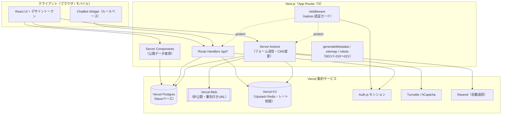

# 技術選定書 — 岩滝・網野自動車教習所 Webサイトリニューアルデモ

## 変更履歴

| バージョン | 日付 | 変更内容 | 変更者 |
|-----------|------|---------|--------|
| 0.1.0 | 2026-07-19 | 初版作成（P0基盤整備・確定前提の整理と依存選定・構成/セキュリティ設計） | Spec Agent |
| 0.2.0 | 2026-07-26 | **ユーザー承認によりVercel集約構成に確定**。Supabase不使用。DB=Vercel Postgres / ストレージ=Vercel Blob / レート制限=Vercel KV(Upstash Redis) / メール=Resend に一本化。構成B(Supabase)を「不採用」に縮約。環境変数・構成図・付録・未決事項を確定内容に更新 | Spec Agent |
| 0.2.1 | 2026-07-28 | P2.5 ハードニング: §4.5「信頼する HTTP ヘッダと信頼境界」を新設（SEC-022。旧 §4.5 環境変数は §4.6 へ繰り下げ）。`AUTH_SECRET` がビルド時にも必要である旨と `VERCEL` を環境変数一覧に追記 | Impl Agent |
| 0.2.2 | 2026-07-29 | P3 前の仕様追補（spec v0.3.0）に伴う更新。§4.5 にグローバル軸のセマフォ化決着（公開エンドポイントは採用 / 管理者ログインは対象外で残余リスク受容を維持）を追記。§6 #3/#4/#8 を確定値へ更新 | Spec Agent |
| 0.3.0 | 2026-07-29 | P3 設計レビュー差し戻し反映（`docs/review-p3-design-2026-07-29.md`）。**§4.5 に「セマフォの実体（確定）」を新設**（RV-P3D-001。KV リース付きカウンタ / ~~`INCR`+`EXPIRE`~~ **→ 本書 v0.3.1（RV-P3DR-001）で ZSET によるパーミット単位リースへ差し替え。この行の機構は採らない** / TTL=20秒 / `maxDuration`=10秒 / エンドポイント別 + 固定シャード K=4 / `serialize` 非経由 / 待ち 2秒 → Tier C）。**§4.7 CSP を新設**（RV-P3D-010 / N02。最終形オリジン表・`style-src 'unsafe-inline'` の現実解・nonce と `force-dynamic` の整合・単位ごとの再検証）。**§4.6 に環境変数3件を追加**（RV-P3D-S12: `NEXT_PUBLIC_TURNSTILE_SITE_KEY` / `FORM_SESSION_SECRET` / `CRON_SECRET`）＋本番 fail-fast 対象表を新設。§6 #2 に「P3-c で再測」を追加（SPEC-009 / RV-P3D-S04） | Spec Agent |
| 0.3.1 | 2026-07-29 | P3 設計**再**レビュー差し戻し反映（`docs/review-p3-design-re-2026-07-29.md`）。**§4.5 セマフォの機構を差し替え**（RV-P3DR-001。`INCR`+`EXPIRE` → **ZSET によるパーミット単位のリース**。`acquire` = `ZREMRANGEBYSCORE`→`ZCARD`→`ZADD` を Lua 1本 / `release` = `ZREM permitId`（冪等）/ 回復の責任はキーの TTL ではなく score）。**上限を `perShardLimit` 定義に確定**し全体上限 = `perShardLimit × K` と明記（RV-P3DR-006）＋ **power of two choices を採用**。**TTL と `maxDuration` を単一定数 `PUBLIC_HANDLER_MAX_DURATION_SEC` から導出**（RV-P3DR-005）。**`SemaphoreStore` を `RateLimitStore` と別抽象と明記**（RV-P3DR-007）。**§4.5 残余リスク節の無条件の「自動解放されるので枯渇せず」を成立条件付きへ訂正**（RV-P3DR-008） | Spec Agent |
| 0.3.2 | 2026-07-29 | P3 設計**再々**レビュー（`docs/review-p3-design-re2-2026-07-29.md` / Approve・P3-a 着手可）の新規指摘反映。**§4.5 シャードキーの literal 形式を確定**（RV-P3DR2-006。`sem:{applications}:0`〜`:3`。`{}` は Redis Cluster のハッシュタグで、連番を `{}` に入れると複数キー `EVAL` が `CROSSSLOT` で失敗する）。**§4.5 に「`EVAL` の実現可能性（確認済み）」を新設**（`@upstash/redis` の `eval(script, keys: string[], args)` で複数キーが渡せることを確認。**Vercel KV はサービス提供終了のため `@vercel/kv` は採用せず Upstash Redis に確定**。`EVAL` 不可時の代替案と、その場合に AC-RL-11(e) を書き換える必要があることも記録）。**§4.5 に「シャード化の効果の成立条件」を新設**（RV-P3DR2-009。単一ノード KV ではスループットは変わらない／AC-010-13(c) の実測を「シャード化が効いた証拠」と読み替えない）。**`now` を呼び出し側が渡す設計の成立条件（インスタンス間クロックスキュー < TTL）を明記**（RV-P3DR2-005）。**TTL 行に秒 ↔ ms の単位境界を確定**（RV-P3DR2-004。変換は `semaphoreTtlMs()` の1関数のみ／ストアの境界から先はすべて ms）。**待機中の各ポーリングでシャード候補を選び直す**を上限到達時行とシャード選択行に追加（RV-P3DR2-003） | Spec Agent |

> 本書は `business-spec.md` / `functional-spec.md` の非機能要件（セキュリティ・APPI準拠・パフォーマンス）を技術構成に落とし込むもの。前提は「確定済み」であり、本書はその**根拠・依存選定・構成図・セキュリティ設計・移行方針**を明文化する（技術方針そのものの再検討はしない）。

---

## 1. 全体構成（確定）

### 1.1 スタック

**全体をVercelに集約する**（運用ホストを一本化する意向・2026-07-26ユーザー承認）。

| レイヤ | 採用技術（確定） | 役割 |
|-------|---------|------|
| ホスティング | **Vercel** | アプリ配信・Serverless Functions・プレビューデプロイ |
| フレームワーク | **Next.js（App Router, TypeScript）** | SSR/RSC、ルーティング、Route Handler / Server Action |
| ORM | **Prisma** | 型安全なDBアクセス、マイグレーション、シード |
| データベース | **Vercel Postgres**（Neonベース） | 永続化（Course/News/Faq/Application/UploadToken/SupplementalChatRule/AdminUser） |
| ストレージ | **Vercel Blob**（非公開 + 署名付きURL） | 免許証写真の非公開保管（公開URL不可・管理者のみ閲覧） |
| レート制限ストア | **Vercel KV（Upstash Redis）** | 認証不要エンドポイントのレート制限（共有ストア） |
| メール送信 | **Resend**（Vercel連携） | 申込完了の自動返信 |
| 認証 | **Auth.js（NextAuth v5）** | 管理画面（/admin）の認証・セッション |
| 入力検証 | **Zod** | クライアント/サーバー共通スキーマ、サーバー再検証 |
| UI | **React + デザイントークン**（`DESIGN.md` / `/docs/ui-design` 準拠） | 画面・コンポーネント |
| テスト | **Vitest + Playwright**（既存流用） | 単体/結合 + E2E |

### 1.2 データアクセス方針とその根拠（最重要）

**方針**: DBアクセスは **Server Component / Route Handler / Server Action に限定**する。クライアントは**公開DBキーを一切持たない**。この設計思想は Vercel Postgres 集約構成でも堅持する。

**なぜこの構成か（公開DBキー + クライアント直アクセス依存を避ける理由）**:

- 「公開キー（例: Supabase anon key）をクライアントに配布し RLS（Row Level Security）等で守る」構成は、**公開鍵がブラウザに露出**する前提であり、ポリシー設計ミスが即データ漏洩に直結する。本構成ではこの方式を採らない（Supabaseも不使用）。
- 本サイトは **氏名・生年月日・住所・電話・免許取消歴・免許証写真**という機微情報（APPI上の要配慮に近い個人情報）を扱う。クライアントに到達可能なDB経路を**そもそも作らない**ことで、攻撃対象領域（attack surface）を最小化する。
- したがって、全DBアクセスをサーバー内部（Prisma 経由）に閉じ込め、クライアントには**必要なデータだけを整形して返すAPI/RSC境界**を置く。認可・フィルタリングはすべてサーバー側で行う。
- この設計により「公開データ（コース/お知らせ/FAQ）」と「非公開データ（申込内容/写真）」を、同一のサーバー境界の内側で**認可レベルによって出し分け**できる。

```
[Browser]  ──(HTML/RSC payload, 整形済みJSONのみ)──  [Next.js Server (Vercel)]
   │ 公開DBキーを持たない                                  │ Prisma（DB接続情報はサーバー環境変数）
   │                                                      ▼
   └── /api/* (Route Handler) / Server Action ────────  [Vercel Postgres]
```

### 1.3 論理アーキテクチャ図



---

## 2. ホスティング / DB（確定: Vercel集約）

### 2.1 確定構成（Vercel集約）

運用ホストを一本化する意向により、アプリ・DB・ストレージ・レート制限・メールを **Vercel のマネージドサービスに集約**する（2026-07-26 ユーザー承認）。

| 項目 | 選定（確定） | 根拠 |
|------|------|------|
| ホスティング | **Vercel** | Next.js App Router のファーストクラス対応。RSC/Server Action/Edge/画像最適化がゼロ設定に近い。プレビューデプロイでデモ提示が容易。 |
| DB | **Vercel Postgres（Neonベース）** | サーバーレスPostgres。プーリング接続で Prisma のサーバーレス接続問題を回避。Vercelダッシュボードで一元管理。 |
| ストレージ | **Vercel Blob（非公開）** | 署名付きURLで管理者のみ閲覧（期限暫定300秒）。公開URL・CDN公開はしない。 |
| レート制限 | **Vercel KV（Upstash Redis）** | サーバーレスでインスタンスをまたぐ共有ストア（REV-012）。 |
| メール | **Resend** | Vercel連携の送信サービス。申込完了の自動返信。 |

- Prisma はサーバーレス環境で接続枯渇を避けるため、**プーリング接続文字列**を利用し、マイグレーションのみ direct 接続を使う（`POSTGRES_URL` と `POSTGRES_URL_NON_POOLING` を分離）。
- **将来の移行先**: ストレージは S3互換（AWS S3 / Cloudflare R2）へ、DBは素のNeonへ移行可能な抽象（`lib/storage`・`lib/db` 経由アクセス）を保つ。デモでは Vercel Blob / Vercel Postgres に確定（1行注記に留める）。

### 2.2 検討したが不採用: Supabase

当初は代替として「Supabase を service_role サーバー限定＋RLS deny-all で使う構成B」を併記していたが、**ユーザー判断により Supabase は不使用**（運用ホストをVercelに集約するため）。ただし「公開DBキーをクライアントに配布せず、DBアクセスをサーバーに限定する」設計思想（§1.2）は Vercel Postgres 構成でも堅持する。

---

## 3. 主要依存（選定と用途）

| 分類 | ライブラリ / サービス | 用途 | 備考 |
|------|--------------------|------|------|
| 認証 | **Auth.js (NextAuth) v5** | /admin の認証・セッション・middleware ガード | 方式（Credentials/OAuth）は未決（§6）。デモは Credentials 想定。 |
| ORM | **Prisma** | スキーマ定義・マイグレーション・型安全アクセス・シード | `prisma/schema.prisma`、`prisma migrate`、`prisma db seed` |
| ストレージ | **@vercel/blob**（非公開Blob） | 非公開Blobへのアップロード・GET署名付きURL発行 | 管理者のみ閲覧・有効期限**暫定300秒**（§6で確定）。将来S3/R2へ移行可能な `lib/storage` 抽象を維持 |
| レート制限 | **@vercel/kv**（Upstash Redis） | 認証不要エンドポイント（applications/uploads/chat）のレート制限 | サーバーレスの共有ストア（REV-012）。インメモリ/middleware単独は不可 |
| フォーム保護 | **Cloudflare Turnstile** または **hCaptcha** + レート制限 + ハニーポット | スパム/bot対策（F-010/F-009/F-011） | サーバーでトークン検証。レート制限は上記 Vercel KV。 |
| 入力検証 | **Zod** | クライアント補助検証＋**サーバー再検証**の単一スキーマ | `z.infer` で型共有。API境界で必ず parse。 |
| フォーム状態 | **React Hook Form**（+ @hookform/resolvers/zod） | ステップ式フォーム（F-008）の状態・段階検証 | 各ステップで partial validation。 |
| UI | **React** + デザイントークン（CSS変数）/ Tailwind等は DESIGN 準拠 | 画面・コンポーネント | `/docs/ui-design`・`DESIGN.md` に従う。 |
| メール | **Resend**（Vercel連携） | 申込完了の自動返信（F-010） | 個人情報を本文に過剰記載しない。 |
| 構造化データ | 自前 JSON-LD 生成 | DrivingSchool×2 / FAQPage / BreadcrumbList（F-020） | ライブラリ不要。型付きヘルパを用意。 |
| テスト | **Vitest**（単体/結合）+ **Playwright**（E2E） | 既存構成を流用 | `tests/unit` `tests/integration` `tests/e2e`。 |
| ロギング | 構造化ログ（pino 等） | 監査ログ・エラー | **個人情報・資格情報をログに出さない**（§4）。 |

---

## 4. セキュリティ設計

### 4.1 APPI（個人情報保護法）準拠

| 原則 | 実装方針 |
|------|---------|
| 利用目的の明示・同意 | 申込フォームに**プライバシーポリシー同意チェック必須**（`privacyConsent` true 必須, F-008/F-010）。 |
| 最小収集 | 問い合わせ種別（INQUIRY）では申込専用項目を収集しない（Application を type で分岐）。 |
| 保持期間 | Application に保持ポリシーを定義（例: 一定期間後に匿名化/削除）。デモでは**管理画面から削除可能**とし、方針を明記。 |
| 削除フロー | 管理者による削除時、DBレコードと**ストレージ上の写真オブジェクトも連動削除**（orphan を残さない）。 |
| 開示・訂正対応 | 受信管理（F-017）で内容確認・ステータス管理。将来の開示請求対応を想定した構造。 |

### 4.2 免許証写真の保護（機微情報）

- **Vercel Blob（非公開）**に保存。公開URL・CDN公開は**しない**。
- **保存時暗号化**（Vercel Blob のマネージド暗号化。将来S3/R2移行時は SSE/暗号化を利用）。
- DBには**objectKey のみ**を保持（公開URLは保持しない, F-009 `LicensePhoto`）。
- 閲覧は**管理者のみ**、サーバーが認可検証後に発行する**署名付きURL（期限暫定300秒）**経由（F-018）。
- アップロードは**サーバー生成のobjectKey＋uploadTokenバインド方式**（REV-004）で、サーバーが content-type / size を制約（JPEG/PNG/WebP, ≤5MB 暫定）し、格納後に再検証する。

### 4.3 管理画面の認証・認可・監査ログ

- `/admin/**` と管理系API（`/api/admin/*`）を **middleware で認証ガード**、かつ各 Route Handler / Server Action 内で**サーバー側 session 再検証**（多層防御）。
- 認可失敗は 401/403。未認証は ログインへリダイレクト。
- **監査ログ**: CMS変更（お知らせ/料金/FAQ の作成・更新・削除）、申込のステータス変更、写真の署名URL発行を、操作者・対象・日時付きで記録（個人情報本文は記録しない）。

### 4.4 通信・ヘッダ・アプリ防御

| 対策 | 内容 |
|------|------|
| CSP | Content-Security-Policy を設定（許可オリジンの明示、`unsafe-inline` の最小化）。 |
| セキュリティヘッダ | HSTS、X-Content-Type-Options、Referrer-Policy、Permissions-Policy、X-Frame-Options（clickjacking）。 |
| サーバー再バリデーション | 全変更系APIで Zod による**サーバー側再検証を必須**（クライアント検証は補助）。 |
| インジェクション | Prisma のパラメータ化クエリ。生SQLは原則不使用。 |
| XSS | 出力サニタイズ。お知らせ本文等のリッチテキストはサニタイズして描画。 |
| CSRF | Server Action / Auth.js の CSRF 保護を利用。 |
| スパム | Turnstile/hCaptcha + レート制限 + ハニーポット（F-010）。二重送信防止。 |
| 秘密情報 | DB接続情報・ストレージ資格情報・認証シークレットは**環境変数**（`.env`）。リポジトリに含めない。`.env.example` のみ管理。 |

### 4.5 信頼する HTTP ヘッダと信頼境界（SEC-022）

レート制限のキーは発信元 IP から導出する。`X-Forwarded-For` は各プロキシが**右へ追記**するヘッダで、
**左端はクライアントが自由に名乗れる**。信頼できるプロキシ配下だと分かっているときにだけ採用する。
実装は `lib/http-guard.ts` の `resolveClientIp()`（真実源。P3 の未認証エンドポイントでも再利用する）。

**信頼する前提**: 本サイトが **Vercel 配下で動いていること**。判定の根拠は Vercel がシステム環境変数
として注入する `VERCEL=1`。`resolveClientIp(request, { trustProxy })` で明示的に上書きもできる。

| ヘッダ | 優先度 | 信頼する根拠（Vercel 公式 Request headers, 2025-12-13） |
|--------|--------|--------------------------------------------------------|
| `x-vercel-forwarded-for` | 1（最優先） | `x-forwarded-for` と同一の値だが、**Vercel の手前に自前プロキシを置いた構成でも上書きされない**。 |
| `x-forwarded-for` | 2 | Vercel がクライアントの公開 IP で**上書きする**（IP spoofing 防止のため外部 IP を転送しない）。クライアント指定値を通せるのは Enterprise の Trusted Proxy 権限を購入した場合のみ。 |
| `x-real-ip` | 3 | 同上。最後の手段。 |

**信頼境界の外に置いた場合**（`next start` の直公開・ローカル・オンプレなど、`VERCEL` が無い環境）:

- 上記ヘッダを**一切読まない**。クライアント申告値を IP として扱わない。
- ただし「IP 不明だから無制限」にはせず、**単一の `unknown` バケットへ縮退**させる（制限を緩めない）。
- **この共有バケットは照合前ゲートに使わない（計数のみ）**。`resolveClientIp()` が返す
  `trusted: false` を `loginGuard.attempt({ trusted })` へ渡し、`lib/login-guard.ts` 側で分岐する。
  共有バケットが枯渇していても `verify()` は実行し、成功なら `ok` を返す。失敗した場合は、
  枯渇していれば `rate-limited` を返す（緩む方向にも壊さない）。
- 併せて**キー非依存のグローバル上限**（`auth.ts` の `LOGIN_GLOBAL_LIMITER`, 100回/分 +
  `LOGIN_GLOBAL_RESERVE_LIMITER`, 20回/分）が、縮退時のコスト保護（scrypt の総量）を担う。

> **訂正（P2.5-b / 2026-07-28, SEC-030 / RV-P25-002）**
> この節には以前「この縮退で全利用者が同一バケットを共有しても、**正しい資格情報は常に通る**ため
> 正規管理者が締め出されることはない」と書かれていたが、**これは事実に反していた**。
> 「成功は常に通す」が適用されていたのはアカウント軸だけで、IP 軸（＝ `unknown` バケット）は
> 照合前ゲートのままだった。実測では、他者が 10 分間に 10 回失敗させるだけで、正しいパスワードを
> 持つ管理者が `outcome=rate-limited` / `verified=false` になった（攻撃コスト 10req/10分。
> 元の SEC-021 の 5req/15分 + 管理者メール既知 よりも安い）。
> 上記の「照合前ゲートに使わない（計数のみ）」がこの訂正後の実際の意味論である。

**縮退が支払う代償（記録）**: 発信元を識別できない以上、「発信元あたりの推測回数を縛る」ことは
定義上できない。縮退時のブルートフォース耐性は IP 軸（10回/10分）ではなく、グローバル軸 + 予約枠
（合計 120回/分）の上限まで低下する。緩い閾値を別に割り当てる案は、共有ゲートであることが変わらず
締め出しが遅くなるだけなので採らなかった。

採用する値は必ず **IPv4 / IPv6 リテラルとして検証**し、妥当でなければ不採用にする。
これにより解決結果は常に 45 文字以下となり、攻撃者が任意長の文字列をレート制限キーにして
store のメモリを増幅させる経路（SEC-023）を断つ。

**Vercel 以外へ移す場合の必須作業（SEC-030 修正方針3 / SEC-061 / SEC-069）**:
環境変数 **`TRUST_PROXY=1`** を設定する。

> **訂正（P3-c1 / 2026-07-29, SEC-069）**
> この節には以前「`resolveClientIp` の `trustProxy` 判定（既定は `process.env.VERCEL === '1'`）を
> 更新し、`trustProxy` を必ず有効化すること」と書かれていたが、**その手段が実装されていなかった**
> （`ResolveClientIpOptions.trustProxy` は存在したが、真にする env も配線も無く、本番ルートは
> 誰も渡していなかった）。すなわち**非 Vercel 本番は永続的に縮退構成**だった。
> P3-c1 で `TRUST_PROXY` を `lib/env.ts` のスキーマへ追加し、`resolveClientIp` の既定を
> 「`options.trustProxy` → `TRUST_PROXY` → `VERCEL === '1'`」の順に決まる形へ変更した。

| 値 | 解釈 |
|----|------|
| `1` / `true` | 前段プロキシの転送ヘッダを信頼する |
| `0` / `false` | 信頼しない（**`VERCEL=1` より優先される**。Vercel の手前に自前プロキシを置く構成を表現できる） |
| 未設定 | `VERCEL === '1'` にフォールバック（fail-closed） |
| それ以外 | **起動時に落とす**（`TRUST_PROXY=yes` を黙って false に倒すと、設定したつもりのまま縮退で運用され続ける） |

**`TRUST_PROXY` 由来の信頼では、採用するヘッダが Vercel 検出時と異なる**（REV-P3C1-003 / NEW-005）:

| 信頼の出所 | 採用するヘッダ（優先順） |
|-----------|----------------------|
| プラットフォーム検出（`VERCEL=1`） | `x-vercel-forwarded-for` → `x-forwarded-for` → `x-real-ip` |
| **env（`TRUST_PROXY=1`）** | **`x-real-ip` → `x-forwarded-for`。`x-vercel-forwarded-for` は採用しない** |

理由:

- `x-vercel-forwarded-for` を最優先してよい根拠は「Vercel の手前に自前プロキシを置いても
  上書きされない」という **Vercel 上でのみ成立する性質**である。非 Vercel の前段
  （nginx / ALB / Cloudflare）はこのヘッダを知らないので**剥がさない**。採用すると攻撃者は
  ヘッダを 1 本足すだけで `trusted: true` かつ任意の key を得る（発信元軸のバケット無限生成 /
  SEC-057 の是正の無効化 / 被害者 IP を騙った管理者締め出し）。
- `x-real-ip` を優先するのは、nginx の最も普及したレシピ
  `proxy_set_header X-Forwarded-For $proxy_add_x_forwarded_for;` が **append（追記）であって
  上書きではない**ため。append 構成では**クライアントが名乗った値が XFF の左端に残る**。
  同レシピの `X-Real-IP $remote_addr` は単一値で設定され append されない。

> ⚠️ **append 構成では `X-Real-IP $remote_addr` を必ず併設すること。**
> `x-real-ip` を設定しない append 構成で `TRUST_PROXY=1` にすると、攻撃者が任意の発信元を
> 名乗れる（＝ SEC-057 の是正ごと無効化される）。`x-real-ip` を**必須**にしていないのは、
> 上書き構成で XFF しか送らない環境を永久に縮退させないためであり、
> **append 構成を安全にするものではない。**

⚠️ **本番ルートは `resolveClientIp` に `trustProxy` オプションを渡さないこと。**
明示引数はプラットフォームと同じヘッダ優先順位になるため、
`resolveClientIp(req, { trustProxy: env.TRUST_PROXY })` と書くと上の限定が丸ごと消える。
`tests/unit/trust-proxy-env.test.ts` がこの配線をソースで固定している。

設定を怠っても「クライアント申告値を信じてしまう」方向には壊れない（fail-closed で `unknown` へ縮退する）が、
**縮退したままの運用は上記の代償を恒久的に負う**（発信元あたりの制限が無く、耐性がグローバル軸の
上限まで低下する）。したがって「怠っても安全」ではなく「**怠ると耐性が下がる**」と理解すること。

#### 残余リスク（受容した。閉じていない）— SEC-029 / RV-P25-001

グローバル軸と予約枠は「単一ホストが全管理者を締め出す」経路（SEC-029 が実測）を閉じたが、
**共有軸による締め出しそのものを消してはいない**:

> **独立した発信元 30**（`global.limit / ip.limit + globalReserve.limit` = 100/10 + 20）を持つ攻撃者は、
> 依然として正規管理者のログインを窓ごと止められる（総リクエスト 120回/分・scrypt 120回）。

**固定ウィンドウのカウンタを照合前ゲートに使う限り、この性質は構造的に消えない。**
予約枠は攻撃者に必要な**独立発信元数**を増やす（**1 → 30**）だけで、ゼロにはしない。
P2.5-b はこれを「消した」のではなく「**残余リスクとして受容した**」。

> **数値の注意（SEC-038 / 2026-07-29 訂正）**: 以前この節は「1 → 120 超」と記していたが、
> **120 は総リクエスト数であって発信元数ではない**。予約枠の判定基準は「その発信元の 1 回目の試行か」
> （`cleanSource`）であって「正規利用者か」ではないため、**攻撃者の新品 IP は常に予約枠を引ける**
> （1 IP あたり 1 リクエストで引き切れる）。したがってコスト上昇は 120 倍ではなく **4 倍**である。
> 受容判断自体は P2 のスコープでは維持するが、**根拠となる数値はこの実測値を使うこと**。

また「他者がグローバル上限を使い切っても正しい資格情報は通る」という不変条件は、
**失敗履歴の無い発信元に限って**成立する（予約枠を引ける条件が `cleanSource` であるため）。
直前に失敗している正規管理者は、グローバル枠が枯渇していれば通らない。

構造的に閉じる形は、SEC-022 修正方針3 が第一候補として挙げていた
**「同時実行中の scrypt 数を上限とするセマフォ」**である（**パーミット単位のリースとして設計した場合に限り**
処理完了・**リース期限の満了**で解放され、過負荷時の症状が「拒否」ではなく「待ち」になる＝正規利用者が締め出されない。
**成立条件は下記「セマフォの実体（確定）」に書いた条件を満たすことであり、無条件には成立しない**）。

> **この文の読み方の注意（RV-P3DR-008 / 2026-07-29 訂正）**: 以前この行は「**処理完了で自動解放されるので枯渇せず**」と
> 無条件に書いていたが、**この命題はサーバーレスでは偽である**。プロセスの強制終了・Function タイムアウト・デプロイ中断では
> 解放処理が実行されないため、「処理完了で解放される」だけの機構は**漏れたパーミットが累積して恒久枯渇する**
> （具体的な破れ方は下記「セマフォの実体（確定）」の訂正注記を参照）。
> **P4 で管理者ログインのセマフォ化を再評価する人は、この行を「セマフォなら枯渇しない」の根拠に使ってはならない。**
> 枯渇しないのは下記の成立条件（パーミット単位のリース + 期限切れの回収）を満たす実装だけである。
**P3 で未認証エンドポイント（申込 / 免許証アップロード / チャット）へレート制限を横展開する際に、
グローバル軸をセマフォへ置き換えるかを必ず再評価すること。** 未認証経路では正規利用者の母数が
管理者より桁違いに多く、共有軸の締め出しがそのままサービス停止になる。

> **決着（2026-07-29 / 仕様 v0.3.0, SEC-029 条件1'-1）**: この再評価は**公開エンドポイントについてはセマフォ採用で決着した**。
> `functional-spec.md` §4.11 AC-RL-1 が受け入れ条件として、公開3エンドポイント（`POST /api/applications` /
> `POST /api/uploads/license` / `POST /api/chat`）の全体流量制御を**同時実行数セマフォ**とし、
> **全体流量（共有軸）の枯渇のみを理由に 429 を返すことを禁止**した。
> **管理者ログイン（`auth.ts` のグローバル軸）は本決定の対象外**であり、上記の残余リスクを受容したまま P2 の実装を維持する
> （母数が管理者1名で、締め出しの影響とセマフォ化の変更コストが釣り合わないため）。P4 以降で再評価する。

#### セマフォの実体（確定 / 2026-07-29 仕様 v0.3.2, RV-P3D-001 → **RV-P3DR-001 で機構を差し替え**）

> **なぜここに書くか**: v0.3.0 の決着は「詳細は AC-RL-1 を参照せよ」であり、AC-RL-1 には**実装形態が書かれていなかった**。
> その状態では実装が2通り（プロセス内 / KV）に分岐し、**片方は要件を満たさない**。かつ AC-RL-1 が主張していた
> 「処理完了で自動解放されるため**枯渇せず**」という性質は、**リースを設計しない限り事実にならない**
> （サーバーレスのタイムアウト・クラッシュ・デプロイ中断では `release` が呼ばれない）。
> 「文書に事実と異なる記述が入り、それが次工程の入力になる」（P2.5 の教訓3）の再発を避けるため、成立条件を併記して確定する。

> **⚠️ 訂正: `INCR` + `EXPIRE` は採らない（v0.3.1 → v0.3.2 / RV-P3DR-001）**。v0.3.1 は
> 「`acquire` = `INCR` + `EXPIRE(TTL)` / `release` = `DECR`」と確定していたが、**この機構は TTL を「パーミット」ではなく
> 「カウンタキー全体」に付けており、AC-RL-11 が「枯渇しない」の成立条件として名指しした性質を提供しない**。
> 実装は次の2通りにしかならず、**どちらも破れる**:
> 1. **`EXPIRE` を毎 `acquire` で発行する**（記述どおりの素直な実装）: TTL が毎回リセットされるため、
>    **リクエストが TTL 未満の間隔で到着し続ける限りキーは永久に期限切れにならない**。`release` が呼ばれずに漏れた
>    パーミットは回復せず累積する。**タイムアウトは高負荷時に集中して起きる**ので、漏れの発生と「TTL が効かない条件」は
>    同じ状況で重なる。累積が上限に達すると**セマフォは恒久枯渇し、以後すべての公開送信が Tier C(202) を返し続ける**——
>    「拒否ではなく待ち」が「**永久に順番が来ない待ち**」になり、条件1'-1 が守ろうとした
>    「正規利用者を締め出さない」が最悪の形で破れる。
> 2. **`EXPIRE ... NX`（未設定時のみ設定）**: キーが**在庫ごと**消えるため、境界の前後で処理中のパーミットも忘れられ、
>    **同時実行上限を最大2倍超過**する。後から届く正当な `release` は新しいカウンタを `DECR` し、0 クランプで実態より小さく壊れる。
>
> **かつ、この欠陥は「TTL 経過で回復する」を無負荷で放置して検証するテストでは検出できない**（実装 1 はその条件では green になる）。
> **P2.5 の SEC-038（テストが green でも脅威が閉じていない）と同一構造**であるため、機構ごと差し替える。

**確定機構: パーミット単位のリース（ZSET + Lua）**。「誰のパーミットがいつまで有効か」を**パーミット1件ごとに**持ち、
**期限切れは次の `acquire` が必ず回収する**。回復の責任をキーの TTL ではなく **各パーミットの score** に持たせるのが要点である。

| 項目 | 確定値 | 根拠 |
|------|--------|------|
| 状態の置き場所 | **KV（Upstash Redis）上の ZSET**（`member` = `permitId` / `score` = リース期限のエポック ms） | プロセス内（インスタンスローカル）では Vercel の N インスタンスに対して N 倍の同時実行を許し、「全体流量制御」にならない |
| `acquire` | **Lua（`EVAL`）1本で原子的に**: **(1)** 候補シャード各キーに `ZREMRANGEBYSCORE <key> -inf <now>`（**期限切れパーミットの掃除**）→ **(2)** `ZCARD <key>` が `perShardLimit` 未満か判定 → **(3)** `ZADD <key> <now+TTL*1000> <permitId>`。成功時は `{ key, permitId }` を、空きが無ければ `nil` を返す | (1)(2)(3) を分けて発行すると掃除と判定の間で競合し上限を超過する。**`permitId` はリクエストごとの暗号論的乱数（≥128bit）**。`now` は**呼び出し側が渡す**（Lua 内で `TIME` を読まない＝テストから時刻を注入できるようにする。Test 申し送り13） |
| `release` | **`ZREM <key> <permitId>`** | **`permitId` を持つので二重 `release` は自然に冪等**（2回目は 0 件削除）。`DECR` 方式で必要だった「0 未満にクランプ」という後付け補正（原子的に書けない）が不要になる。**他のパーミットを誤って解放することが構造的に起きない**（AC-RL-11(c)） |
| キー自体の `EXPIRE` | **保険として `TTL × 2` を設定してよい**（必須ではない） | 完全に無トラフィックになったエンドポイントのキーを残さないための掃除。**回復の責任を負わせない**（負わせると v0.3.1 と同じ欠陥に戻る） |
| **リース TTL** | **20秒** = `PUBLIC_HANDLER_MAX_DURATION_SEC × 2`。**単位の境界を1箇所に固定する（RV-P3DR2-004）**: 定数は秒（`SEMAPHORE_TTL_SEC`）、**`SemaphoreStore` の境界から先はすべてミリ秒**（`ttlMs` / `now` / ZSET の score）。変換は **`semaphoreTtlMs() = SEMAPHORE_TTL_SEC * 1000` の1関数だけ**に置き、秒の値がストアの境界を越えないようにする | **定数から導出する**（数値を2箇所に書かない。AC-RL-15）。`release` が呼ばれなくてもパーミットが回復することが「枯渇しない」の成立条件（AC-RL-11）。**AC-RL-15(a) の関係式テストは秒の定数同士しか見ないため、秒 → ms の変換ミスを検出しない**——`acquire` に渡る実 ms 値が 20,000 であることを別に固定する（20ms なら処理中のパーミットが即回収されて上限超過、5.5時間なら漏れたパーミットが実質回復せず RV-P3DR-001 が閉じた状態に戻る） |
| 公開ハンドラの `maxDuration` | **10秒** = `PUBLIC_HANDLER_MAX_DURATION_SEC`（各 Route Handler は**この定数を export する**） | **TTL との依存をコードで表現する**。`maxDuration` を伸ばして TTL を伸ばし忘れると、処理中のパーミットが早期回復して同時実行上限を超過する。**文書に書くだけでは `route.ts` を編集する人に届かない**ため、単一定数からの導出をユニットテストで固定する（AC-RL-15 / RV-P3DR-005） |
| キー | **エンドポイント別 + 固定シャード K=4**。**literal 形式（確定 / RV-P3DR2-006）**: `sem:{applications}:0` 〜 `sem:{applications}:3`（`uploads` / `chat` も同形）。**`{}` はメタ記法ではなく Redis Cluster のハッシュタグそのもの**であり、エンドポイント名を `{}` に入れる。**`sem:<endpoint>:{0..3}` のように連番を `{}` に入れてはならない** | **同一エンドポイントの K 個のシャードが必ず同一スロットに載る**ことが、power of two choices（1回の `EVAL` に `KEYS[1] KEYS[2]` を渡す）の成立条件である。スロットが分かれると複数キーの `EVAL` は `CROSSSLOT` で失敗する。単一ノード構成では無害。**`release` は `acquire` が返した `key` に対して行う**（`{ key, permitId }` を1つのハンドルとして持ち回り、シャード番号を別途覚えない）。**シャード化の効果の範囲**: 単一ホットキーを避ける狙いだが、**単一ノード KV ではノードのスループットは変わらない**（下記「シャード化の効果の成立条件」を参照。RV-P3DR2-009） |
| **上限の定義** | **`perShardLimit`（シャードあたりの値）として定義する。エンドポイント全体の同時実行上限は `perShardLimit × K`** | 「全体で N」と定義するとシャードあたりが `N/K` になり、**全体には空きがあるのに選んだシャードが満杯**という事象が常態化する。AC-RL-9 の実測（閾値の何%か）を計算可能にするため、上限の意味を1通りに固定する（RV-P3DR-006） |
| シャード選択 | **power of two choices を採用する**: 1回の `acquire` で**2シャードをランダムに選び、掃除後の `ZCARD` が小さい方**へ `ZADD` する（両方満杯なら失敗）。**候補の抽選は `acquire` の内側で毎回行う**（`acquire` の外で1回だけ計算して持ち回らない。RV-P3DR2-003） | ランダム1択だと偏りで**公称容量に達する前に Tier C が出る**（＝正規利用者を待たせる）。2択にするのは同じ Lua スクリプトに `KEYS[1] KEYS[2]` を渡すだけで、コストはほぼ増えない。**採らない場合は「偏りにより実効容量が公称を下回ることを受容する」と明記する必要があり、受容する理由が無い**ため採用する |
| 直列化 | **`serialize` を経由しない** | AC-010-13 の検証対象。セマフォがスループットの単一障害点になっては本末転倒 |
| 抽象 | **`SemaphoreStore`（`acquire(keys, perShardLimit, ttlMs, now, permitId) / release(key, permitId)`）という専用インタフェース**を持つ。`RateLimitStore` を拡張しない | 現行の `RateLimitStore` は `get/set/delete` + `{ count, resetAt }` で、**固定ウィンドウカウンタは「減らない」ことが前提の抽象**であり `release` を表現できない（`lib/rate-limit.ts:26-49`）。**共有するのは KV クライアントと接続設定であって判定ロジックではない**（AC-RL-8 / RV-P3DR-007） |
| 上限到達時 | **最大2秒・1回だけ待つ**（100〜200ms ジッタ付きポーリング）→ **Tier C（`202 { retryAfterMs }`）へ劣化**。**待機中の各ポーリングでシャード候補を選び直す**（同一ペアを再利用しない。RV-P3DR2-003） | 待機中も Function インスタンスを占有し課金されるため、当初案の 5秒は長すぎる（過負荷時に待たせると保護したい資源をむしろ消費する）。`maxDuration` 10秒に対して 2秒とする。**候補を固定すると、全体に空きがあっても満杯の2シャードを叩き続けて Tier C を返す**（4シャード中3満杯なら 1回の失敗が起きる確率は 50% で、単発の失敗は「全体が満杯」を意味しない）。待ちが「空くのを待つ」ではなく「他人が譲るのを待つ」になり、power of two choices の採用理由が待機経路で無効化される |
| 同時実行上限の数値（`perShardLimit`） | **P3-a で実測確定**（§6 #2 / AC-RL-9） | 「正規利用者が到達しないこと」を実測で示す。**実測値は `perShardLimit × K` の全体上限に換算して §6 #2 に記録する** |

> **この機構が AC-RL-11 を満たす理由**: 期限切れパーミットの回収は**キーの寿命ではなく `acquire` の第1ステップ**で行われる。
> したがって**トラフィックが継続している状況でも**（＝漏れが最も起きやすい高負荷時でも）、期限を過ぎたパーミットは
> 次の `acquire` で必ず回収される。**逆に言えば、`acquire` が (1) を省略した実装は AC-RL-11 を満たさない**——
> AC-RL-11(a) はこれを「継続的に `acquire` が到着している状況での回復」として検証する（**無負荷で放置するテストを書かない**）。
>
> **⚠️ この機構の成立条件（無条件の性質ではない / RV-P3DR2-005）**: `now` は各 Function インスタンスが自分の
> `Date.now()` から渡すため、**リース期限の判定は「パーミットを書いた側の時計」と「掃除する側の時計」の比較**になる。
> したがって上記の性質は「**インスタンス間のクロックスキューが TTL（20秒）に対して十分小さいこと**」を前提とする。
> Vercel の実行環境は NTP 同期されておりスキューはミリ秒オーダーなのでこの前提は満たされるが、**これは前提であって性質ではない**。
> あるインスタンスの時計が TTL 以上進んでいると、その `ZREMRANGEBYSCORE -inf <now>` が**他インスタンスの有効なパーミットを
> 一掃して同時実行上限を超過させる**。逆に遅れていれば期限切れの回収が遅れる。**スキューが TTL に対して無視できない環境
> （手動で時刻を設定するオンプレ検証機等）へ移す場合は、この前提を再評価すること。**

#### `EVAL` の実現可能性（確認済み / 2026-07-29 / RV-P3DR2-006）

本機構の原子性は **1回の `EVAL` に2つのキー（power of two choices の候補）を渡せること**に依存する。着手前に確認した結果を記録する。

| 確認項目 | 結果 | 根拠 |
|---------|------|------|
| **採用する KV クライアント** | **`@upstash/redis` に確定**。**`@vercel/kv` は採用しない** | **Vercel KV はサービスとして提供終了**しており、既存ストアは 2024年12月に Upstash Redis へ移行済み・新規は Marketplace 経由で Redis プロバイダを入れる形になっている（<https://vercel.com/docs/redis>）。本書 v0.2.0 の「レート制限=Vercel KV(Upstash Redis)」という記述は**実体としては Upstash Redis を指す**ものとして読む（§4.6 の `KV_*` 環境変数はそのまま Upstash の接続情報として使う） |
| **`eval` を提供するか / 複数キーを渡せるか** | **提供する。渡せる** | `@upstash/redis` は `redis.eval(script, keys, args)` を提供し、`keys` は `string[]`（<https://upstash.com/docs/redis/sdks/ts/commands/scripts/eval>）。REST 経由でも Lua スクリプトは単一の実行単位として処理される |
| **複数キーを渡す際の制約** | **クラスタ構成では同一スロットである必要がある**（`CROSSSLOT`）。**ハッシュタグで解決済み** | 上記キー行のとおり `sem:{applications}:0..3` としてエンドポイント名をハッシュタグに入れるため、K 個のシャードは必ず同一スロットに載る。単一ノード構成では制約自体が生じない |

> **`EVAL` が使えなかった場合の代替案（現時点では採らない）**: 「楽観的に `ZADD` → `ZCARD` → 超過なら自分の `permitId` を
> `ZREM` して失敗」に落とす。**この案は一瞬の上限超過を受容する**ことになるため、採る場合は
> **AC-RL-11(e)（特に (e-2) 単一原子操作・(e-3) 濃度の最大値）を先に書き換え、受容を本書に記録してから実装する**こと。
> 上表のとおり確認は済んでおり、この分岐に入る見込みは無い。

#### シャード化の効果の成立条件（RV-P3DR2-009）

「シャード化によりスループットの単一障害点を避ける」は**無条件には成立しない**。**キー単位のロックやスロット単位の
ルーティングを持つ構成（クラスタ化された Redis）では正しい**が、Upstash の標準構成のように**単一ノードで
コマンドが元々直列実行されるバックエンドでは、K=4 に分けてもノードのスループットは変わらない**
（分散するのはキー空間であってサーバーではない）。

**それでも K=4 を採る理由**: 実害が無く（`EVAL` はマイクロ秒オーダーで、支配的なのは HTTP RTT である）、
将来クラスタ化した場合に効き、コストもほぼゼロだからである。**採用判断は妥当だが、効果の範囲は上記に限る。**

**したがって AC-010-13(c)（並行 N リクエストで応答時間が N に線形比例しない）の実測結果を、
「シャード化が効いた証拠」と読み替えてはならない。** 実際に効いているのは AC-010-13(a)
（セマフォが `serialize` を経由しないこと）である。**P3-a の完了報告でこの因果を取り違えると、
本書に事実と異なる記述が入り、それが次工程の入力になる**（P2.5 の教訓3）。

同様に、`trusted=false` の縮退時もグローバル軸は硬いゲートのままである。したがって縮退した配置では、
グローバル枠 + 予約枠を使い切れる攻撃者は全利用者を止められる。緩和は `trustProxy` の有効化。

> **縮退時の攻撃コスト（SEC-038 / 実測）**: `trusted=false` では `cleanSource` が常に `true` になるため
> **攻撃者自身が予約枠を引ける**。予約枠の設計前提（「攻撃者は自分の IP 軸を消費しているので引けない」）は、
> IP 軸が存在しない縮退時には成立しない。結果として締め出しは
> **単一ホストから 121リクエスト/分**で成立する（＝必要発信元数は 1 のまま。コストは上がっていない）。
> これは SEC-029 が実測した脅威がほぼそのまま残っている状態である。
> **本番（Vercel 集約・`VERCEL=1` → `trusted=true`）に実害は無い**が、`next start` 直公開のデモ運用・
> ローカル・オンプレ検証では成立する。該当構成では前段プロキシによる XFF 上書きを必ず用意すること。

### 4.6 環境変数（想定キー一覧）

Vercel の各サービス連携で自動注入される標準キー名に合わせる（すべてサーバー環境変数・クライアント非公開）。

```
# --- Vercel Postgres（DB接続はサーバー限定）---
POSTGRES_URL                 # Prisma pooled 接続
POSTGRES_URL_NON_POOLING     # migrate 用 direct 接続
POSTGRES_PRISMA_URL          # Prisma 用（pgbouncer付き, 任意）
# --- Vercel Blob（免許証写真・非公開）---
BLOB_READ_WRITE_TOKEN        # サーバーからのアップロード/署名URL発行
# --- Vercel KV（レート制限・Upstash Redis）---
KV_REST_API_URL
KV_REST_API_TOKEN
KV_REST_API_READ_ONLY_TOKEN  # 読み取り専用（任意）
# --- 認証（Auth.js）---
AUTH_SECRET                  # セッション署名。**ランタイムとビルド時の両方で必要**（RV-P2R-005）
AUTH_* (provider別)          # 認証プロバイダ資格情報（方式確定後）
# --- プラットフォーム（Vercel が自動注入。アプリ側では読み取りのみ）---
VERCEL                       # "1" のとき信頼できるプロキシ配下と判定する（§4.5）
# --- スパム対策 / メール ---
TURNSTILE_SECRET                  # サーバー検証用シークレット
NEXT_PUBLIC_TURNSTILE_SITE_KEY    # ★P3-b 追加: ウィジェット描画に必要なサイトキー（クライアント公開。公開前提の値）
RESEND_API_KEY                    # 自動返信メール（Resend）
# --- 公開フォーム（P3。RV-P3D-S12）---
FORM_SESSION_SECRET          # ★P3-a 追加: フォームセッション Cookie の署名鍵（§4.11 AC-RL-13）
CRON_SECRET                  # ★P3-a 追加: 保持期間 / orphan 回収バッチの起動認可（§4.12 AC-PII-10）
```

**本番 fail-fast（`lib/env.ts`）の対象**（AC-010-10 と同じ扱い。`NODE_ENV=production` で未設定なら起動時に throw）:

| キー | fail-fast | 必須になる単位 | 備考 |
|------|----------|--------------|------|
| `KV_REST_API_URL` / `KV_REST_API_TOKEN` | ✅ 必須 | P3-a | SEC-033 / AC-010-10 |
| `FORM_SESSION_SECRET` | ✅ 必須 | P3-a | **`AUTH_SECRET` を直接使わず、HKDF 等で用途別に導出すること**（鍵の用途分離。同一鍵を Cookie 署名とセッション署名に使うと、片方の漏えいが両方に波及する）。導出元を `AUTH_SECRET` にする実装も可だが、その場合も**導出ラベルを分ける** |
| `CRON_SECRET` | ✅ 必須 | P3-a | 未設定のまま `/api/cron/**` を公開すると**未認証の削除エンドポイント**になる（AC-PII-10） |
| `NEXT_PUBLIC_TURNSTILE_SITE_KEY` / `TURNSTILE_SECRET` | ✅ 必須 | **P3-b（`/apply` 公開時）** | P3-a 時点では未設定でも起動できてよい（フォームが無いため）。**`/apply` を公開する単位で必須へ昇格させる**ことを P3-b の完了条件に含める |
| `BLOB_READ_WRITE_TOKEN` | ✅ 必須 | P3-c | 写真アップロード経路の追加時 |

### 4.7 Content-Security-Policy（SEC-002 / RV-P3D-010）

**CSP は P3-a で最終形（後続単位で必要になるオリジンを全て含む）で投入する。** まだ使っていないオリジンを先に許可することになるが、**後から緩める（＝監査をやり直す）よりリスクが小さく、順序も正しくなる**。P3-a で「CSP 投入済み」と監査記録を残しても、P3-b でオリジンを足した瞬間にその証跡が最終ポリシーを表さなくなる——「監査済み」の範囲が単位間の隙間に落ちる状態を作らない。かつ、**CSP 投入と Turnstile 導入の順序を誤るとフォーム公開と同時に CAPTCHA が壊れる**（可用性の問題でもある。Designer 申し送り I-3）。

| ディレクティブ | 許可オリジン | 必要になる単位 | 根拠 |
|--------------|-------------|--------------|------|
| `default-src` | `'self'` | P3-a | 既定を絞る |
| `script-src` | `'self'` + **nonce** + `https://challenges.cloudflare.com` | P3-a（Turnstile 分を先行許可） | **`'unsafe-inline'` を含めない**（AC-008-1 の検証対象） |
| `frame-src` | `'self'` `https://challenges.cloudflare.com` | P3-a（同上） | Turnstile ウィジェットは iframe |
| `connect-src` | `'self'` + **Vercel Blob のホスト** | P3-a（P3-c 分を先行許可） | ブラウザから署名付き PUT を直接行うため |
| `img-src` | `'self'` `data:` `blob:` | P3-a | 免許証プレビューは `createObjectURL`（`blob:`）。`next/image` は使わない（`license-upload.md` §6） |
| `style-src` | `'self'` **`'unsafe-inline'`** | P3-a | **下記の注記を必ず読むこと** |
| `object-src` / `base-uri` / `frame-ancestors` | `'none'` / `'self'` / `'none'` | P3-a | クリックジャッキング・base タグ注入の防止 |
| `form-action` | `'self'` | P3-a | — |

> **郵便番号解決は `connect-src` に追加不要**。サーバー Route Handler 経由で解決し、外部 API をクライアントから叩かない設計になっているため（`functional-spec.md` F-008 API 仕様 / `application-form.md`）。**外部 API 直叩きに設計変更する場合はここへの追加が必要**になる。

> **`style-src` に `'unsafe-inline'` を許容する（記録 / RV-P3D-N02）**: Next.js はクリティカル CSS を inline `<style>` で注入するため、`style-src` から `'unsafe-inline'` を外すと描画が壊れる。**AC-008-1 は `script-src` のみを対象としているので仕様違反ではない**が、**実装・監査が「CSP を厳格にした」と過大に報告しないよう**ここに明記しておく。XSS 対策の主要な効果は `script-src` 側にあり、`style-src` の緩和で失うのは CSS インジェクション由来の限定的な情報漏えい耐性である。

> **nonce 方式と動的レンダリングの整合（記録）**: `script-src` を nonce 方式にすると middleware でリクエストごとに nonce を生成する必要があり、**全ページが動的レンダリングになる**。**本プロジェクトは P1 で既に `force-dynamic` を採用済み**（DB 停止でも build が成功するため）なので、**追加の代償は無い**。

> **単位ごとの再検証（AC-008-1 / AC-010-15）**: CSP は P3-b / P3-c の完了時に再検証し、**`script-src` に `'unsafe-inline'` が入っていないことを各単位の E2E で毎回確認する**。検証対象ページは P3-a では `/`、P3-b 以降は `/apply`。

---

## 5. 既存テンプレ（Vite）→ Next.js 移行方針

現状の雛形は Vite + Vitest + Playwright 構成（`pnpm dev/build/test:*`）。以下の方針で Next.js(App Router) へ移行する。

| 項目 | 移行内容 |
|------|---------|
| ビルド基盤 | Vite を Next.js に置換。`vite`/`@vitejs/*` を除去し、`next` を追加。`package.json` の `dev`=`next dev` / `build`=`next build` / `start`=`next start` に更新。 |
| ディレクトリ | `app/`（App Router）、`app/api/*`（Route Handler）、`app/admin/*`（管理）、`prisma/`、`lib/`（Prisma client・zod schema・auth）を新設。既存 `src/components/ui`・`src/styles` は流用しデザイントークンを維持。 |
| 型チェック | `pnpm type-check`（`tsc --noEmit`）は継続。Next.js の型（`next-env.d.ts`）を追加。 |
| テスト（Vitest） | **流用**。単体/結合は Vitest のまま（`tests/unit`・`tests/integration`）。Next.js 用に `vitest.config` の環境（jsdom/node）とパスエイリアスを調整。Server Action / Route Handler は node 環境でユニットテスト。 |
| テスト（Playwright） | **流用**。E2E は `next build && next start` を webServer に設定して実行（`tests/e2e/playwright`）。既存 Page Object・Markdownシナリオを継承。 |
| CI | `.github/workflows/ci.yml` の test:unit/integration/e2e ステップは維持。Prisma migrate（テスト用DB）とビルドを追加。 |
| Lint | ESLint を Next.js 構成（`eslint-config-next`）に更新。 |

> 移行はデータアクセス境界（§1.2）を壊さないことを最優先とする。既存UIコンポーネントはクライアント/サーバーコンポーネントの区分（`"use client"`）を明示して移す。

---

## 6. 未決事項（後続Phaseで確定）

| # | 項目 | 暫定値 / 選択肢 | 確定タイミング |
|---|------|---------------|--------------|
| 1 | Auth.js 認証方式 | Credentials（デモ想定）/ OAuth / Email Magic Link | 実装Phase（F-012）着手前 |
| 2 | レート制限の閾値 | **未決（P3-a で確定・P3-c で再測）**。軸の設計と**セマフォの実体**（**KV ZSET によるパーミット単位のリース** / TTL 20秒 / シャード K=4 / 待ち 2秒 → Tier C）は `functional-spec.md` §4.11 と本書 §4.5 で確定済み。残るのは**各軸の数値**（**セマフォは `perShardLimit`。記録時は全体上限 `perShardLimit × K` に換算した値も併記する**）と、それを「正規利用者が到達しない」と示す実測（AC-RL-9。書式も同条件で固定済み）。**P3-c 完了時に写真フローを含めた実測をやり直す**（AC-RL-9 / SPEC-009） | P3-a で暫定確定 → **P3-c で再測**（写真の発行・自動再発行を含めた総リクエスト数で検証する） |
| 3 | 免許証写真サイズ上限 | **確定: 5,242,880 B（5MB）/ JPEG・PNG・WebP**（`functional-spec.md` F-009 境界値）。申告値でなく**マジックバイトと実サイズで検証**（AC-009-3/4） | ✅ 確定（2026-07-29, spec v0.3.0） |
| 4 | 署名付きURL有効期限 | **確定: 署名付きPUT URL 300秒 / uploadToken 600秒 / 閲覧用署名URL 300秒**（SPEC-003。従来は単一 `expiresIn` に混在していた） | ✅ 確定（2026-07-29, spec v0.3.0） |
| 8 | 個人情報の保持期間の具体値 | **確定: 申込3年 / 問い合わせ1年 / 免許証写真は対応完了後30日・受信から最長180日 / 未紐付けアップロードはトークン失効後24時間 / 削除要求は受付から14日以内**（`business-spec.md` §2.3。真実源は同節）。REV-021 クローズ | ✅ 確定（2026-07-29, business-spec v0.3.0） |

**確定済み（2026-07-26 Vercel集約）**: DBホスト=Vercel Postgres / ストレージ=Vercel Blob / レート制限ストア=Vercel KV / メール=Resend。旧・未決 #5〜#7 は本決定で解消。

---

## 付録: 依存とデータモデル・機能の対応

| 技術要素 | 対応機能（functional-spec） |
|---------|--------------------------|
| Prisma / Vercel Postgres | 全データモデル（Course/News/Faq/Application/UploadToken/SupplementalChatRule/AdminUser） |
| Auth.js（NextAuth v5） | F-012（認証）, F-013〜F-018（管理系ガード） |
| Vercel Blob（非公開）+ 署名付きURL | F-009（アップロード）, F-018（閲覧） |
| Vercel KV（Upstash Redis） | F-009/F-010/F-011 のレート制限 |
| Resend | F-010（申込完了の自動返信） |
| Zod + React Hook Form | F-008（ステップ式フォーム）, 全変更系APIのサーバー再検証 |
| Turnstile/hCaptcha + レート制限 + ハニーポット | F-010（送信・スパム対策） |
| ルールベース照合（Faq単一ナレッジ源 + SupplementalChatRule） | F-011（ChatBot, REV-001） |
| generateMetadata / JSON-LD / sitemap・robots | F-019 / F-020 / F-021（SEO） |
| Vitest / Playwright | 品質ゲート（type-check / unit / integration / e2e） |
