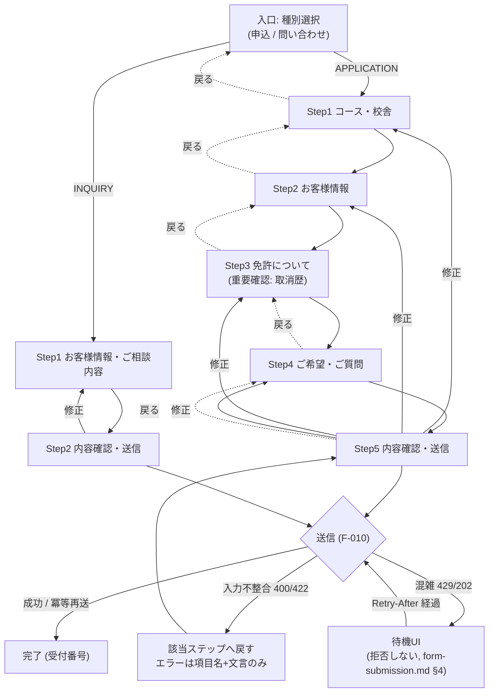

# UI設計: ステップ式 申込・問い合わせフォーム（F-008）

> 準拠: `/DESIGN.md`、共通シェル・共通コンポーネントは `./layout.md` §7 を単一参照元とする。
> 対応要件: `functional-spec.md` F-008（画面仕様・振る舞い仕様・境界値）, `business-spec.md` US-006 / US-007 / US-009 および §2.2.1 フロー図
> 関連設計: 免許証写真は `./license-upload.md`（F-009）、送信・スパム対策・完了/失敗・レート制限UXは `./form-submission.md`（F-010）
> 制約: `docs/phase-status.md`「P3 の設計制約」を満たすこと（**エラーレスポンスに入力値をエコーバックしない** / 公開エンドポイントの上限到達は拒否ではなく待ち・段階的劣化）
> ルート: `/apply`（`?type=` `?courseId=` を初期値として受け取る。`course-comparison.md` / `course-detail.md` の申込CTA遷移先）
> 更新: 2026-07-29（仕様 v0.3.1 / `docs/spec-p3-fix-2026-07-29.md` §4 の申し送り D-2 / D-8 を反映）。**§4.2 に AC-008-3 の許可条件 (a)〜(e) を明記**、**§5.5 の年齢下限を SPEC-007 の確定値へ**、**§12 の申し送りに仕様側の回答を記載**。
> なお `GET /apply` のレスポンスでは**フォームセッション Cookie が発行される**（AC-RL-13 / AC-008-4）。UI から見た影響は `form-submission.md` §3.5 を参照。

## ビジュアルコンセプト

- このフォームは `product-concept.md` Pain#2「必須14 / 全19項目の長大フォームで離脱する」への直接的な回答である。**1画面あたりの意思決定を1テーマに絞る**ことを最優先し、装飾よりも「あと何回タップすれば終わるか」が常に分かることに投資する。
- トーンは公開サイト（`top-page.md` / `course-comparison.md`）と同一。Accent オレンジは**進行系の主要アクション（次へ / 送信する）にのみ**使い、フォーム内の他要素へは広げない。Primary ブルーは戻る・修正などの副次操作に割り当てる。
- 「重要確認（免許取消歴）」は DESIGN.md §4 Inputs の重要確認事項ブロック（Warning Light 背景 + 左罫）で**視覚的に他の設問と質を変える**。現行サイトで自由記述欄に埋没していた項目を、色・形状・配置の3つで独立させる。
- 進捗は「ゲーム的な報酬」ではなく**残量の可視化**として扱う。パーティクル等の演出は入れず、完了画面のみ控えめなチェックマークのスケールインに留める（教習所という文脈で軽薄に見えないこと、および `prefers-reduced-motion` 下でも情報量が落ちないことを優先）。

---

## 1. ステップ構成（最終確定）

`functional-spec.md` F-008 の Step 表は「目安。UI設計で最終確定する」とされている。`business-spec.md` §2.2.1 のフロー図が種別選択とコース選択を別ノードに分けていることに合わせ、**種別選択を進捗の外側（入口）に置く**構成を確定とする。

### 確定した理由

| 論点 | 決定 | 理由 |
|------|------|------|
| 種別（申込/問い合わせ）の位置 | **入口（Step 0）。進捗バーの分母に含めない** | 種別によって総ステップ数が 5 と 2 に変わる。種別を Step1 に含めると進捗表示が「1/5」→「1/2」と後退して見え、残量の可視化という目的を壊す |
| 免許取消歴・現有免許・免許証写真 | **1ステップに統合（Step3「免許について」）** | 3つとも「所有免許の申告」という単一テーマ。分割するとタップ数が増えるだけで意思決定は減らない。取消歴は同ステップ内で重要確認ブロックにより独立性を確保できる |
| 確認画面 | **ステップとして数える（最終ステップ）** | 「次で最後」が事前に分かることが離脱率に効く |
| 同意チェック | **確認画面と同一ステップ** | 同意対象＝送信内容であり、内容を見た直後に置くのが APPI 上も自然 |

### APPLICATION（全5ステップ）

| # | ステップ名 | 収集項目（F-008 対応） |
|---|-----------|----------------------|
| 入口 | ご希望の内容 | 種別（type） |
| 1 | コース・校舎 | 教習プラン（複数可） / コース / 校舎 / 受講形態 |
| 2 | お客様情報 | 氏名 / 氏名カナ / 生年月日 / 性別 / メール / 電話 / 郵便番号 / 住所 / 建物名 |
| 3 | 免許について | **免許取消歴の有無（必須）** / 取消歴の補足（条件付き） / 現有免許 / 免許証写真（任意, F-009） |
| 4 | ご希望・ご質問 | 入所希望日 / 希望教習時間帯 / 支払方法 / 当校初めてか / 知ったきっかけ / 質問・要望 |
| 5 | 内容確認・送信 | プライバシー同意 / 全入力のレビュー / 送信（F-010） |

### INQUIRY（全2ステップ）

| # | ステップ名 | 収集項目 |
|---|-----------|---------|
| 入口 | ご希望の内容 | 種別（type） |
| 1 | お客様情報・ご相談内容 | 氏名 / 氏名カナ / 生年月日 / 性別 / メール / 電話 / 当校初めてか / 知ったきっかけ / 質問・要望 |
| 2 | 内容確認・送信 | プライバシー同意 / レビュー / 送信 |

- INQUIRY では申込専用ステップ（1・3・4）を**描画しない**。非活性で見せることもしない（存在しない項目を見せると「入力し損ねた」と誤認させるため）。
- 申込専用項目は INQUIRY のときフォーム状態からも**破棄する**（F-010 の `type` 逸脱拒否 E-010-6 をクライアント側で構造的に起こさないため）。種別を APPLICATION→INQUIRY に切り替える操作では確認ダイアログを出し、破棄されることを明示する（§4.3）。

### 画面遷移図



---

## 2. レイアウト

### 2.1 ページシェル

```
┌────────────────────────────────────────┐
│ Header (sticky)                          │  ← layout.md §2 のまま
├────────────────────────────────────────┤
│ Breadcrumb: トップ ＞ 申込・お問い合わせ      │
├────────────────────────────────────────┤
│ FormStepper                              │  ← §3
│  ステップ 2 / 5  ・ お客様情報              │
│  ▓▓▓▓▓▓▓▓░░░░░░░░░░░░                    │
├────────────────────────────────────────┤
│ <form> 現在ステップの本体                    │
│  [FormErrorSummary]  ← 検証失敗時のみ         │
│  FormField ...                            │
│  FormField ...                            │
├────────────────────────────────────────┤
│ StepNav                                  │
│  [← 戻る]                    [次へ →]      │
├────────────────────────────────────────┤
│ 保存の注意 / お電話でのお申込み導線             │
├────────────────────────────────────────┤
│ Footer                                   │
└────────────────────────────────────────┘
```

- **`MobileCtaBar` は `/apply` 配下で非表示**（`layout.md` §4 の hidden 対象に既定済み）。フォーム内の「次へ」と固定CTAの「資料請求」が競合するため。
- `ChatbotFab` は表示を維持する（入力中の疑問を解消してから続行できる方が離脱に効く）。ただしフォーム本体と重ならないよう `bottom: 24px` のデスクトップ既定値をモバイルでも使う（CTAバーが無いため）。
- コンテナは `max-w-[720px]`（`layout.md` §9 の 1120px より狭い専用値）。フォームは1カラム固定で、デスクトップでも横に伸ばさない。理由: 入力欄が長くなるほど視線移動が増え誤入力が増える。DESIGN.md §5 Container の 1120px は「一覧・比較」用途の値であり、フォームには適用しない。

### 2.2 入口（種別選択）

```
┌──────────────────────────────────────┐
│ SectionHeading                          │
│   eyebrow="APPLY"                       │
│   title="お申込み・お問い合わせ"             │
│   description="1〜2分で完了します。..."      │
├──────────────────────────────────────┤
│ ┌────────────────┐ ┌────────────────┐│
│ │ ● 入所を申し込む   │ │ ○ 質問・相談する  ││ ← RadioCardGroup
│ │ 教習コースを決めて  │ │ 費用や日程を       ││
│ │ 手続きに進みます   │ │ 相談だけしたい方   ││
│ │ 所要 3〜5分       │ │ 所要 1〜2分       ││
│ └────────────────┘ └────────────────┘│
├──────────────────────────────────────┤
│                          [次へ →]        │
└──────────────────────────────────────┘
```

- `?type=APPLICATION` / `?type=INQUIRY` 付きで遷移した場合は該当カードを選択済みにする。**入口ステップは自動スキップしない**（何のフォームに来たのかを1画面で理解させ、誤った種別のまま個人情報を入力させないため）。
- `?courseId=` 付きで遷移した場合、入口の下に「選択中のコース: 普通車(AT) 通学 岩滝校」を `Badge` 群 + コース名で表示し、引き継ぎが効いていることを即座に見せる。

### 2.3 Step1 コース・校舎（APPLICATION）

```
┌──────────────────────────────────────┐
│ h2 コース・校舎をお選びください               │
├──────────────────────────────────────┤
│ 教習プラン ［必須］（複数選択できます）          │
│  [✓] 通常プラン  [ ] 短期プラン  [ ] ...      │
│  ヘルプ: 迷ったら「通常プラン」で構いません。      │
│         詳細はご連絡時にご案内します。          │
├──────────────────────────────────────┤
│ コース ［必須］                             │
│  [ 普通車（AT） 通学          ▾ ]            │
│  ※ /courses から選んで来られた場合は選択済み     │
├──────────────────────────────────────┤
│ 校舎 ［必須］                               │
│  ┌──────────┐ ┌──────────┐            │
│  │ ● 岩滝校    │ │ ○ 網野校    │            │ ← RadioCardGroup
│  │ 与謝野町     │ │ 京丹後市     │            │
│  └──────────┘ └──────────┘            │
├──────────────────────────────────────┤
│ 受講形態 ［必須］                            │
│  ( ) 通学     ( ) 合宿                       │
└──────────────────────────────────────┘
```

- コース選択と校舎/受講形態は本来従属関係にある（あるコースが特定校舎でしか開講されない）。**コースを選ぶと校舎・受講形態を自動で追随させ、ユーザーが手で直した場合はコース選択の方を「条件に合うコース」で絞り直す**。整合しない組み合わせを送信させないことをクライアント側で担保する（サーバー再検証は F-010 側で別途行う）。
- コース一覧は `GET /api/courses`（F-002）を再利用する。取得失敗時は `ErrorState`（`layout.md` §7.6）を当該フィールド位置に出し、**フォーム全体は落とさない**。コースが選べない場合の代替として電話導線を併記する。

### 2.4 Step2 お客様情報

```
┌──────────────────────────────────────┐
│ h2 お客様情報をご入力ください                 │
│ 補足: ご連絡と本人確認のために使用します。       │
│       利用目的は[プライバシーポリシー]に記載。   │
├──────────────────────────────────────┤
│ 氏名 ［必須］          [山田 太郎          ]  │
│ 氏名カナ ［必須］      [ヤマダ タロウ        ]  │
│   help: 全角カタカナでご入力ください            │
│ 生年月日 ［必須］      [   年/月/日  📅   ]    │
│   help: 例 1998年4月1日 → 1998/04/01         │
│ 性別 ［任意］          ( )男性 ( )女性 ( )回答しない│
│ メールアドレス ［必須］  [example@mail.jp     ]  │
│   help: 受付番号の控えをお送りします             │
│ 電話番号 ［必須］       [09012345678         ]  │
│   help: ハイフンあり・なしどちらでも構いません      │
├──────────────────────────────────────┤
│ 郵便番号 ［必須］       [6292263 ] [住所を自動入力]│
│ 住所 ［必須］           [京都府与謝郡与謝野町... ]│
│ 建物名・部屋番号 ［任意］ [                   ]  │
└──────────────────────────────────────┘
```

- **郵便番号 → 住所補完**は US-006「入力補助がある」に対応する。実装は外部 API 呼び出しではなく、**サーバー側の Route Handler 経由**で行う（クライアントから第三者ドメインを直接叩くと、SEC-002 で投入する CSP の `connect-src` を広げることになり、また利用者の郵便番号が第三者に渡る）。デモ範囲では京都府内の郵便番号のみを内包データで解決し、外れた場合は「自動入力できませんでした。ご住所をご入力ください」とし**エラーにはしない**。
- 生年月日は現行サイトの「セレクト地獄」（`product-concept.md` Pain#2）を避け、`<input type="date">` を第一候補とする。年の選択が深くなる問題に対しては `min` / `max` を与え、iOS/Android のネイティブピッカーに委ねる。年/月/日 3セレクトのフォールバックは持たない（3セレクトこそが現行の課題であるため）。
  - **`max` を「年齢下限から算出した境界日」にしない**（§5.5）。**判定基準はサーバーの受信日（JST）**であり、クライアントのローカル日付で算出した境界を `max` にすると、日付境界・端末時計のずれ・海外からの入力で、**サーバー判定では通る正規申込者がピッカー上で入力できなくなる**。`max` は「今日（未来日不可）」に留め、**年齢下限は入力を止めずに `AGE_BELOW_MIN` のエラー表示で伝える**（エラーなら直せるが、入力できない境界は利用者に打つ手がない）。
- 郵便番号・電話番号は `inputMode="numeric"` `autocomplete`（`postal-code` / `tel` / `email` / `name` 等）を全項目に付与する。モバイルのオートフィルは入力量を最も直接的に減らす手段であり、**タップ数削減の主要施策として明示的に設計する**。

### 2.5 Step3 免許について（APPLICATION のみ）

```
┌──────────────────────────────────────┐
│ h2 お持ちの免許について                      │
├══════════════════════════════════════┤
│ ▌ ⚠ 必ずご回答ください                       │ ← ImportantNoticeBlock
│ ▌ 免許取消歴の有無 ［必須］                    │   Warning Light 背景
│ ▌                                        │   左罫 4px Warning
│ ▌  ( ) ありません                           │
│ ▌  ( ) あります                             │
│ ▌                                        │
│ ▌ 取消歴がある場合、必要な手続きが異なります。      │
│ ▌ 正確なご申告をお願いします。                  │
│ ▌                                        │
│ ▌ ┌ 「あります」選択時のみ展開 ─────────┐  │
│ ▌ │ 差し支えなければ状況をお書きください［任意］│  │
│ ▌ │ [                              ]  │  │
│ ▌ │ 取消日・理由など。ご記入がなくても      │  │
│ ▌ │ お申込みは進められます。               │  │
│ ▌ └──────────────────────────────┘  │
├══════════════════════════════════════┤
│ 現在お持ちの免許 ［任意・複数選択可］             │
│  [ ] 普通自動車  [ ] 普通自動二輪  [ ] 原付 ...  │
│  [ ] 持っていない／これから取得する               │
├──────────────────────────────────────┤
│ 免許証の写真 ［任意］                         │
│  （現有免許を選択した場合に展開。license-upload.md）│
└──────────────────────────────────────┘
```

- **免許取消歴は必ずステップ最上部**に置き、スクロールなしで視界に入る位置に固定する。DESIGN.md §4「重要確認事項ブロック」のスタイルをそのまま使う（Background `#FFFBEB` / Border-left `4px solid #D97706` / Padding 16px / Radius 8px）。
- 選択肢の文言は「あり/なし」ではなく **「ありません」「あります」** とする。ラジオ単体をスクリーンリーダーが読み上げたとき（`legend` を読み飛ばす設定でも）意味が通るため。
- 取消歴の補足は F-008 では「条件付き」だが、**入力必須にはしない**。必須にすると正直に「あります」と答えるコストが上がり、虚偽申告を誘発する。US-007 の受け入れ条件は「補足入力**または**注意喚起が表示される」であり、注意喚起（上記の説明文）と任意入力の併置で満たす。
- 「持っていない／これから取得する」を選ぶと他のチェックを解除し、免許証写真の領域を折りたたむ（相互排他）。
- 免許証写真は現有免許を1つ以上選んだときに展開する。未選択時は「免許証をお持ちの方は写真を添付できます（任意）」の一行リンクのみを置き、押せば展開する。**最小収集原則（`business-spec.md` §4.3）に沿って、機微情報の入力欄を既定で見せない**。

### 2.6 Step4 ご希望・ご質問

```
┌──────────────────────────────────────┐
│ h2 ご希望とご質問                            │
│ 補足: すべて任意です。空欄のままでも進めます。     │
├──────────────────────────────────────┤
│ 入所希望日 ［任意］     [ 2026年09月 ▾ ]      │
│ 希望教習時間帯 ［任意］  ( )午前 ( )午後 ( )夜間 ( )指定なし│
│ お支払い方法 ［任意］    [ 選択してください ▾ ]   │
│ 当校のご利用は ［任意］  ( )初めて ( )2回目以降    │
│ 当校を知ったきっかけ ［任意・複数可］             │
│   [ ] Web検索 [ ] SNS [ ] ご家族・ご友人 ...     │
│ ご質問・ご要望 ［任意］                        │
│   [                              ]          │
│   0 / 1000                                  │
└──────────────────────────────────────┘
```

- 全項目任意のステップであることをステップ冒頭で明示し、「次へ」だけで抜けられることを分かるようにする（このステップが離脱点にならないようにする）。
- 文字数カウンタは 1000 文字上限に対し、900 文字を超えたら Warning 色に変える。上限で入力を切り捨てず、超過分は `aria-describedby` 経由で「あと N 文字減らしてください」と伝える（切り捨ては入力の消失に等しく、フォーム離脱の直接原因になる）。
- 入所希望日は `<input type="month">`。過去月は `min` で塞ぐ（F-008 境界値「未来日」）。

### 2.7 Step5 内容確認・送信

```
┌──────────────────────────────────────┐
│ h2 ご入力内容の確認                          │
├──────────────────────────────────────┤
│ ── コース・校舎 ───────────── [修正] ─│
│  教習プラン   通常プラン                      │
│  コース      普通車（AT） 通学                 │
│  校舎        岩滝校                          │
│  受講形態     通学                            │
├──────────────────────────────────────┤
│ ── お客様情報 ───────────── [修正] ─│
│  氏名        山田 太郎                        │
│  氏名カナ     ヤマダ タロウ                    │
│  生年月日     1998年4月1日                     │
│  ...                                        │
├──────────────────────────────────────┤
│ ── 免許について ──────────── [修正] ─│
│  免許取消歴    ありません                      │
│  現在お持ちの免許 普通自動二輪                   │
│  免許証の写真  表 1枚 / 裏 1枚（添付済み）        │ ← 画像は再表示しない
├──────────────────────────────────────┤
│ ── ご希望・ご質問 ─────────── [修正] ─│
│  ...                                        │
├──────────────────────────────────────┤
│ [ ] [プライバシーポリシー]に同意します ［必須］    │
├──────────────────────────────────────┤
│ （必要に応じて）認証ウィジェット                  │ ← form-submission.md §3
├──────────────────────────────────────┤
│ [← 戻る]                    [この内容で送信]   │
└──────────────────────────────────────┘
```

- 「修正」はステップ単位のリンク。押すと該当ステップへ戻り、**戻り先では「確認画面から戻ってきた」ことを保持**して、次へ押下時に Step5 へ直帰する（`returnToReview` フラグ）。中間ステップを再度なぞらせない（`business-spec.md` REV-017 の「該当項目のステップへ戻る」に対応）。
- **免許証写真は確認画面でサムネイルを再表示しない**（`license-upload.md` §6 参照）。「表 1枚 / 裏 1枚（添付済み）」というテキストと、押下で当該ステップへ戻る「修正」のみを提供する。確認画面は滞在時間が長く、肩越しの覗き見（ショルダーハック）に最も晒される画面であるため。
- 同意チェックのリンク（`/privacy`, F-023）は `target="_blank" rel="noopener noreferrer"` で開く。同一タブで開くと入力状態を持ったまま離脱させることになる。
- **写真スロットが `degraded` / `failed` / 未完了（`queued` / `cooldown` / `uploading`）のときは、この行を「表 1枚 / 裏 未添付」等に変え、Warning トーンで「写真をもう一度お選びください / 写真なしで送信することもできます」を添える**（`license-upload.md` §4.2・§4.3）。**送信ボタンはブロックしない**——写真は任意項目であり、写真のせいで申込全体を失わせない。
- 送信ボタン以降の挙動（送信中 / 完了 / 失敗 / 混雑時の待機 / Tier B の CAPTCHA）は `form-submission.md` に委譲する。

---

## 3. FormStepper（進捗表示）

```
Mobile（≤767px）
┌──────────────────────────────────────┐
│ ステップ 2 / 5 ・ お客様情報                  │
│ ▓▓▓▓▓▓▓▓░░░░░░░░░░░░░░░░░░░░░░░       │
└──────────────────────────────────────┘

Desktop（≥1024px）
┌──────────────────────────────────────────────────┐
│  ①──────②──────③──────④──────⑤        │
│ コース   お客様情報   免許     ご希望    内容確認        │
│  ✓      ●現在       ○       ○       ○           │
└──────────────────────────────────────────────────┘
```

```ts
FormStepper ("use client"):
  props: {
    steps: { id: StepId; label: string; state: "done" | "current" | "todo"; hasError?: boolean }[]
    currentIndex: number       // 0-based
    onJumpTo?: (id: StepId) => void   // done のステップのみ呼ばれる。todo は無効
  }
```

- マークアップは `<nav aria-label="申込フォームの進捗"><ol>`。各 `<li>` に完了/現在/未着手をテキストで持たせる（`<span class="sr-only">完了</span>` 等）。**色と丸印のみで状態を伝えない**（`layout.md` §8「色のみに依存しない」）。
- 現在ステップの `<li>` に `aria-current="step"`。
- 視覚的な進捗バーは `aria-hidden="true"`。`<ol>` が既にセマンティクスを持つため `role="progressbar"` を重ねると二重に読み上げられる。
- ステップ遷移時、`aria-live="polite"` の隠し領域へ「ステップ 2 / 5 お客様情報」を流す。同時にフォーカスを新ステップの `<h2>`（`tabIndex={-1}`）へ移し、`scrollIntoView({ block: "start" })` する。**フォーカスをページ先頭に戻さないこと**（ヘッダーから読み直しになる）。
- 完了済みステップはクリックで戻れる。未着手ステップはクリック不可（`aria-disabled="true"` かつ `onClick` なし）。ただし確認画面（最終ステップ）まで一度到達したら、以降は全ステップがクリック可能になる。
- サーバー由来のエラーで戻された場合、該当ステップに赤丸 + `<span class="sr-only">入力エラーあり</span>` を付ける（`hasError`）。**エラー内容そのものはステッパーに書かない**（項目名すら進捗表示に載せず、当該ステップ内で示す）。

---

## 4. 状態設計

### 4.1 状態モデル

```ts
type ApplicationType = "APPLICATION" | "INQUIRY"
type StepId = "entry" | "course" | "personal" | "license" | "preference" | "review"

interface FormState {
  type: ApplicationType | null
  currentStep: StepId
  visited: StepId[]            // 到達済み（ステッパーのクリック可否判定）
  returnToReview: boolean      // 確認画面から「修正」で戻った
  values: ApplicationValues    // 全入力値（type に応じた部分集合）
  errors: Partial<Record<FieldName, ErrorCode>>   // ★値は保持しない。code のみ
  idempotencyKey: string       // マウント時に crypto.randomUUID()。form-submission.md §2
  submission: SubmissionState  // form-submission.md §2 で定義
}
```

- 状態は `useReducer` 単一ストアで持つ。フィールドごとの `useState` 分散は、確認画面・下書き復元・type 切替時の一括破棄が破綻するため採らない。
- ページは Server Component（`app/(public)/apply/page.tsx`）でシェル・コース選択肢・プライバシー文言を描画し、フォーム本体 `<ApplicationForm>` のみ `"use client"` とする（`layout.md` 技術前提の「Server Component 既定」に従う）。

### 4.2 入力保持と下書き

| 対象 | 保持 | 手段 |
|------|------|------|
| ステップ間の移動 | する | React state（`useReducer`） |
| タブ内のリロード・誤操作 | する | **`sessionStorage`**（タブを閉じれば消える） |
| ブラウザを閉じた後 | **しない** | `localStorage` は使わない |
| 免許証写真の `objectKey` / `uploadToken` / プレビュー / `File` | **しない** | §4.4 / `license-upload.md` §6 #7 |

#### `sessionStorage` 利用の許可条件（AC-008-3 / RV-P3D-005 で確定）

> **v0.3.0 の AC-008-3 は `sessionStorage` への PII 保存を全面禁止しており、本節と正面衝突していた。** 差し戻しレビューを経て**仕様側が改訂され、条件付きで明示的に許可された**（UI 設計側を潰さない決着）。**以下の (a)〜(e) を「全て」満たすことが許可の条件**であり、1つでも欠けると AC-008-3 違反になる。Test Agent はこの (b)(d)(e) を E2E で検証する。

| 条件 | 本設計での実現 |
|------|--------------|
| **(a)** タブを閉じると失われる | `sessionStorage` を使う（`localStorage` / Cookie は使わない）。**この選択自体が (a) の実現である** |
| **(b) 自動復元しない** | 下書きが存在する状態でフォームを開いても**自動的には反映せず**、「前回の入力内容が残っています」+ `[入力を復元する] [破棄して最初から]` を提示する。**利用者の明示操作でのみ復元する。** 自動復元は「共有端末で他人の入力が突然表示される」事故の原因になる |
| **(c) 常時「今すぐ削除する」導線がある** | フォーム下部に「入力内容はこのタブにのみ一時保存されています。[今すぐ削除する]」を**常時表示**する。**折りたたみ・スクロール連動での出し分け・特定ステップでのみ表示は不可**（「常時」が条件であり、探させないことが目的）。押下で即座に `removeItem` + フォーム state を初期化する |
| **(d) 送信成功・完了画面到達・破棄操作で `removeItem`** | **3つの契機すべてで `sessionStorage.removeItem()` を実行する。** (1) 送信成功（201/200 受領時）、(2) **完了画面到達時**、(3) **「破棄して最初から」/「今すぐ削除する」押下時**。(1) と (2) は通常同時に起きるが、**冪等再送で完了画面に到達する経路など片方だけが成立するケースがあるため両方を契機にする** |
| **(e) 写真関連値を保存しない** | **`objectKey` / `uploadToken` / プレビュー URL（`blob:`）/ `File` オブジェクトを `sessionStorage` に一切書かない。** これは**絶対に緩めない条件**である——`uploadToken` は「このオブジェクトを自分の申込に紐付ける」資格情報であり、共有端末に残ると**後続の利用者が他人の免許証画像を自分の申込に紐付けられる**。写真の state は `useLicenseUpload()` のメモリ上にのみ存在し、リロードで失われる（`license-upload.md` §6 #7 / §10） |

- **`localStorage` および Cookie への書き込みは引き続き全面禁止**。理由: 本フォームは氏名・生年月日・住所・電話・免許取消歴という機微度の高い組み合わせを扱う。家庭・職場・ネットカフェの共有端末で、次の利用者のブラウザに残り続ける保存先を選ぶ合理性がない。離脱防止の効果はタブ内復元でほぼ得られる。
- **`idempotencyKey` の `sessionStorage` 保存は許可されている**（PII ではなく、リロード後の二重登録防止に必要。`form-submission.md` §2.1）。**「sessionStorage 全面禁止」が成立しない**のはこのためでもある——下書き復元を落としても `idempotencyKey` だけは例外が必要になる。
- 復元時のメッセージには**写真は復元されない旨を含める**（「免許証の写真は、お手数ですがもう一度お選びください」）。(e) の帰結を利用者に説明する唯一の場所である。

### 4.3 種別（type）の切り替え

- 入口ステップに戻って type を変更する操作は、**申込専用項目を破棄する**。`ConfirmDialog`（`admin/news-cms.md` §1 で定義済みの共通コンポーネント）を再利用して確認する。
  - title: 「お問い合わせに切り替えますか？」
  - description: 「コース・ご住所・免許に関するご入力内容は削除されます。」
  - confirmLabel: 「切り替える」 / confirmVariant: `"primary"`（破壊的ではあるが利用者の意図した操作なので `danger` は使わない）
- APPLICATION → INQUIRY の切替時、**アップロード済みの免許証写真があれば即時に破棄要求を送る**（`license-upload.md` §5）。

### 4.4 離脱防止

- 入力が1文字でもあり、かつ送信未完了の状態で `beforeunload` に確認を出す。ただし**送信成功後・完了画面では解除する**（完了後に警告が出るのは純粋なノイズ）。
- ブラウザの戻るボタンでステップを戻す: ステップは `?step=` としてクエリに同期し、`history.pushState` + `popstate` 購読で処理する（`router.push` を使うと App Router がサーバー往復し、クライアント state を保ったままの遷移にならない）。
  - **クエリに載せるのは `step` と `type` のみ**。入力値は一切 URL に載せない（履歴・リファラ・共有で PII が漏れる）。
  - 完了画面へ遷移する際は `history.replaceState` を使い、戻るボタンで「送信可能な確認画面」に戻らないようにする。

---

## 5. バリデーションと エラー提示

### 5.1 検証タイミング

| タイミング | 対象 | 目的 |
|-----------|------|------|
| `onBlur`（初回のみ） | 当該フィールド | 早期フィードバック。ただし**入力中（`onChange`）は検証しない**（打っている途中に赤くするのは阻害） |
| エラー表示後の `onChange` | 当該フィールド | 直ったら即座にエラーを消す（回復は即時に伝える） |
| 「次へ」押下 | 当該ステップ全項目 | 先へ進ませない判定（F-008 E-008-1/2/3） |
| 「送信」押下 | 全ステップ全項目 + 同意 | F-008 E-008-4 |
| サーバー応答 | サーバーが返した項目 | F-010 E-010-4。§5.4 |

### 5.2 エラーメッセージ（入力値をエコーバックしない）

**設計制約**: `docs/phase-status.md` P3 セキュリティ要件「エラーレスポンスに入力値をエコーバックしない」。これを**運用ルールではなく型で強制する**。

```ts
// ★ value を持てない形にする。クライアント・サーバーで共有する。
type FieldError = { field: FieldName; code: ErrorCode }

type ErrorCode =
  | "REQUIRED" | "TOO_SHORT" | "TOO_LONG" | "FORMAT_EMAIL" | "FORMAT_TEL"
  | "FORMAT_KANA" | "FORMAT_POSTAL" | "DATE_INVALID" | "DATE_FUTURE"
  | "AGE_BELOW_MIN" | "CONSENT_REQUIRED" | "CHOICE_INVALID" | "TYPE_MISMATCH"

// 文言解決は**クライアント側の固定テーブル**のみで行う。サーバーは文言を返さない。
const ERROR_MESSAGE: Record<ErrorCode, string> = {
  REQUIRED: "必須項目です",
  FORMAT_EMAIL: "メールアドレスの形式が正しくありません",
  FORMAT_TEL: "電話番号は10桁または11桁の数字でご入力ください",
  FORMAT_KANA: "全角カタカナでご入力ください",
  // ...
}
```

- サーバーが `message: string` を返す設計にすると、いずれ「どこが違うか分かるように」という善意で入力値が混入する。**サーバーの応答型に文字列メッセージを置かない**ことで構造的に防ぐ。
- 文言の禁止事項:
  - ❌ 「"yamada@" は正しいメールアドレスではありません」
  - ❌ 「入力された郵便番号 1234567 に該当する住所がありません」
  - ⭕ 「メールアドレスの形式が正しくありません」
  - ⭕ 「該当するご住所が見つかりませんでした。ご住所を直接ご入力ください」
- 例外の扱い: **文字数カウンタ（`0 / 1000`）は値そのものではなく長さであり許容する**。ただしサーバーログ・エラー応答には長さも含めない。

### 5.3 エラーの見せ方

```
┌──────────────────────────────────────┐
│ ⚠ 入力内容をご確認ください（2件）            │  ← FormErrorSummary, role="alert"
│   ・氏名カナ: 全角カタカナでご入力ください      │     各項目は当該フィールドへのリンク
│   ・メールアドレス: 形式が正しくありません       │
├──────────────────────────────────────┤
│ 氏名カナ ［必須］                           │
│ ┌────────────────────────────────┐│  ← border 2px solid #DC2626
│ │ やまだ たろう                        ││
│ └────────────────────────────────┘│
│ ⚠ 全角カタカナでご入力ください               │  ← id="nameKana-error"
└──────────────────────────────────────┘
```

```ts
FormErrorSummary ("use client"):
  props: { errors: FieldError[]; onFocusField: (field: FieldName) => void }
  // role="alert" / tabIndex={-1}。表示時にこの要素自体へフォーカスを移す。
```

```ts
FormField:   // components/ui/FormField.tsx（新規 / admin/news-cms.md §2 の契約を拡張）
  props: {
    label: string
    htmlFor: string
    required?: boolean
    optional?: boolean        // 「任意」の明示ラベル
    error?: string            // ERROR_MESSAGE で解決済みの文言
    helpText?: string
    children: ReactNode
  }
```

- 「次へ」でエラーになったら: (1) `FormErrorSummary` を描画してそこへフォーカス、(2) 各項目に `aria-invalid="true"` と `aria-describedby="<id>-error <id>-help"`、(3) 個別メッセージは `<p id="<id>-error">` に置く。
  - サマリ側を `role="alert"` にし、**個別メッセージ側は `role="alert"` にしない**。両方に付けると同一内容が2回読み上げられる。
- サマリの各行は当該フィールドへのアンカー。押下でフォーカス + `scrollIntoView`。
- 必須/任意の表し方は `admin/news-cms.md` §2 の既存方針を踏襲する: **`*` を使わず、ラベル横に Caption サイズ・Text Secondary の「必須」テキスト**。Danger 色は実際のエラー時にのみ予約する。任意項目が少数派のステップでは「任意」を明示し、必須が少数派のステップ（Step4）では逆に「任意」を省いてステップ冒頭で一括して述べる。
- エラー時のマイクロインタラクションは**シェイクを使わない**。DESIGN.md のトーン（信頼・落ち着き）に合わないうえ、`prefers-reduced-motion` 下で情報が消える。境界色の変化（150ms）とサマリのフェードイン（150ms）のみ。

### 5.4 サーバー由来エラー（E-010-4 / E-010-6）

- 応答は `{ errors: FieldError[] }`。クライアントは各 `field` を `FIELD_STEP_MAP` でステップへ写像する。
- 複数ステップに散った場合: **最も手前のステップへ移動**し、他ステップは `FormStepper` に `hasError` を立てる。移動先に `FormErrorSummary` を出し、冒頭に「他のステップにもご確認いただく項目があります」を添える。
- E-010-6（INQUIRY で申込専用項目を送信）は、正常なクライアント操作では発生しない（§1 で申込専用項目を破棄しているため）。発生した場合は個別項目エラーではなく「お手数ですが、最初からやり直してください」+ 状態リセット導線とする。**どの項目が逸脱したかを画面に出さない**（攻撃者への情報提供になるため）。

### 5.5 検証ルール一覧（F-008 境界値に対応）

| フィールド | ルール | ErrorCode |
|-----------|--------|-----------|
| type | いずれか選択 | `REQUIRED` |
| plans | APPLICATION 時 1つ以上 | `REQUIRED` |
| courseId | APPLICATION 時 選択肢内 | `REQUIRED` / `CHOICE_INVALID` |
| school / format | APPLICATION 時 選択肢内 | `REQUIRED` / `CHOICE_INVALID` |
| name | 1〜50文字（トリム後） | `REQUIRED` / `TOO_LONG` |
| nameKana | 全角カタカナ + 全角/半角スペース, 1〜50文字 | `REQUIRED` / `FORMAT_KANA` / `TOO_LONG` |
| birthDate | 実在日付・未来日不可・年齢下限（**下記で確定**） | `DATE_INVALID` / `DATE_FUTURE` / `AGE_BELOW_MIN` |
| email | RFC 準拠形式 | `REQUIRED` / `FORMAT_EMAIL` |
| phone | ハイフン除去後 数字のみ 10〜11桁 | `REQUIRED` / `FORMAT_TEL` |
| postalCode | APPLICATION 時 ハイフン除去後 7桁 | `REQUIRED` / `FORMAT_POSTAL` |
| address | APPLICATION 時 1〜100文字 | `REQUIRED` / `TOO_LONG` |
| buildingName | 0〜100文字 | `TOO_LONG` |
| licenseRevoked | APPLICATION 時 いずれか選択 | `REQUIRED` |
| preferredStartMonth | 当月以降 | `DATE_INVALID` |
| message | 0〜1000文字 | `TOO_LONG` |
| privacyConsent | true 必須 | `CONSENT_REQUIRED` |

#### 年齢下限（SPEC-007 で確定 / S-2 への回答）

**申し送り S-2 は「§4.5 で既に確定していた」ことが判明し、F-008 の境界値表に転記された。** 以下が確定値であり、UI はこれに従う。**コース選択との連動は不要**（種別別要件＝二輪16歳・大型/二種21歳等はデモ検証対象外 / REV-014。**普通車基準の一律下限のみを検証する**）。

| 項目 | 確定値 |
|------|--------|
| 下限 | **18歳の誕生日の1ヶ月前**（＝17歳11ヶ月）から申込可 |
| 基準日 | **サーバーの受信日（JST）**。クライアントのローカル日付・タイムゾーンは使わない |
| 「1ヶ月前」の定義 | **暦月**で計算し、**該当日が存在しない月は当月末日に丸める**（例: 生年月日 2008-03-31 → 判定日は 2026-02-28（うるう年なら 02-29）） |
| 判定 | `birthDate + 18年 - 1ヶ月 <= 受信日（JST の日付単位）` なら可。純関数 `isAgeEligible({ birthDate, receivedAt })` |
| エラーコード | `AGE_BELOW_MIN` |

- **クライアント側の即時検証は「早期フィードバック」に限る**。最終判定はサーバーが受信日で行うため、**クライアントのローカル日付で判定した結果とサーバーの結果が食い違いうる**（日付境界・端末時計のずれ・海外からの送信）。食い違った場合は §5.4 のサーバー由来エラー経路で `AGE_BELOW_MIN` を表示すればよく、**クライアント判定を「通ったのだから通るはず」と扱わない**こと。
- 文言は `AGE_BELOW_MIN`「お申込みいただける年齢に達していません。お電話でご相談ください」+ 電話導線。**エラー表示に生年月日そのものを含めない**（AC-PII-2 / §5.2 の入力値エコーバック禁止）。「2009年5月1日生まれの方は…」は禁止。
- **`ERROR_MESSAGE` テーブルの文言は「◯歳未満は申し込めません」という数値表現にしない**。実際の下限は「18歳の1ヶ月前」であり、「18歳未満は不可」と書くと 17歳11ヶ月の正規申込者に誤った説明をすることになる。
- クライアント検証は**サーバー検証の代替ではない**。同じルールを `lib/validators/application.ts` に置き、Route Handler / Server Action とクライアントが同一モジュールを import する（`lib/validators/news.ts` の既存方針を踏襲）。

---

## 6. コンポーネント分解

### 6.1 再利用する既存コンポーネント

| コンポーネント | 用途 |
|--------------|------|
| `components/ui/SectionHeading` | 入口・各ステップの見出し |
| `components/ui/CTAButton` | 次へ（`primary`）/ 戻る（`secondary`）/ 修正（`tertiary`）/ 送信（`primary`） |
| `components/ui/Badge` | 引き継いだコースの校舎・受講形態表示（`school` / `format`） |
| `components/ui/States`（`ErrorState`） | コース一覧の取得失敗 |
| `components/admin/ConfirmDialog` | type 切替の確認 → **`components/ui/ConfirmDialog` へ移動して共用**（§6.3） |
| `components/layout/Breadcrumb` | パンくず |

### 6.2 新規コンポーネント（提案）

| # | コンポーネント | 配置 | 新規である理由 |
|---|--------------|------|--------------|
| 1 | `FormField` | `components/ui/` | `admin/news-cms.md` §2 で契約が定義済みだが**未実装**（`NewsForm.tsx` はインラインで label/input を書いている）。P3 で入力項目が20超になるため共通化が必須。実装後、`NewsForm` の移行を Should Fix として起票 |
| 2 | `FormStepper` | `components/apply/` | 既存に進捗表示コンポーネントが無い。§3 の a11y 要件（`<ol>` + `aria-current="step"` + `aria-live` 通知）を含むため素朴な div では不足 |
| 3 | `RadioCardGroup` | `components/ui/` | 種別・校舎・受講形態の2〜3択で、素の `<input type="radio">` はモバイルのタップ領域（44px）と説明文の同居を満たせない。`role` はネイティブ radio のまま `<label>` をカード化する実装（独自 `role="radio"` は書かない） |
| 4 | `ImportantNoticeBlock` | `components/ui/` | DESIGN.md §4 Inputs に**スタイル定義済みだが未実装**。免許取消歴（US-007）が初出。将来 FAQ・コース詳細の注意喚起にも使える汎用形にする |
| 5 | `FormErrorSummary` | `components/apply/` | §5.3。`ErrorState` は「取得失敗 + 再読み込み」用途で、項目リンク付きサマリとは責務が異なる |
| 6 | `ReviewSummary` | `components/apply/` | 確認画面のセクション別レビュー。`SpecTable`（`<dl>`）の見た目を踏襲するが、セクション見出しと「修正」リンクが必要で `SpecTable` の props（`rows` + `priceFrom`）に収まらない |
| 7 | `LicensePhotoUploader` | `components/apply/` | `license-upload.md` で定義 |
| 8 | `RateLimitWaitPanel` | `components/apply/` | `form-submission.md` §4 で定義 |
| 9 | `TurnstileWidget` | `components/apply/` | `form-submission.md` §3 で定義 |

```ts
RadioCardGroup:
  props: {
    legend: string                 // <fieldset><legend>
    name: string
    options: { value: string; label: string; description?: string; note?: string }[]
    value: string | null
    onChange: (v: string) => void
    columns?: 1 | 2                // モバイルは常に1列
    error?: string
  }

ImportantNoticeBlock:
  props: {
    title: string                  // 例: "必ずご回答ください"
    tone?: "warning" | "info"      // 既定 warning（DESIGN.md の Warning Light）
    children: ReactNode
  }
  // <section aria-labelledby> + 見出しは Heading 3。アイコンは装飾のみ（aria-hidden）

ReviewSummary:
  props: {
    sections: {
      stepId: StepId
      title: string
      rows: { label: string; value: string; masked?: boolean }[]
      onEdit: () => void
    }[]
  }
  // masked=true の行は値の代わりに件数等の要約を出す（免許証写真）
```

### 6.3 既存コンポーネントの移動提案

- `components/admin/ConfirmDialog.tsx` → `components/ui/ConfirmDialog.tsx`。公開フォームの type 切替確認で使うため。管理画面専用ディレクトリからの import は依存方向として不自然（公開 → 管理）。**実装コードの変更は本設計では行わない**ため、Impl Agent への申し送りとする。

### 6.4 ディレクトリ

```
components/
├── ui/                    # 既存。汎用コンポーネント
│   ├── FormField.tsx      # 新規
│   ├── RadioCardGroup.tsx # 新規
│   ├── ImportantNoticeBlock.tsx  # 新規
│   └── ConfirmDialog.tsx  # admin から移動（提案）
└── apply/                 # 新規ディレクトリ。/apply 専用
    ├── ApplicationForm.tsx     # "use client" ルート。useReducer を持つ
    ├── FormStepper.tsx
    ├── FormErrorSummary.tsx
    ├── ReviewSummary.tsx
    ├── LicensePhotoUploader.tsx
    ├── RateLimitWaitPanel.tsx
    ├── TurnstileWidget.tsx
    └── steps/
        ├── StepEntry.tsx
        ├── StepCourse.tsx
        ├── StepPersonal.tsx
        ├── StepLicense.tsx
        ├── StepPreference.tsx
        └── StepReview.tsx
```

- `components/courses/` `components/top/` `components/admin/` という既存の「ページ/ドメイン単位ディレクトリ」の慣行に合わせる。

---

## 7. デザイントークンの利用方針

**新規トークンは追加しない。** 既存の `tailwind.config.ts` の定義で全て表現できる。

| 用途 | 使用トークン |
|------|------------|
| 入力欄 通常枠 | `border-border-strong`（`#CBD5E1`） |
| 入力欄 フォーカス | `focus:border-primary-700` + `focus:ring-2 focus:ring-primary-700/30` |
| 入力欄 エラー枠 | `border-2 border-danger`（`#DC2626`） |
| エラーメッセージ | `text-danger text-body-sm` |
| ヘルプテキスト | `text-text-secondary text-body-sm` |
| 「必須」ラベル | `text-caption text-text-secondary` |
| 重要確認ブロック | `bg-warning-bg` + `border-l-4 border-warning` + `p-m rounded` |
| 進捗バー 済み | `bg-accent`（`#C2410C`） |
| 進捗バー 未 | `bg-border`（`#E5E7EB`） |
| ステップ見出し | `text-h2 font-heading` |
| 次へ / 送信 | `CTAButton variant="primary"` |
| 戻る | `CTAButton variant="secondary"` |
| 修正 | `CTAButton variant="tertiary"` |
| カード枠（RadioCard・レビューセクション） | `rounded-card border border-border bg-surface shadow-level1` |
| 選択中の RadioCard | `border-2 border-primary-700 bg-primary-50` |
| 間隔 | `gap-xs`(4) / `gap-s`(8) / `gap-m`(16) / `gap-l`(24) / `gap-xl`(32) |

- 入力欄の `font-size` は **16px 未満にしない**（DESIGN.md §4 Inputs、iOS の自動ズーム防止）。`text-body`（16px）を使い、`text-body-sm` は入力欄本体に使わない。
- 入力欄・ボタンの高さは 48px（`min-h-[48px]`）。既存 `NewsForm.tsx` は `h-12`（=48px）を使っており、これに揃える。
- Accent 500 `#F97316` は装飾専用（文字を乗せない）。進捗バーには 700 `#C2410C` を使う。

---

## 8. インタラクション定義

| トリガー | アニメーション | 持続時間 | イージング |
|---------|-------------|---------|----------|
| ステップ遷移（次へ / 戻る） | 新ステップのフェードイン + 8px スライド（次へ=右→左 / 戻る=左→右） | 200ms | ease-out |
| 進捗バーの伸長 | `width` トランジション | 300ms | ease-out |
| RadioCard 選択 | 枠線色 + 背景色トランジション | 150ms | ease-out |
| 入力欄フォーカス | 枠線 + リング | 150ms | ease-out |
| エラーメッセージ出現 | フェードイン + 4px スライドダウン | 150ms | ease-out |
| 条件付き領域の展開（取消歴の補足 / 写真領域） | 高さ auto へのトランジション（`grid-template-rows: 0fr → 1fr`） | 200ms | ease-out |
| 「修正」→ 該当ステップ | ステップ遷移と同じ。加えて対象セクションの一時ハイライト（`bg-primary-50` 800ms フェードアウト） | 200ms / 800ms | ease-out |
| 送信ボタン押下 | `form-submission.md` §2 | - | - |

- ステップ遷移のスライドは**方向で前後を伝える**演出であり、`prefers-reduced-motion` 下ではフェードのみに落とす（`globals.css` の既存の一括無効化が適用されるため追加実装は不要だが、**遷移完了をアニメーション終了イベントに依存させない**こと。E2E での待機が破綻する）。
- ステップ遷移は `will-change: opacity, transform` を付けず、`transform`/`opacity` のみのアニメーションに留める（GPU レイヤーの常時確保はモバイルのメモリを圧迫する。DESIGN.md 「見た目の豪華さより滑らかさ」）。
- **ステップ遷移中は「次へ」を disabled にしない**。200ms の間ボタンが死ぬと連打時に取りこぼしが起きる。代わりに遷移中の追加クリックを無視する（state 側でガード）。

---

## 9. アクセシビリティ要件

| 項目 | 要件 |
|------|------|
| ラベル関連付け | 全入力に `<label htmlFor>`。placeholder をラベル代わりにしない（入力後に消えるため）。ラジオ/チェックボックス群は `<fieldset><legend>` |
| Label in Name | 可視ラベル文字列をアクセシブルネームに含める（WCAG 2.5.3）。`NewsForm.tsx` の「取り下げ/公開」で得た知見（ラベルが部分一致すると選択が曖昧になる）を踏まえ、**同一グループ内の選択肢ラベルが互いの部分文字列にならないようにする**。例: 免許取消歴は「あり/なし」ではなく「あります/ありません」→ これは部分一致するため **「取消歴はありません」「取消歴があります」** とする |
| フォーカス管理 | ステップ遷移時: 新ステップの `<h2 tabIndex={-1}>` へ。エラー発生時: `FormErrorSummary` へ。サマリの項目リンク押下時: 当該入力へ。ダイアログ: 開時に安全側ボタン、閉時にトリガーへ復帰 |
| エラーの読み上げ | `FormErrorSummary` に `role="alert"`。個別メッセージは `aria-describedby` 経由（`role` 重複を避ける） |
| 進捗の読み上げ | `<nav aria-label="申込フォームの進捗"><ol>` + `aria-current="step"`。遷移は `aria-live="polite"` で1回だけ通知 |
| `aria-invalid` | エラー中の入力に `aria-invalid="true"`。解消時に外す |
| 必須の伝達 | `required` 属性 + 可視ラベル「必須」。`aria-required` は `required` があれば不要 |
| タッチターゲット | 全インタラクティブ要素 44px 以上、入力欄・ボタンは 48px（`layout.md` §9） |
| コントラスト | エラー文字 `#DC2626` on `#FFFFFF` = 4.83:1（AA 適合）。ヘルプ `#4B5563` on `#FFFFFF` = 7.56:1 |
| 色のみに依存しない | エラーは 色 + ⚠アイコン + テキスト。進捗は 色 + 形状 + `sr-only` テキスト |
| キーボード完結 | ステッパーのジャンプ、条件付き展開、ダイアログ、ファイル選択のすべてを Tab / Enter / Space / Esc で操作可能に |
| ズーム | 400% 拡大（WCAG 1.4.10 リフロー）で横スクロールが発生しないこと。1カラム固定なので構造的に満たすが、`FormStepper` のデスクトップ横並びは折り返す |
| 自動入力 | `autocomplete` を全該当項目に付与（`name` `email` `tel` `postal-code` `address-level1` `street-address` `bday`）。ハニーポットには `autocomplete="off"` + `tabIndex={-1}` + `aria-hidden="true"` を必ず付ける（`form-submission.md` §3.3。オートフィルがハニーポットを埋めると、利用者は原因不明の送信失敗に遭う） |

---

## 10. レスポンシブ

| ブレークポイント | ステッパー | フォーム本体 | ナビゲーション |
|-----------------|-----------|------------|--------------|
| Mobile ≤767px | 「2 / 5 ・お客様情報」+ 進捗バー | 1カラム、`px-m`（16px）、フィールド間 `gap-l`（24px） | 「戻る」「次へ」を横並び。**「次へ」を画面下に sticky 固定**（`bottom: 0`, 白背景 + 上向き Shadow Level2, `padding-bottom: env(safe-area-inset-bottom)`）。長いステップでも常に次へ到達できる |
| Tablet 768–1023px | 同上（ラベル付きに切替可） | 1カラム、`max-w-[640px]` 中央寄せ | sticky を解除し、フォーム末尾に配置 |
| Desktop ≥1024px | ①〜⑤ ラベル付き横並び | 1カラム、`max-w-[720px]` 中央寄せ。氏名/カナ、郵便番号/住所は2カラム化しない | フォーム末尾。右寄せで「次へ」 |

- モバイルの sticky ナビは `MobileCtaBar` が非表示であることが前提（`layout.md` §4）。両方が出ると画面下部が二重になる。
- モバイルで各ステップが**1〜2スクリーン以内**に収まることを設計目標とする（US-006「モバイルで各ステップが1画面で完結」）。Step2（お客様情報 9項目）と Step3（免許について）は超える可能性があるため、Step2 は「ご本人について / ご連絡先 / ご住所」の3つの `<fieldset>` に視覚的な区切り（`border-t border-border pt-l`）を入れ、スクロール中も現在地が分かるようにする。
- 横向き（landscape）でモバイルのソフトキーボードが画面の大半を占める場合、フォーカス中の入力が隠れないよう `scroll-margin-block: 96px` を全入力に付ける。

---

## 11. E2E / テストへの申し送り（Test Agent 向け）

- **アニメーション完了を待たない**セレクタ設計にする。ステップの識別は `data-testid="apply-step-<stepId>"` と `<h2>` テキストで行い、進捗バーの幅では判定しない。
- 検証すべき UI 契約:
  1. INQUIRY 選択時、Step1（コース）・Step3（免許）・Step4（希望）が **DOM に存在しない**こと（非表示ではなく不在）。
  2. エラーメッセージに**入力した値が含まれない**こと。`page.getByRole('alert')` のテキストに、入力した氏名・メール文字列が現れないことを明示的にアサートする（これは P3 のセキュリティ受け入れ条件そのもの）。
  3. 確認画面から「修正」→ 該当ステップ → 「次へ」で**確認画面に直帰**すること。
  4. **(b) 自動復元しない**: リロード後に「復元する / 破棄する」が出ること、**利用者が押すまでフォームに値が入っていないこと**（AC-008-3 (b)）。
  5. **`localStorage` および Cookie にフォーム値が書かれていない**こと（`sessionStorage` は §4.2 の (a)〜(e) を満たす限り許可されている。**`sessionStorage` が空であることをアサートしてはならない**——下書き保存は仕様上許可された振る舞いであり、それを禁止するテストは AC-008-3 の改訂前の記述に対するテストになる）。
  6. **(e) 写真関連値を保存しない**: `objectKey` / `uploadToken` / **プレビュー URL（`blob:`）/ `File` 由来の値**のいずれも `sessionStorage` にも `localStorage` にも書かれていないこと。**写真を添付した状態で下書き保存が走った直後**に検証すること（保存契機の後でなければ意味がない）。
  7. **(d) 3つの契機すべてで消える**: (1) 送信成功時、(2) 完了画面到達時、(3)「破棄して最初から」/「今すぐ削除する」押下時に `sessionStorage` から下書きキーが `removeItem` されていること。
  8. **(c) 「今すぐ削除する」導線が常時表示されていること**: 入口・各ステップ・確認画面のいずれでも DOM に存在し、可視であること。
  9. `AGE_BELOW_MIN` の境界: **17歳11ヶ月0日は不可 / 17歳11ヶ月1日は可**。**エラー表示に生年月日の文字列が含まれない**こと（§5.5）。
- `role="alert"` は `globals.css` で `next-route-announcer` を無効化済みのため単一想定でよい（P2 の既知事項）。ただし本フォームでは `FormErrorSummary` と F-010 の送信エラーが同時に出ないことを設計で保証する（サマリ表示中は送信ボタンを押せない）。

---

## 12. 仕様への申し送り（Spec Agent 向け）

> **v0.3.1（2026-07-29）で S-1〜S-7 のすべてに回答が返った**（`docs/spec-p3-fix-2026-07-29.md` §4）。**未回答の申し送りは残っていない。**

| # | 内容 | 影響 | 回答（v0.3.1 / 確定） |
|---|------|------|---------------------|
| S-1 | **ステップ構成を確定した**（入口 + APPLICATION 5 / INQUIRY 2）。F-008 の Step 表（1〜6）と番号がずれるため、`functional-spec.md` F-008 の Step 列を本設計に合わせて更新されたい | F-008 画面仕様表 | ✅ **対応済み**（SPEC-006）。F-008 の Step 表が本設計の確定構成へ更新された。さらに **AC-008-2 がステップ番号ではなくフィールド名ベースへ書き換えられた**（UI 構成は変わりうるが type ごとのフィールドの有無は変わらないため）。**UI 設計側の変更は不要** |
| S-2 | **年齢下限の具体値が未確定**（F-008 は「年齢下限チェック」とのみ記載）。教習種別により下限が異なるため、コース選択との連動要否も含めて確定が必要 | F-008 バリデーション / §5.5 | ✅ **回答: §4.5 で既に確定していた**（本設計の見落とし）。値は「**18歳の誕生日の1ヶ月前**」の一律下限で、**コース連動は不要**（REV-014）。基準日・暦月丸め・境界値5本が SPEC-007 / AC-008-8 に確定。**§5.5 に反映済み** |
| S-3 | 免許取消歴の補足を**任意入力**とした（F-008 は「条件付き」）。US-007 の「補足入力**または**注意喚起」を注意喚起 + 任意入力で満たす。必須化は虚偽申告を誘発するため採らない | F-008 Step3 | ✅ 判断が維持された |
| S-4 | 郵便番号→住所の自動補完を追加した（US-006「入力補助」の具体化）。外部 API を**クライアントから直接叩かない**方針を tech-stack に記載されたい（CSP `connect-src` / 第三者への PII 送信の観点） | F-008 / tech-stack §4 | ✅ **採用**（SPEC-008）。`GET /api/postal/[code]` としてサーバー Route Handler 経由で確定し F-008 API 仕様に登録。**デモ範囲では内包データで解決し外部通信を行わない**ため、**`connect-src` への追加は不要**（`tech-stack.md` §4.7 に明記）。レート制限も §4.11 の公開変更系ラッパの対象外（GET のため）。ただし**外部 API 呼び出しに変更する場合は §4.11 の対象に含める**ことが条件として明記された |
| S-5 | **免許証写真の即時削除 API**（`DELETE /api/uploads/license`）の追加を提案する。詳細は `license-upload.md` §5 | F-009 API仕様 | ✅ **採用**（SPEC-011）。F-009 API 仕様に登録され AC-009-10 が立った。**UI 文言は「削除する」のままでよい**（代替案の「この申込には添付しない」への変更は不要）。§4.3 の type 切替時の破棄要求もこの API を使う |
| S-6 | E-010-3（レート超過）の「時間をおいて再度お試しください」を**拒否画面ではなく待機UIの文言**として扱う。P3 設計制約（拒否ではなく待ち）との整合。詳細は `form-submission.md` §4 | F-010 異常系 | ✅ **採用**。E-010-3（共有軸 → Tier C）/ E-010-3b（発信元軸 → Tier D）に分割され、文言も待機 UI 側に合わせて書き換えられた |
| S-7 | 個人情報の**保持期間**が未確定（`phase-status.md` P3 要件「保持期間を業務仕様として確定させる」）。確認画面の同意文言・`/privacy` の記載に必要。UI 側は文言を差し込むだけで対応できるよう設計済み | business-spec §4.3 / F-023 | ✅ v0.3.0 で回答済み（§4.12 / AC-PII-5。申込3年・問い合わせ1年・写真は DONE から30日 等）。UI は文言差し込みで対応 |

### 12.1 仕様側から本設計へ返された変更（v0.3.1 で反映済み）

| 出典 | 内容 | 反映先 |
|------|------|--------|
| **RV-P3D-005 / AC-008-3 改訂** | `sessionStorage` の条件付き利用が**明示的に許可**された。(a)〜(e) を全て満たすことが条件で、**(e)（写真関連値を保存しない）は絶対に緩めない** | **§4.2**（条件表を新設）/ §11（テスト項目を差し替え） |
| **SPEC-007** | 年齢下限の確定値・基準日・暦月丸め | **§5.5** |
| **SPEC-011** | 削除 API の採用 | `license-upload.md` §5 / 本書 §4.3 |
| **SPEC-012** | ハニーポットの応答が Tier B へ | `form-submission.md` §3.3 |
| **SPEC-013** | `receiptNumber` が **ULID 26文字**に（日次連番の廃止） | `form-submission.md` §6（完了画面の表示設計） |
| **AC-RL-13 / AC-RL-6** | フォームセッション Cookie の必須化。送信間隔はサーバーの `issuedAt` で判定 | `form-submission.md` §3.4 / §3.5 |
