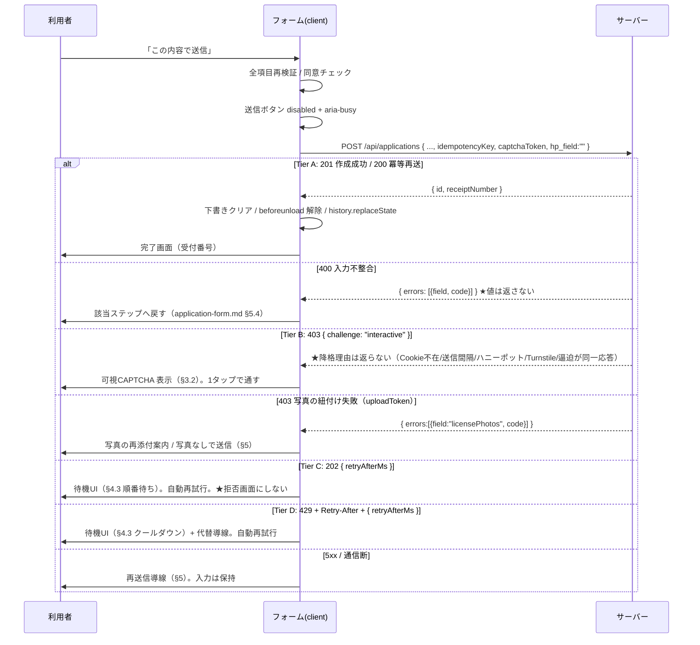

# UI設計: フォーム送信・スパム対策・完了/失敗・混雑時UX（F-010）

> 準拠: `/DESIGN.md`、共通コンポーネントは `./layout.md` §7。
> 対応要件: `functional-spec.md` F-010（画面仕様・振る舞い仕様・API仕様・REV-011 冪等性）, `business-spec.md` US-006 / US-009
> 位置づけ: `./application-form.md` §2.7 Step5「内容確認・送信」の押下以降を扱う。写真の紐付けは `./license-upload.md`。
> 制約: `docs/phase-status.md`「P3 の設計制約 条件1'」— **公開エンドポイントでは共有軸の枯渇を「拒否」ではなく「待ち / 段階的劣化 / CAPTCHA フォールバック」にする**。本ファイル §3・§4 がその UI 側の回答である。
> 更新: 2026-07-29（仕様 v0.3.1 / `docs/spec-p3-fix-2026-07-29.md` §4 の申し送り D-1 / D-3 / D-4 / D-5 を反映）。**§4.2 の Tier 表が仕様 §4.11 の「唯一の真実源」として採用された**ため、本ファイルと仕様は同一契約でなければならない。

## ビジュアルコンセプト

- 送信は、利用者がここまで 3〜5 分かけて積み上げた入力を**手放す瞬間**である。したがってこの区間の設計原則はただ一つ、**「利用者の入力を絶対に失わせない」**。混雑していても、失敗しても、認証を求めても、フォームの中身は常に手元に残っている状態を保つ。
- 混雑時の表現は「エラー」ではなく**「順番待ち」**として設計する。赤（Danger）を使わず、Info / Warning のトーンで扱う。実際、共有軸の枯渇は利用者の過失ではなく、当校側の都合である。
- 完了画面は本フォームで唯一「達成」を演出してよい場所。ただし控えめに。受付番号という**次の行動に使える情報**を最も大きく見せることが、演出よりも安心につながる。

---

## 1. 送信の全体像



> **送信ボディにクライアント側の時刻を含めない**（§3.4）。送信間隔の判定はサーバーがフォームセッション Cookie の署名済み `issuedAt` で行う。

---

## 2. 送信状態の設計

```ts
type SubmissionState =
  | { kind: "idle" }
  | { kind: "submitting" }                                  // 通常送信中
  | { kind: "queued"; retryAfterSec: number; attempt: number }   // 混雑・順番待ち（§4）
  | { kind: "cooldown"; retryAfterSec: number }                  // 上限到達・待ち時間長め（§4）
  | { kind: "challenge"; origin: "server" | "client" }            // CAPTCHA 提示（§3.2）
  | { kind: "fieldErrors"; errors: FieldError[] }                // 400/422（application-form.md §5.4）
  | { kind: "failed"; reason: "network" | "server" }              // 5xx / 通信断
  | { kind: "done"; receiptNumber: string }
```

- `challenge` の `origin` は**表示を変えるためのものではない**（Tier B の見た目は常に同一。§4.2 注記 4）。`"server"` = `403 { challenge }` を受けた、`"client"` = `trusted=false` 環境 / Turnstile トークン失効でクライアント側から interactive に切り替えた、の区別だけを持ち、**降格理由（Cookie / 送信間隔 / ハニーポット / 逼迫）はそもそもサーバーが返さないので状態にも持てない**。
- `queued` は **`202` を受け取ったときにのみ**遷移する（Tier C）。待ち上限内に空いた「遅延した `201`」は Tier A の遅延成功であり、`submitting` のまま `done` へ進む（§4.2 注記 2）。

### 2.1 二重送信の防止（3層）

| 層 | 手段 | 目的 |
|----|------|------|
| 1. UI | `kind !== "idle"` の間、送信ボタンを `disabled` + `aria-busy="true"` + スピナー | 連打・ダブルタップの抑止 |
| 2. 状態 | reducer 側で `submitting`/`queued` 中の `SUBMIT` アクションを無視 | React の再レンダリング競合や Enter キー経路を含めて塞ぐ |
| 3. サーバー | **`idempotencyKey`（REV-011）** | 応答消失後の再送・自動再試行・リロード後の再送でも二重登録しない |

- `idempotencyKey` は `ApplicationForm` のマウント時に `crypto.randomUUID()` で1回だけ生成する。
- **再生成するのは「完了画面に到達した後、もう一件申し込む」ときだけ**。以下では再生成しない:
  - 400/422 で戻って内容を直して再送 → 同一キー（サーバーに何も入っていないため衝突しない。同一の申込の訂正として扱われる）
  - 429/202 の自動再試行 → 同一キー（**これが最重要**。§4.4）
  - 5xx / 通信断の再送信 → 同一キー（サーバー側で実は成功していた場合、200 idempotent が返って完了画面へ進む。これが「保存失敗の再送信導線」E-010-5 の正しい振る舞い）
- `sessionStorage` の下書きに `idempotencyKey` を含める。リロードして復元したときに新しいキーになると、リロード直前の送信が成功していた場合に二重登録が起きる。

### 2.2 送信中の表示

```
┌────────────────────────────────────────┐
│ [← 戻る(disabled)]      [⟳ 送信しています…] │
├────────────────────────────────────────┤
│ 送信が完了するまで、この画面を閉じないでください。  │
└────────────────────────────────────────┘
```

- 送信中は「戻る」も無効化する（戻った先で内容を編集されると、送信中のペイロードと画面表示が乖離する）。
- 全画面オーバーレイは**使わない**。オーバーレイは「操作を奪われた」感が強く、混雑で 20 秒待たされるケース（§4）と相性が悪い。ボタン内スピナー + 直下の説明文で十分。
- `beforeunload` 警告は送信中も維持し、**完了画面到達時にのみ解除**する。
- スピナーは `animation` に依存するため、`prefers-reduced-motion` 下では回転を止め「送信しています…」のテキストと `aria-busy` のみで状態を伝える（`globals.css` の一括無効化により自動的にこうなる。**動きが消えても情報が消えない**構成であることが重要）。

---

## 3. スパム対策 UI

### 3.1 3つの対策の役割分担

| 対策 | 可視性 | 利用者への負荷 | UI 上の扱い |
|------|--------|--------------|-----------|
| ハニーポット（`hp_field`） | **完全に不可視** | ゼロ | §3.3 |
| 送信間隔の下限 | 不可視 | ゼロ | §3.4 |
| CAPTCHA（Turnstile） | **既定は不可視。必要時のみ可視化** | 通常ゼロ / 劣化時に1タップ | §3.2 |

- `docs/phase-status.md` 条件1' #3 は「`trusted=false` で per-source ゲートを完全に外す場合、公開フォームでは**別軸を必ず併用**（Turnstile / セッション Cookie / 送信間隔下限）」を要求している。上表の3つがその「別軸」にあたり、**IP 単独軸に依存しない**構成をUI側から支える。

### 3.2 CAPTCHA（Cloudflare Turnstile）の配置

**既定は Managed / invisible モード**とし、確認画面の表示と同時にバックグラウンドで実行してトークンを取得しておく。利用者は何も操作しない。

```
通常時（Tier A）
┌────────────────────────────────────────┐
│ [ ] プライバシーポリシーに同意します ［必須］     │
│                                          │
│ ┌──────────────────────────────────┐│  ← 高さだけ予約した領域
│ │ （不可視。トークン取得済み）              ││     CLS を起こさないため
│ └──────────────────────────────────┘│
│ このサイトは Cloudflare Turnstile により    │
│ 保護されています。[プライバシー]              │
│                                          │
│ [← 戻る]              [この内容で送信]      │
└────────────────────────────────────────┘

段階的劣化時（Tier B）
┌────────────────────────────────────────┐
│ [✓] プライバシーポリシーに同意します           │
│                                          │
│ ┌──────────────────────────────────┐│
│ │ ℹ 確認のため、チェックにご協力ください      ││  ← Info トーン。Danger を使わない
│ │ ┌──────────────────────────────┐ ││
│ │ │ [ ] 私は人間です      Cloudflare │ ││
│ │ └──────────────────────────────┘ ││
│ └──────────────────────────────────┘│
│                                          │
│ [← 戻る]              [この内容で送信]      │  ← 未完了なら disabled
└────────────────────────────────────────┘
```

```ts
TurnstileWidget ("use client"):
  props: {
    mode: "invisible" | "interactive"
    onToken: (token: string) => void
    onExpire: () => void
    onError: (kind: "network" | "script") => void
  }
```

- **領域の高さを常に予約する**（`min-height: 72px`）。invisible → interactive へ切り替わったときにボタンが押し下がると、押そうとしていた指が別の要素を叩く（モバイルで頻発する事故）。
- Tier B へ落とすトリガー:
  1. サーバーが `403 { challenge: "interactive" }` を返した。**サーバー側の契機は複数あるが（フォームセッション Cookie の不在・不正 / 送信間隔下限未満 / ハニーポット非空 / Turnstile 未検証 / 逼迫の兆候）、応答本文は `{ challenge: "interactive" }` のみでこれらを区別できない。UI もどれであるかを推測・表示しない**（§4.2 注記 4）
  2. `resolveClientIp()` が `trusted=false` の環境で動いている（`tech-stack.md` §4.5 の縮退時。この場合は**最初から interactive** にする）
  3. invisible トークンの取得に失敗した / 期限切れ（Turnstile トークンは短命なので、確認画面の滞在が長いと失効する。`onExpire` で再取得し、再取得も失敗したら interactive へ）
  - 2・3 はクライアント側で自律的に interactive へ切り替える経路、1 はサーバー応答による経路だが、**表示は完全に同一**にする。§3.4（送信間隔）・§3.5（Cookie 不在）・§3.3（ハニーポット）はすべて 1 に集約された。
- **Tier B は「拒否」ではない**。文言は「認証に失敗しました」（F-010 E-010-1 の原文）ではなく **「確認のため、チェックにご協力ください」**。E-010-1 の文言は「利用者がチェックを完了したのにサーバー検証が通らなかった」場合にのみ使う。
- トークン失効時に**利用者が気づかないまま送信ボタンを押して失敗する**のを避けるため、`onExpire` では静かに再取得し、再取得中は送信ボタンを `disabled` + 「準備しています…」にする。
- **CSP との相互作用（SEC-002 / I-3 は回答済み）**: 申し送り I-3（「CSP 投入と Turnstile 導入を同一作業単位で行わないと、フォーム公開と同時に CAPTCHA が壊れる」）は**採用され**、**CSP は P3-a で最終形（Turnstile / Blob を含む全オリジン）で投入する**ことが確定した（RV-P3D-010）。オリジン一覧の真実源は `tech-stack.md` §4.7 の表であり、`script-src` / `frame-src` に `https://challenges.cloudflare.com` が P3-a の時点で含まれる。`script-src` に `'unsafe-inline'` は入らない（nonce 方式。Turnstile は外部スクリプトの読み込みのみ）。**`style-src` は `'unsafe-inline'` を許容せざるを得ない**（Next.js のクリティカル CSS inline 注入。`tech-stack.md` §4.7 に記録済み）。
- Turnstile のスクリプト自体がブロック / 読み込み失敗した場合（社内プロキシ・広告ブロッカー）: **送信を諦めさせない**。「認証を読み込めませんでした」+ 電話 / LINE の代替導線 + 「再読み込み」を出す。サーバー側はトークン欠落を 403 とするが、UI は必ず代替経路を提示する。

### 3.3 ハニーポット

```tsx
// 視覚的にもアクセシビリティツリー上も存在しない。ただし DOM には在る。
<div aria-hidden="true" className="absolute left-[-9999px] top-0 h-0 w-0 overflow-hidden">
  <label htmlFor="hp_field">この欄は入力しないでください</label>
  <input
    id="hp_field"
    name="hp_field"
    type="text"
    tabIndex={-1}
    autoComplete="off"
  />
</div>
```

| 属性 | 理由 |
|------|------|
| `aria-hidden="true"`（親要素） | スクリーンリーダーが読み上げないようにする。`left:-9999px` だけでは支援技術には見えており、視覚障害のある利用者が入力してしまうと**誤検知で Tier B に落ちる**。SPEC-012 により誤検知しても CAPTCHA 1タップで通過できるようになったが、**そもそも読み上げさせないこと**が正しい対処であり、この属性の必要性は変わらない |
| `tabIndex={-1}` | キーボード操作の Tab 順から外す。Tab で辿り着けると同様の事故が起きる |
| `autoComplete="off"` | **最重要**。ブラウザ / パスワードマネージャの自動入力がこの欄を埋めると、正規の利用者が全員 bot 判定される。名前を `hp_field`（住所・氏名を連想させない）にしているのも同じ理由 |
| `display:none` を使わない | 一部の bot は `display:none` の欄をスキップするため、罠として機能しにくい。オフスクリーン配置の方が有効 |

- `type="hidden"` にはしない（hidden は bot も人間も埋めないため罠にならない）。

#### 検出時の応答（SPEC-012 / RV-P3D-006 で変更）

**ハニーポット検出時のサーバー応答は「静かに拒否」ではなく Tier B（`403 { challenge: "interactive" }`）への降格である。** したがって UI は**汎用エラーを表示しない**。§3.2 の Tier B UI（可視 CAPTCHA）をそのまま再利用し、利用者は 1タップで通過できる。

| 旧設計（v0.3.0 まで） | 確定（SPEC-012） |
|---------------------|-----------------|
| サーバー: 正常応答と区別できない応答（静かに拒否） | サーバー: **Tier B（`403 { challenge: "interactive" }`）** |
| UI: 汎用エラー「送信できませんでした…」+ 電話導線 | UI: **可視 CAPTCHA へ遷移**（§3.2）。エラー表示ではない |

- **なぜ変わったか**: サーバーが正常応答と区別できない応答を返すなら、クライアントは汎用エラーを出す判断材料を持たない——**論理的に両立しない**。本設計が「汎用エラーとする」と判断した意図（誤検知時に利用者が気づける）は**採用され、より良い形に置き換わった**。利用者は「原因不明のエラー」ではなく、CAPTCHA を 1タップして先へ進める。
- **防御効果は維持される**: bot はほぼ Turnstile を通過できない。かつ Tier B は混雑・Cookie 不在・送信間隔でも返るため、**ハニーポット固有のシグナルにならない**（bot に判定基準を教えない、という当初の目的も維持される）。
- **表示は §3.2 の Tier B と完全に同一にすること**（§4.2 注記 4）。「確認のため、チェックにご協力ください」以外の文言を出さない。ハニーポット由来であることを示唆する表示（例: 「不正な入力が検出されました」）は**禁止**。
- サーバーログには「`hp_field` が非空だった」事実と発信元情報のみを記録し、**入力値を残さない**（§11 I-5。仕様側は AC-PII-1 の対象に追加済み）。

### 3.4 送信間隔の下限（RV-P3D-004 で判定基準が確定）

- **判定基準はサーバーが持つ値のみ**。具体的には**フォームセッション Cookie 内の署名済み `issuedAt`（AC-RL-13）とサーバー受信時刻の差**が 3 秒未満なら **Tier B（可視 CAPTCHA）へ降格**させる。
- **UI はクライアント側のマウント時刻を送信しない**。v0.3.0 までの本節は「マウント時刻を記録して判定する」としつつ「クライアント値なので単独では信頼できない。サーバー側は自前の基準を別に持つべきだが実装/セキュリティ側に委ねる」と**未解決のまま委譲していた**が、仕様側が受け皿を用意した（AC-RL-6 / AC-RL-13）。**`formRenderedAt` 相当の値をリクエストボディに含めない**こと（サーバーは受け取っても無視する）。
- 人間が入口 → 全ステップ → 確認画面まで 3 秒で到達することは物理的にありえないため、**正規利用者への影響はゼロ**。
- **拒否にはしない**（下書き復元で一気に確認画面へ飛ぶ経路など、想定外の正当な短時間到達を潰さないため）。降格させるだけに留める。**この判断はそのまま採用され、AC-RL-6 が「静かに拒否」から「Tier B へ降格」に書き換えられた。**
- UI 側の役割は「降格した結果を利用者にどう見せるか」（= §3.2 の Tier B の見せ方）に純化された。**降格理由が送信間隔であることを表示してはならない**（§4.2 注記 4）。

### 3.5 フォームセッション Cookie が無い / 壊れている場合の UI

**フォームセッション Cookie は必須**になった（AC-RL-13 / AC-008-4）。`GET /apply` のレスポンスで `HttpOnly` / `Secure` / `SameSite=Lax` / 30分 の署名付き Cookie が発行され、送信時にこれが**無い・署名が壊れている・期限切れ**のリクエストは**素通りさせず Tier B へ降格**する。

- **到達しうる正規利用者が実在する**: プライベートブラウジング（一部設定）、Cookie ブロック拡張、企業端末のポリシー、確認画面に 30 分以上滞在した利用者。これらは bot ではないため、**「もう一度お試しください」で突き放してはならない**。
- **UI は §3.2 の Tier B をそのまま出す**（「確認のため、チェックにご協力ください」）。CAPTCHA を通せば送信は成立する。**Cookie の話を利用者に説明しない**（理由を出さないルール §4.2 注記 4、かつ「Cookie を有効にしてください」は多くの利用者に操作不能な要求である）。
- **入力は保持される**。Cookie 起因の降格でフォーム状態を破棄しない。
- 確認画面の滞在が長引いた場合に備え、**Turnstile トークンの `onExpire` 再取得（§3.2）と同様、Cookie 期限切れは「送信してみて 403 を受けてから Tier B に落ちる」経路で吸収する**。事前に残時間を監視して警告を出す設計は採らない（30分の残時間表示は不安を煽るだけで、利用者にできる対処が無い）。

---

## 4. レート制限到達時の UX（P3 設計制約への回答）

### 4.1 なぜ「拒否」にしないのか

`docs/phase-status.md` 条件1' #1 は、未認証・大母数の公開エンドポイントで共有軸（グローバル軸）を照合前の硬いゲートに使うことを禁じている。`tech-stack.md` §4.5 の残余リスク（SEC-029）が示すとおり、**共有軸のゲートは「攻撃者が枠を使い切ると正規利用者が全員締め出される」**性質を構造的に持つ。管理者ログインではそれを残余リスクとして受容したが、**申込フォームでこれが起きるとサービス停止そのもの**になる。

したがって UI 側の要件は明確である:

> **上限に到達しても、利用者には「断られた」と見せない。「順番に処理している」と見せ、待たせ、自動で完了させる。入力は絶対に失わせない。**

### 4.2 4段階の劣化

> **この表は仕様 `functional-spec.md` §4.11「混雑・劣化時のワイヤ契約（Tier 表 — 唯一の真実源）」と同一の契約である**（SPEC-010 / RV-P3D-002 により、本表が「正」として採用され仕様側がこれに合わせて書き換えられた）。**本ファイルと仕様のどちらかを変える場合は必ず両方を同時に変えること。** 相互参照: 仕様 §4.11 / AC-RL-1 / AC-RL-12、F-010 API 仕様 Error Responses、F-009 API 仕様 Error Responses。

| Tier | サーバー側の状況 | 応答 | 本文 | UI |
|------|----------------|------|------|-----|
| **A 通常** | 余裕あり | `201`（新規作成）/ `200`（冪等再送） | `{ id, receiptNumber }` / `{ id, receiptNumber, idempotent: true }` | 通常の送信（§2.2）→ 完了画面 |
| **B 段階的劣化** | フォームセッション Cookie の不在・署名不正・期限切れ / 送信間隔下限未満 / **ハニーポット非空** / Turnstile 未検証 / 逼迫の兆候 | `403` | `{ "challenge": "interactive" }` | **可視 CAPTCHA**（§3.2）。1タップで通す |
| **C 待ち（順番待ち）** | 同時実行上限（セマフォ = 共有軸）に到達し、サーバー側の待ち上限（2秒）内に空かなかった | `202` | `{ "retryAfterMs": number }` | **待機UI + 自動再試行**。利用者の操作は不要 |
| **D 待ち（クールダウン）** | **発信元軸・フォームセッション軸**（＝攻撃者自身に閉じた軸）の窓上限に到達 | `429` + `Retry-After` ヘッダ | `{ "retryAfterMs": number }` | **待機UI + カウントダウン + 代替導線**。カウントダウン 0 で自動再試行 |

**契約の注記（UI 実装が依拠してよい前提。仕様 §4.11「契約のルール」と同一）**:

1. **`200 + challengeRequired` は使わない。** `200` は「冪等再送で既存レコードを返す」に割り当て済みであり、同じ 200 に「作成されなかった」意味を重ねると、クライアントが**ボディのフィールド有無で成功判定する**ことになる。UI は **HTTP ステータスだけで Tier を判別してよい**（`201/200` → A、`403 + challenge` → B、`202` → C、`429` → D）。
2. **遅延した 201 は Tier C ではなく Tier A（遅延成功）である。** サーバーは待ち上限（2秒）内に空けば通常どおり `201` を返す。この場合 UI は待機 UI を出さず、通常の送信中表示のまま完了画面へ進む。**待機 UI を出すのは `202` を受け取ったときだけ**。
3. **`Retry-After` / `retryAfterMs` は必ずサーバーが返し、サーバー側で ±20% のジッタが加えられている**（thundering herd 回避 / I-2 の回答）。したがって **クライアントは待ち時間を自分で決めず、独自の指数バックオフやジッタを重ねない**。同一条件で2回応答を取ると値が一致しないのは正常であり、UI がこれを異常として扱ってはならない。
4. **Tier B の表示は降格理由を出さない。** サーバーは本文を `{ challenge: "interactive" }` のみとし、どのシグナル（Cookie 不在 / 送信間隔 / ハニーポット / 逼迫）で降格したかを返さない。**UI 側も、混雑・Cookie 不在・送信間隔・ハニーポットで完全に同一の見た目にする**（bot に判定基準を教えないという目的をここで回収している）。
5. **テスト用フック**: `CI=1` かつ非本番のときに限り `retryAfterMs` が 1〜2秒に固定される（§10）。E2E に実時間 60 秒を待たせない。

- **C と D の違いは「待ち時間の桁」だけ**であり、利用者から見た構造は同じ（待つ → 自動で送られる）。C は秒オーダー、D は十秒〜分オーダーを想定する。
- **拒否（送信不可のまま終わる状態）は存在しない**。B は 1 タップで通過でき、C / D は待てば自動で送られる。D で自動再試行の上限（3回）に達しても、手動の「もう一度送信する」ボタンと代替導線（電話 / LINE）が常に残る。

### 4.3 待機 UI

```
Tier C（順番待ち・秒オーダー）
┌────────────────────────────────────────┐
│ ┌──────────────────────────────────┐│
│ │ ⏳ 順番にお送りしています                ││  ← Info トーン（青系）
│ │                                    ││     Danger（赤）は使わない
│ │ ▓▓▓▓▓▓▓▓▓▓▓░░░░░░░░░  あと約 8 秒  ││
│ │                                    ││
│ │ ご入力内容は保持されています。            ││
│ │ このまま画面を閉じずにお待ちください。      ││
│ └──────────────────────────────────┘│
│                    [⟳ 送信しています…]     │  ← disabled のまま
└────────────────────────────────────────┘

Tier D（クールダウン・十秒〜分オーダー）
┌────────────────────────────────────────┐
│ ┌──────────────────────────────────┐│
│ │ ⏳ ただいま大変混み合っています            ││  ← Warning トーン（黄系）
│ │                                    ││
│ │        あと 1 分 12 秒               ││  ← 大きく表示
│ │ ▓▓▓▓▓░░░░░░░░░░░░░░░░░░░░         ││
│ │                                    ││
│ │ お待ちいただくと自動的に送信されます。      ││
│ │ ご入力内容は保持されています。            ││
│ │                                    ││
│ │ [もう一度送信する] ← 残り0秒まで disabled  ││
│ │                                    ││
│ │ ── お急ぎの方は ──────────────  ││
│ │ 📞 岩滝校 0120-46-4163              ││
│ │ 📞 網野校 0120-07-2633              ││
│ │ [LINEで相談する]                     ││
│ └──────────────────────────────────┘│
└────────────────────────────────────────┘
```

```ts
RateLimitWaitPanel ("use client"):
  props: {
    tier: "queued" | "cooldown"
    retryAfterSec: number          // Retry-After / retryAfterMs 由来。クライアントで捏造しない
    attempt: number                // 自動再試行の回数（3 で手動へ）
    onRetryNow: () => void         // 手動再試行。cooldown 満了まで disabled
    alternatives: ReactNode        // 電話・LINE 導線（cooldown のみ）
  }
```

### 4.4 待機中の振る舞い

| 事項 | 設計 |
|------|------|
| 自動再試行 | `Retry-After` / `retryAfterMs` が示す時刻に**サーバー指示どおり**再試行する。**値には既にサーバー側で ±20% のジッタが加えられている**ため、クライアント独自の指数バックオフ・ジッタを重ねない（サーバーが最も正確に混雑を知っているため）。自動は最大 **3 回**、以降は手動ボタンのみ |
| 冪等性 | **自動再試行でも同一 `idempotencyKey` を使う**（§2.1）。「待たされている間にサーバー側では実は成功していた」場合、再試行が `200 { idempotent: true }` を返し、そのまま完了画面へ進む。これは REV-011 が UX 上で最も効く場面 |
| 入力の保持 | 待機中もフォーム状態は完全に保持。`sessionStorage` の下書きも消さない |
| 離脱の警告 | `beforeunload` を維持。「送信の処理中です」 |
| 「戻る」 | 待機中は `disabled`。ただし **Tier D で自動再試行を使い切った後は有効化**する（長時間待つより内容を見直したい利用者の選択肢を残す） |
| 免許証写真の期限 | 待機が長引くと **`uploadToken` の有効期限（600秒 / 確定・SPEC-003）** に触れうる。待機中も `license-upload.md` §4.2 の残時間監視を動かし、期限直前なら**バックグラウンドで再アップロード**する。写真のせいで送信が失敗する経路を潰す。**監視対象は `uploadTokenExpiresIn`（600秒）であって `uploadUrlExpiresIn`（300秒）ではない**（`license-upload.md` §4.2 の非対称性）。**再発行は1スロットあたり最大3回**（SPEC-009）。到達後は縮退表示となり、待機が続いても再発行を繰り返さない |
| タブが非表示のとき | `setInterval` はバックグラウンドタブで間引かれるため、カウントダウンは**経過時刻の差分（`Date.now()`）から毎回算出**する。`visibilitychange` で復帰時に即座に再計算し、期限を過ぎていれば即再試行する。**ただし写真の自動再発行は `document.visibilityState === 'hidden'` の間は行わない**（AC-009-11(b) / `license-upload.md` §4.2）。送信の自動再試行と写真の自動再発行は別のルールに従うことに注意 |

### 4.5 カウントダウンのアクセシビリティ（重要）

- パネル全体は **`role="status"` / `aria-live="polite"`**。`role="alert"` にしない。緊急事態ではなく待機であり、`alert` は他の読み上げを中断してしまう。
- **毎秒更新される数字を `aria-live` 領域に置かない**。1秒ごとに読み上げが割り込むと、スクリーンリーダー利用者は他の情報を一切受け取れなくなる。
  - 視覚的なカウントダウン（`あと 1 分 12 秒`）は **`aria-hidden="true"`**。
  - `aria-live` 領域には**別に**、状況が変わったときだけ更新するテキストを置く:
    - 待機開始時: 「混み合っています。約 90 秒後に自動的に送信します」
    - 30秒ごと: 「あと約 60 秒」「あと約 30 秒」
    - 再試行時: 「送信しています」
    - 満了時: 「送信できます。もう一度送信するボタンが押せます」
- 進捗バーは装飾（`aria-hidden="true"`）。数値情報は上記テキストが担う。
- カウントダウンのアニメーションは `transition` のみで、`prefers-reduced-motion` 下でも**残り秒数のテキストは必ず残る**。
- 「もう一度送信する」が disabled の間、`aria-disabled="true"` とし、`aria-describedby` で「あと約 30 秒後に押せます」を紐付ける（disabled 属性だけだと理由が伝わらない）。

### 4.6 文言のルール

| ❌ 使わない | ⭕ 使う | 理由 |
|-----------|--------|------|
| 「アクセスが集中しています。しばらく経ってから再度お試しください」 | 「順番にお送りしています。このままお待ちください」 | 前者は利用者に再訪の責任を負わせる（＝離脱する） |
| 「エラーが発生しました」「429」 | 「ただいま大変混み合っています」 | 利用者の過失ではない。技術的コードを出さない |
| 「リクエストが多すぎます」 | （上記） | 利用者を責める語感 |
| 「送信に失敗しました」（混雑時） | 「まだ送信できていません。自動で再送します」 | 失敗と待機は別物。失敗と伝えると入力を捨てて離脱する |

- F-010 E-010-3 の原文「時間をおいて再度お試しください」は**そのままでは使わない**。P3 設計制約と矛盾するため、待機 UI の中の補足文として「自動的に再送されます」に置き換える。**この申し送り（S-6）は v0.3.1 で反映済み**——E-010-3 は「共有軸（セマフォ）の上限 → 『順番にお送りしています』/ Tier C（202）」、E-010-3b は「発信元軸・フォームセッション軸の窓上限 → 『ただいま大変混み合っています』/ Tier D（429）」に書き換えられ、**仕様側の文言が本節と一致した**。

---

## 5. 失敗時の設計

| ケース | 応答 | 表示 | 復帰 |
|--------|------|------|------|
| 入力不整合（E-010-4） | 400 `{ errors:[{field,code}] }` | 該当ステップへ戻し、`FormErrorSummary` | `application-form.md` §5.4 |
| 業務ルール違反（同意なし等） | 422 | 同上 | 同上 |
| type 逸脱（E-010-6） | 422 | 「お手数ですが、最初からやり直してください」+ リセット導線。**どの項目が逸脱したかは出さない** | 状態リセット |
| 写真の紐付け失敗（E-009-4/5） | 403 | 「免許証の写真をもう一度添付してください。写真なしで送信することもできます」+ Step3 へのリンク + 「写真なしで送信する」ボタン | 写真は任意項目なので**送信そのものは救済できる** |
| CAPTCHA 検証失敗（E-010-1） | 403 | 「認証に失敗しました。もう一度チェックしてください」+ 可視 CAPTCHA を再描画。**利用者がチェックを完了したのにサーバー検証が通らなかった場合にのみこの文言を使う** | Tier B |
| ハニーポット（E-010-2） | **403 `{ challenge: "interactive" }`（Tier B）** | **§3.2 の Tier B UI（「確認のため、チェックにご協力ください」）。エラー表示ではない**（SPEC-012） | §3.3 |
| フォームセッション Cookie の不在・不正・期限切れ | **403 `{ challenge: "interactive" }`（Tier B）** | 同上。**Cookie に言及しない**（§3.5） | §3.5 |
| 送信間隔の下限未満 | **403 `{ challenge: "interactive" }`（Tier B）** | 同上（§3.4） | §3.4 |
| 保存失敗（E-010-5） | 500 | 「送信できませんでした。もう一度お試しください」+「もう一度送信する」+ 電話導線 | **同一 `idempotencyKey` で再送**。既に保存されていれば 200 idempotent で完了へ |
| 通信断 | - | 「通信が不安定なようです。電波の良い場所でもう一度お試しください」+「もう一度送信する」 | 同上 |

- **どの失敗でもフォームを破棄しない**。エラー表示は確認画面（Step5）の上部に差し込み、その下には入力内容のレビューがそのまま残っている状態を保つ。
- 5xx / 通信断の表示は `ErrorState`（`layout.md` §7.6）を流用できるが、**「再読み込み」ではなく「もう一度送信する」**である必要がある。ページ再読み込みは下書き復元ダイアログを挟むことになり、送信の再試行としては遠回り。`ErrorState` の固定文言「再読み込み」を使わず、専用の表示を確認画面内に置く。
- 電話・LINE の代替導線は、**失敗が2回連続したときにのみ**表示する。1回目から出すと「Web では無理そうだ」という印象を与える。
- **Tier B（表の下3行）は「失敗」ではない**。上記の失敗カウントに含めず、代替導線も出さない。CAPTCHA を通せば送信は成立する経路であり、失敗として扱うと利用者を不必要に諦めさせる。

---

## 6. 完了画面

```
┌────────────────────────────────────────┐
│                  ✓                       │  ← スケール 0.9→1 + フェード, 400ms
│        お申込みを受け付けました              │     一度だけ。反復・パーティクルなし
│                                          │
│ ┌──────────────────────────────────┐│
│ │ 受付番号                              ││
│ │  01JZK8P4Q7M2NX5R3TVWY6B9CD          ││  ← ULID 26文字（SPEC-013）
│ │                        [コピー]        ││     Title〜Display サイズ・等幅・折返し可
│ └──────────────────────────────────┘│
│                                          │
│ ご入力いただいたメールアドレス宛に、           │
│ 受付内容の控えをお送りしました。              │
│ （数分たっても届かない場合は、迷惑メールフォルダ  │
│   をご確認のうえ、お電話ください）             │
│                                          │
│ ── このあとの流れ ──────────────  │
│ 1. 当校の担当者が内容を確認します（1〜2営業日）  │
│ 2. お電話またはメールでご連絡します            │
│ 3. 必要書類のご案内をいたします               │
│                                          │
│ ── お問い合わせ ──────────────  │
│ 📞 岩滝校 0120-46-4163                   │
│ 📞 網野校 0120-07-2633                   │
│                                          │
│ [トップページへ]  [コース・料金を見る]         │
└────────────────────────────────────────┘
```

- **受付番号を最も大きく**表示する。これが利用者にとって唯一の「証拠」であり、電話問い合わせ時の鍵になる。
- **受付番号の形式は ULID（26文字の Crockford Base32）である**（SPEC-013 / AC-010-5。日次連番 `YYYYMMDD-NNNN` は**採らない**。日次連番は受付番号1つからその日の受付件数を推測させるため廃止された）。**これは v0.3.1 で確定した値であり、UI 側の表示設計はこれに従う**:
  - **`tabular-nums` は使わない**（英字を含むため意味がない）。**等幅フォント**（`font-mono`）で字形を安定させ、`letter-spacing` をわずかに広げて読み取りやすくする。
  - **26文字は 8桁+4桁の日次連番より格段に長い**。Mobile 幅では Display サイズだと 1 行に収まらないため、**Title サイズ + `overflow-wrap: anywhere` で 2 行に折り返す**か、**4文字ごとに視覚的な区切り（`word-spacing` / `<span>` 分割）を入れる**。区切りを入れる場合は、**コピーとスクリーンリーダー読み上げの対象は区切りを含まない生の値**にすること（`<span>` 分割時は親要素に `aria-label={receiptNumber}` を置き、コピーは state の生値を使う）。
  - **電話口での読み上げ負荷が上がるトレードオフは仕様側で受容済み**（本デモに受付番号での照会機能は無く、管理者は画面検索で引ける）。UI 側はこれを緩和するため、**コピーボタンを目立たせ、控えメールにも同じ番号を載せる**（メールに載る以上、口頭で読み上げる場面自体を減らせる）。
- コピーボタン: `navigator.clipboard.writeText()`。成功時に「コピーしました」を `aria-live="polite"` で通知し、ボタン脇に 2 秒表示。Clipboard API 不可の環境では `<input readOnly>` で全選択できる形にフォールバック。**ULID は手入力での書き写しが現実的でないため、このフォールバックは省略不可**。
- **受付番号を URL に載せない**。完了画面は `/apply` と同一ルート内の状態遷移とし、`history.replaceState('', '', '/apply/complete')` でパスだけ変える（`?receipt=` を付けない）。理由: URL は履歴・ブックマーク・リファラ・共有経由で残り、受付番号は将来の照会キーになりうる。
- **ブラウザバックで確認画面に戻らない**こと。`history.replaceState` により確認画面のエントリを置き換える。戻ると `/apply` の初期状態（入口）になり、下書きはクリア済みなので再送信は起こらない。
- 完了時に実行する副作用:
  1. `sessionStorage` の下書きを削除
  2. `beforeunload` ハンドラを解除
  3. `URL.revokeObjectURL()` を全プレビューに対して実行（`license-upload.md` §6 #2）
  4. `idempotencyKey` を破棄（次の申込では新規発番）
- INQUIRY の完了画面は文言のみ差し替える（「お問い合わせを受け付けました」「1〜2営業日以内にご返信します」）。受付番号は同様に発行・表示する。
- **自動返信メールが送れなかった場合**（Resend 障害等）でも、申込自体が保存されていれば完了画面を出す。ただし「控えメールの送信に失敗しました。受付番号を控えてください」を Warning トーンで併記する。申込の成否とメールの成否を混同させない。
- **`200 { idempotent: true }` に `receiptNumber` が含まれない場合の防御的分岐**（AC-010-4 / SPEC-017 / §11 I-6）: 冪等照合は `idempotencyKey` かつ `sid` の一致で行われるため、**`sid` が一致しない再送では `receiptNumber` が返らない**。この経路は**同一タブの正規利用者には発生しない**（同一 Cookie のため）が、UI は必ず分岐を持つこと。
  - **受付番号カードを描画しない**（空欄・`—`・仮採番・`id` の代用など、**受付番号を偽って表示することを一切しない**）。コピーボタンも出さない。
  - 見出しは「お申込みは受け付け済みです」とし、本文は「受付番号は、ご入力いただいたメールアドレス宛の控えメールをご確認ください」+ 電話導線（§4.3 と同じ 2校の番号）。**「送信できませんでした」型の文言は使わない**（実際には受け付けられているため、事実と異なる）。
  - **`data-submission-state="done"`** のまま（§10 テスト項目10 の Tier 判別は HTTP ステータスのみ、を崩さない）。**再送ボタンを出さない**——同一キーの再送は同じ応答を返すだけで、押させると抜けられないループになる。
  - 完了時の副作用（下書き削除 / `beforeunload` 解除 / `revokeObjectURL` / `idempotencyKey` 破棄）は**通常の完了画面と同一に実行する**。

---

## 7. インタラクション定義

| トリガー | アニメーション | 持続時間 | イージング |
|---------|-------------|---------|----------|
| 送信ボタン押下 | ラベル差し替え + スピナー回転（無限） | 150ms / 1000ms/回転 | ease-out / linear |
| 可視 CAPTCHA の出現（Tier B） | フェードイン。**高さは事前に予約済みなのでレイアウトは動かない** | 200ms | ease-out |
| 待機UIの出現 | フェードイン + 8px スライドダウン | 200ms | ease-out |
| カウントダウンバーの減少 | `width` トランジション（1秒ごとに更新） | 1000ms | linear |
| 自動再試行の発火 | 待機UIが「送信しています…」に差し替わる | 150ms | ease-out |
| 完了のチェックマーク | スケール 0.9→1 + フェードイン。**1回のみ、反復なし** | 400ms | `cubic-bezier(0.16, 1, 0.3, 1)`（ease-out-expo） |
| 受付番号のコピー成功 | 「コピーしました」のフェードイン → 2秒後フェードアウト | 150ms | ease-out |
| エラー表示 | フェードイン + 4px スライドダウン。**シェイク・フラッシュは使わない** | 150ms | ease-out |

- 完了時のパーティクル・紙吹雪は**使わない**。教習所の入所申込という文脈で祝祭的な演出は軽く見え、また入所が確定したわけではない（担当者の確認が残っている）ため、達成感を過剰に演出すると誤解を生む。
- スピナーの回転は `prefers-reduced-motion` で停止する（`globals.css` の一括無効化）。停止しても「送信しています…」のテキストと `aria-busy` で状態が伝わる構成にしてある。

---

## 8. アクセシビリティ要件

| 項目 | 要件 |
|------|------|
| 送信中 | 送信ボタンに `aria-busy="true"` + `disabled`。ラベルテキスト自体を「送信しています」に変える（`aria-label` だけを変えると視覚と乖離し WCAG 2.5.3 に反する） |
| 待機UI | `role="status"` `aria-live="polite"`。毎秒更新の数字は `aria-hidden`、30秒刻みのテキストのみ live 領域（§4.5） |
| エラー | 確認画面上部のエラー領域に `role="alert"` + `tabIndex={-1}`、表示時にフォーカスを移す |
| alert の単一性 | 同時に複数の `role="alert"` を出さない。`globals.css` で `next-route-announcer` を無効化済み（P2 の既知事項）なので、本画面の alert は常に1つになるよう state 設計で保証する |
| 完了画面 | `<h1>` を「お申込みを受け付けました」とし、遷移時に `<h1 tabIndex={-1}>` へフォーカス。受付番号は `<output>` ではなく通常テキスト + `aria-live` は不要（フォーカス移動で読み上げられるため） |
| CAPTCHA | Turnstile の iframe には Cloudflare 側で a11y 対応が入っている。周囲の説明文（「確認のため…」）を `aria-describedby` でウィジェット領域に紐付ける。音声チャレンジ等のフォールバックは Cloudflare 側に委ねる |
| ハニーポット | `aria-hidden="true"` + `tabIndex={-1}` を必ず付ける（§3.3。付け忘れは重大な a11y 事故） |
| 代替導線 | 電話番号は `tel:` リンク、`aria-label="岩滝校に電話する 0120-46-4163"`。数字の読み上げが崩れないよう区切りを入れる |
| コントラスト | 待機UI（Info）: `#0284C7` on `#F0F9FF` = 4.6:1（AA 適合）。Warning: `#D97706` on `#FFFBEB` は 3.3:1 で本文用途には不足するため、**Warning はアイコンと罫線にのみ使い、本文は `#111827` で書く** |

---

## 9. レスポンシブ

| ブレークポイント | 送信ボタン | 待機UI | 完了画面 |
|-----------------|-----------|--------|---------|
| Mobile ≤767px | 全幅、画面下 sticky（`application-form.md` §10） | 確認画面上部に inline。全幅カード | 1カラム、受付番号は `text-title` + 折返し可（ULID 26文字。`text-display` では収まらない） |
| Tablet 768–1023px | フォーム末尾右寄せ | 同上、`max-w-[640px]` | 同上 |
| Desktop ≥1024px | フォーム末尾右寄せ | 同上、`max-w-[720px]` | 中央寄せ、`max-w-[560px]` |

- 待機UIは**モーダルにしない**。モーダルにするとモバイルで背面のフォーム内容が見えなくなり、「入力は保持されています」という主張の説得力が落ちる。inline パネルとして確認画面の上部に差し込み、下に自分の入力内容が見えている状態を保つ。

---

## 10. テストへの申し送り（Test Agent 向け）

- `data-testid`: `submit-button` / `wait-panel` / `complete-receipt` / `turnstile-slot` / `honeypot`。送信状態は `<form data-submission-state="idle|submitting|queued|cooldown|challenge|failed|done">` で公開する。
- 検証すべき UI 契約:
  1. **429 応答で「拒否」文言が出ないこと**。`wait-panel` が表示され、`role="status"`（`alert` ではない）であること。これは P3 設計制約の受け入れ条件そのもの。
  2. 429 → `Retry-After` 経過 → 自動再試行 で、**2回目のリクエストの `idempotencyKey` が1回目と同一**であること。
  3. 待機中もフォームの入力値が DOM 上に保持されていること。
  4. 500 → 「もう一度送信する」→ 200 idempotent で完了画面に到達すること（二重登録が起きないこと）。
  5. ハニーポット `input` が `aria-hidden` 配下にあり、`tabIndex=-1` かつ `autocomplete="off"` であること。Tab 順に現れないこと。
  6. 完了画面の URL に受付番号が**含まれない**こと。
  7. 完了後にブラウザバックしても確認画面（送信可能状態）に戻らないこと。
  8. エラー応答の `role="alert"` テキストに、入力した氏名・メール・電話番号が**含まれない**こと。
  9. 送信中に送信ボタンを連打しても POST が1回しか飛ばないこと。
  10. **Tier の判別が HTTP ステータスのみで行われること**（§4.2 注記 1）: `202` → `data-submission-state="queued"`、`429` → `"cooldown"`、`403 { challenge }` → `"challenge"`、`201`/`200` → `"done"`。**ボディのフィールド有無で成功判定していないこと**（`200 + challengeRequired` 相当の分岐がコード上に存在しないこと）。
  11. **Tier B の表示が降格理由で変わらないこと**（§4.2 注記 4 / D-4）: サーバーが `403 { challenge: "interactive" }` を返す4経路（ハニーポット非空 / フォームセッション Cookie 未送信 / 送信間隔 3秒未満 / Turnstile 失敗）で、**画面に出るテキストが完全に一致する**ことをアサートする。ハニーポット経路で「送信できませんでした」等のエラー文言が出**ない**こと（SPEC-012 の受け入れ確認）。
  12. **Cookie を送らない送信が Tier B になり、フォームの入力値が保持されたままであること**（§3.5）。「もう一度お試しください」型の文言が出ないこと。
  13. **送信リクエストのボディにクライアント側の時刻（`formRenderedAt` 相当）が含まれないこと**（§3.4 / AC-RL-6）。
  14. **`retryAfterMs` をクライアントが上書きしていないこと**: サーバー応答の値と、実際の再試行までの待ち時間が一致すること（±実行誤差）。**ジッタはサーバー側で加えられているため、同一条件で2回取ると値が異なるのが正常**であり、テストは「同値であること」をアサートしてはならない（§4.2 注記 3 / AC-RL-12(c)）。
  15. **遅延した `201` で待機 UI が出ないこと**（§4.2 注記 2）: サーバーが 2秒待ってから `201` を返すケースで `wait-panel` が描画されないこと。
  16. 完了画面の受付番号が **ULID 形式（26文字・Crockford Base32）** で表示され、**コピーした値に視覚的な区切り文字が混入しない**こと（SPEC-013 / §6）。
  17. **`200 { idempotent: true }` で `receiptNumber` を含まない応答に対し、受付番号カードもコピーボタンも描画されないこと**（§6 の防御的分岐 / AC-010-4 の「`sid` 不一致」ケース）。空欄・`—`・`id` の代用など**受付番号らしき値が一切 DOM に出ない**こと、「送信できませんでした」型の文言が出ないこと、**再送ボタンが出ない**ことを併せてアサートする。**Cookie 期限切れの再送はこの経路ではなく `403 { challenge }`（項目11・12）になる**ため、両者を取り違えたテストを書かないこと。
- 待機UIのカウントダウンは実時間に依存するため、E2E ではサーバー側 `Retry-After` / `retryAfterMs` を 1〜2 秒に固定できるテスト用フックを使うこと。**このフックは仕様側に採用済み**（§4.11 契約のルール 6: `CI=1` かつ非本番でのみ有効）。実時間 60 秒を待つテストは書かない。
- Turnstile は E2E でテストサイトキー（常に成功 / 常に失敗）を使い分けられる。CI では「常に成功」を既定とし、Tier B の分岐は「常に失敗」キーで検証する。

---

## 11. 実装・セキュリティへの申し送り

> **v0.3.1（2026-07-29）で全項目に回答が返った**（`docs/spec-p3-fix-2026-07-29.md` §4）。以下の「回答」列が確定内容であり、**未回答の申し送りは残っていない**。

| # | 内容 | 宛先 | 回答（v0.3.1 / 確定） |
|---|------|------|---------------------|
| I-1 | **`202 + retryAfterMs`（Tier C）を返す経路が API 仕様に無い**。F-010 の Response は 201/200/400/403/422/429/500。セマフォ方式（`tech-stack.md` §4.5 の推奨解）を採るなら、待ちを表現する応答が必要。`429 + Retry-After` で代用も可能だが、**「待てば通る（C）」と「窓が明けるまで通らない（D）」を UI が区別できる情報**をサーバーが返すこと | Spec / Impl | ✅ **採用**。指摘が正しく API 仕様側が直された。F-010 / F-009 の Error Responses に 202（Tier C）/ 403 challenge（Tier B）/ 429 + `Retry-After`（Tier D）が Tier 対応で記載された（SPEC-010）。**本ファイル §4.2 の Tier 表が「正」として採用され**、仕様 §4.11 が唯一の真実源として整備された |
| I-2 | `Retry-After` は**必ずサーバーが返す**こと。クライアント側の推測でバックオフを組むと、混雑時に全クライアントが同期して再試行し事態を悪化させる（thundering herd）。サーバー側で jitter を含めた値を返すこと | Impl | ✅ **採用**。AC-RL-12 で条件化（**±20% のジッタ**をサーバーが加える。同一条件の連続2回で `retryAfterMs` が同値にならないことをユニットテストで検証） |
| I-3 | **CSP（SEC-002）に Turnstile のオリジンを追加**する必要がある（`script-src` / `frame-src`: `https://challenges.cloudflare.com`）。CSP 投入と Turnstile 導入を同一作業単位で行わないと、フォーム公開と同時に CAPTCHA が壊れる | Impl / Security | ✅ **採用**。**CSP は P3-a で最終形（Turnstile / Blob を含む全オリジン）で投入する**ことが確定（RV-P3D-010）。オリジン表は `tech-stack.md` §4.7 |
| I-4 | エラー応答の型に `message: string` を置かないこと（`application-form.md` §5.2）。`{ field, code }` のみ。入力値エコーバック禁止を型で強制する | Impl | ✅ 維持（AC-008-6 / AC-010-8 / AC-PII-2） |
| I-5 | ハニーポット検出時の**サーバーログにも入力値を残さない**。「hp_field が非空だった」という事実と発信元情報のみ記録する | Impl / Security | ✅ **採用**。**AC-PII-1 の対象に追加**された。あわせてハニーポットの応答自体が Tier B へ変更（SPEC-012 / §3.3） |
| I-6 | `idempotencyKey` はクライアント生成の UUID であり、**衝突・推測のリスクがある**。他人のキーを推測して POST すると既存レコードが返る（`{ id, receiptNumber }` が漏れる）。サーバー側で「キー + 発信元 or セッション」の組で照合するか、返す情報を最小化すること。**現行の API 仕様（`200 { id, receiptNumber, idempotent: true }`）はこの点で情報漏えい経路になりうる** | Security | ✅ **採用**。AC-010-4 で**冪等照合を `idempotencyKey` かつフォームセッション Cookie の `sid` の一致**で行うことに変更。照合値は `Application.sessionIdHash`（`sid` の HMAC。**`null` の行は「不一致」**）との定数時間比較（SPEC-017 / RV-P3DR-002 で案(A) 採用）。**`sid` 不一致では `{ idempotent: true }` のみを返し `id` / `receiptNumber` を返さない**。→ **UI への影響**: 自動再試行・リロード後の再送は同一タブ = 同一 Cookie なので通常経路に影響しない。**Cookie が期限切れ（30分）・不在・署名不正の状態での再送は、冪等照合に到達せず AC-RL-13(b) により先に Tier B（`403 { challenge: "interactive" }`）で止まる**ため、**§3.2 の Tier B UI（可視 CAPTCHA）として扱う**——**§5「保存失敗」型のエラー画面を出してはならない**（§3.5 と同一経路。出すとテスト項目11「4経路で画面テキストが完全に一致する」に落ちる）。`receiptNumber` が返らない `200 { idempotent: true }` に到達するのは**Cookie は有効だが `sid` が一致しない**再送（別セッションからのキー提示 / `sessionIdHash` が `null` の行）だけであり、この場合は**受付番号を偽って表示しない**（§6 の防御的分岐）。**⚠️ 本欄は v0.3.1 時点で「Cookie 期限切れ → §5『保存失敗』相当の再送導線」と書いていたが、確定契約では Tier B が正しい。RV-P3DR2-008 により訂正**（「受付番号を偽って表示しない」という結論自体は不変） |
| I-7 | 免許証写真の `uploadToken` 期限と、混雑時の待機時間が競合しうる（§4.4）。期限を延ばすのではなく、UI 側の自動再アップロード（`license-upload.md` §4.2）で吸収する方針とした。実装時にこの前提が崩れないこと | Impl | ✅ 前提は維持。**期限は 600秒（確定 / SPEC-003。旧記述の「10分（暫定）」を訂正）**。ただし SPEC-009 により**自動再アップロードは1スロット最大3回**・**`visibilityState === 'hidden'` 中は行わない**という上限が付いた（`license-upload.md` §4.2）。上限到達後は写真なしでの送信に縮退する |
