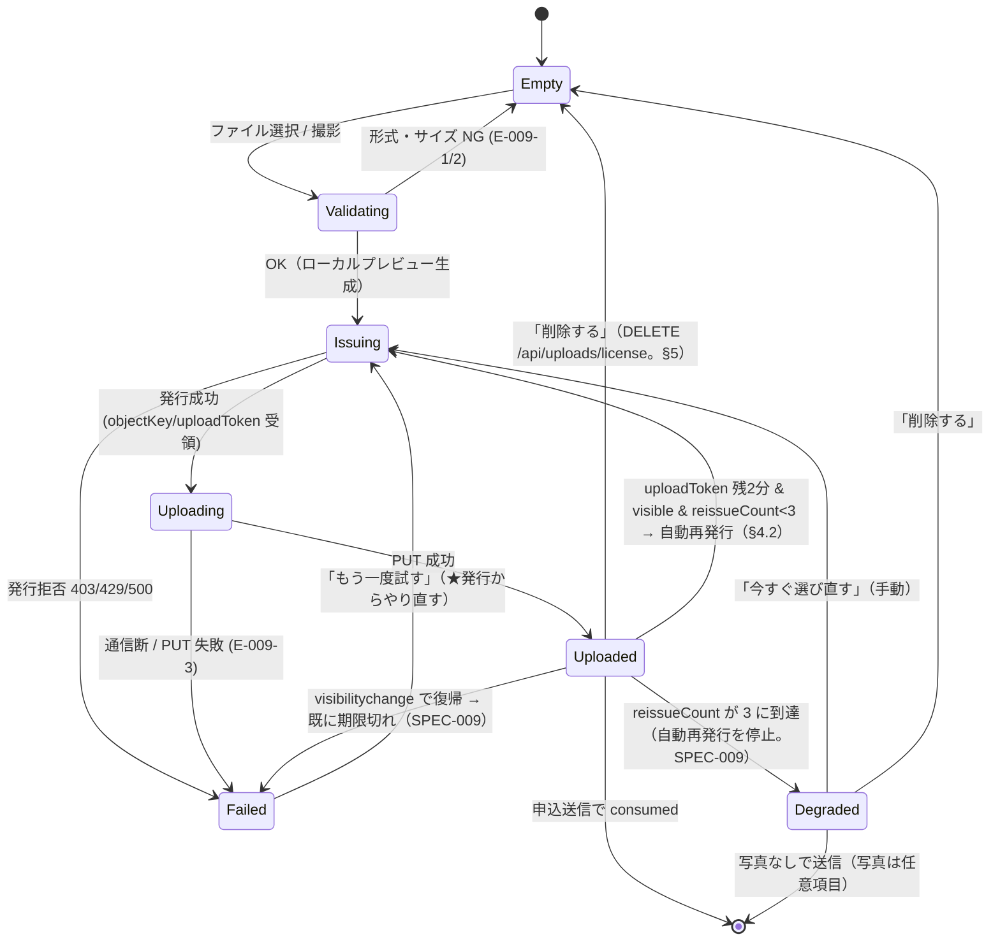

# UI設計: 免許証写真アップロード（F-009）

> 準拠: `/DESIGN.md`、共通コンポーネントは `./layout.md` §7。
> 対応要件: `functional-spec.md` F-009（画面仕様・振る舞い仕様 REV-004・API仕様）, `business-spec.md` US-008
> 位置づけ: `./application-form.md` §2.5 Step3「免許について」の一部として描画される。単独ページを持たない。
> 制約: `docs/phase-status.md`「P3 のセキュリティ要件」。**免許証写真は本プロジェクトで最も機微度の高い情報資産**であり、UI 設計もその前提で行う。
> 更新: 2026-07-29（仕様 v0.3.1 / `docs/spec-p3-fix-2026-07-29.md` §4 の申し送り D-1 / D-3 / D-6 / D-7 を反映）。**失効値は `uploadUrlExpiresIn: 300` / `uploadTokenExpiresIn: 600` の2フィールドで確定**（§4.2）、**§4.3 を 4 Tier に統一**、**自動再発行に上限3回・非表示タブでの停止を追加**（§4.2）、**削除 API の採用を反映**（§5）。

## ビジュアルコンセプト

- **「安心して預けられる」ことを UI で示す**のが最大の設計目標。免許証というものを他人の Web フォームにアップロードする行為には強い心理的抵抗があり、離脱の直接原因になる。したがってこの領域は「どこに保存され / 誰が見られ / いつ消えるか」を**アップロード前に**明示する。
- 同時に、**任意項目であることを終始明確にする**。「後からでも提出できます」を常に併記し、写真が用意できないことが申込の障害にならないようにする。
- ゲーム的な達成演出（パーティクル等）は使わない。免許証の提出は「楽しい体験」ではなく「不安を減らすべき手続き」であり、演出過多は逆に軽薄さとして不信を招く。フィードバックは**進捗の正確さ**と**完了の明確さ**のみに投資する。

---

## 1. レイアウト

```
┌────────────────────────────────────────┐
│ 免許証の写真 ［任意］                        │
│ ┌────────────────────────────────────┐│
│ │ 🔒 お預かりする写真について               ││ ← 事前告知ブロック
│ │ ・非公開の保管領域に保存し、URLを公開しません ││   ImportantNoticeBlock tone="info"
│ │ ・閲覧できるのは当校の担当者のみです         ││
│ │ ・お申込みが完了しなかった場合、一定期間後に  ││
│ │   自動的に削除されます                    ││
│ │ ・添付されなくてもお申込みは進められます      ││
│ │ [プライバシーポリシーを見る]               ││
│ └────────────────────────────────────┘│
├────────────────────────────────────────┤
│  表面（おもてめん）                          │
│ ┌────────────────────────────────────┐│
│ │            ＋                        ││ ← 空スロット
│ │   写真を撮る / ファイルを選ぶ            ││
│ │   JPEG・PNG・WebP / 5MBまで            ││
│ └────────────────────────────────────┘│
│                                          │
│  裏面（うらめん）                            │
│ ┌────────────────────────────────────┐│
│ │            ＋                        ││
│ │   写真を撮る / ファイルを選ぶ            ││
│ └────────────────────────────────────┘│
├────────────────────────────────────────┤
│ うまく撮るコツ: 明るい場所で、文字が読める大きさで、 │
│ 影や反射が入らないように撮影してください。          │
└────────────────────────────────────────┘
```

- 表/裏の2スロットを縦積み（モバイル）/ 横2カラム（≥768px）で並べる。
- スロットの比率は **免許証の実物に近い 8:5**（`aspect-ratio: 8 / 5`）にする。撮影ガイドとしても機能し、プレビュー時に上下の余白が暴れない。
- 「表面（おもてめん）」のようにルビ相当の読み仮名を括弧で添える。教習所の利用者層には高齢者・外国籍の方も含まれる（`business-spec.md` の想定ユーザー）。

---

## 2. スロットの状態遷移



- **`Degraded` と `Failed` は別状態**。`Degraded` は「まだ有効な写真が付いているが、これ以上は自動で延命しない」、`Failed` は「もう有効な写真が付いていない」。前者で不安を煽る表示をしない。
- **`visibilityState === 'hidden'` の間は `Uploaded → Issuing` の遷移が起きない**（AC-009-11(b)）。この抑止はタイマー側ではなく**遷移の発火条件**に置く（タイマーを止めるだけだと、バックグラウンドタブ復帰時にまとめて発火する実装になりうる）。

### 各状態の表示

| 状態 | 表示 | 操作 |
|------|------|------|
| `Empty` | 破線枠 + ＋アイコン + 「写真を撮る / ファイルを選ぶ」+ 形式・上限の明記 | ファイル選択 |
| `Validating` | 「確認しています…」（通常 100ms 未満なので視覚的にはほぼ出ない。100ms 超のときのみ表示） | - |
| `Issuing` | プレビュー（薄く 60% 不透明度）+ 「準備しています…」 | キャンセル |
| `Uploading` | プレビュー（薄く）+ **determinate 進捗バー + %表示** | キャンセル |
| `Uploaded` | プレビュー（100%）+ ✓「添付しました」+ ファイル形式・サイズ表示 | 削除する / 差し替える |
| `Degraded` | プレビュー（100%）+ ✓「添付しました」+ Warning トーンの補足「送信時に、お手数ですが写真をもう一度お選びください」 | 今すぐ選び直す / 削除する |
| `Failed` | プレビュー（薄く）+ ⚠ 理由 + 「もう一度試す」 | 再試行 / 削除 |
| `Queued` / `Cooldown` | プレビュー（薄く）+ スロット内 inline の `RateLimitWaitPanel`（§4.3 Tier C / D） | キャンセル |

- 進捗は **determinate（%が進む）** とする。5MB・モバイル回線では体感で数秒〜十数秒かかり、indeterminate なスピナーだけでは「止まっている」と判断されて離脱・多重操作を招く。
- 進捗を出すには `fetch` では不足で、**`XMLHttpRequest` の `upload.onprogress`** が必要（`fetch` のリクエストボディ進捗は主要ブラウザで未サポート）。これは実装可能性上の確定事項として明記する。
- 「キャンセル」は `xhr.abort()`。中断時にサーバー側へは未消費オブジェクトが残りうるため、§5 の削除要求を送る。

---

## 3. ファイル選択と撮影

```html
<input
  type="file"
  accept="image/jpeg,image/png,image/webp"
  <!-- capture 属性は付けない -->
/>
```

- **`capture="environment"` を付けない**。付けると一部の環境でカメラ起動に固定され、**すでに撮影済みの写真をライブラリから選ぶ導線が失われる**。属性を付けなければ OS が「カメラで撮影 / ライブラリから選択 / ファイル」を提示する。
- `accept` に MIME を列挙するが、**これはフィルタであって検証ではない**。ユーザーは「すべてのファイル」を選べるため、選択後にクライアント側で拡張子ではなく**マジックバイト（先頭数バイト）を読んで実形式を判定**する。サーバー側の再検証（F-009 正常系 6）が真の防御線であり、クライアント側判定は「サーバーへ無駄な 5MB を送らせない」ためのユーザー体験上の措置と位置づける。
- ドラッグ&ドロップはデスクトップでのみ有効化する（スロット全体を drop target にし、`dragover` で枠を Primary 色に）。モバイルでは意味がないため、`Empty` スロットの文言もデバイスで出し分けない（「ドラッグ&ドロップ」という文言をモバイルに出さない）。
- 複数選択は不可（`multiple` を付けない）。表/裏でスロットが分かれているため。

### ローカル検証（E-009-1 / E-009-2）

| ケース | 表示 | 挙動 |
|--------|------|------|
| 非対応形式 | 「JPEG・PNG・WebP の画像を選んでください」 | スロットは `Empty` のまま。アップロードしない |
| サイズ超過 | 「ファイルサイズが大きすぎます（5MB以下）。カメラアプリの設定で画質を下げるか、別の写真をお選びください」 | 同上 |
| 読み取り不能 | 「この画像を読み込めませんでした。別の写真をお試しください」 | 同上 |

- **エラー文言にファイル名を含めない**。ファイル名は利用者の氏名や日付を含むことがあり、PII のエコーバックにあたる（`docs/phase-status.md` P3 要件）。「選択されたファイル `yamada_menkyo_20260729.jpg` は…」は禁止。
- サイズ超過は最も起きやすい失敗（近年のスマホは1枚 3〜8MB）。**単に拒否せず具体的な回避策を書く**。将来的な改善案として「クライアント側で `canvas` により長辺 2000px へ縮小してから送る」を推奨するが、免許証は文字の可読性が要件のため、縮小率は保守的にし、**縮小を既定にする前に実物での可読性確認が必要**（本フェーズでは縮小なし、上限超過は案内で対応）。

---

## 4. アップロードとトークンのライフサイクル

### 4.1 発行 → PUT → 紐付け

`functional-spec.md` F-009 正常系 3〜6 に対応する。UI から見た流れ:

```
1. ローカル検証 OK
2. POST /api/uploads/license { side, contentType, size }
   → {
       uploadUrl,                  // 署名付き PUT URL
       objectKey,                  // ★サーバー生成。クライアントは一切指定しない（REV-004）
       uploadToken,                // objectKey にバインドされた単回使用トークン
       uploadUrlExpiresIn: 300,    // 署名付き PUT URL の失効秒数（確定 / SPEC-003）
       uploadTokenExpiresIn: 600   // uploadToken の失効秒数（確定 / SPEC-003）
     }
3. XHR PUT uploadUrl（進捗表示）
4. 完了 → state に { objectKey, uploadToken, side } を保持
   ★ プレビューは手元の blob: URL。サーバーから画像を取り直さない
5. 申込送信時に { objectKey, uploadToken, side } を同送 → サーバーが検証して consumed
```

> **単一の `expiresIn` フィールドは存在しない**（SPEC-003 が明示的に廃止した）。**必ず `uploadUrlExpiresIn` / `uploadTokenExpiresIn` の2フィールドで受け取ること。** 2つは値も意味も異なる（§4.2）。

### 4.2 有効期限の扱い（重要）

#### 2つの期限は別物である（SPEC-003 / 確定値）

| 値 | 確定値 | 何の猶予か | UI が監視すべきか |
|----|--------|-----------|-----------------|
| `uploadUrlExpiresIn`（署名付き PUT URL） | **300秒** | **格納操作そのもの**の猶予。この URL への PUT が失効するだけ | **監視しない**。失効しても、既に PUT 済みなら何も起きない |
| `uploadTokenExpiresIn`（`uploadToken`） | **600秒** | **格納後、申込送信までの**猶予。これが切れると申込への紐付けが 403 になる | **こちらを監視する** |

> **非対称性を必ず意識すること（RV-P3D-009）**: **署名付き PUT URL は 300秒で失効するが、`uploadToken` は 600秒生きる。** URL のほうが短いのは、署名が露出している時間を最小化するためであり、「写真がもう使えない」という意味ではない。**この2つを混同すると、UI が 300秒ごとに再アップロードを走らせる実装になる**（帯域を倍近く消費し、AC-009-5 が「唯一の帯域防御」と定めた発行数を無駄に膨らませる）。**残時間監視の対象は `uploadTokenExpiresIn`（600秒）である。**
>
> いずれも **v0.3.1 で確定した値**であり、「暫定」ではない（v0.3.0 まで本節は「暫定10分」と記していたが、SPEC-003 により確定値になった。値 600秒 = 10分は同じで、**「暫定」という位置づけだけが誤り**だった）。

#### 期限切れの先回り

- Step3 で写真を上げてから Step4・Step5 を経て送信するまでに 600秒を超えることは**現実的に起こりうる**（確認画面での見直し、電話での相談、中断、混雑時の待機 `form-submission.md` §4.4 など）。
- 何もしなければ送信時に 403（E-009-4）となり、**入力を全て終えた最後の瞬間に失敗する**という最悪の体験になる。したがって UI 側で先回りする:

```
状態: Uploaded（uploadToken の残り有効時間 + 再発行回数 reissueCount を保持）
  └ 残り 2分 を切った & document.visibilityState === "visible"
    & reissueCount < 3 のとき → バックグラウンドで自動的に再発行 + 再PUT
     ├ 成功 → 新しい objectKey/uploadToken に差し替え、reissueCount++。
     │        UIは無表示（利用者は気づかない）
     │        古い objectKey は §5 の削除要求を送る（失敗時は orphan 回収に委ねる）
     └ 失敗 → スロットを Failed にし、確認画面に
              「免許証の写真をもう一度添付してください」を表示。
              ★ 送信そのものはブロックしない（写真は任意項目のため）

  └ reissueCount === 3（上限到達）→ 自動再発行を停止し「縮退表示」へ（下記）
  └ visibilityState === "hidden" の間 → 再発行しない（API を呼ばない）
       復帰（visibilitychange）時に期限切れなら Failed へ遷移
```

#### 自動再発行の上限と、非表示タブでの停止（SPEC-009 / AC-009-11 で確定）

**背景（なぜ上限が要るか）**: 上限が無いと、タブを開いたまま放置した利用者が **8分ごとに（写真2枚なら発行2回 + PUT 2回 × 最大5MB）を永久に繰り返す**。AC-009-5 は「発行数の制限が唯一の帯域防御」と定めているため、この機構は**正規利用者が自分で自分をレート制限に到達させる**経路になる（条件1'-1 の趣旨に反する）。本設計が善意で入れた救済策が、別の受け入れ条件を壊していた。

| # | 確定した規則 | UI 状態 |
|---|------------|---------|
| 1 | **自動再発行は1スロットあたり最大3回**。到達後は自動再発行を停止する | **`degraded`（縮退表示）**: プレビューは残したまま、スロット下に「送信時に、お手数ですが写真をもう一度お選びください」+ 「今すぐ選び直す」ボタン。**Danger 色は使わない**（利用者の失敗ではない）。Warning トーンのアイコン + 本文は `#111827` |
| 2 | **`document.visibilityState === 'hidden'` の間は再発行 API を呼ばない** | 表示は `uploaded` のまま変えない（バックグラウンドで何も起きていないことを利用者に伝える必要はない） |
| 3 | `visibilitychange` で復帰した時点で `uploadToken` が**既に期限切れ**なら | **`failed`**（`reason: "EXPIRED"`）。「時間が経ったため、写真をもう一度お選びください」+ 「選び直す」 |

- **1申込あたりの最悪ケースの発行回数は「写真2枚 ×（初回1 + 再発行3）= 8回」で頭打ちになる。** この値は AC-RL-9 の実測入力に含められ、発行 API のレート制限閾値は**これを上回る値**に設定されることが仕様側で条件化された（F-009 境界値表）。**UI 側でこの上限を緩めると、その前提が崩れる。**
- **上限到達 / 復帰時 Failed のいずれでも、送信そのものはブロックしない。** 写真は任意項目であり、「写真なしで送信 → 後日メールで提出」に縮退できる。確認画面でその選択肢を明示する。
- `visibilityState` の判定は**再発行スケジューラの純ロジックに閉じる**（テスト可能にするため。AC-009-11 はユニットテストと E2E の両方を要求している）。`setInterval` の間引きに依存せず、残時間は `Date.now()` との差分で毎回算出する。

#### その他

- 再アップロードのために、選択された `File` オブジェクトを**そのタブのメモリ上で保持し続ける**。ページを閉じれば消える。`sessionStorage` には保存しない（§6 #7 / AC-008-3 (e)）。
- 「送信直前に必ず再アップロードする」方式は採らない。5MB × 2 枚の再送を全ユーザーに常時課すことになり、モバイル回線での送信失敗率を上げる。**残時間監視 + 期限直前のみ再送**が、帯域と成功率のバランスとして妥当。
- 期限切れが起きても**フォーム全体を失敗させない**。

### 4.3 発行拒否・通信失敗（E-009-3）

`POST /api/uploads/license` / `DELETE /api/uploads/license` は**公開変更系**であり、`form-submission.md` §4.2 の **4 Tier 契約が全く同じ形で適用される**（仕様 §4.11 Tier 表が唯一の真実源 / F-009 API 仕様 Error Responses）。**Tier ごとの応答は `POST /api/applications` と同一**なので、受け側のロジックは共通化できる。

| Tier | 応答 | 表示 | 挙動 |
|------|------|------|------|
| — | 400（形式/サイズ） | 「この画像は受け付けられませんでした。JPEG・PNG・WebP の 5MB 以下の写真をお選びください」 | `Empty` へ戻す |
| — | 415（Content-Type 不正） | 同上（利用者から見て 400 と区別する意味がない） | `Empty` へ戻す |
| **B** | **`403 { challenge: "interactive" }`** | 「確認のため、下の認証にご協力ください」 | `form-submission.md` §3.2 の Tier B（可視 CAPTCHA）へ。**拒否文言を出さない**。**降格理由（Cookie 不在 / Turnstile 未検証 / 逼迫）は応答に含まれず、UI も区別しない** |
| **C** | **`202 { retryAfterMs }`**（**新規 / セマフォ上限**） | **拒否せず待機UI**。「順番にお預かりしています（あと約 N 秒）」→ **サーバー指示どおりに自動再試行** | `form-submission.md` §4.3 の `RateLimitWaitPanel`（`tier="queued"`）をスロット内に inline 表示。スロットは `issuing` のまま保持し、`File` を捨てない |
| **D** | **`429` + `Retry-After` + `{ retryAfterMs }`** | 同上（`tier="cooldown"`。十秒〜分オーダー） | 同上。カウントダウン 0 で自動再試行。自動は最大3回、以降は「もう一度試す」の手動のみ |
| — | 通信断 / PUT 失敗 | 「アップロードできませんでした。電波の良い場所で、もう一度お試しください」+「もう一度試す」 | `Failed` |
| — | 500 | 「アップロードできませんでした。時間をおいてお試しください」+ 電話導線 | `Failed` |

- **v0.3.0 まで本節には 202（Tier C）の受け側が無かった**（403 / 429 のみ）。仕様 §4.11 で契約が統一されたため、**4 Tier に揃えた**（RV-P3D-002 / D-1）。**セマフォ（共有軸）の枯渇で 429 は返らない**——429 を受け取ったなら、それは発信元軸・フォームセッション軸（＝自分に閉じた軸）の上限である。
- **`retryAfterMs` はサーバーが返し ±20% のジッタを含む。** クライアントは待ち時間を自分で決めず、独自のバックオフを重ねない（`form-submission.md` §4.2 注記 3）。
- **Tier C / D はスロット単位の待機**であり、**フォーム全体の送信をブロックしない**。写真の順番待ち中でも利用者は Step4 へ進める（写真は任意項目）。ただし**送信時に未完了のスロットがあれば確認画面でその旨を表示**する（「写真のアップロードが完了していません。完了を待つ / 写真なしで送信する」）。
- **再試行は必ず「発行（POST）」からやり直す**。`uploadUrl` は **300秒**で失効しており（§4.2）、古い署名付き URL への PUT を繰り返しても回復しない。再試行で新しい `objectKey` が採番されるため、失敗した側のオブジェクトは orphan 回収の対象になる。
- **Tier C / D の自動再試行も、§4.2 の再発行上限（3回 / スロット）とは別カウント**である。前者は「まだ1枚も上がっていない発行の再試行」、後者は「上がった写真の期限延長」で、目的も帯域への影響も異なる。**両方を同一カウンタで数えないこと**。
- 再試行時にユーザーへファイル再選択を求めない（`File` を保持しているため）。失敗のたびにギャラリーを開き直させるのは離脱の直接原因。

---

## 5. 削除

```
┌────────────────────────────────────┐
│ 表面                                 │
│ ┌────────────────────┐            │
│ │  [プレビュー画像]      │            │
│ │  ✓ 添付しました        │            │
│ └────────────────────┘            │
│ [削除する]  [差し替える]              │
└────────────────────────────────────┘
```

- 「削除する」は `ConfirmDialog` を出さない（誤操作のコストが低く、再添付が容易なため）。代わりに削除後 8 秒間だけ「写真を削除しました [元に戻す]」を表示する（Undo パターン）。ただし **Undo は同一 `File` からの再アップロードであり、削除されたオブジェクトの復活ではない**。
- 削除時の内部処理:
  1. `URL.revokeObjectURL(previewUrl)` を必ず呼ぶ（メモリと、DevTools から辿れる blob 参照を残さない）
  2. state から `objectKey` / `uploadToken` を破棄
  3. **サーバーへ削除要求を送る**（下記）

### 削除 API（S-5 → **採用済み** / SPEC-011 / RV-P3D-S03）

**申し送り S-5（`DELETE /api/uploads/license`）は採用された。** `functional-spec.md` F-009 API 仕様に登録済みで、AC-009-10 が受け入れ条件として立っている。したがって **UI 文言は「削除する」のままでよい**（実際に消えるため、代替案の「この申込には添付しない」への変更は不要になった）。

```
DELETE /api/uploads/license   (認証不要・§4.11 の公開変更系ラッパ必須)
Request: { "objectKey": "string", "uploadToken": "string" }
Response (204): 本文なし
Error:
  403 — uploadToken 不正 / 期限切れ / 消費済み / objectKey 不一致（**理由を区別しない汎用 403**）
  403 / 202 / 429 — Tier B / C / D（他の公開変更系と**同一契約**。§4.3 の表がそのまま適用される）
  500 — サーバーエラー
```

- **削除は即時に Blob オブジェクトを消す**（orphan 回収バッチを待たない）。「削除しました」という UI 表示と実体が一致する。これが S-5 を出した理由そのものであり、採用によって解消された。
- **IDOR にならない根拠（仕様に明記済み）**: `uploadToken` は発行時に `objectKey` へバインドされた予測不能な単回使用トークンであり、**それを提示できること自体が本人性の証明**になる。サーバーは受け取った `objectKey` を信頼せず、**`uploadToken` から DB を引いてバインド済みの `objectKey` に対してのみ削除を実行する**（クライアント指定の `objectKey` は照合にのみ使う）。
- **消費済み（申込に紐付いた）トークンでは削除できない**（AC-009-10(c)）。紐付け後の削除は管理側の F-017 `DELETE` 経路のみ。UI 上、送信完了後にこのボタンは存在しないため矛盾しない。
- **削除要求が失敗しても UI 上は削除済みとして扱う**（利用者に再試行を求めない）。失敗時のみ orphan 回収へフォールバックする。**403 の理由を画面に出さない**（サーバーが区別しないので出しようがない）。
- **Undo（下記）との関係**: Undo は「削除された **objectKey** の復活」ではなく、**保持している `File` からの再アップロード**である。削除 API が即時に消す以上、この区別は必須。Undo 押下時は新しい発行（POST）からやり直す。
- 送信されるのは `{ objectKey, uploadToken }` のみ。**ファイル名・氏名等は一切送らない**。

---

## 6. 機微情報としての扱い（設計上の明示）

`docs/phase-status.md` の指示「プレビューの扱い・キャッシュ・共有リンク化されないことを設計上明示すること」への回答。

| # | 事項 | 設計 | 理由 |
|---|------|------|------|
| 1 | プレビューの生成 | **`URL.createObjectURL(file)` を使う。`FileReader` の DataURL は使わない** | DataURL は巨大な文字列として React state・DevTools・エラーレポート・`JSON.stringify` の対象に載りやすく、意図せず外へ出る経路が多い。blob: URL はハンドルであり中身を運ばない |
| 2 | プレビューの寿命 | 削除時・差し替え時・コンポーネント unmount 時に **必ず `revokeObjectURL`** | 解放しないと当該ドキュメントが生きている限り blob が参照可能なまま残る |
| 3 | プレビューの共有可能性 | blob: URL は **生成元ドキュメントの origin + 生存期間に閉じる**。別タブ・別端末に貼っても開けない。URL バーに現れず、履歴にも残らない | 「共有リンク化されない」ことの技術的担保 |
| 4 | サーバー画像の再表示 | **利用者側では一切行わない**。アップロード後も表示するのは手元の blob のみ。**署名付き GET URL をクライアントに返さない** | 返した瞬間、その URL は履歴・スクリーンショット・共有経由で漏れうる。閲覧は管理者のみ（F-018） |
| 5 | `next/image` の使用 | **禁止**。素の `` を使う | `next/image` は `/_next/image?url=` を経由し、最適化結果をサーバー/CDN にキャッシュする。免許証画像をそのパイプラインに乗せない |
| 6 | HTTP キャッシュ | 署名付き PUT / 将来の GET には `Cache-Control: no-store` を要求する。Service Worker からは `/api/uploads/**` と blob ストレージのドメインを**明示的に除外** | ブラウザ/中間キャッシュへの残留を防ぐ |
| 7 | クライアント永続化 | `objectKey` / `uploadToken` / プレビュー URL / `File` を **`sessionStorage` にも `localStorage` にも保存しない**（`application-form.md` §4.2）。**この指摘は仕様に取り込まれ、AC-008-3 の条件 (e) として「絶対に緩めない条件」に格上げされた**（RV-P3D-005）。下書き保存が `sessionStorage` を条件付きで使えるようになった後も、**写真関連値だけは例外なく対象外**である | `uploadToken` は「このオブジェクトを自分の申込に紐付ける」資格情報。ストレージに残ると、同一ブラウザの後続利用者が他人の免許証画像を自分の申込に紐付けられる |
| 8 | 確認画面での再表示 | **サムネイルを再表示しない**。「表 1枚 / 裏 1枚（添付済み）」のテキストのみ | 確認画面は滞在時間が最も長く、公共の場での覗き見リスクが最大。再確認したい利用者は「修正」で Step3 に戻れる |
| 9 | エラー・ログ | ファイル名・`objectKey` を画面に出さない。フロントのエラーレポート送信（将来 Sentry 等を入れる場合）で `objectKey` を含むオブジェクトを送らない | `objectKey` は非公開だが、漏れれば署名 URL 取得の手掛かりになる |
| 10 | 印刷 | `@media print` で写真スロットを非表示にする | 確認画面を印刷して手元に残す利用者がいる |
| 11 | スクリーンショット抑止 | **行わない（できない）** | Web では技術的に不可能。代わりに #8 で表示機会そのものを減らす |

---

## 7. コンポーネント契約

```ts
type UploadSide = "front" | "back"

type SlotState =
  | { kind: "empty" }
  | { kind: "validating" }
  | { kind: "issuing"; previewUrl: string }
  | { kind: "queued"; previewUrl: string; retryAfterMs: number; attempt: number }   // Tier C（202）
  | { kind: "cooldown"; previewUrl: string; retryAfterMs: number; attempt: number } // Tier D（429）
  | { kind: "uploading"; previewUrl: string; progress: number }  // 0..100
  | { kind: "uploaded";  previewUrl: string; objectKey: string; uploadToken: string
    ; tokenExpiresAt: number      // ★ uploadTokenExpiresIn(600s) 由来。監視対象はこちら
    ; reissueCount: number }      // 0..3。3 に到達したら degraded（SPEC-009）
  | { kind: "degraded";  previewUrl: string; objectKey: string; uploadToken: string
    ; tokenExpiresAt: number }    // 自動再発行の上限到達。手動の選び直しのみ
  | { kind: "failed"; previewUrl?: string; reason: UploadErrorCode }

type UploadErrorCode =
  | "UNSUPPORTED_TYPE" | "TOO_LARGE" | "UNREADABLE"
  | "ISSUE_REJECTED" | "CHALLENGE_REQUIRED" | "RATE_LIMITED"
  | "EXPIRED"                     // visibilitychange 復帰時に uploadToken が期限切れ（SPEC-009）
  | "NETWORK" | "SERVER"
  // ★ ここにもファイル名・入力値を運ぶフィールドを置かない

LicensePhotoUploader ("use client"):
  props: {
    slots: Record<UploadSide, SlotState>
    onSelect: (side: UploadSide, file: File) => void
    onCancel: (side: UploadSide) => void
    onRemove: (side: UploadSide) => void
    onRetry: (side: UploadSide) => void
    disabled?: boolean          // type=INQUIRY では描画自体しないので通常不要
  }

LicensePhotoSlot ("use client"):
  props: { side: UploadSide; state: SlotState; on*: ... }   // 上記を1スロット分に分解
```

- アップロードの副作用（POST 発行 / XHR PUT / DELETE / 期限監視）は `useLicenseUpload()` カスタムフックに閉じ、コンポーネントは状態の描画に徹する。テスト時にフックを差し替えられるようにする（Test Agent への配慮）。
- **再発行の判定は純関数として切り出す**（AC-009-11 がユニットテストを要求しているため）:
  ```ts
  shouldReissue(input: {
    tokenExpiresAt: number      // uploadTokenExpiresIn(600s) 由来
    now: number
    reissueCount: number        // < 3 でのみ true
    visibilityState: DocumentVisibilityState   // "hidden" では常に false
  }): boolean
  ```
  **`document` を直接読まず引数で受ける**こと。フック側が `document.visibilityState` / `Date.now()` を渡す。これで「上限3回」「非表示中は呼ばない」の両方がユニットテストで固定できる。
- `LicensePhotoUploader` は `ApplicationForm` の reducer に対して `dispatch` するだけで、自前の永続化を持たない。**`sessionStorage` への書き込みは一切行わない**（AC-008-3 (e)。`application-form.md` §4.2）。

---

## 8. インタラクション定義

| トリガー | アニメーション | 持続時間 | イージング |
|---------|-------------|---------|----------|
| スロットへ drag over（desktop） | 枠線 Primary 化 + 背景 `primary-50` | 150ms | ease-out |
| ファイル選択直後（プレビュー出現） | フェードイン + スケール 0.98→1 | 200ms | ease-out |
| 進捗バーの伸長 | `width` トランジション | 150ms | linear（進捗は等速の方が実態と一致し、速度感の誤認を避ける） |
| アップロード完了 | ✓ アイコンのフェードイン + プレビューの不透明度 60%→100% | 250ms | ease-out |
| 失敗 | 枠線 Danger 化 + メッセージのフェードイン | 150ms | ease-out |
| 削除 | プレビューのフェードアウト → 空スロットのフェードイン | 150ms | ease-out |
| Undo トースト | 上からスライドイン、8秒後に自動フェードアウト | 200ms | ease-out |

- 進捗バーだけ `linear` を使うのは意図的（他は `ease-out`）。進捗の減速は「詰まった」と誤認される。
- `prefers-reduced-motion` 下でも**進捗の数値表示（`45%`）は残す**。アニメーションが消えても情報が消えないこと（DESIGN.md §7 / 段階的エンハンスメント）。

---

## 9. アクセシビリティ要件

| 項目 | 要件 |
|------|------|
| ラベル | 各スロットは `<fieldset><legend>免許証の写真</legend>` 配下。個々の input は `<label for>` で「免許証の表面の写真」「免許証の裏面の写真」 |
| ファイル入力 | ネイティブ `<input type="file">` を視覚的に隠し、`<label>` をスタイルして操作面にする。**`display:none` は使わない**（一部支援技術がフォーカスできなくなる）。`sr-only` パターン（`clip-path` + `position:absolute`）を使う |
| キーボード | `<label>` を押せるようにするのではなく、**`<input type="file">` 自身がフォーカス可能なまま**にして Enter / Space で OS ダイアログを開く。カスタムボタン + `input.click()` は不要 |
| 進捗の読み上げ | `role="progressbar" aria-valuenow aria-valuemin=0 aria-valuemax=100 aria-label="表面の写真をアップロード中"`。**毎%更新すると読み上げが洪水になる**ため、`aria-valuenow` は 10% 刻みでのみ更新し、視覚表示のみ 1% 刻みにする |
| 状態変化の通知 | スロットの `aria-live="polite"` 領域に「表面の写真を添付しました」「表面の写真のアップロードに失敗しました」を流す。**プレビュー画像自体は装飾ではない**が中身を説明できないため `alt="添付した免許証の表面の写真"` とする（内容の読み上げは不可能。存在の通知に留める） |
| エラー | スロット内メッセージに `role="alert"`。`aria-describedby` で input に紐付け |
| 色のみに依存しない | 完了 = ✓ アイコン + 「添付しました」テキスト、失敗 = ⚠ + 理由テキスト |
| タッチターゲット | 「削除する」「差し替える」「もう一度試す」は 44px 以上。スロット全体は `aspect-ratio: 8/5` で十分大きい |
| コントラスト | 破線枠 `#CBD5E1` on `#FFFFFF` は 1.6:1 で AA 非適合だが、**枠は装飾であり情報は内部のテキスト（`#4B5563`, 7.56:1）が担う**ため許容。フォーカス時は `outline: 2px solid #1D4ED8` で明確化 |

---

## 10. レスポンシブ

| ブレークポイント | スロット配置 | 事前告知ブロック |
|-----------------|------------|----------------|
| Mobile ≤767px | 縦積み1列、全幅、`aspect-ratio: 8/5` | 全文表示（折りたたまない。読ませたい情報のため） |
| Tablet 768–1023px | 横2列、`gap-m` | 全文表示 |
| Desktop ≥1024px | 横2列、最大幅 `max-w-[720px]` 内（`application-form.md` §10） | 全文表示 |

- モバイルで撮影から戻ってきたとき、スクロール位置が当該スロットに保たれること（`scroll-margin-block: 96px`）。OS のカメラアプリ往復でページが再描画される端末があるため、**`File` をメモリだけに持つ設計は「ページが破棄されない」前提に立つ**。iOS Safari でメモリ逼迫時にタブが破棄されると入力が失われるが、これは `sessionStorage` 復元（写真以外, `application-form.md` §4.2）で部分的に救う。写真は再選択が必要になる旨を復元時のメッセージに含める。

---

## 11. テストへの申し送り（Test Agent 向け）

- `data-testid="license-slot-front"` / `"license-slot-back"`、状態は `data-state="empty|validating|issuing|queued|cooldown|uploading|uploaded|degraded|failed"` 属性で公開する。進捗バーの幅では判定しない。
- 検証すべき UI 契約:
  1. `objectKey` / `uploadToken` / プレビュー URL が `sessionStorage` / `localStorage` に**存在しない**こと（AC-008-3 (e)）。
  2. プレビューの `src` が `blob:` で始まること（`data:` でないこと）。
  3. 削除後に `URL.revokeObjectURL` が呼ばれ、`` が DOM から消えること。**かつ `DELETE /api/uploads/license` が `{ objectKey, uploadToken }` を伴って呼ばれること**（§5 / SPEC-011）。
  4. エラーメッセージにファイル名が**含まれない**こと（テスト用ファイル名に識別可能な文字列を仕込んでアサート）。
  5. 確認画面（Step5）に `` が**存在しない**こと（§6 #8）。
  6. 5MB 超のファイルで `POST /api/uploads/license` が**呼ばれない**こと（ローカル検証で止まる）。
  7. INQUIRY 選択時、アップローダが DOM に存在しないこと。
  8. **発行応答の 2 フィールドが別々に使われていること**（SPEC-003 / D-3）: `uploadUrlExpiresIn: 300` / `uploadTokenExpiresIn: 600` を返すモックに対し、**残時間監視が 600秒側を基準にしている**こと（＝ 300秒経過時点で自動再発行が発火**しない**こと）。単一の `expiresIn` を読むコードが存在しないこと。
  9. **自動再発行が1スロット3回で止まること**（AC-009-11(a)）: 期限を進めて4回目の `POST /api/uploads/license` が発生せず、`data-state="degraded"` になること。
  10. **`visibilityState === 'hidden'` の間は再発行 API を呼ばないこと**（AC-009-11(b)）: `visibilitychange` を発火させ、期限直前でもネットワーク要求が発生しないこと。復帰時に既に期限切れなら `data-state="failed"` になること。
  11. **`202` を受けたときに待機 UI が出て、`File` が保持されたまま自動再試行されること**（§4.3 Tier C）。**共有軸の枯渇で 429 を期待するテストを書かない**こと。
  12. `403 { challenge: "interactive" }` で拒否文言が出ず、`form-submission.md` §3.2 の Tier B UI に遷移すること。
- 再発行の判定は純関数 `shouldReissue()`（§7）に分離されているので、9・10 の中核はユニットテストで固定できる。E2E は「実際に API が呼ばれない」ことの確認に絞ってよい。
- Playwright では `page.setInputFiles()` でネイティブ input に直接投入できる（カスタムボタン + `input.click()` 方式にしないのは、この操作性のためでもある）。
